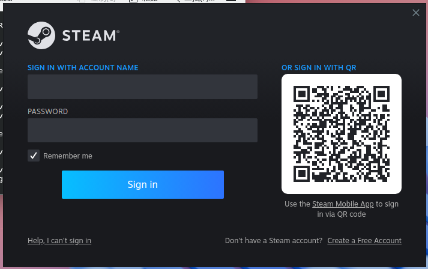
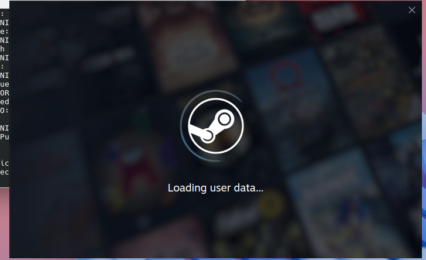
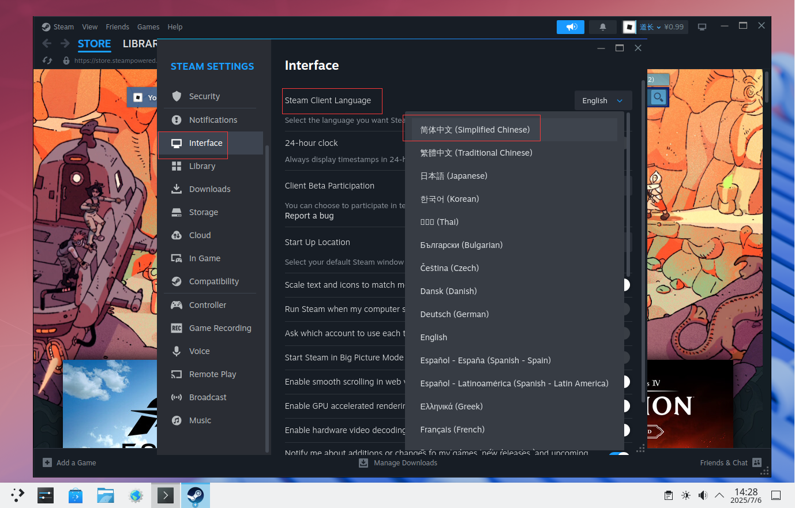
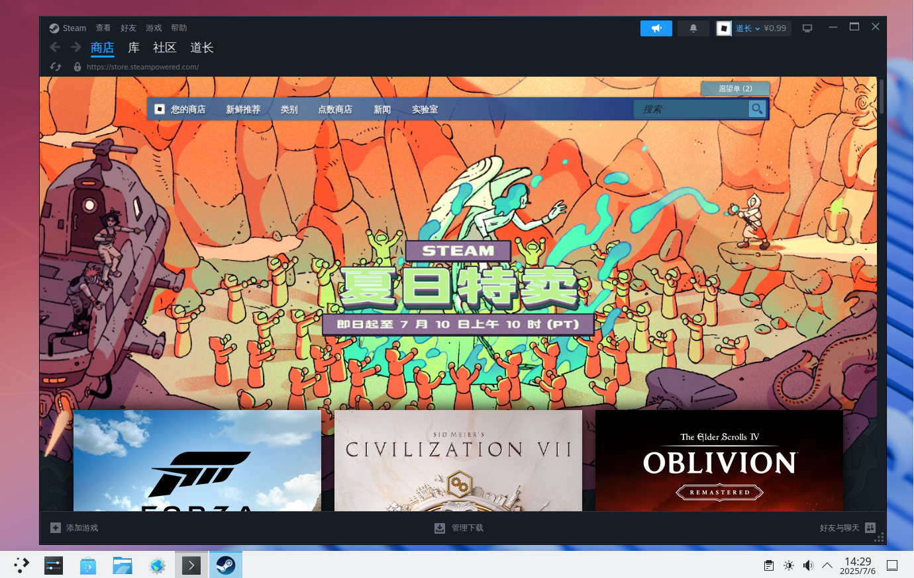
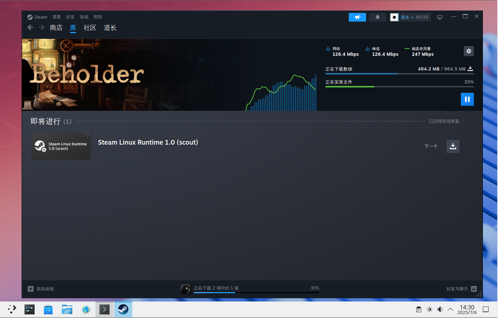
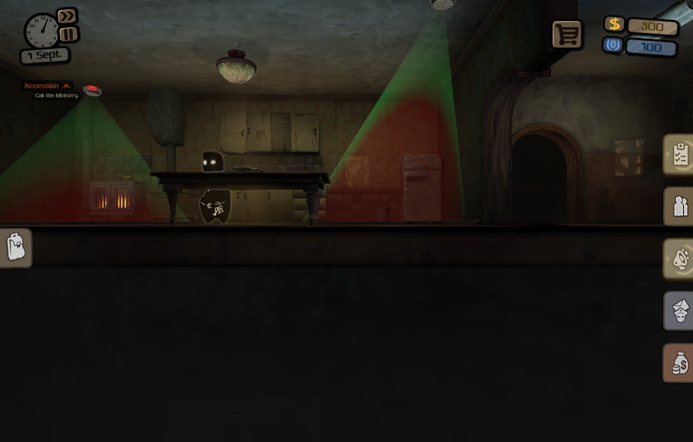

# 20.4 Steam

## 基于 Port games/linux-steam-utils

### 加载 Linux 兼容层模块

```sh
# service linux enable   # 启用 Linux 兼容层服务，并设置为开机自启
# service linux start    # 启动 Linux 兼容层服务
```

### 安装 games/linux-steam-utils

- 使用 pkg 安装

```sh
# pkg ins linux-steam-utils
```

- 使用 Ports 安装

```
# cd /usr/ports/games/linux-steam-utils/ 
# make install clean
```

- 查看安装后的说明：

```sh
# pkg info -D linux-steam-utils
linux-steam-utils-20250627:
On install:
Please note, this is an unofficial wrapper for the Steam client  
请注意，这只是 Steam 客户端的非官方封装。
and as such it is supported on a best effort basis.  
因此仅提供尽力支持。

Limitations:  
限制：

- Sandbox is disabled for the web browser component.  
  浏览器组件的沙盒已被禁用。  
- No controller input, no streaming, no VR.  
  不支持手柄输入、串流与 VR。  
- Valve Anti-Cheat is untested.  
  尚未测试 Valve 反作弊系统。  
- Steam's container runtime (pressure-vessel) doesn't work.  
  Steam 的容器运行时（pressure-vessel）无法使用。

Additional dependencies:  
额外依赖：

- If you use an NVIDIA card, you need to install a suitable  
  x11/linux-nvidia-libs(-xxx) port.  
  如果你使用 NVIDIA 显卡，需要安装适配的 x11/linux-nvidia-libs（-xxx）Port。

Steam setup:  
Steam 设置步骤：

1. Set security.bsd.unprivileged_chroot and vfs.usermount sysctls to 1.  
   将 sysctl 变量 security.bsd.unprivileged_chroot 与 vfs.usermount 设置为 1。  
2. Add nullfs to kld_list, load it.  
   将 nullfs 添加到 kld_list 并加载该模块。  
3. Create a dedicated FreeBSD non-wheel user account for Steam. Switch to it.  
   为 Steam 创建一个专用的 FreeBSD 非 wheel 用户账户，并切换至该用户。  
4. Run `/usr/local/steam-utils/bin/lsu-bootstrap` to download the Steam bootstrap executable.  
   运行 `/usr/local/steam-utils/bin/lsu-bootstrap` 下载 Steam 的引导可执行文件。  
5. Run `steam` to download updates and start Steam.  
   运行 `steam` 下载更新并启动 Steam。

For the list of tested Linux games see https://github.com/shkhln/linuxulator-steam-utils/wiki/Compatibility.  
已测试的 Linux 游戏列表请参见：https://github.com/shkhln/linuxulator-steam-utils/wiki/Compatibility。

Native Proton setup (optional, semi-experimental):  
原生 Proton 设置（可选，半实验性）：

1. Run `sudo pkg install wine-proton libc6-shim python3`.  
   运行 `sudo pkg install wine-proton libc6-shim python3` 安装依赖。  
2. Run `/usr/local/wine-proton/bin/pkg32.sh install wine-proton mesa-dri`.  
   运行 `/usr/local/wine-proton/bin/pkg32.sh install wine-proton mesa-dri` 安装 32 位依赖。  
3. In Steam install the matching Proton version (appid 2348590 for 8.0, 2805730 for 9.0, etc).  
   在 Steam 中安装匹配的 Proton 版本（8.0 对应 appid 2348590，9.0 对应 appid 2805730，等等）。
```

### 配置 Port linux-steam-utils

如果你使用 NVIDIA 显卡，需要安装适配的 Port x11/linux-nvidia-libs（-xxx）。

#### 设置 sysctl 变量

将 sysctl 变量 `security.bsd.unprivileged_chroot` 与 `vfs.usermount` 设置为 `1`：

- 立即生效

```sh
# sysctl security.bsd.unprivileged_chroot=1   # 允许非特权用户使用 chroot
# sysctl vfs.usermount=1                      # 允许普通用户挂载文件系统
```

- 永久生效

编辑 `/etc/sysctl.conf`，在文件最后一行换行，添加：

```sh
security.bsd.unprivileged_chroot=1   # 允许非特权用户使用 chroot
vfs.usermount=1                      # 允许普通用户挂载文件系统
```

#### 启用内核模块 nullfs

- 立即加载 nullfs 内核模块

```sh
# kldload nullfs
```

- 将 `nullfs` 添加到 `kld_list`，并加载该内核模块。

```sh
# sysrc kld_list+="nullfs"
```

#### 为 Steam 创建专用用户账户

如果不这样做，将会提示如下内容：

```sh
Please, consider setting up a dedicated OS user account for Steam.
Otherwise each and every Steam game will have unrestricted access to your files.
If you really couldn't care less, you can suppress this message with
--allow-stealing-my-passwords,-browser-history-and-ssh-keys flag.
```

- 创建名为 test 的用户，指定默认 shell 为 `/bin/sh`，并创建用户主目录

```sh
# pw useradd -n test -s /bin/sh -m
```

- 切换到 test 用户：

```sh
# su test
```

>**技巧**
>
>在 test 用户权限下，输入命令 `exit` 即可退回到以前的用户。


#### 下载 Steam 的引导可执行文件

启动 steam-utils 的 lsu-bootstrap 初始化程序：

```sh
$ /usr/local/steam-utils/bin/lsu-bootstrap
```

#### 允许 test 用户访问 X11

在当前登录桌面的用户权限下执行：

```sh
$ xhost +SI:localuser:test
```

以允许本地用户 test 访问当前的 X Server。

### 启动 Steam

- 切换到 test 用户：


```sh
# su test
```

- 启动 Steam 客户端

```sh
$ /usr/local/steam-utils/bin/steam
```

输入用户名和密码登录：



加载中：



设置中文界面：



Steam：



### 测试游戏 Beholder 的运行情况

>**技巧**
>
>Beholder 是收费游戏。若想玩，你需要自行购买。

下载 Beholder：



启动 Beholder：




### 故障排除

#### `Bubblewrap doesn't work on FreeBSD. Select LSU chroot or Legacy Runtime in the game compatibility settings.`

右键单击游戏，点击兼容性，勾选“强制使用特定 Steam Play 兼容性工具”，选择“Legacy Runtime 1.0”。

#### 无中文字体显示

该问题尚未解决。
