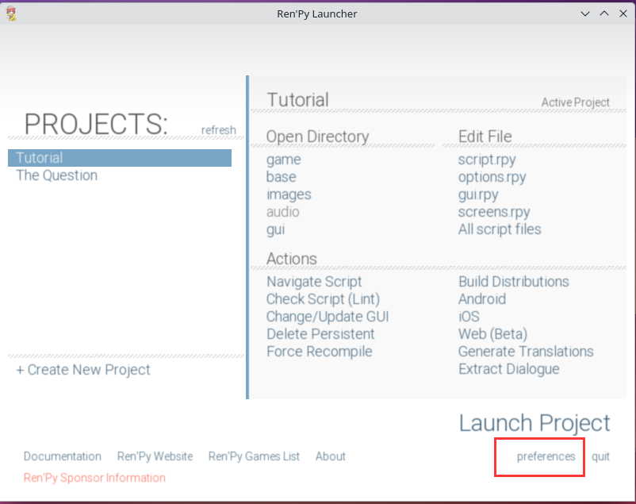
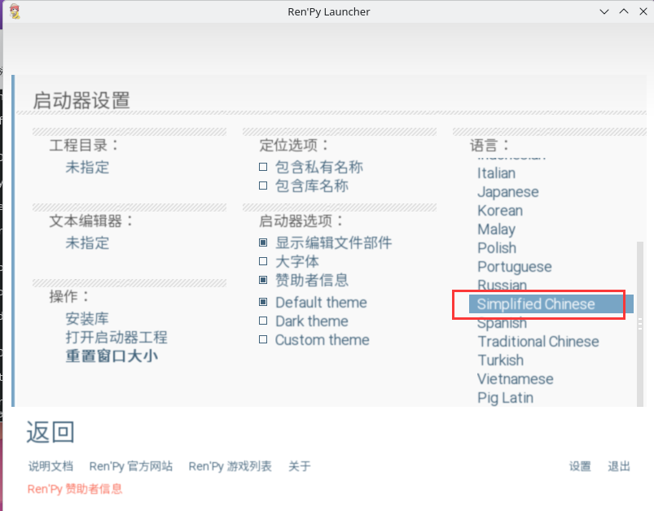
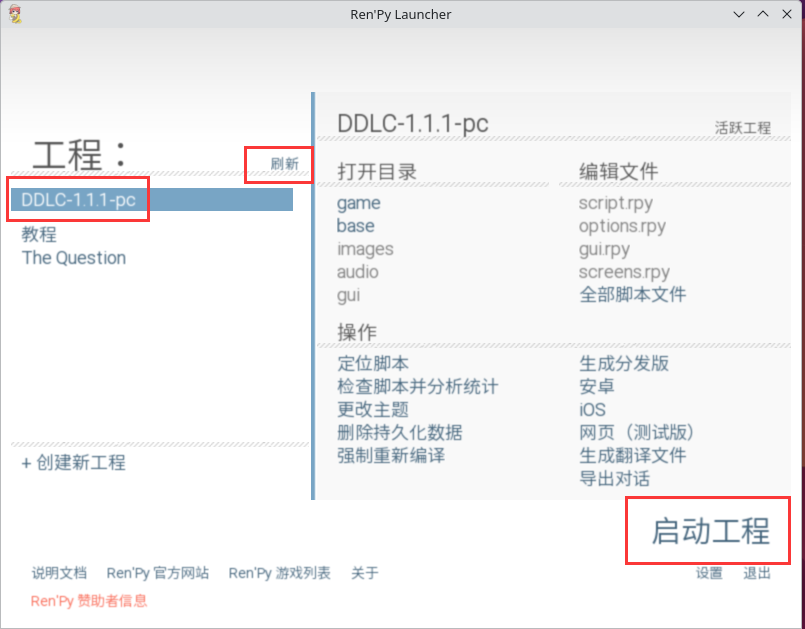
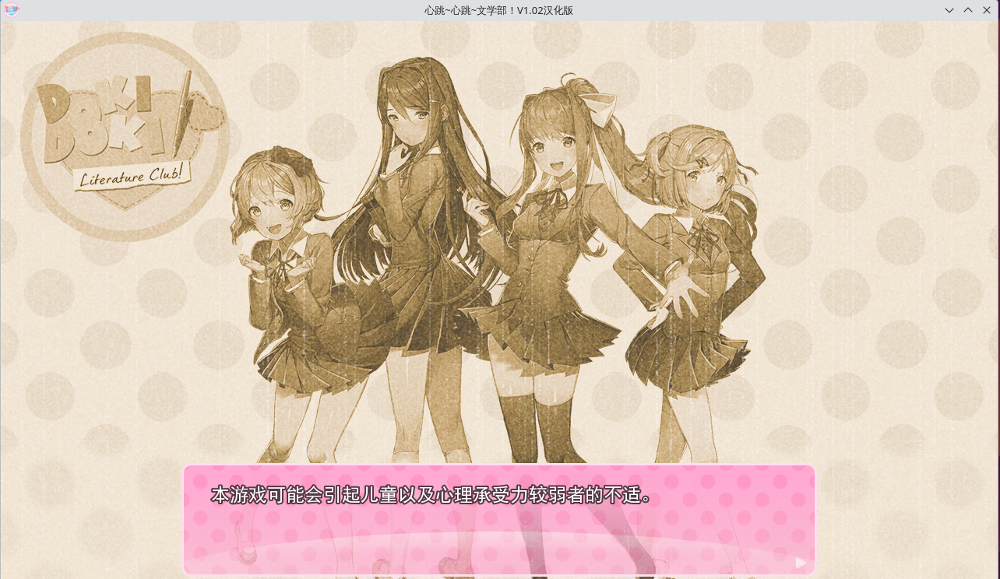
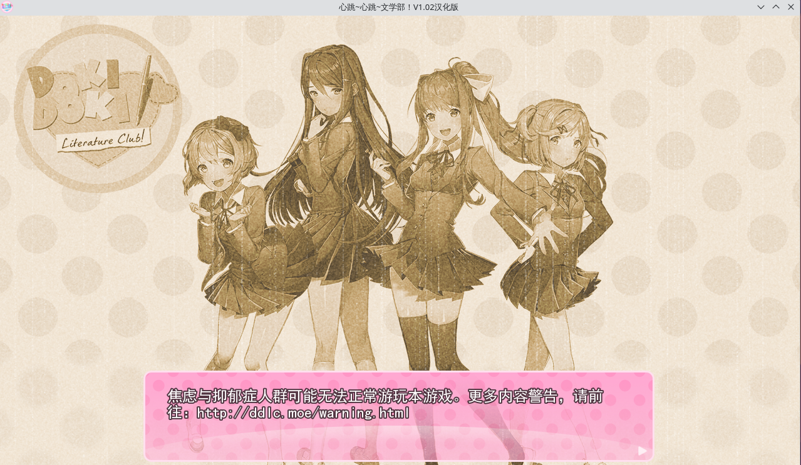
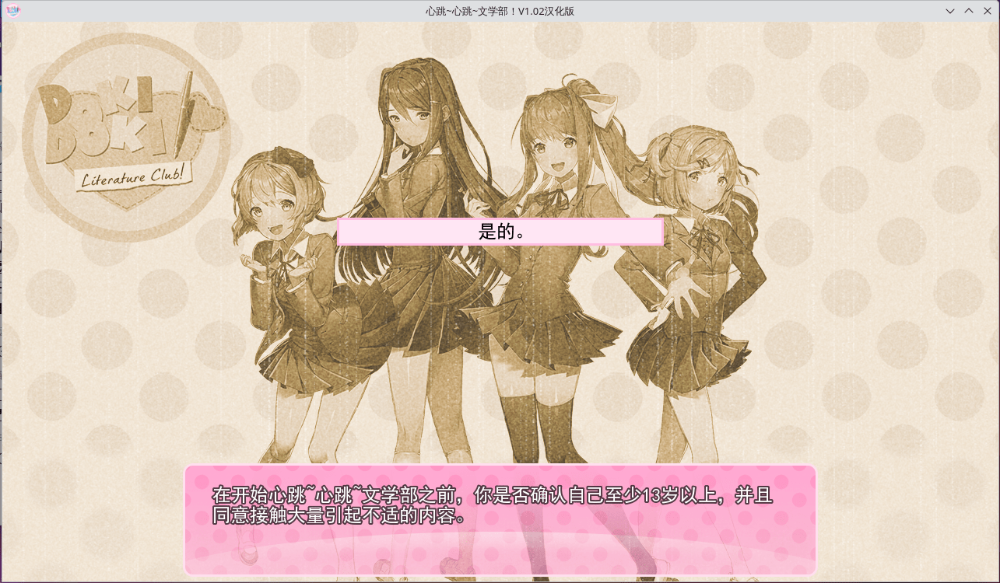
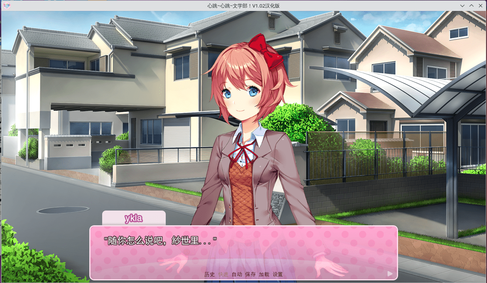

# 20.1 Ren'Py 视觉小说引擎

## Ren'Py 游戏概述

本节旨在介绍 Ren'Py 视觉小说引擎在 FreeBSD 系统上的安装、配置与应用方法。作为开源游戏开发工具链的重要组成部分，Ren'Py 为交互式叙事内容的创作与分发提供了跨平台解决方案。

Ren'Py 是一款视觉小说引擎，可便捷用于制作互动式视频游戏。

由于其核心基于 Python 语言，因此可便捷移植到不同的操作系统平台上，如 Windows 和 Linux。这一特性源于 Python 语言本身的跨平台设计，使得 Ren'Py 能够在多种计算环境中保持功能一致性。

虽然 Ren'Py 暂未官方适配 FreeBSD，但 FreeBSD 社区对其进行了二次打包，使其能够在该平台上运行。

尽管如此，在 FreeBSD 上运行 Ren'Py 游戏仍需进行必要的配置。以下将详细介绍具体的实施步骤。

## 安装 Ren'Py

使用 pkg：

```sh
# pkg install renpy
```

或者使用 Ports：

```sh
# cd /usr/ports/games/renpy/ 
# make install clean
```

## Ren'Py 设置中文界面

本小节介绍如何将 Ren'Py 界面设置为中文。设置界面语言的具体操作步骤可参考以下图片。





## 玩《心跳文学部！》

> **警告**
>
> 《心跳文学部！》是一款恐怖游戏，并可能会 [致郁](https://ddlc.moe/warning) [备份](https://web.archive.org/web/20260116224633/https://ddlc.moe/warning)！

这里以《心跳文学部！》为例，其他游戏也可采用相同的操作方式。

选择附带 Linux 版本的游戏进行解压，即同时包含 Windows 版本与 Linux 版本的游戏文件。

### 运行 Ren'Py

默认游戏路径位于 `~/`，Ren'Py 不识别中文路径，因此必须将解压后的文件夹 `DDLC-1.1.1-pc` 放在用户主目录下，例如 `/home/ykla`。

汉化语言包位置：[Doki Doki Literature Club 简体中文汉化补丁 v1.02（2025 更新）](https://steamcommunity.com/sharedfiles/filedetails/?id=1176221672) [备份](https://web.archive.org/web/20260120150852/https://steamcommunity.com/sharedfiles/filedetails/?id=1176221672)。将汉化包解压后放在对应目录即可。

在引擎界面左侧点击“刷新”，在“工程（Projects）”列表中即可看到刷新后的游戏 DDLC-1.1.1。点击该游戏后，选择右下角的“启动工程（Launch Project）”即可加载游戏。

笔者已将上述游戏打包并发布在 <https://github.com/ykla/DDLC/releases>，供读者参考使用。











## rpa 解包

本小节介绍 rpa 文件的解包方法与相关工具。解包 rpa 文件可用于查看或修改游戏资源。

### 选择游戏版本

尽量选择附有 Linux 版本的游戏。如果游戏仅支持 Windows 系统，可通过 Ren'Py 引擎打包 Linux 版本。

### 解包工具

rpa 文件解包工具：[unrpa](https://github.com/Lattyware/unrpa) [备份](https://web.archive.org/web/20260120150852/https://github.com/Lattyware/unrpa)

也可使用 pip 安装 unrpa 软件包：

```sh
$ pip install unrpa
```

随后使用 unrpa 工具将指定的 rpa 文件解包到目标目录，其中 `-mp` 参数用于指定输出目录：

```sh
$ python3 unrpa -mp "解包目录" "XXX.rpa"
```

rpyc 文件反编译工具：[unrpyc](https://github.com/CensoredUsername/unrpyc) [备份](https://web.archive.org/web/20260116224624/https://github.com/CensoredUsername/unrpyc)。rpyc 是 Ren'Py 脚本文件的编译格式，包含了游戏的剧情逻辑与交互规则。

使用 unrpyc 工具反编译指定的 rpyc 文件，将其转换为可读的 rpy 源文件：

```sh
$ python3 unrpyc -c "XXX.rpyc"
```

该步骤并非必需，仅用于方便将脚本翻译为其他语言或进行二次开发工作。

## 参考文献

- 游戏分发站： [itch](https://itch.io/) [备份](https://web.archive.org/web/20260120135455/https://itch.io/)，提供免费独立游戏分享平台，支持创作者自主发布作品。

## 课后习题

1. 查找 Ren'Py 官方源代码，尝试将其移植到 FreeBSD Ports 中，并构建一个可独立安装的包，分析其移植过程中需要解决的跨平台兼容性问题。

2. 使用 unrpa 和 unrpyc 工具解包并反编译一个 Ren'Py 游戏，重构其最小可运行脚本。

