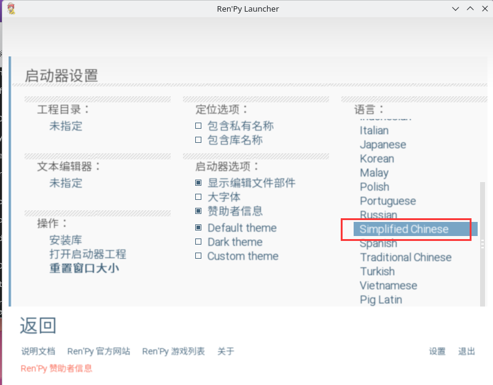

# 20.1 Ren’Py 视觉小说引擎

## Ren’Py 游戏概述

Ren’Py 是一款视觉小说引擎，可以方便地用于制作互动式视频游戏。

由于其核心基于 Python 语言，因此可以较为方便地移植到不同的操作系统平台上，如 Windows 和 Linux。

虽然 Ren’Py 暂未官方适配 FreeBSD，但 FreeBSD 对其进行了二次打包。

如此一来，就可以在 FreeBSD 上畅玩互动游戏了吗？显然不是！不过，我们可以作一番小小的尝试。


## 安装 Ren’Py

使用 pkg：

```sh
# pkg install renpy
```

或者使用 Ports：

```sh
# cd /usr/ports/games/renpy/ 
# make install clean
```

## Ren’Py 设置中文界面




## 玩《心跳文学部！》

>**警告**
>
>《心跳文学部！》是一款恐怖游戏，并可能会 [致郁](https://ddlc.moe/warning) [备份](https://web.archive.org/web/20260116224633/https://ddlc.moe/warning)！

这里以《心跳文学部！》为例，其他游戏也可以采用相同的操作方式。

选择附带 Linux 版本的游戏进行解压（即 Windows 版本与 Linux 版本共存）。

- 运行 Ren’Py

默认游戏路径位于 `~/`，Ren’Py 不识别中文路径，因此必须将解压后的文件夹 `DDLC-1.1.1-pc` 放在用户主目录下（例如 `/home/ykla`）。

汉化语言包位置：[Doki Doki Literature Club 简体中文汉化补丁 v1.02（2025 更新）](https://steamcommunity.com/sharedfiles/filedetails/?id=1176221672) [备份](https://web.archive.org/web/20260120150852/https://steamcommunity.com/sharedfiles/filedetails/?id=1176221672)。将汉化包解压出来放在对应目录即可。

在引擎界面左侧点击“刷新”，在“工程（Projects）”列表中即可看到刷新后的游戏 DDLC-1.1.1。点击该游戏后，选择右下角的“启动工程（Launch Project）”即可加载游戏。

笔者已将上述游戏打包并发布在了 <https://github.com/ykla/DDLC/releases>，以飨读者。


## rpa 解包

- 尽量选择附有 Linux 版本的游戏

  如果游戏仅支持 Windows 系统，可通过 Ren’Py 引擎打包 Linux 版本。

- rpa 文件解包工具：[unrpa](https://github.com/Lattyware/unrpa) [备份](https://web.archive.org/web/20260120150852/https://github.com/Lattyware/unrpa)

也可以使用 pip 安装 unrpa 软件包：

```sh
$ pip install unrpa
```

随后使用 unrpa 工具将指定的 rpa 文件解包到目标目录：

```python
$ python3 unrpa -mp "解包目录" "XXX.rpa"
```

rpyc 文件反编译工具：[unrpyc](https://github.com/CensoredUsername/unrpyc) [备份](https://web.archive.org/web/20260116224624/https://github.com/CensoredUsername/unrpyc)

使用 unrpyc 工具反编译指定的 rpyc 文件：

```python
$ python3 unrpyc -c "XXX.rpyc"
```

该步骤并非必需，仅用于方便将脚本翻译为其他语言。

## 参考文献

- 游戏分发站： [itch](https://itch.io/) [备份](https://web.archive.org/web/20260120135455/https://itch.io/)

