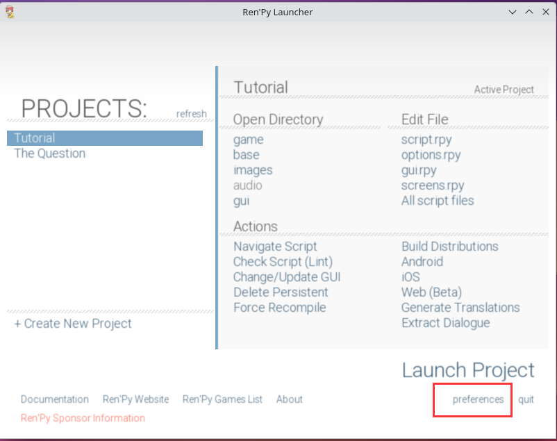
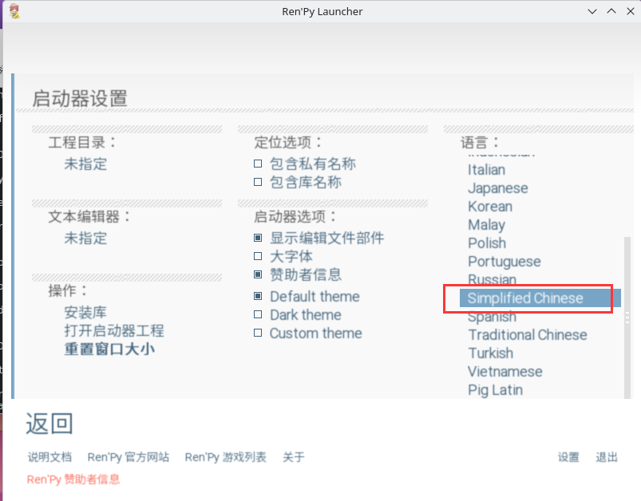
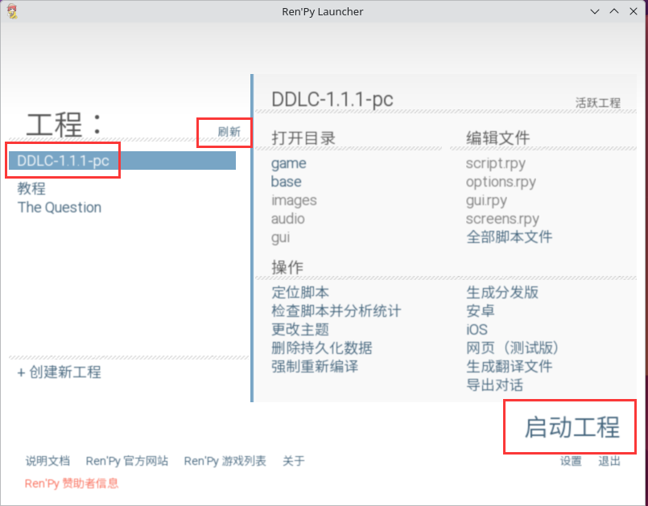
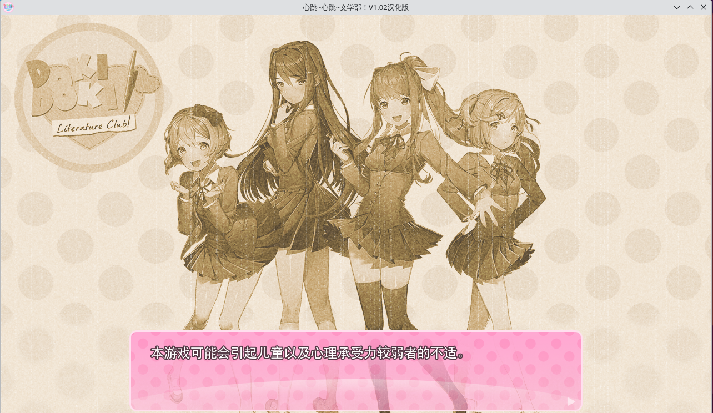
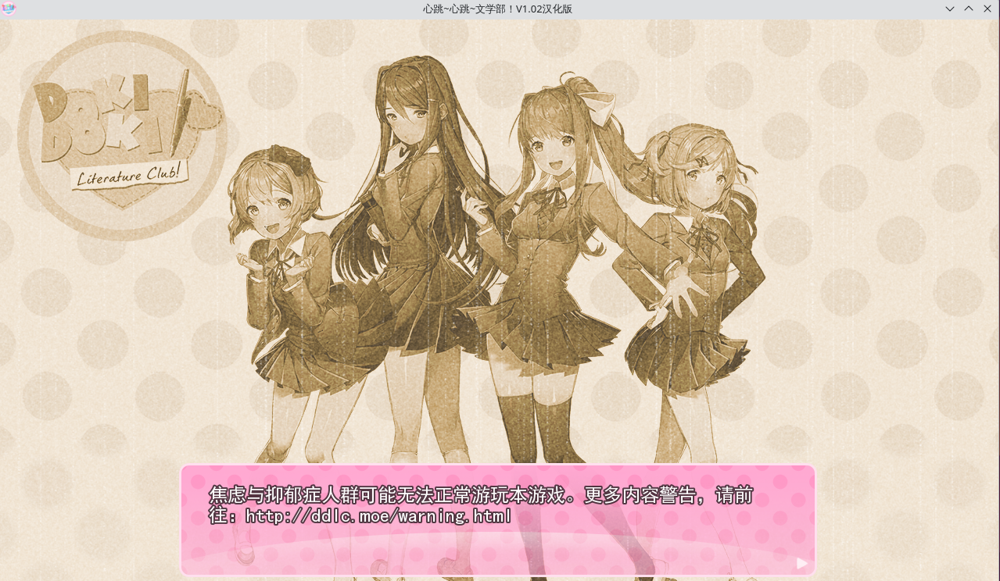
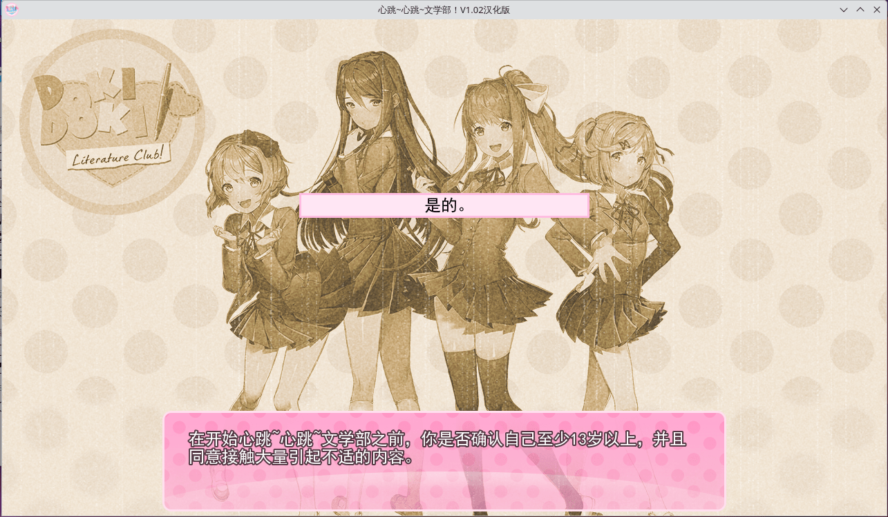
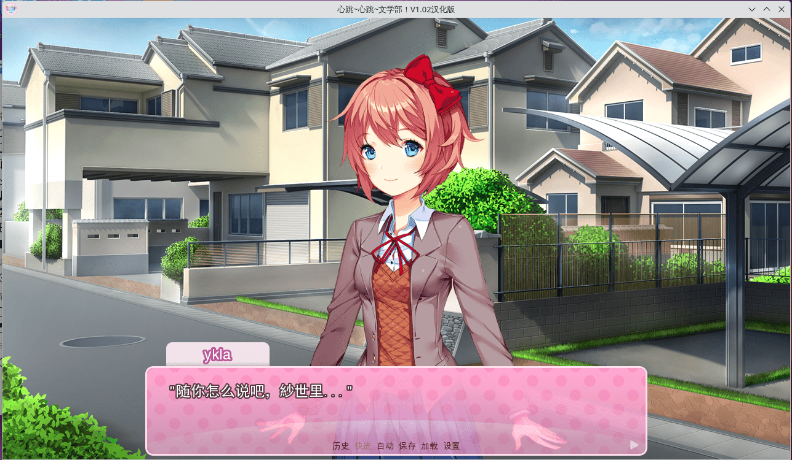
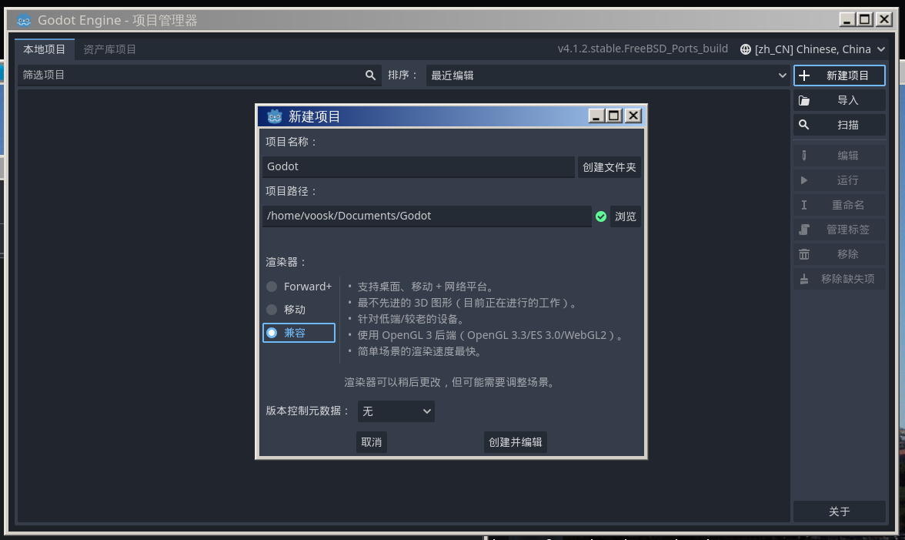
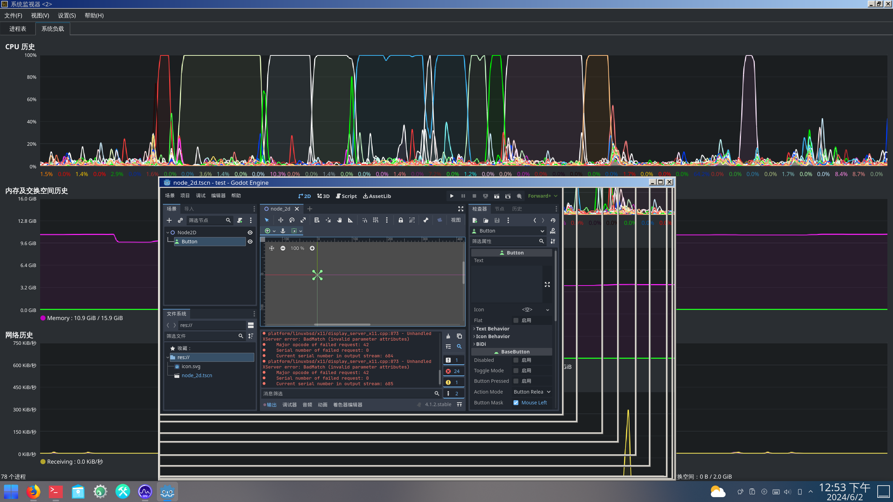
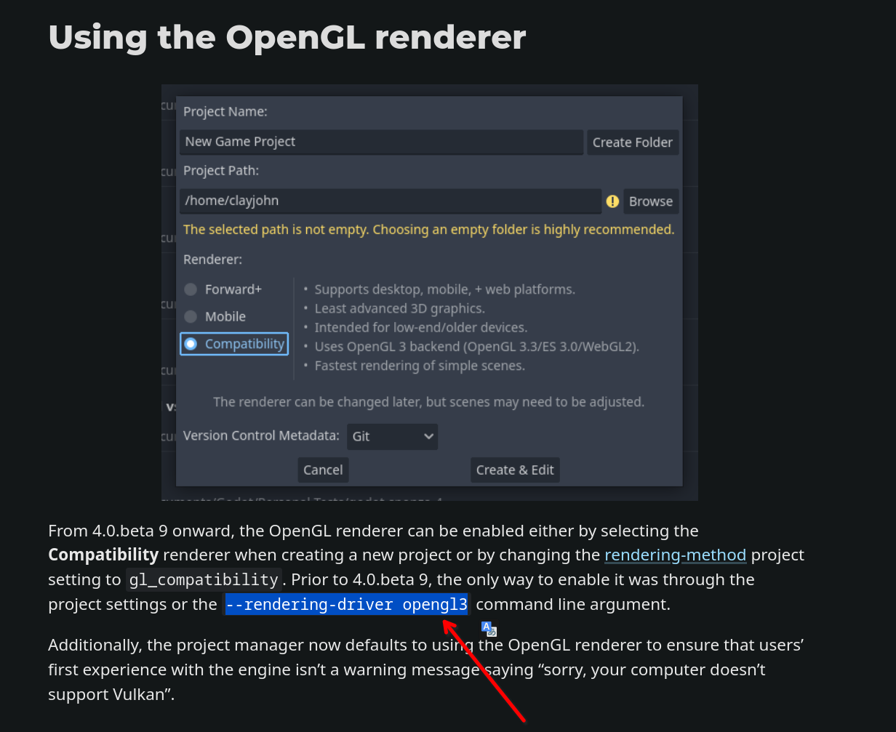

# 20.1 游戏


## 五分钟游戏

|    游戏        |     Gnome/GTK      |   KDE/Qt    |      游戏类型      |
| :--------: | :----------------: | :---------: | :------------: |
|    数独    |    games/gnome-sudoku    |   games/ksudoku   | 逻辑/益智游戏  |
|    数壹    |       games/hitori       |             | 逻辑/益智游戏  |
|    扫雷    |     games/gnome-mines    |   games/kmines    |    益智游戏    |
|    2048    |     games/gnome-2048     |      |    益智游戏    |
|   贪吃蛇   |   games/gnome-nibbles    |             |    休闲游戏    |
|  国际象棋  |    games/gnome-chess    |    games/knights   |    益智游戏    |
|   五子棋   |                    |     games/bovo     |    益智游戏    |
|  配对拼图  |   games/gnome-tetravex  |             |    益智游戏    |
|   对对碰   |  games/gnome-mahjongg   |   |                |
| 俄罗斯方块 |     games/quadrapassel    |   games/kblocks   | 限时消除类游戏 |
|   机器人   |    games/gnome-robots    |             |                |
|   黑白棋   |               |  games/kreversi   |     翻转棋     |
|   吃豆人   |                    |   games/kapman    |                |
|   华容道   |  games/gnome-klotski |             |                |
|  宝石迷阵  |     games/swell-foop     |  games/kdiamond   |   消除类游戏   |
|  快艇骰子  |        games/tali        |     games/kiriki  |                |
|   四子棋   |   games/four-in-a-row    |  games/kfourinline |                |
|   炸弹人   |                    |  games/granatier  |                |
|            |                    |   games/klines    |  彩色线条游戏  |
|  纸牌接龙  |     games/aisleriot      |             |                |
|            |       games/atomix       |   games/katomic   |    解谜游戏    |

更多逻辑/益智游戏请访问 [网页谜题](https://cn.puzzle-sudoku.com/)，及 [本地小游戏](https://gottcode.org/)。

## Renpy 游戏

`Renpy` 是一款视觉小说引擎，可以很方便地拿来制作互动视频游戏。由于游戏骨架是 `Python` 语言，因此可以很方便地移植到不同的系统平台上，如 Windows 及 Linux。

虽然 `Renpy` 暂时未对 `FreeBSD` 作系统适配，但是 `FreeBSD` 自己对其作了二次打包。如此一来，就可以在 FreeBSD 上畅玩互动游戏了么？显然不是！不过，我们可以作一番小小的尝试。


### 安装 renpy

使用 pkg：

```sh
# pkg install renpy
```

或者使用 Ports：

```sh
# cd /usr/ports/games/renpy/ 
# make install clean
```

### renpy 设置中文界面





### 玩《心跳文学部！》

>**警告**
>
>《心跳文学部！》是一款恐怖游戏，并可能会[致郁](https://ddlc.moe/warning)！

  这里以 [《心跳文学部！》](https://teamsalvato.itch.io/ddlc) 为例，其它游戏也可同样操作。选择附有 Linux 版本的游戏解压（即 Windows 版本，2 版本共存）。

- 运行 renpy

  默认游戏路径在 `~/`，renpy 不识别中文路径，所以必须把解压后的文件夹 `DDLC-1.1.1-pc` 放在用户根目录下（比如我是 `/home/ykla`）。汉化语言包位置：[Doki Doki Literature Club 简体中文汉化补丁 v1.02（2025 更新）](https://steamcommunity.com/sharedfiles/filedetails/?id=1176221672)。将汉化包解压出来放在对应目录即可。

  在引擎界面左侧，点击`刷新`。`工程(Projects)` 处可以看到列出来刷新的游戏 `DDLC-1.1.1`，点击该游戏后，选择右下角的 `启动工程(Launch Project)` 即可加载游戏。

  我已经把上面的游戏打包了放在 <https://github.com/ykla/DDLC/releases>，以飨读者。

>**警告**
>
>《心跳文学部！》是一款[恐怖游戏](https://ddlc.moe/warning)，并可能会致郁！











### rpa 解包

- 尽量选择附有 Linux 版本的游戏

  如果游戏仅支持 Windows 系统，可通过 renpy 引擎打包 Linux 版本。

- rpa 文件解包：[unrpa](https://github.com/Lattyware/unrpa)

或者 `$ pip install unrpa`

```python
$ python3 unrpa -mp "解包目录" "XXX.rpa"
```

- rpyc 文件解包：[unrpyc](https://github.com/CensoredUsername/unrpyc)

```python
$ python3 unrpyc -c "XXX.rpyc"
```

  这一步非必要，仅为了方便翻译成其它语言。

### 参考文献

- 游戏分发站： [itch](https://itch.io/)

## Godot 游戏

安装 Godot

```sh
# pkg install godot-tool godot
```

或者：

```sh
# cd /usr/ports/devel/godot-tools/ && make install clean
# cd /usr/ports/devel/godot/ && make install clean
```

安装好以后新建项目，进入编辑器，你可能会发现非常卡，CPU 占用高。这是因为此时 Godot 的渲染是 CPU 在处理，而且交给了单个线程。你需要给 `godot-tool` 加一个启动参数：

```sh
$ godot-tool --rendering-driver opengl3
```

这样进入打开项目 Godot 编辑器以后，打开 KDE 或 Gnome 的系统监视器，缩放 Godot 窗口，就会发现 CPU 的占用没有明显变化，这说明渲染工作已经交给了 GPU。

除此之外，还需要注意的是工程的创建，如果你遇到了上面的卡顿问题，并且使用了强制 OpenGL 参数，在创建项目的时候应该选择“兼容”，而不是 Forward+ 或移动，因为只有“兼容”才使用 OpenGL3 后端，那两个都是 RenderingDevice，这个可以在窗口中的介绍看到。



  
  


