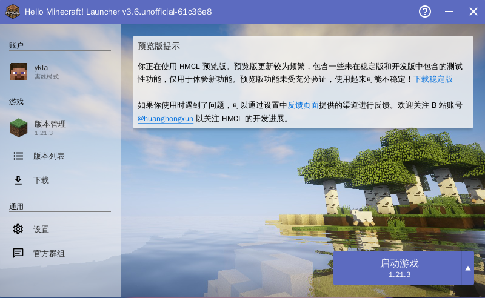
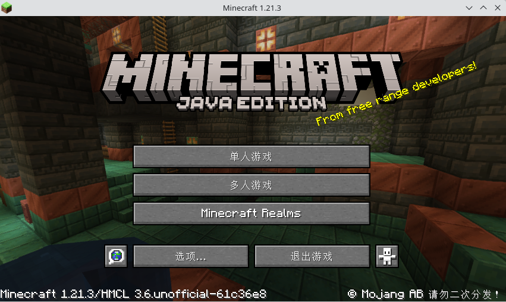
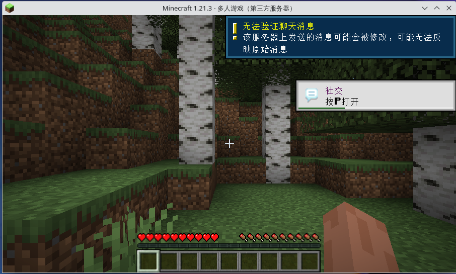

# 第 20.1 节 游戏

## 我的世界（Minecraft）

### 桌面端

>**警告**
>
>请勿使用 Port `games/minecraft-client`。无人维护，版本太旧已经过时，打开均提示无法下载。

#### 安装 OpenJDK

过旧的 jdk 版本并不支持，本文测试 23 正常。

安装 OpenJDK23：

```sh
# pkg install openjdk23
```

或者：

```sh
# cd /usr/ports/java/openjdk23/ 
# make install clean
```

#### 配置 HMCL

从 [releases](https://github.com/HMCL-dev/HMCL/releases) 下载最新的发行版本。

打开终端执行

```sh
$ java -jar HMCL*.jar
```

不是所有的 Minecraft 版本都支持，适配版本请参考[平台支持状态](https://github.com/HMCL-dev/HMCL/blob/main/PLATFORM_cn.md)。

其他设置同其他平台，不再赘述。

#### 启动游戏





### 服务器端

#### 安装 OpenJDK

过旧的 jdk 版本并不支持，本文测试 23 正常。

安装 OpenJDK23：

```sh
# pkg install openjdk23
```

或者：

```sh
# cd /usr/ports/java/openjdk23/ 
# make install clean
```

#### 使用 Ports 或官方服务器

经过测试 [Minecraft 官方服务器端](https://www.minecraft.net/en-us/download/server)可以直接在 FreeBSD 14.2 上运行。只需要安装 OpenJDK 即可。

还可以使用 Ports 中的 `games/minecraft-server`：

```sh
# cd /usr/ports/games/minecraft-server/ 
# make install clean
```

查看配置信息：

```sh
root@ykla:/usr/ports/games/minecraft-server # pkg info -D minecraft-server
minecraft-server-1.21.1:
On install:
When you first run minecraft-server, it will populate the file
/usr/local/etc/minecraft-server/eula.txt

It is required to read the EULA, and then set eula=true

- Configuration files can be found in /usr/local/etc/minecraft-server/
- Log and debug output files can be found in /var/log/minecraft-server/
- World files can be found in /var/db/minecraft-server/

Without daemon option:
- To run the server, run /usr/local/bin/minecraft-server # 运行方法
- To edit java's parameters, edit /usr/local/etc/minecraft-server/java-args.txt # java 参数
- To run with a specific version of Java, set environment variable JAVA_VERSION, # 指定某一 java 版本
  for example:
    export JAVA_VERSION=22
    /usr/local/bin/minecraft-server
  or:
    JAVA_VERSION=22 /usr/local/bin/minecraft-server

With daemon option:
- The service has been installed with the name 'minecraft'
- To adjust maximum memory usage (-Xmx), use minecraft_memx= in /etc/rc.conf  # 指定最大内存占用
- To adjust initial memory usage (-Xms), use minecraft_mems= in /etc/rc.conf # 指定初始化内存占用
- To add other java parameters, use minecraft_args= in /etc/rc.conf # 指定初始化参数
- To run with a specific version of Java, use minecraft_java_version= in /etc/rc.conf # 指定某一 java 版本
- To see the interactive console, type service minecraft console
```

```sh
$ /usr/local/bin/minecraft-server

…………省略一部分…………

[15:52:21] [ServerMain/WARN]: Failed to load eula.txt
[15:52:21] [ServerMain/INFO]: You need to agree to the EULA in order to run the server. Go to eula.txt for more info.
```

提示需要同意许可协议，将 `/usr/local/etc/minecraft-server/eula.txt` 里面的 `eula=false` 改成 `eula=true`。

再次运行 `$ /usr/local/bin/minecraft-server`：

```sh
root@ykla:/usr/ports/games/minecraft-server # /usr/local/bin/minecraft-server
Starting net.minecraft.server.Main
[15:54:47] [ServerMain/INFO]: Environment: Environment[sessionHost=https://sessionserver.mojang.com, servicesHost=https://api.minecraftservices.com, name=PROD]
[15:54:48] [ServerMain/INFO]: No existing world data, creating new world
[15:54:49] [ServerMain/INFO]: Loaded 1290 recipes
[15:54:49] [ServerMain/INFO]: Loaded 1399 advancements
[15:54:49] [Server thread/INFO]: Starting minecraft server version 1.21.1
[15:54:49] [Server thread/INFO]: Loading properties
[15:54:49] [Server thread/INFO]: Default game type: SURVIVAL
[15:54:49] [Server thread/INFO]: Generating keypair
[15:54:49] [Server thread/INFO]: Starting Minecraft server on *:25565
[15:54:50] [Server thread/INFO]: Using default channel type
[15:54:50] [Server thread/INFO]: Preparing level "world"
[15:54:53] [Server thread/INFO]: Preparing start region for dimension minecraft:overworld
[15:54:53] [Worker-Main-2/INFO]: Preparing spawn area: 2%
[15:54:54] [Worker-Main-2/INFO]: Preparing spawn area: 2%
[15:54:54] [Worker-Main-3/INFO]: Preparing spawn area: 2%
[15:54:55] [Worker-Main-1/INFO]: Preparing spawn area: 2%
[15:54:55] [Worker-Main-2/INFO]: Preparing spawn area: 18%
[15:54:56] [Worker-Main-1/INFO]: Preparing spawn area: 51%
[15:54:56] [Worker-Main-3/INFO]: Preparing spawn area: 51%
[15:54:56] [Server thread/INFO]: Time elapsed: 3317 ms
[15:54:56] [Server thread/INFO]: Done (6.876s)! For help, type "help"
```

按 **ctrl** + **c** 中断。因为此时非正版用户和未登录用户无法使用此服务器。我们需要关闭正版验证。

`/usr/local/etc/minecraft-server/server.properties` 将其中的 `online-mode=false` 改成 `online-mode=true`

然后再次运行服务器：

```sh
root@ykla:/usr/ports/games/minecraft-server # /usr/local/bin/minecraft-server
Starting net.minecraft.server.Main
[18:47:47] [ServerMain/INFO]: Environment: Environment[sessionHost=https://sessionserver.mojang.com, servicesHost=https://api.minecraftservices.com, name=PROD]
[18:47:51] [ServerMain/INFO]: Loaded 1337 recipes
[18:47:51] [ServerMain/INFO]: Loaded 1448 advancements
[18:47:51] [Server thread/INFO]: Starting minecraft server version 1.21.3
[18:47:51] [Server thread/INFO]: Loading properties
[18:47:51] [Server thread/INFO]: Default game type: SURVIVAL
[18:47:51] [Server thread/INFO]: Generating keypair
[18:47:51] [Server thread/INFO]: Starting Minecraft server on *:25565
[18:47:51] [Server thread/INFO]: Using default channel type
[18:47:52] [Server thread/WARN]: **** SERVER IS RUNNING IN OFFLINE/INSECURE MODE!
[18:47:52] [Server thread/WARN]: The server will make no attempt to authenticate usernames. Beware.
[18:47:52] [Server thread/WARN]: While this makes the game possible to play without internet access, it also opens up the ability for hackers to connect with any username they choose.
[18:47:52] [Server thread/WARN]: To change this, set "online-mode" to "true" in the server.properties file.
[18:47:52] [Server thread/INFO]: Preparing level "world"
[18:47:52] [Server thread/INFO]: Preparing start region for dimension minecraft:overworld
[18:47:53] [Worker-Main-5/INFO]: Preparing spawn area: 0%
[18:47:53] [Worker-Main-5/INFO]: Preparing spawn area: 0%
[18:47:53] [Worker-Main-5/INFO]: Preparing spawn area: 0%
[18:47:53] [Server thread/INFO]: Time elapsed: 1233 ms
[18:47:53] [Server thread/INFO]: Done (1.709s)! For help, type "help"
[18:48:34] [Server thread/INFO]: ykla[/127.0.0.1:37462] logged in with entity id 39 at (-1.5, 63.0, 1.5)
[18:48:34] [Server thread/INFO]: ykla joined the game

```



## 五分钟游戏

|    游戏        |     Gnome/GTK      |   KDE/Qt    |      游戏类型      |
| :--------: | :----------------: | :---------: | :------------: |
|    数独    |    games/gnome-sudoku    |   games/ksudoku   | 逻辑/益智游戏  |
|    数壹    |       games/hitori       |             | 逻辑/益智游戏  |
|    扫雷    |     games/gnome-mines    |   games/kmines    |    益智游戏    |
|    2048    |     games/gnome-2048     |      |    益智游戏    |
|   贪吃蛇   |   games/gnome-nibbles    |             |    休闲游戏    |
|  国际象棋  |    games/gnome-chess    |    games/knights   |    益智游戏    |
|   五子棋   |                    |     games/bovo     |    益智游戏    |
|  配对拼图  |   games/gnome-tetravex  |             |    益智游戏    |
|   对对碰   |  games/gnome-mahjongg   |   |                |
| 俄罗斯方块 |     games/quadrapassel    |   games/kblocks   | 限时消除类游戏 |
|   机器人   |    games/gnome-robots    |             |                |
|   黑白棋   |               |  games/kreversi   |     翻转棋     |
|   吃豆人   |                    |   games/kapman    |                |
|   华容道   |  games/gnome-klotski |             |                |
|  宝石迷阵  |     games/swell-foop     |  games/kdiamond   |   消除类游戏   |
|  快艇骰子  |        games/tali        |     games/kiriki  |                |
|   四子棋   |   games/four-in-a-row    |  games/kfourinline |                |
|   炸弹人   |                    |  games/granatier  |                |
|            |                    |   games/klines    |  彩色线条游戏  |
|  纸牌接龙  |     games/aisleriot      |             |                |
|            |       games/atomix       |   games/katomic   |    解谜游戏    |

更多逻辑/益智游戏请访问[网页谜题](https://cn.puzzle-sudoku.com/)，及[本地小游戏](https://gottcode.org/)。

## Renpy 游戏

`Renpy` 是一款视觉小说引擎，可以很方便地拿来制作互动视频游戏。由于游戏骨架是 `Python` 语言，因此可以很方便地移植到不同的系统平台上，如 Windows 及 Linux。

虽然 `Renpy` 暂时未对 `FreeBSD` 作系统适配，但是 `FreeBSD` 自己对其作了二次打包。如此一来，就可以在 FreeBSD 上畅玩互动游戏了么？显然不是！不过，我们可以作一番小小的尝试。

### 操作

1.安装 renpy

```sh
# pkg install renpy
```

或者：

```sh
# cd /usr/ports/games/renpy/ 
# make install clean
```

2. 下载游戏

    这里以[《心跳文学部！》](https://teamsalvato.itch.io/ddlc)为例，其它游戏也可同样操作。选择附有 Linux 版本的游戏解压。

>**警告**
>
>《心跳文学部！》是一款恐怖游戏，并可能会致郁！由于编者对此处并不熟悉，请求社区用其他游戏进行替换，可 PR。

3. 运行 renpy

    在引擎界面左侧`工程(Projects)`处可以看到列出来刷新的游戏`DDLC-1.1.1`，点击该游戏后，选择右下角的`启动工程(Launch Project)`即可加载游戏。

### 参考说明

- 游戏分发站： [itch](https://itch.io/)
- 尽量选择附有 Linux 版本的游戏

  如果游戏仅支持 Windows 系统，可通过 renpy 引擎打包 Linux 版本。

- rpa 文件解包：[unrpa](https://github.com/Lattyware/unrpa)

```python
python3 unrpa -mp "解包目录" "XXX.rpa"
```

- rpyc 文件解包：[unrpyc](https://github.com/CensoredUsername/unrpyc)

```python
python3 unrpyc -c "XXX.rpyc"
```

  这一步非必要，仅为了方便翻译成其它语言。

## Godot 游戏

安装 Godot

```sh
# pkg install godot-tool godot
```

或者：

```sh
# cd /usr/ports/devel/godot-tools/ && make install clean
# cd /usr/ports/devel/godot/ && make install clean
```

安装好以后新建项目，进入编辑器，你可能会发现非常卡，CPU 占用高。这是因为此时 Godot 的渲染是 CPU 在处理，而且交给了单个线程。  
你需要给 `godot-tool` 加一个启动参数:

```sh
$ godot-tool --rendering-driver opengl3
```

这样进入打开项目 Godot 编辑器以后，打开 KDE 或 Gnome 的系统监视器，缩放 Godot 窗口，就会发现 CPU 的占用没有明显变化，这说明渲染工作已经交给了 GPU.  
除此之外，还需要注意的是工程的创建，如果你遇到了上面的卡顿问题，并且使用了强制 OpenGL 参数，在创建项目的时候应该选择“兼容”，而不是 Forward+ 或移动，因为只有“兼容”才使用 OpenGL3 后端，那两个都是 RenderingDevice，这个可以在窗口中的介绍看到。
 

  
  


