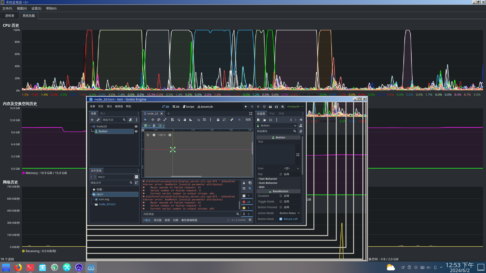

# 20.2 Godot 开源游戏引擎


## 安装 Godot 引擎

使用 pkg 安装：

```sh
# pkg install godot-tool godot
```

或者使用 ports 安装：

```sh
# cd /usr/ports/devel/godot-tools/ && make install clean
# cd /usr/ports/devel/godot/ && make install clean
```

## 使用 Godot

安装完成后新建项目并进入编辑器，可能会发现界面卡顿且 CPU 占用率较高。这是因为此时 Godot 的渲染由 CPU 处理，并且仅使用单个线程。

此时需要为 `godot-tool` 添加一个启动参数：


```sh
$ godot-tool --rendering-driver opengl3
```

使用 OpenGL 3 渲染驱动启动 Godot 工具。

这样在打开项目并进入 Godot 编辑器后，通过 KDE 或 GNOME 的系统监视器观察，在缩放 Godot 窗口时可以发现 CPU 占用率没有明显变化，这表明渲染工作已经由 GPU 处理。

此外，还需要注意项目的创建方式。如果遇到上述卡顿问题并使用了强制 OpenGL 参数，在创建项目时应选择“兼容”，而不是 Forward+ 或“移动”，因为只有“兼容”模式使用 OpenGL3 后端，后两者使用的是 RenderingDevice，这一点可以在创建窗口的说明中看到。


  
  


