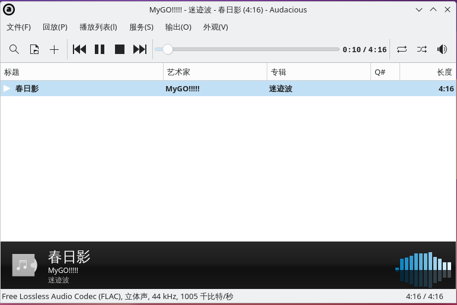
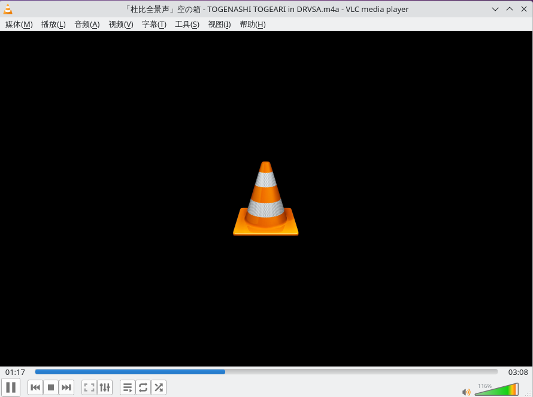

# 第 20.2 节 音频播放器

## Audacious

### 安装 Audacious
- 使用 pkg 安装：

```sh
# pkg install audacious audacious-plugins
```

>**注意**
>
>不安装 `audacious-plugins`，则无法打开 `audacious` 主程序。

- 或者使用 Ports 安装：

```sh
# cd /usr/ports/multimedia/audacious/ && make install clean
# cd /usr/ports/multimedia/audacious-plugins/ && make install clean
```
### 使用

- 测试 `.m4a`（杜比 AC-4 编码）、`.flac`、`.av3a`（AVS2/AVS3 编码 ）音乐：

Audacious 仅支持 `.flac`，不支持 `.m4a`、`.av3a`。



## VLC

安装等方法见其他章节。FreeBSD `ffmpeg` 默认编码没有打开对 libuavs3d（提供了 AVS2/AVS3）的支持。不知道怎样做。

经过测试 VLC 可播放 ac4（m4a）：



## 用 MPD 播放 DSD

Music Player Daemon (MPD) 是一款灵活、强大且可扩展的音乐播放器系统，它可以在计算机上运行，并通过各种客户端进行控制。MPD 的主要功能包括：支持各种音频格式，客户端 - 服务器架构，播放列表管理，支持流媒体，跨平台支持等。

### 准备

支持 DSD 的声卡或 DAC，一段 DSD 音频文件。

以下基于 FreeBSD 14.0，外置 DAC 使用海贝 R3（声卡设置基本类似），使用 oss 驱动。

### 安装

```sh
# pkg install musicpd
```

或者

```sh
# cd /usr/ports/audio/musicpd/
# make install clean
```

### 硬件设置

查看声卡信息

```sh
# cat /dev/sndstat
pcm0: <Realtek ALC269 (Analog 2.0+HP/2.0)> (play/rec) default
pcm1: <Intel Cougar Point (HDMI/DP 8ch)> (play)
pcm2: <USB audio> (play)
No devices installed from userspace.
```

这里要使用的是 pcm2，对应设备文件 `/dev/dsp2`，下面会使用到。

可以用 `sysctl -d dev.pcm.2` 查看相关硬件参数意义，摘录关键的三条如下：

```sh
dev.pcm.2.bitperfect: bit-perfect playback/recording (0=disable, 1=enable)
dev.pcm.2.play.vchanrate: virtual channel mixing speed/rate
dev.pcm.2.play.vchanmode: vchan format/rate selection: 0=fixed, 1=passthrough, 2=adaptive
```

如下设置 (可以写入 `sysctl.conf` 永久化设置):

```sh
# sysctl dev.pcm.2.bitperfect=1
# sysctl dev.pcm.2.play.vchanrate=352800
# sysctl dev.pcm.2.play.vchanmode=1
```

- 因为使用的 oss 驱动，muscipd 只能用 dop 传输模式，dop 模式要求开启 bitperfect
- 采样率 (vchanrate)，DSD 采样率为 44.1khz 的倍数，所以不要设为 48khz 的倍数不然会有杂音，在可能的情况下设置为最高，这里是 352.8khz。
- 0（fixed）：在此模式下，音频设备使用固定的采样率和格式来处理多路音频流。1（passthrough）：在此模式下，音频设备尽可能地保持输入音频流的原始采样率和格式。2（adaptive）：在此模式下，音频设备会根据需要自动适应和转换输入音频流的采样率和格式。

>**技巧**
>
>可以用 `dmesg` 查看可用采样率。在非播放非 dsd 文件时，采样率和音频文件采样率相同（或整数倍）为宜，这样可以避免重采样造成的音质损失。采样率不是越高越好，可以多试几次，找到最佳。

```sh
# dmesg|grep -i pcm2
pcm2 on uaudio0
# dmesg|grep -i uaudio0
uaudio0 on uhub0
uaudio0: <HiBy R3, class 239/2, rev 2.00/ff.ff, addr 1> on usbus1
uaudio0: Play[0]: 384000 Hz, 2 ch, 32-bit S-LE PCM format, 2x4ms buffer. (selected)
uaudio0: Play[0]: 352800 Hz, 2 ch, 32-bit S-LE PCM format, 2x4ms buffer.
uaudio0: Play[0]: 192000 Hz, 2 ch, 32-bit S-LE PCM format, 2x4ms buffer.
uaudio0: Play[0]: 176400 Hz, 2 ch, 32-bit S-LE PCM format, 2x4ms buffer.
uaudio0: Play[0]: 96000 Hz, 2 ch, 32-bit S-LE PCM format, 2x4ms buffer.
uaudio0: Play[0]: 88200 Hz, 2 ch, 32-bit S-LE PCM format, 2x4ms buffer.
uaudio0: Play[0]: 48000 Hz, 2 ch, 32-bit S-LE PCM format, 2x4ms buffer.
uaudio0: Play[0]: 44100 Hz, 2 ch, 32-bit S-LE PCM format, 2x4ms buffer.
uaudio0: Play[0]: 32000 Hz, 2 ch, 32-bit S-LE PCM format, 2x4ms buffer.
uaudio0: No recording.
uaudio0: No MIDI sequencer.
pcm2 on uaudio0
uaudio0: No HID volume keys found.
```

### 基本设置

musicpd 配置文件为 `/usr/local/etc/musicpd.conf` 。

里面默认的一些目录为

```ini
/var--> mpd --
               |-> music
               |-> .mpd --> playlists
```

这些目录要自行建立

```sh
# mkdir -p /var/mpd/music
# mkdir -p /var/mpd/.mpd/playlists
# chown -R mpd:mpd /var/mpd
# chmod 777 /var/mpd/music
```

第三行把目录设为用户 mpd 所有，不然可能有权限问题。第四行 music 目录存放音乐文件用，设置 777 是为方便增删文件，自己根据情况设置即可。

修改 `/usr/local/etc/musicpd.conf` ，"Default OSS Device" 一节后面增加一节：

```ini
audio_output {
        type            "oss"
        name            "OSS Device（dop mode）"
        device          "/dev/dsp2"     # 指定使用的设备，不需要把 dac 或声卡等设置为默认设备，dsp2 专用于播放音乐，默认设备做自己的事就行
        dop             "yes"           # 开启 dop 模式
}
```

注意：可以指定多个输出设备，在各种客户端中可以开启关闭指定的输出设备


开启 musicpd 服务

```sh
# sysrc musicpd_enable=YES
# service musicpd start
```

### 客户端使用

可以使用 ncmpc (字符界面），MaximumMPD（iphone）等客户端，客户端有很多。

pc 端 GUI 建议使用 cantata (`pkg install cantata`)

命令行建议安装 mpc（`pkg install musicpc`), 适合用于绑定桌面环境全局快捷键


