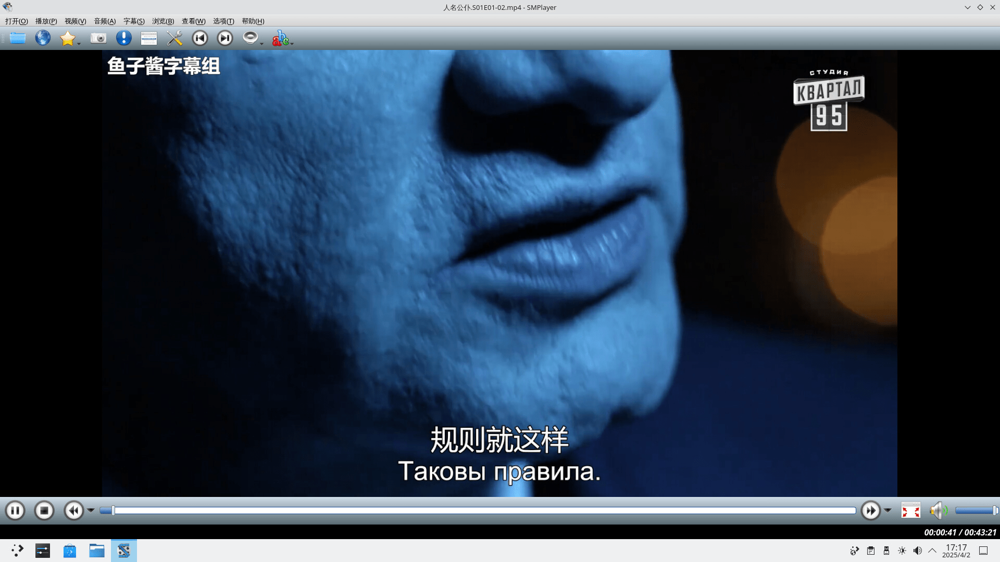
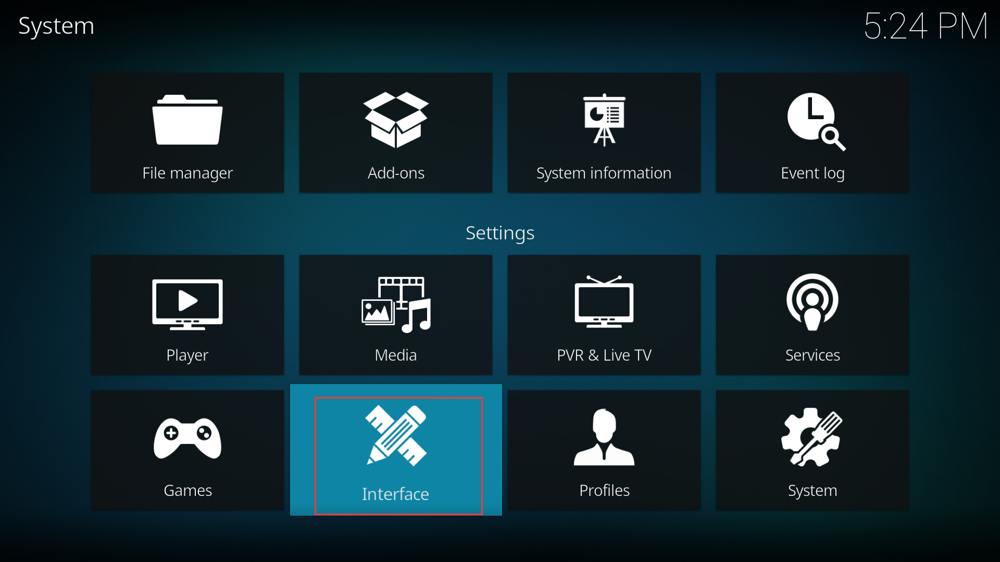

# 第 20.2 节 视频播放器 & 剪辑

## VLC

### 安装 VLC

- 使用 pkg 安装：
  
```sh
# pkg install vlc
```

- 或者使用 Ports：

```sh
# cd /usr/ports/multimedia/vlc/ 
# make install clean
```

### VLC 视频播放测试

视频 A、B 均正常


## SMPlayer

SMPlayer 是 MPlayer（纯命令行）的 QT 前端。推荐使用。

### 安装 SMPlayer

- 使用 pkg 安装：

```sh
# pkg install smplayer
```

- 或者使用 Ports：

```sh
# cd /usr/ports/multimedia/smplayer/ 
# make install clean
```

### SMPlayer 视频播放测试

视频 A、B 均正常




## Kodi

Kodi 曾用名为 XBMC。

### 安装 Kodi 

- 使用 pkg 安装：
  
```
# pkg install kodi
```

- 或者使用 Ports：
  
```sh
# cd /usr/ports/multimedia/kodi/ 
# make install clean
```

### Kodi 设置中文

打开 `interface`（界面）



点击 `Skin`（皮肤）。再点击左下角，把 `basic`（简单）改为 `expert`（专家）或 `Standard`（标准），否则你看不到 `fonts` 等选项！然后将 `fonts`（字体）改为 `Arial based`，否则中文会乱码！


返回，选择 `Regional`（区域）——> `Language`（语言）——> `Chinese (Simple)`（简体中文）。


中文设置完毕：


### Kodi 播放视频测试

视频 A、B 均正常


## 视频剪辑

- Olive 视频编辑器：

安装：

```sh
# pkg install olive-video-editor
```

或者：

```sh
# cd /usr/ports/multimedia/olive/ 
# make install clean
```


## 压缩字幕

- ffmpeg :

```
# pkg install ffmpeg
```

或者：

```sh
# cd /usr/ports/multimedia/ffmpeg/ 
# make install clean
```

处理：

```sh
$ ffmpeg -i 视频文件.mp4 -vf subtitles=对应字幕.ass 输出视频.mp4
```