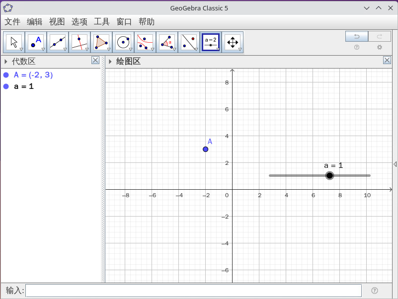
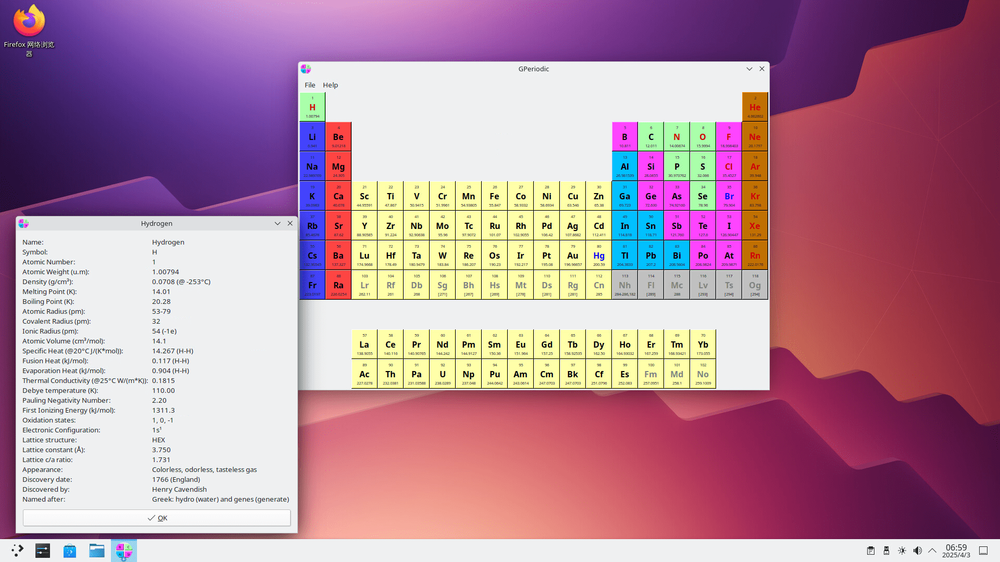
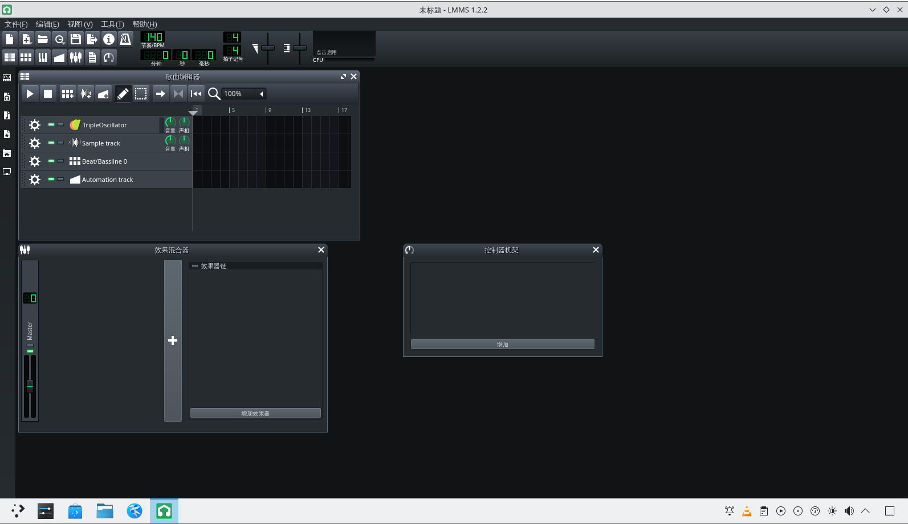
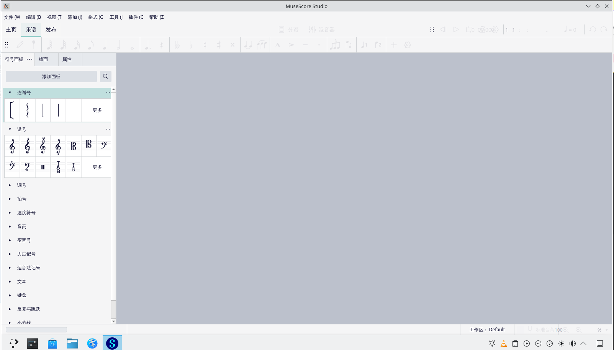
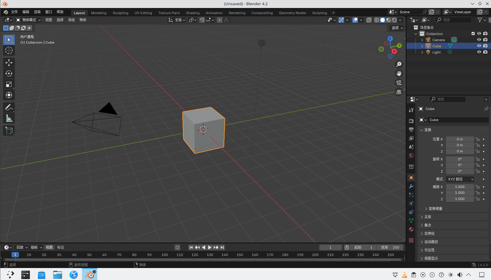
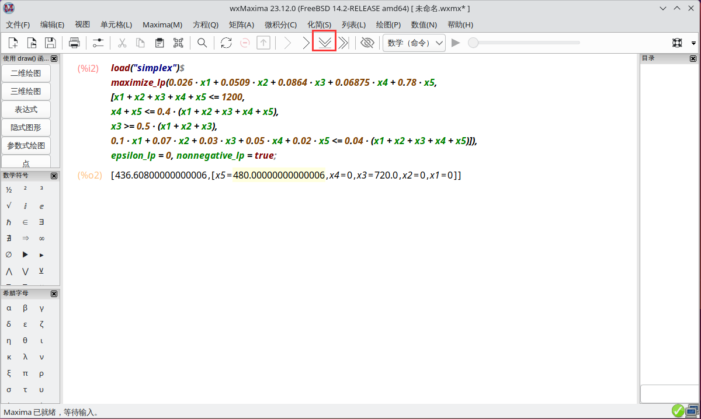

# 第 20.5 节 科研与专业工具

## Calibre 文档管理（epub、mobi、azw3 等格式）

用过 Kindle 的人应该对 Calibre 这款软件并不陌生。Calibre 可以在多种文档格式之间进行转换，还可以自定义 CSS 格式。

### 安装 Calibre

- 使用 pkg 安装：

```sh
# pkg install calibre
```

- 使用 Ports 安装：

```sh
# cd /usr/ports/deskutils/calibre/ 
# make install clean
```

### 使用 Calibre


## 代数学

简单的计算器 **bc** 和 **dc**，无需安装，FreeBSD 基本系统内置。其源代码在 <https://github.com/freebsd/freebsd-src/tree/main/contrib/bc>。

### bc（Basic Calculator）简单的计算器

```sh
$ bc # 进入 bc
1+15 # 加法
16
sqrt(256) # 开方
16
5^3	 # 求立方
125
90/3 # 除法
30
10%4 # 求余数
2
quit # 退出程序
```

### 后缀表示法


我们从接触数学伊始，用的计算表达方式就是中缀表示法。如，要计算 3 和 4 的和，写作 `3 + 4`，操作符（本例是 `+`）处于操作数（即 3 和 4）的中间。

而在后缀表示法里，操作符置于操作数的后面。如上式改若用后缀表示法，则写作 `3 4 +`。如果有多个操作符，操作符则置于第二个操作数的后面，所以常规中缀表示法的 `3 - 4 + 5` 在后缀表示法里写作 `3 4 - 5 +` 。

乍看起来，后缀表示法十分反人类，然而这种方法更容易被计算机理解，可以利用堆栈结构减少计算机内存访问。

有一例中缀表达式 `5 + ((1 + 2) * 4) - 3`，改为后缀表示法为 `5 1 2 + 4 * + 3 -`。下表给出了从左至右求值的过程，堆栈栏给出了中间值，用于跟踪算法。

| 输入 |   操作   |  堆栈   |            注释            |
| :--: | :------: | :-----: | :------------------------: |
|  5   |   入栈   |    5    |                            |
|  1   |   入栈   |  5, 1   |                            |
|  2   |   入栈   | 5, 1, 2 |                            |
|  +   | 加法运算 |  5, 3   |  1, 2 出栈，让结果 3 入栈  |
|  4   |   入栈   | 5, 3, 4 |                            |
|  \*  | 乘法运算 |  5, 12  | 3, 4 出栈，让结果 12 入栈  |
|  +   | 加法运算 |   17    | 5, 12 出栈，让结果 17 入栈 |
|  3   |   入栈   |  17, 3  |                            |
|  -   | 减法运算 |   14    | 17, 3 出栈，让结果 14 入栈 |

计算完成时，栈内只有一个操作数，这就是表达式的结果 `14`。

#### dc（Desktop Calculator）桌面计算器 

`dc` 是采用后缀表示法的开源计算器，传统上，采用中缀表示法的 `bc` 计算器程序是在 `dc` 之上实现的。

对于上例，我们试着用 `dc` 操作一番。终端输入 

```sh
$ dc -e '5 1 2 + 4 * + 3 - p'
```

可得到 `14`。问题解决。

## 几何学

### 几何绘图软件 GeoGebra

安装命令：

```sh
# pkg install geogebra
```

或者使用 Ports 安装：

```sh
# cd /usr/ports/math/geogebra/ 
# make install clean
```



## 线性规划

安装 GLPK：

```sh
# pkg install glpk
```

或者

```sh
# cd /usr/ports/math/glpk/ 
# make install clean
```

线性规划里，我们经常会用到 **单纯形法**。在计算机层面，有很多软件可以解放我们的大脑，你甚至可以在 OFFICE 表格软件的“规划求解”里，得到很好的解答。这里我们简单介绍一下免费的命令行线性规划软件包 GLPK 的使用方法。希望大家可以触类旁通，举一反三。

我们先来看一个例子，取自 Hamdy A. Tara 所著的“Operations Research : An Introduction”一书，例题 2.4-1：

> 有一家银行计划放贷，预计最高投放 1200 万。下表显示了相关的数据。

| 贷款类型 | 利率  | 坏账率 |
| :------: | :---: | :----: |
|   个人   | 0.14  |  0.1   |
|   汽车   | 0.13  |  0.07  |
|   家用   | 0.12  |  0.03  |
|   农业   | 0.125 |  0.05  |
|   商业   |  0.1  |  0.02  |

> 坏账意味着不产生利润，本金也无法收回。为了同其它商业机构竞争，农业贷款和商业贷款之和不少于全部贷款的 40% ；为了振兴房地产业，个人贷款、家用贷款和个人贷款三项总计中，其中的个人贷款占比不少于 50% ；银行坏账率最高允许为全部贷款的 4%。
>
> 求解银行能获得最高利润的分配方式。

我们来逐步分析。先设个人、汽车、家用、农业及商业分别的贷款量为 x1、x2、x3、x4 以及 x5。

利润 = 0.14 · 0.9 x1 + 0.13 · 0.93 x2 + 0.12 · 0.97 x3 + 0.125 · 0.95 x4 + 0.1 · 0.98 x5

本金损失 = 0.1 x1 + 0.07 x2 + 0.03 x3 + 0.05 x4 + 0.02 x5

得目标函数 max z = 利润 - 本金损失;

接下来，读者可根据题意找出约束条件。

由以上的目标函数和约束条件，我们可以给出以下数学模型：

```sh
max z = 0.026 x1 + 0.0509 x2 + 0.0864 x3 + 0.06875 x4 + 0.78 x5

s.t. x1 + x2 + x3 + x4 + x5 <= 1200,
    x4 + x5 <= 0.4 (x1 + x2 + x3 + x4 + x5),
    x3 >= 0.5 (x1 + x2 + x3),
    0.1 x1 + 0.07 x2 + 0.03 x3 + 0.05 x4 + 0.02 x5 <= 0.04 (x1 + x2 + x3 + x4 + x5),
    xi >= 0 (i = 1, 2, 3, 4, 5)
```

`touch example` 新建一个文本文件（命名为 `example`），输入：

```sh
var x1 >= 0;
var x2 >= 0;
var x3 >= 0;
var x4 >= 0;
var x5 >= 0;

maximize z: 0.026*x1 + 0.0509*x2 + 0.0864*x3 + 0.06875*x4 + 0.78*x5;
s.t. C1: x1 + x2 + x3 + x4 + x5 <= 1200;
s.t. C2: x4 + x5 <= 0.4*(x1 + x2 + x3 + x4 + x5);
s.t. C3: x3 >= 0.5*(x1 + x2 + x3);
s.t. C4: 0.1*x1 + 0.07*x2 + 0.03*x3 + 0.05*x4 + 0.02*x5 <= 0.04*(x1 + x2 + x3 + x4 + x5);
end;
```

保存后，终端输入 

```sh
$ glpsol -m example -o example.out
GLPSOL--GLPK LP/MIP Solver 5.0
Parameter(s) specified in the command line:
 -m example -o example.out
Reading model section from example...
12 lines were read
Generating z...
Generating C1...
Generating C2...
Generating C3...
Generating C4...
Model has been successfully generated
GLPK Simplex Optimizer 5.0
5 rows, 5 columns, 23 non-zeros
Preprocessing...
4 rows, 5 columns, 18 non-zeros
Scaling...
 A: min|aij| =  1.000e-02  max|aij| =  1.000e+00  ratio =  1.000e+02
GM: min|aij| =  5.774e-01  max|aij| =  1.732e+00  ratio =  3.000e+00
EQ: min|aij| =  3.333e-01  max|aij| =  1.000e+00  ratio =  3.000e+00
Constructing initial basis...
Size of triangular part is 4
*     0: obj =  -0.000000000e+00 inf =   0.000e+00 (5)
*     2: obj =   4.366080000e+02 inf =   0.000e+00 (0)
OPTIMAL LP SOLUTION FOUND
Time used:   0.0 secs
Memory used: 0.1 Mb (102208 bytes)
Writing basic solution to 'example.out'...
```

打开 **example.out** 文件：

```sh
$ cat example.out
Problem:    example
Rows:       5
Columns:    5
Non-zeros:  23
Status:     OPTIMAL
Objective:  z = 436.608 (MAXimum)

   No.   Row name   St   Activity     Lower bound   Upper bound    Marginal
------ ------------ -- ------------- ------------- ------------- -------------
     1 z            B        436.608
     2 C1           NU          1200                        1200       0.36384
     3 C2           NU             0                          -0        0.6936
     4 C3           B            360            -0
     5 C4           B          -16.8                          -0

   No. Column name  St   Activity     Lower bound   Upper bound    Marginal
------ ------------ -- ------------- ------------- ------------- -------------
     1 x1           NL             0             0                     -0.0604
     2 x2           NL             0             0                     -0.0355
     3 x3           B            720             0
     4 x4           NL             0             0                    -0.71125
     5 x5           B            480             0

Karush-Kuhn-Tucker optimality conditions:

KKT.PE: max.abs.err = 0.00e+00 on row 0
        max.rel.err = 0.00e+00 on row 0
        High quality

KKT.PB: max.abs.err = 0.00e+00 on row 0
        max.rel.err = 0.00e+00 on row 0
        High quality

KKT.DE: max.abs.err = 1.11e-16 on column 5
        max.rel.err = 4.34e-17 on column 5
        High quality

KKT.DB: max.abs.err = 0.00e+00 on row 0
        max.rel.err = 0.00e+00 on row 0
        High quality

End of output
```

可查看解答值为：`x3 = 720`，`x5 = 480`，其余各项值为 `0`。

问题解决。

## 物理和化学

- 元素周期表 `GPeriodic`:

使用 pkg 安装：

```sh
# pkg install gperiodic
```

或者

```sh
# cd /usr/ports/biology/gperiodic/ 
# make install clean
```



## 天文地理

- 星图软件 Stellarium：

使用 pkg 安装：

```sh
# pkg install stellarium
```

或者使用 Ports 安装：

```sh
# cd /usr/ports/astro/stellarium/ 
# make install clean
```


>**技巧**
>
>默认会进入全屏模式，按 **F11** 可退出全屏模式以退出软件。

- Gnome 地图：

使用 pkg 安装：

```sh
# pkg install gnome-maps
```

或者使用 Ports 安装：

```sh
# cd /usr/ports/deskutils/gnome-maps/ 
# make install clean
```


看起来地图数据不算太旧。但是街道细节都看不到。


## 艺术

### 音乐

- MIDI 编曲软件 `LMMS`：

使用 pkg 安装：

```sh
# pkg install lmms
```

或使用 Ports 安装：

```sh
# cd /usr/ports/audio/lmms/ 
# make install clean
```

软件支持中文，设置后需要重启一下才能使用中文。



- 制谱软件 `MuseScore`：

使用 pkg 安装：

```sh
# pkg install musescore
```

或者使用 Ports 安装：

```sh
# cd /usr/ports/audio/musescore/ 
# make install clean
```



### 三维图像

- 3D 建模 `Blender`：

使用 pkg 安装：

```sh
# pkg install blender
```

或者使用 Ports 安装：

```sh
# cd /usr/ports/graphics/blender/
# make install clean
```

支持简体中文。如果看不见先设置繁体，再设置简体。



### 绘画

- Krita:

使用 pkg 安装：

```sh
 # pkg install krita
```

或者使用 Ports 安装：

```sh
# cd /usr/ports/graphics/krita/ 
# make install clean
```


## 工具与软件

- 科学计算软件 GNU Octave：

使用 pkg 安装：

```sh
# pkg install octave
```

或者使用 Ports 安装：

```sh
# cd /usr/ports/math/octave/ 
# make install clean
```


## 统筹学

- 计算机代数系统 wxMaxima：

使用 pkg 安装：

```sh
# pkg install wxmaxima
```

或：

```sh
# cd /usr/ports/math/wxmaxima/
# make install clean
```

上一节我们使用 GLPK 求解线性规划问题，本节我们使用性能更加强大的 wxMaxima 来解决问题。以下代码仅供参考，如果想深入了解，可查看 [官方文档](https://maxima.sourceforge.io/documentation.html)。

```sh
load("simplex")$
maximize_lp(0.026 * x1 + 0.0509 * x2 + 0.0864 * x3 + 0.06875 * x4 + 0.78 * x5,
[x1 + x2 + x3 + x4 + x5 <= 1200,
x4 + x5 <= 0.4 * (x1 + x2 + x3 + x4 + x5),
x3 >= 0.5 * (x1 + x2 + x3),
0.1 * x1 + 0.07 * x2 + 0.03 * x3 + 0.05 * x4 + 0.02 * x5 <= 0.04 * (x1 + x2 + x3 + x4 + x5)]),
epsilon_lp = 0, nonnegative_lp = true;
```




按红框位置可执行指令，软件给出的解答为：`[436.608,[x5=480.0,x4=0,x3=720.0,x2=0,x1=0]]`，可知与 GLPK 求得的答案相同。问题解决。
