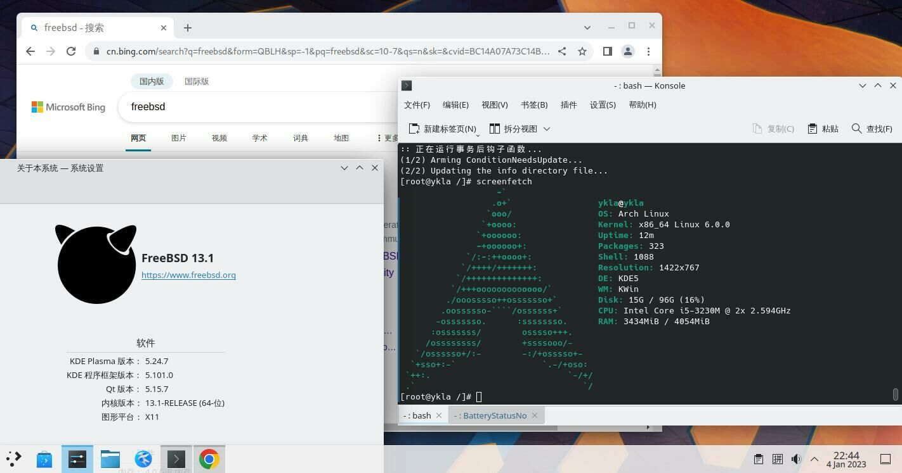
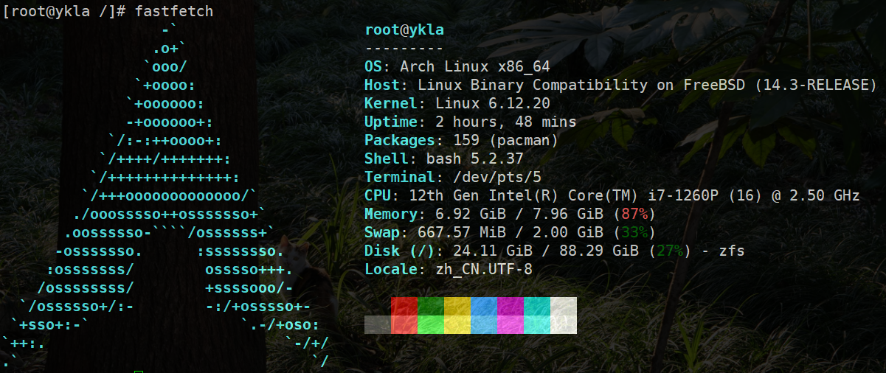

# 21.4 ArchLinux 兼容层（基于 ArchLinux bootstrap）

>**注意**
>
>现在的兼容层构建完成 chroot 后看似卡住，其实是 bash 一行完全无显示，正常输入仍能使用。
>
>测试换 zsh 仍无效，TTY 报错 `linux: jid 0 pid 1154 (bash): linux_ioctl_fallback fd=0, cmd=0x802c542a ('T',42) is not implemented`。

视频教程：[07-FreeBSD-ArchLinux 兼容层脚本使用说明](https://www.bilibili.com/video/BV1wg4y1w7QV)





> **注意**
>
>ArchLinux 兼容层看上去占用略大于 Ubuntu 兼容层是因为正在运行的谷歌 Chrome 浏览器。


### 构建基本系统

#### 处理所需服务项

##### Linux 服务项

```sh
# service linux enable
# service linux start
```

##### dbus

通常桌面已经配置此项，若你没有安装 dbus，请自行安装。

```sh
# service dbus enable
# service dbus start
```

#### 调整 Linux 兼容层默认内核版本

对于滚动发行版，Linux 兼容层默认内核通常较低。直接构建的话，Arch 兼容层会在 chroot 的时候报错 `FATAL: kernel too old`。需要把 Linux 兼容层的内核版本改为 6.12.20（或其他较高版本）才可以。

- 查看当前设置的内核版本：

```sh
# sysctl compat.linux.osrelease
compat.linux.osrelease: 5.15.0
```

>**注意**
>
>你必须先启动 `linux` 服务才能查看当前的 Linux 内核版本。

- 将其调整到较新的版本号（参见 [The Linux Kernel Archives](https://www.kernel.org/) 可获得所需版本号）：

```sh
# echo "compat.linux.osrelease=6.12.20" >> /etc/sysctl.conf # 持久性设置
# sysctl compat.linux.osrelease=6.12.20 # 立刻生效
```

#### 处理自举系统

```sh
# mkdir -p /compat
# fetch https://ftp.sjtu.edu.cn/archlinux/iso/latest/archlinux-bootstrap-x86_64.tar.zst
# tar --use-compress-program=unzstd -xpvf archlinux-bootstrap-x86_64.tar.zst -C /compat --numeric-owner # 若报错 tar: Error exit delayed from previous errors. 请无视之
# mv /compat/root.x86_64 /compat/arch # 重命名
```

### 挂载文件系统

将 `nullfs_load="YES"` 写入 `/boot/loader.conf`（如需立刻生效，可使用 `kldload nullfs`）。

将以下行 **加入** `/etc/fstab`：

```sh
devfs           /compat/arch/dev      devfs           rw,late                      0       0
tmpfs           /compat/arch/dev/shm  tmpfs           rw,late,size=1g,mode=1777    0       0
fdescfs         /compat/arch/dev/fd   fdescfs         rw,late,linrdlnk             0       0
linprocfs       /compat/arch/proc     linprocfs       rw,late                      0       0
linsysfs        /compat/arch/sys      linsysfs        rw,late                      0       0
/tmp            /compat/arch/tmp      nullfs          rw,late                      0       0
```

加入后的 `/etc/fstab` 示例（**请勿复制粘贴此处代码**）：

```sh
# Device                Mountpoint      FStype  Options         Dump    Pass#
/dev/gpt/efiboot0               /boot/efi       msdosfs rw              2       2
/dev/nda0p2             none    swap    sw              0       0
devfs           /compat/arch/dev      devfs           rw,late                      0       0
tmpfs           /compat/arch/dev/shm  tmpfs           rw,late,size=1g,mode=1777    0       0
fdescfs         /compat/arch/dev/fd   fdescfs         rw,late,linrdlnk             0       0
linprocfs       /compat/arch/proc     linprocfs       rw,late                      0       0
linsysfs        /compat/arch/sys      linsysfs        rw,late                      0       0
/tmp            /compat/arch/tmp      nullfs          rw,late                      0       0
```

>**警告**
>
>请勿看串行，抄了上面的实例，否则你将需要进入急救模式！

检查挂载有无报错：

```sh
# mount -al
```

### 基本配置

#### 初始化 pacman 密匙环

```sh
# cp /etc/resolv.conf /compat/arch/etc/ # 此时位于 FreeBSD！复制 DNS 解析。
# chroot /compat/arch /bin/bash # 此时已经是 Arch 兼容层了！
# pacman-key --init
# pacman-key --populate archlinux
```

#### 换源

由于新安装的 Arch 没有任何文本管理器，所以我们需要在 FreeBSD 中编辑相关文件：

```sh
# ee /compat/arch/etc/pacman.d/mirrorlist # 此时位于 FreeBSD！将下行添加至文件顶部。

Server = https://mirrors.tuna.tsinghua.edu.cn/archlinux/$repo/os/$arch
```

#### 启用 DisableSandbox

我们需要为 pacman 启用 DisableSandbox，否则会报错 `error: restricting filesystem access failed because landlock is not supported by the kernel!`，因为 FreeBSD 未实现此沙箱。

```sh
# sed -E -i '' 's/^[[:space:]]*#[[:space:]]*DisableSandbox/DisableSandbox/' ${rootdir}/etc/pacman.conf
```

检查是否启用成功：

```sh
# grep -n 'DisableSandbox' ${rootdir}/etc/pacman.conf
```

然后安装一些基本软件：

```sh
# pacman -S base base-devel nano yay wqy-zenhei
```

##### 参考文献

- [pacman.conf(5)](https://man.archlinux.org/man/pacman.conf.5.en) 指出“在 Linux 系统上，禁用为下载文件进程应用默认的 sandbox。当因当前 Linux 内核不支持该特性而导致下载文件时出现 landlock 相关失败时，这会很有用。”

#### archlinuxcn 源配置

```sh
# nano /etc/pacman.conf # 将下两行添加至文件底部。

[archlinuxcn]
Server = https://mirrors.tuna.tsinghua.edu.cn/archlinuxcn/$arch
```

导入密钥：

```sh
# pacman -S archlinuxcn-keyring
```

>**技巧**
>
>在 `==> Locally signing trusted keys in keyring...` 这一步可能需要十分钟或更长时间。请耐心等待。

由于 yay 及类似安装 aur 的软件均禁止直接 root，故需要在 chroot 中创建一个普通权限的用户（经测试 FreeBSD 中原有的普通用户不可用）：

```sh
# useradd -G wheel -m test
```

编辑 sudo 配置文件（若有红色警告请无视之）：

```sh
# nano /etc/sudoers
```

将 `# %wheel ALL=(ALL) ALL` 前面的 `#` 删掉。
将 `# %sudo ALL=(ALL:ALL) ALL` 前面的 `#` 删掉。

卸载 fakeroot 更改为 fakeroot-tcp，否则无法使用 aur：

> 该 Bug 见 <https://archlinuxarm.org/forum/viewtopic.php?t=14466>

```sh
# pacman -S fakeroot-tcp #会询问是否卸载 fakeroot，请确认并卸载。
```

注意，如果为 `test` 设置了密码但是仍然提示密码错误，你需要新开一个终端，输入 `reboot` 重启 FreeBSD 然后再继续操作。

#### 区域设置

> **提示：如果不设置则无法在 ArchLinux 的图形化程序中使用中文输入法。**

编辑 `/etc/locale.gen`，把 `zh_CN.UTF-8 UTF-8` 前面的注释 `#` 删掉。

重新生成区域文件：

```sh
# locale-gen
```

## Shell 脚本

脚本内容如下：

```sh
#/bin/sh

rootdir=/compat/arch
url="https://ftp.sjtu.edu.cn/archlinux/iso/latest/archlinux-bootstrap-x86_64.tar.zst"

echo "begin to install archlinux ..."
echo "check modules ..."

# check linux module
if [ "$(sysrc -n linux_enable)" = "NO" ]; then
        echo "linux module should be loaded. Continue?(Y|n)"
        read answer
        case $answer in
                [Nn][Oo]|[Nn])
                        echo "linux module not loaded"
                        exit 1
                        ;;
                [Yy][Ee][Ss]|[Yy]|"")
                        sysrc linux_enable=YES
                        ;;
        esac
fi
echo "start linux"
service linux start

# check dbus
if ! /usr/bin/which -s dbus-daemon;then
        echo "dbus-daemon not found. install it [Y|n]"
        read  answer
        case $answer in
            [Nn][Oo]|[Nn])
                echo "dbus not installed"
                exit 2
                ;;
            [Yy][Ee][Ss]|[Yy]|"")
                pkg install -y dbus
                ;;
        esac
    fi

if [ "$(sysrc -n dbus_enable)" != "YES" ]; then
        echo "dbus should be enable. Continue?(Y|n)"
        read answer
        case $answer in
            [Nn][Oo]|[Nn])
                        echo "dbus not running"
                        exit 2
                        ;;
            [Yy][Ee][Ss]|[Yy]|"")
                        sysrc dbus_enable=YES
                        ;;
        esac
fi
echo "start dbus"
service dbus start

echo "now we will bootstrap archlinux"

fetch ${url}
mkdir /compat
tar --use-compress-program=unzstd -xpvf archlinux-bootstrap-x86_64.tar.zst -C /compat --numeric-owner
rm archlinux-bootstrap-x86_64.tar.zst
mv /compat/root.x86_64 ${rootdir}

if [ ! "$(sysrc -f /boot/loader.conf -qn nullfs_load)" = "YES" ]; then
        echo "nullfs_load should load. continue? (Y|n)"
        read answer
        case $answer in
            [Nn][Oo]|[Nn])
                echo "nullfs not load"
		exit 3
                ;;
            [Yy][Ee][Ss]|[Yy]|"")
                sysrc -f /boot/loader.conf nullfs_load=yes
                ;;
        esac
fi

if ! kldstat -n nullfs >/dev/null 2>&1;then
        echo "load nullfs module"
        kldload -v nullfs
fi

echo "mount some fs for linux"
echo "devfs ${rootdir}/dev devfs rw,late 0 0" >> /etc/fstab
echo "tmpfs ${rootdir}/dev/shm tmpfs rw,late,size=1g,mode=1777 0 0" >> /etc/fstab
echo "fdescfs ${rootdir}/dev/fd fdescfs rw,late,linrdlnk 0 0" >> /etc/fstab
echo "linprocfs ${rootdir}/proc linprocfs rw,late 0 0" >> /etc/fstab
echo "linsysfs ${rootdir}/sys linsysfs rw,late 0 0" >> /etc/fstab
echo "/tmp ${rootdir}/tmp nullfs rw,late 0 0" >> /etc/fstab
#echo "/home ${rootdir}/home nullfs rw,late 0 0" >> /etc/fstab
mount -al

echo "For archlinux, we should change 'compat.linux.osrelease'. continue? (Y|n)"
read answer
case $answer in
	[Nn][Oo]|[Nn])
		echo "close to success"
		exit 4
		;;
	[Yy][Ee][Ss]|[Yy]|"")
		echo "compat.linux.osrelease=6.12.20" >> /etc/sysctl.conf
		sysctl compat.linux.osrelease=6.12.20
                ;;
esac
echo "complete!"
echo "to use: chroot ${rootdir} /bin/bash"
echo ""
echo "but for easy use ,i can do some init config"
echo "if agree:"
echo "   I set resolv.conf to ali dns"
echo "   init pacman keyring"
echo "   use tsinghua mirror"
echo "continue?[Y|n]"
read answer
case $answer in
	[Nn][Oo]|[Nn])
		echo "set your archlinux by yourself.bye!"
		exit 0
		;;
	[Yy][Ee][Ss]|[Yy]|"")
		echo "nameserver 223.5.5.5" >> ${rootdir}/etc/resolv.conf
		chroot ${rootdir} /bin/bash -c "pacman-key --init"
		chroot ${rootdir} /bin/bash -c "pacman-key --populate archlinux"
		cat ${rootdir}/etc/pacman.d/mirrorlist > mlst.tmp
		echo 'Server = https://mirrors.tuna.tsinghua.edu.cn/archlinux/$repo/os/$arch' > ${rootdir}/etc/pacman.d/mirrorlist
		cat mlst.tmp >> ${rootdir}/etc/pacman.d/mirrorlist
		rm mlst.tmp
		echo '[archlinuxcn]' >> ${rootdir}/etc/pacman.conf
		echo 'Server = https://mirrors.tuna.tsinghua.edu.cn/archlinuxcn/$arch' >> ${rootdir}/etc/pacman.conf
		echo "Refresh sources and systems"
		echo "Now we will enable DisableSandbox for pacman or you will get error: restricting filesystem access failed because landlock is not supported by the kernel!"
		sed -E -i '' 's/^[[:space:]]*#[[:space:]]*DisableSandbox/DisableSandbox/' ${rootdir}/etc/pacman.conf
		grep -n 'DisableSandbox' ${rootdir}/etc/pacman.conf
		chroot ${rootdir} /bin/bash -c "pacman -Syyu --noconfirm"
		echo "Refresh key"
    		chroot ${rootdir} /bin/bash -c "pacman -S --noconfirm archlinuxcn-keyring"
		echo "Install yay"
		chroot ${rootdir} /bin/bash -c "pacman -S --noconfirm yay base base-devel nano yay wqy-zenhei"
		echo "Create user"
		chroot ${rootdir} /bin/bash -c "useradd -G wheel -m test"
		echo "Now modify the sudo configuration"
		echo '%wheel ALL=(ALL) ALL' >> ${rootdir}/etc/sudoers
		echo '%sudo ALL=(ALL:ALL) ALL' >> ${rootdir}/etc/sudoers
		echo "change fakeroot"
		chroot ${rootdir} /bin/bash -c "pacman -S --noconfirm fakeroot-tcp"
		echo "Make localised settings"
		echo 'zh_CN.UTF-8 UTF-8' >> ${rootdir}/etc/locale.gen
		chroot ${rootdir} /bin/bash -c "locale-gen"
		echo "all done."
                ;;
esac
echo "Now you can run '#chroot /compat/arch/ /bin/bash' Into ArchLinux"
```

## 参考文献

- [linux --Linux ABI support](https://man.freebsd.org/cgi/man.cgi?linux(4))
- [从现有 Linux 发行版安装 Arch Linux](https://wiki.archlinuxcn.org/wiki/%E4%BB%8E%E7%8E%B0%E6%9C%89_Linux_%E5%8F%91%E8%A1%8C%E7%89%88%E5%AE%89%E8%A3%85_Arch_Linux)
