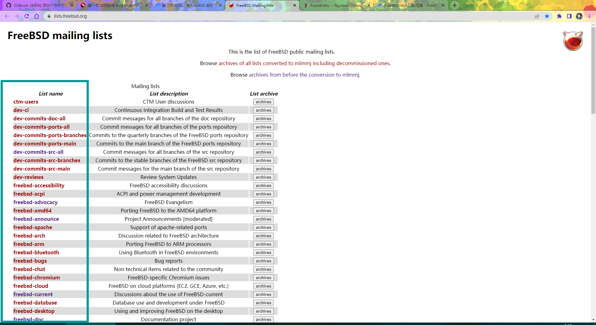
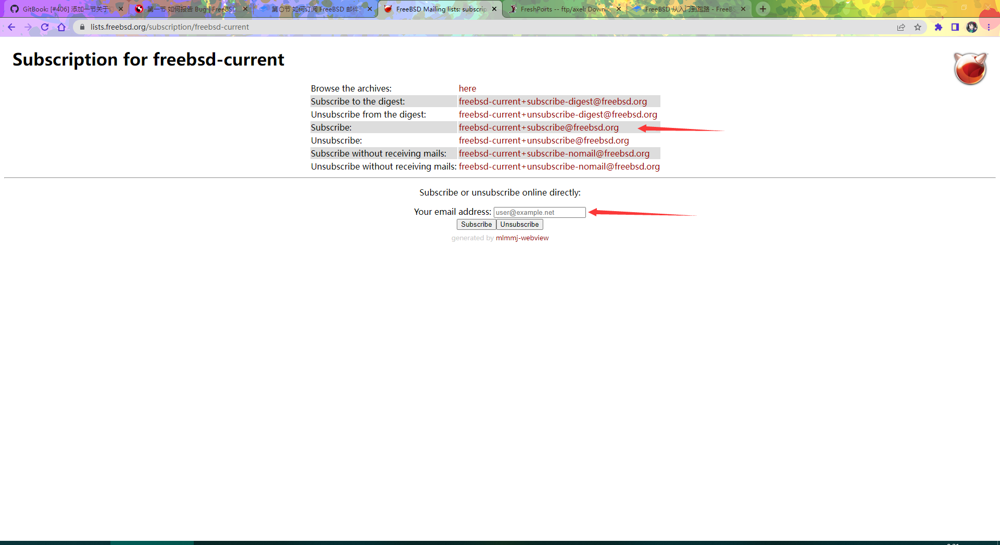

# 第〇节 如何订阅 FreeBSD 邮件列表

## 简单版本

FreeBSD 邮件订阅列表在 [https://lists.freebsd.org/](https://lists.freebsd.org/) 列出。建议订阅 freebsd-current，几乎所以人都在那里。订阅只需要输入你的邮箱即可，然后你会收到回信，按要求给他列出的邮箱随便发一封包含内容的邮件即可，你应该就会收到订阅成功的提示。如果要从摘要订阅转为全文一般订阅，只需要重新向 Subscribe 的邮件地址（比如 freebsd-doc 是 freebsd-doc+subscribe@freebsd.org）发送任意内容的邮件即可。

请使用英语，如果不会可以用 [https://deepl.com](https://deepl.com) 来进行翻译。出现问题时建议先发邮件问一问再提交 bug 报告。

***

提交之后，你会收到一则确认电子邮件，可以通过它来跟踪进展情况。保持关注，如果有人要求提供更多信息，记得及时回复，耐心等候，“坐和放宽”，相信你的问题会很快得到解决的！

***

## 详细版本

打开 [https://lists.freebsd.org/](https://lists.freebsd.org/) 找到要订阅的邮件列表（以 freebsd-current 为例）：

点红色的字进去：

给这一行列出的邮件地址，发邮件内容标题无所谓。他会给你回一封，又列出了一个邮件地址让你给他列出的地址再发一封，内容标题无所谓。这样你就在邮件列表里了。如果输入邮箱回车你没有得到回复，你就手动给在 `subscribe` 那一行的邮箱发邮件，标题内容随机。

要测试自己的邮件别人能不能收到，请按上述步骤订阅发测试邮件给 [freebsd-test](https://lists.freebsd.org/subscription/freebsd-test)。

## 规则

* 如果被管理员警告达三次，会被所有邮件列表拉黑。
* 闲聊去 [https://lists.freebsd.org/subscription/freebsd-chat](https://lists.freebsd.org/subscription/freebsd-chat)
* 不应该在 2 个以上的邮件列表上发帖。除非必要。
* 严禁发广告（非 FreeBSD 的），会立刻被 ban。
* 使用英语。不会的可以用 deepl.com 翻译。
* 严禁个人攻击和谩骂。尊重他人隐私，不要发表私密邮件。

## FreeBSD 社区准则（CoC）

### 摘要

* 友好耐心
* 热情好客
* 体贴
* 相互尊敬
* 对他人友善，并注意不要乱说话
* 持不同见解时多换位思考

### 详细版本

[https://www.freebsd.org/internal/code-of-conduct/](https://www.freebsd.org/internal/code-of-conduct/)

## 说明

FreeBSD 基本系统外的第三方程序是由个人或邮件列表维护的，如果需要移植软件，可能没有人回复，需要自行学习一下 port 开发者手册。

一言以蔽之，FreeBSD 目前的现状是缺钱与缺人，鼓励艰苦奋斗，自力更生……

附 port 开发者手册

[https://docs.freebsd.org/en/books/porters-handbook/](https://docs.freebsd.org/en/books/porters-handbook/)
