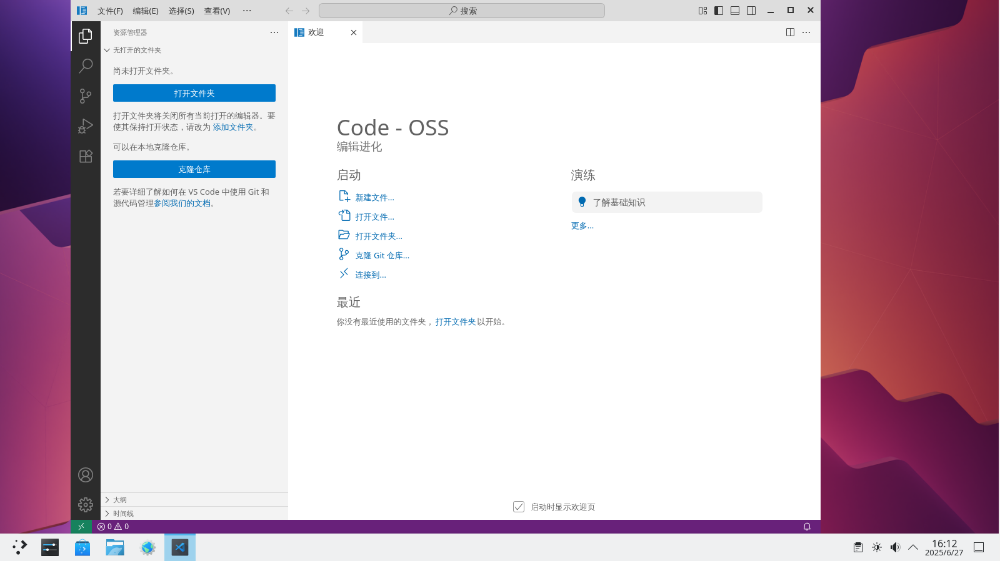

# 22.15 在 FreeBSD 上开发 C/C++

## 概述

C 与 C++ 是两门具有悠久历史的经典编程语言，至今仍在系统编程、高性能计算、嵌入式开发等领域占据核心地位。FreeBSD 作为一个以稳定性、高性能和完整内核源码开放著称的操作系统，其内核及大量用户态工具均以 C 语言编写，充分体现了 C 语言在系统级开发中的独特优势：可移植的底层内存操作能力、极小的运行时开销、与操作系统接口的高度契合性，以及长期积累的庞大生态基础。

本文旨在为初学者及有一定经验的开发者提供几种在 FreeBSD 环境下快速搭建 C/C++ 开发环境、编译程序并进行调试的实用方法，帮助读者在 FreeBSD 平台上快速开展 C/C++ 项目开发。

## FreeBSD 部分 C/C++ 开发工具概览

| 工具 | 简介 | 主要开发语言 | 编辑器类型 |
| :--- | :--- | :--- | :--- |
| [Code-OSS](https://github.com/microsoft/vscode) | Visual Studio Code 的开源版本，去除微软闭源组件和遥测功能，功能强大的可扩展代码编辑器。 | TypeScript / JavaScript (Electron 框架) | 轻度至中度（通过扩展可接近 IDE 功能） |
| [JetBrains CLion](https://www.jetbrains.com/clion/) | 专为 C/C++ 开发的跨平台集成开发环境（IDE），提供智能代码辅助、重构和深度调试集成，适合大型项目。 | Java (基于 IntelliJ 平台) | 重度 IDE |
| [Zed](https://zed.dev/) | 高性能现代代码编辑器，由 Atom 编辑器原团队打造，注重速度和流畅性，内置协作支持。 | Rust | 轻度至中度（原生性能高，但功能聚焦于编辑） |

## 使用 VSCode（Code-OSS） 开发 C/C++

考虑到 C 与 C++ 在语法、工具链及编译流程上具有高度的相似性，本文将以 C 语言为例，详细介绍开发环境的配置方法。
对于 C++ 的开发需求，读者可参考 C 语言的配置步骤，在编译器选择、项目设置等方面进行相应的调整即可。

### 安装 VS Code

- 使用 pkg 安装：

```sh
# pkg install vscode
```

- 或者使用 Ports 安装：

```sh
# cd /usr/ports/editors/vscode/ 
# make install clean
```

需要注意的是，以这种方式安装的 VS Code 实际上是 [Code - OSS](https://github.com/microsoft/vscode) [备份](https://web.archive.org/web/20260120164534/https://github.com/microsoft/vscode)。Code - OSS 与 VS Code 的区别主要在于许可证不同以及可用的闭源资源不同，类似 Chromium 与 Chrome 的关系。

感兴趣的读者可以自行 [阅读原文](https://github.com/microsoft/vscode/wiki/Differences-between-the-repository-and-Visual-Studio-Code) [备份](https://web.archive.org/web/20260120164653/https://github.com/microsoft/vscode/wiki/Differences-between-the-repository-and-Visual-Studio-Code)。

目前已知微软的 Python 插件以及 LLVM 的 clangd 插件都可以直接在 Code - OSS 上运行，但同步设置服务暂时无法使用。

### 设置中文环境





### 安装必要的软件

安装相关工具以在编辑器中正常运行和调试。

- 使用 pkg 安装：

```sh
# pkg install llvm lldb-mi cmake meson ninja ccls
```

- 使用 ports 安装：

```sh
# cd /usr/ports/devel/llvm/ && make install clean # 默认版本 LLVM 工具链的元 Port
# cd /usr/ports/devel/lldb-mi/ && make install clean # LLDB 调试器的机器接口驱动
# cd /usr/ports/devel/cmake/ && make install clean # 用于连接所有 CMake 组件的元 Port
# cd /usr/ports/devel/meson/ && make install clean # 高性能构建系统
# cd /usr/ports/devel/ccls/ && make install clean #  C/C++/ObjC 语言服务器
```

可选：安装 GNU 套件 gcc、gdb。

### 安装所需插件

由于 FreeBSD Ports 中的 VSCode 实际为 Visual Studio Code 的开源版本 Code-OSS，该版本移除了微软的闭源组件及遥测功能，因此无法直接访问微软官方的扩展市场，也无法安装或使用依赖微软专有库的官方 C/C++ 扩展。为了在 FreeBSD 上获得完整的 C/C++ 开发支持，需要选用一组开源替代插件，以提供语言服务、调试适配及构建任务集成等核心功能。

请按以下步骤安装所需插件：

1. 打开 VSCode 扩展视图（Ctrl+Shift+X）。
2. 搜索并安装以下三个插件：
   - **`llvm-vs-code-extensions.vscode-clangd`**：基于 Clang 的语言服务器，提供代码补全、语法检查、跳转定义等功能。
   - **`webfreak.debug`**：调试适配器客户端，支持多种调试器后端（如 lldb-mi）的集成。
   - **`KylinIdeTeam.cppdebug`**：专为 C/C++ 设计的调试扩展，与 lldb-mi 等调试器配合，实现断点、变量监视等调试能力。

安装完成后，即可通过后续的配置文件（`launch.json` 和 `tasks.json`）将上述插件与底层工具链衔接，搭建起完整的 FreeBSD 下 C/C++ 开发环境。

鉴于 C/C++ 生态中可选的工具链与调试方案极为丰富，本篇仅选取三种典型组合作为示例，分别对应调试适配器 `lldb-mi`，以及构建系统 `CMake + Ninja` 和 `Meson + Ninja`。我们将以 Visual Studio Code 作为前端开发环境，演示如何将这些底层工具集成于编辑器之中。

需要说明的是，C/C++ 项目的配置并无“万能模板”，实际开发中需根据项目结构和构建需求灵活调整。因此，本节将以一个极简实例为切入点：项目名称为 `test`，仅包含一个源文件 `main.c`。通过此实例，读者可直观理解配置文件的编写逻辑，并以此为起点应对更复杂的项目场景。

### 调试器集成：基于 lldb-mi 的配置

首先，请进入项目根目录，即 `test` 文件夹，其下存在 `main.c`。在该目录下存在隐藏文件夹 `.vscode`（不存在则手动创建）。

```sh
project/                   ← 上层路径
└── test/                  ← 进入这个目录（自行创建）假设设置你的根目录
    ├── main.c
    └── .vscode/           ← 在这里创建（隐藏文件夹）
```

随后，在 `.vscode` 文件夹内新建两个 VSCode 所需的配置文件：`launch.json` 用于定义调试器的启动参数与行为，`tasks.json` 则用于配置构建任务的执行流程。

```sh
project/                          ← 假设设置你的根目录
└── test/                         ← 项目根目录
    ├── main.c
    └── .vscode/                  ← VS Code 配置目录（隐藏）
        ├── launch.json           ← 调试配置文件
        └── tasks.json            ← 构建任务配置文件
```

这两个文件是 VSCode 与底层工具之间的桥梁，通过 `launch.json` 和 `tasks.json` 可以统一管理项目的调试与构建过程。

准备好后，在 `launch.json` 写入：

```json
{
    "version": "0.2.0",                                     // launch.json 文件格式版本
    "configurations": [                                     // 所有调试/运行配置的列表
        {                                                   // 配置 1：带调试模式
            "name": "Debug with LLDB-MI",                   // 配置名称，在下拉菜单中显示
            "type": "cppdbg",                               // 使用 cppdbg 调试适配器（Native Debug 扩展提供）
            "request": "launch",                            // 请求类型：启动新程序
            "program": "${workspaceFolder}/test",           // 要调试的可执行文件路径（项目根目录下的 test 文件）
            "cwd": "${workspaceFolder}",                    // 程序运行时的工作目录（项目根目录）
            "MIMode": "lldb",                               // 使用 LLDB 作为 MI 调试后端
            "miDebuggerPath": "/usr/local/bin/lldb-mi",     // LLDB-MI 可执行文件的路径
            "stopAtEntry": true,                            // 启动后立即在 main 函数入口暂停（方便设置断点）
            "preLaunchTask": "Build with Clang"             // 启动调试前先运行构建任务（确保 test 已编译）
        },
        {                                                   // 配置 2：不带调试，直接运行
            "name": "Run without Debugging",                // 配置名称
            "type": "cppdbg",                               // 同样使用 cppdbg 适配器
            "request": "launch",                            // 启动程序
            "program": "${workspaceFolder}/test",           // 要运行的可执行文件
            "cwd": "${workspaceFolder}",                    // 运行时工作目录
            "stopAtEntry": false,                           // 不暂停，直接运行到程序结束
            "preLaunchTask": "Build with Clang"             // 先构建再运行
        }
    ]
}
```

在 `tasks.json` 写入：

```json
{
    "version": "2.0.0",                         // tasks.json 文件格式版本
    "tasks": [                                  // 所有任务的数组
        {                                       // 唯一的构建任务
            "label": "Build with Clang",        // 任务名称，在 VS Code 任务列表中显示
            "type": "shell",                    // 任务类型：在 shell/终端中执行
            "command": "clang",                 // 主命令：使用 clang 编译器
            "args": [                           // 传递给 clang 的参数
                "-g",                           // 生成调试符号（debug 信息）
                "-o",                           // 指定输出文件名
                "test",                         // 输出可执行文件名为 test
                "main.c"                        // 要编译的源文件
            ],
            "group": {                          // 任务分组设置
                "kind": "build",                // 这是一个构建任务
                "isDefault": true               // 按 Ctrl+Shift+B 时默认执行这个任务
            },
        }
    ]
}
```

随后即可使用 VSCode 的运行与调试功能。

### 构建系统集成：CMake + Ninja

因为要用到 `CMake`，所以在项目根目录创建一个 `CMakeLists.txt` 文件。

```sh
project/
└── test/                          ← 项目根目录
    ├── main.c
    └── CMakeLists.txt             ← CMake 构建脚本，手动创建
```

把以下内容写入该文件中：

```cmake
cmake_minimum_required(VERSION 3.10)          # 指定最低要求的 CMake 版本（3.10 或更高）
project(test C)                               # 项目名称为 test，使用 C 语言
add_executable(test main.c)                   # 创建一个可执行文件，名字叫 test，源文件是 main.c
```

>**即使**
>
>这是一个最简单的 CMake 配置，读者应根据实际情况进行调整。  

然后同理，在 `.vscode` 文件夹下创建 `launch.json` 和 `tasks.json` 文件。

```sh
project/
└── test/                          ← 项目根目录
    ├── main.c
    └── CMakeLists.txt             ← CMake 构建脚本，手动创建
    └── .vscode/
        ├── launch.json
        └── tasks.json
```

在 `launch.json` 写入：

```json
{
    "version": "0.2.0",                                                 // launch.json 文件格式版本
    "configurations": [                                                 // 调试/运行配置列表
        {                                                               // 配置1：带调试（使用 LLDB-MI）
            "name": "Debug with LLDB-MI (CMake)",                       // 配置名称（下拉菜单显示）
            "type": "cppdbg",                                           // 调试器类型：cppdbg（Native Debug 扩展提供）
            "request": "launch",                                        // 启动新程序
            "program": "${workspaceFolder}/build/test",                 // 要调试的可执行文件路径
            "cwd": "${workspaceFolder}",                                // 程序运行的工作目录（项目根）
            "MIMode": "lldb",                                           // MI 模式使用 LLDB
            "miDebuggerPath": "/usr/local/bin/lldb-mi",                 // LLDB-MI 的路径
            "stopAtEntry": true,                                        // 启动后立即在 main 入口暂停
            "preLaunchTask": "CMake Build",                             // 调试前先运行构建任务（CMake Build）
            "setupCommands": [                                          // 启动 LLDB 时的额外命令
                {
                    "description": "Enable pretty-printing for lldb",   // 描述
                    "text": "-enable-pretty-printing",                  // 启用 LLDB 美化输出（STL 容器等更易读）
                    "ignoreFailures": true                              // 忽略失败（有些 LLDB 版本不支持）
                }
            ]
        },
        {                                                               // 配置2：不带调试，直接运行
            "name": "Run without Debugging (CMake)",                    // 配置名称
            "type": "cppdbg",                                           // 仍然使用 cppdbg 适配器
            "request": "launch",                                        // 启动程序
            "program": "${workspaceFolder}/build/test",                 // 可执行文件路径
            "cwd": "${workspaceFolder}",                                // 工作目录
            "stopAtEntry": false,                                       // 不暂停，直接运行到结束
            "preLaunchTask": "CMake Build",                             // 先构建
            "console": "integratedTerminal"                             // 输出使用 VS Code 内置终端面板（清晰显示 printf 等输出）
        }
    ]
}
```

在 `tasks.json` 写入：

```json
{
    "version": "2.0.0",                         // tasks.json 文件格式版本
    "tasks": [                                  // 所有任务的数组
        {                                       // 任务 1：CMake 配置阶段
            "label": "CMake Configure",         // 任务名称
            "type": "shell",                    // 在 shell/终端中执行
            "command": "cmake",                 // 主命令：cmake
            "args": [                           // 传递给 cmake 的参数
                "-S", ".",                      // 源代码目录：当前目录（.）
                "-B", "build",                  // 构建目录：build 文件夹
                "-G", "Ninja",                  // 生成器：使用 Ninja（比 make 更快）
                "-DCMAKE_BUILD_TYPE=Debug"      // 设置构建类型为 Debug（带调试符号）
            ],
            "group": "build"                    // 归类为构建组
        },
        {                                       // 任务 2：实际编译阶段
            "label": "CMake Build",             // 任务名称
            "type": "shell",                    // shell 类型
            "command": "ninja",                 // 使用 ninja 进行构建
            "args": [                           // 参数
                "-C", "build"                   // 在 build 目录下执行 ninja
            ],
            "dependsOn": "CMake Configure",     // 依赖：必须先完成 CMake 配置
            "group": {                          // 分组设置
                "kind": "build",                // 属于构建任务
                "isDefault": true               // Ctrl+Shift+B 默认执行这个任务
            },
        }
    ]
}
```

### 构建系统集成：Meson + Ninja

Meson 构建系统以 `meson.build` 文件为核心配置文件，用于定义项目的构建规则。

```sh
project/
└── test/                         ← 项目根目录
    ├── main.c
    └── meson.build               ← Meson 构建描述文件，手动创建
```

在项目的根目录创建该文件，并写入：

```cmake
project('myapp', 'c')          # 项目名随便起，不影响
executable('hello', 'main.c')  # 可执行文件叫 hello
```

>**技巧**
>
>这是一个最简单的 Meson 配置，读者应根据实际情况进行调整。  

然后同理，在 `.vscode` 文件夹下创建 `launch.json` 和 `tasks.json` 文件。

```sh
project/
└── test/
    ├── main.c
    ├── meson.build               ← Meson 构建描述文件，手动创建
    └── .vscode/
        ├── launch.json           ← 调试配置文件
        └── tasks.json            ← 构建任务配置文件
```

在 `launch.json` 写入：

```json
{
    "version": "0.2.0",                                     // launch.json 文件格式版本
    "configurations": [                                     // 所有调试/运行配置的数组
        {                                                   // 配置1：带调试的 Meson 项目
            "name": "Debug with LLDB-MI (Meson)",           // 配置名称，在下拉菜单中显示
            "type": "cppdbg",                               // 使用 cppdbg 调试器适配器（Native Debug 扩展提供的）
            "request": "launch",                            // 请求类型：launch（启动新程序）
            "program": "${workspaceFolder}/build/hello",    // 要调试的可执行文件完整路径（${workspaceFolder} 是当前项目根目录）
            "cwd": "${workspaceFolder}",                    // 程序运行时的工作目录（项目根目录）
            "MIMode": "lldb",                               // 使用 LLDB 作为 MI 调试器后端
            "miDebuggerPath": "/usr/local/bin/lldb-mi",     // LLDB-MI 可执行文件的路径
            "stopAtEntry": true,                            // 启动后立即在 main 函数入口处暂停
            "preLaunchTask": "Meson Build"                  // 启动调试前先运行的构建任务（确保程序已编译）
        },
        {                                                   // 配置2：不带调试，直接运行
            "name": "Run without Debugging (Meson)",        // 配置名称
            "type": "cppdbg",                               // 同样使用 cppdbg 适配器
            "request": "launch",                            // 启动程序
            "program": "${workspaceFolder}/build/hello",    // 要运行的可执行文件
            "cwd": "${workspaceFolder}",                    // 运行时工作目录
            "preLaunchTask": "Meson Build",                 // 先构建再运行
            "stopAtEntry": false,                           // 不需要在入口暂停，直接运行到结束
            "externalConsole": false                        // 输出使用 VS Code 内置终端（false = 集成终端，true = 弹出外部窗口）
        }
    ]
}
```

在 `tasks.json` 写入：

```json
{
    "version": "2.0.0",                         // tasks.json 文件格式版本
    "tasks": [                                  // 所有任务的数组定义
        {                                       // 第一个任务：配置 Meson 项目
            "label": "Meson Configure",         // 任务名称，在 VS Code 任务列表中显示
            "type": "shell",                    // 任务类型：shell（在终端中执行命令）
            "command": "meson",                 // 要执行的主命令：meson
            "args": [                           // 传递给 meson 的参数列表
                "setup",                        // 子命令：初始化/配置构建目录
                "build",                        // 构建目录名称（这里是 build 文件夹）
                "--buildtype=debug"             // 设置构建类型为 debug（带调试符号）
            ],
            "group": "build"                    // 把这个任务归类为“构建”组（方便在菜单中快速找到）
        },
        {                                       // 第二个任务：实际编译项目
            "label": "Meson Build",             // 任务名称
            "type": "shell",                    // 同样是 shell 类型
            "command": "ninja",                 // 使用 ninja 作为构建工具（Meson 默认生成 ninja 文件）
            "args": [                           // 传递给 ninja 的参数
                "-C",                           // 指定工作目录
                "build"                         // ninja 在 build 目录下执行
            ],
            "dependsOn": "Meson Configure",     // 依赖关系：必须先运行 “Meson Configure” 任务
            "group": {                          // 任务分组设置
                "kind": "build",                // 这是一个构建任务
                "isDefault": true               // 按 Ctrl+Shift+B 时默认执行这个任务
            },
        }
    ]
}
```

## 使用 CLion 开发 C/C++

### 安装 CLion

使用 pkg 安装：

```sh
# pkg install jetbrains-CLion
```

或者使用 ports 构建：

```sh
# cd /usr/ports/devel/jetbrains-clion/
# make install clean
```

### 配置 CLion

由于 CLion 使用 CMake，所以使用方法相较于 VSCode 更简单，只需正确配置 `CMakeLists.txt` 即可（可参照上文 VSCode 的配置），不再赘述。

> **注意**
>
> 在 FreeBSD 上使用 CLion 进行 C/C++ 的开发，如果不是特殊情况，尽量使用 gcc 和 gdb 套件以避免一些错误。

### 故障排除

需要注意的是，从 FreeBSD 软件源获取来的 CLion 可能无法正常打开，会报错如下：

```
java.lang.IllegalArgumentException: Missing extension point: com.intellij.flsConfigurationProvider
Caused by: java.lang.ClassNotFoundException: com.jetbrains.rider.protocol.ProtocolManagerInitializer
    [Plugin: org.jetbrains.plugins.clion.radler]
```

要修复这个问题，就得编辑 CLion 的  `/usr/local/share/jetbrains/clion/plugins/plugin-classpath.txt` 文件：

然后把里面开头的乱码删除即可（删至 `<idea-plugin` 作为开头），重启 CLion 后可正常进入软件。参见 [Bug 290663 - devel/jetbrains-clion: fails to start](https://bugs.freebsd.org/bugzilla/show_bug.cgi?id=290663)。

## 使用 Zed 开发 C/C++

### 安装 Zed

使用 pkg 安装:

```sh
# pkg install zed-editor
```

或者使用 ports 构建：

```sh
# cd /usr/ports/editors/zed
# make install clean
```

### 配置 Zed

Zed 的调试功能主要基于调试适配器协议（Debug Adapter Protocol，DAP）实现，并默认依赖特定的调试适配器，例如 CodeLLDB（用于 LLDB 后端）或 GDB，以支持包括 Rust、C/C++ 在内的多种语言的调试。CodeLLDB 作为主要的 LLDB DAP 适配器，其官方支持平台仅限于 Linux、macOS 和 Windows，未包含 FreeBSD 或其他 BSD 变体。这导致在 FreeBSD 环境下，CodeLLDB 调试路径默认不可用，从而使 Zed 的内置调试功能受到显著限制。

Zed 本身支持 LLDB 作为调试后端（例如在调试 Zed 自身源码时可通过 rust-lldb 进行），但其通用调试系统严格依赖 DAP 协议，而非 LLDB 的 Machine Interface（MI）接口（如 LLDB-MI）。因此，直接集成 LLDB-MI 并非 Zed 的标准支持方式。若需使用 LLDB，必须通过兼容的 DAP 适配器（如 CodeLLDB 或官方 lldb-dap）实现，而这些适配器在 FreeBSD 上要么缺乏官方支持，要么存在兼容性问题。

理论上，可尝试通过 Zed 的扩展系统配置其他 DAP 适配器以实现调试支持，但 FreeBSD 并非 Zed 的官方支持平台，社区维护的 Ports 版本在调试功能上可能存在不稳定性或缺失部分依赖。因此，在 FreeBSD 环境下，即使 GDB 调试能够在 Zed 中运行，其行为本质上与在终端直接使用 GDB 相同，仅通过 Zed 的图形界面进行封装，仍需依赖手动输入命令。

基于上述情况，在当前阶段，建议将 Zed 定位为纯粹的代码编辑器，主要用于编码、文本编辑和高性能的界面体验，而将程序的构建、运行及调试工作交由命令行工具（如 clang、ninja、lldb、gdb）或其他专用调试前端完成。若未来 Zed 项目或社区扩展对 FreeBSD 的调试支持得到完善，则可重新评估其作为完整开发环境的适用性。

## 故障排除与未竟事宜

> **思考题**
>
> 本文介绍的开发方法主要围绕编译器、调试器以及基础的构建工具展开，并未将 NeoVim、Emacs 等高度可定制化的编辑器作为核心推荐。
>
> 这些工具的功能和配置方式在本书其他章节中已有简要说明，可供参考。
>
> 然而，每个开发者的学习习惯和目标各不相同：
>
> - 你是否认为投入大量时间配置和美化编辑器，能够实质性地提升你的编码能力或学习效率？  
> - 在初学阶段，将精力集中于理解语言特性、系统接口和调试技巧，与沉浸于工具定制之间，你更倾向于如何权衡？  
> - 有人将深度定制工具链视为一种“苦难哲学”（即以复杂配置为荣），你认为这种观点是否适用于你自己的学习路径？  
>  
> 请根据自身的实际需求和长期目标，审慎选择适合的开发环境与工作流程。
