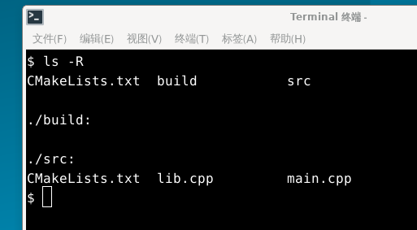
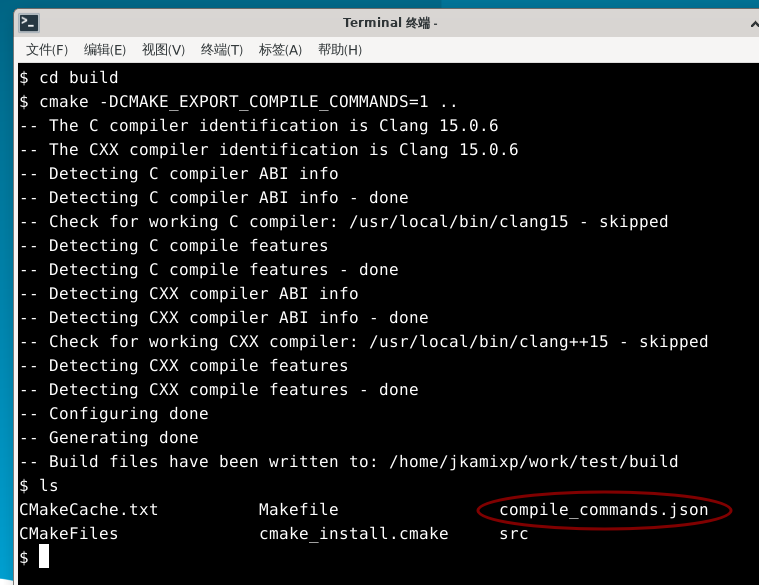
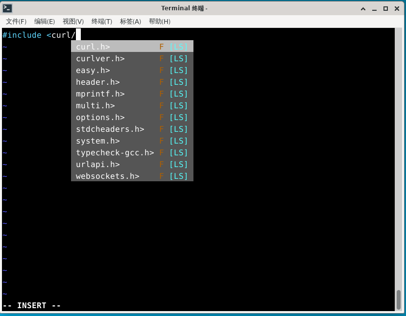
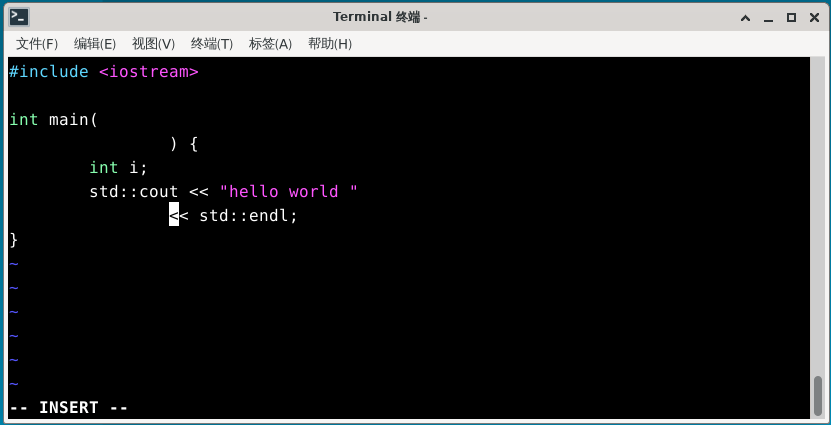
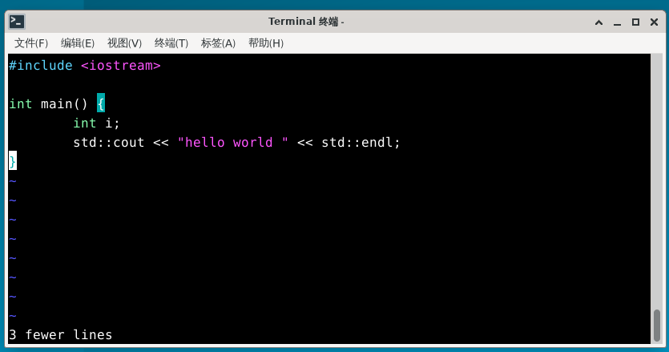
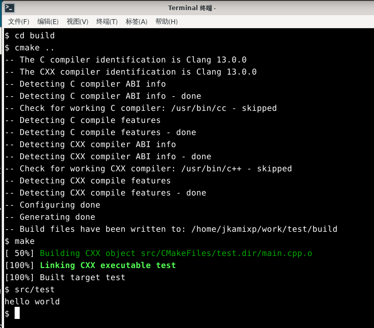
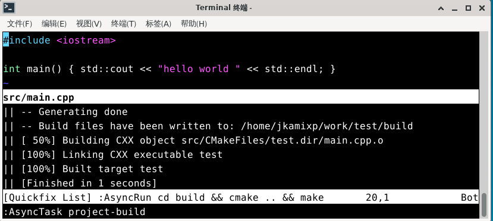
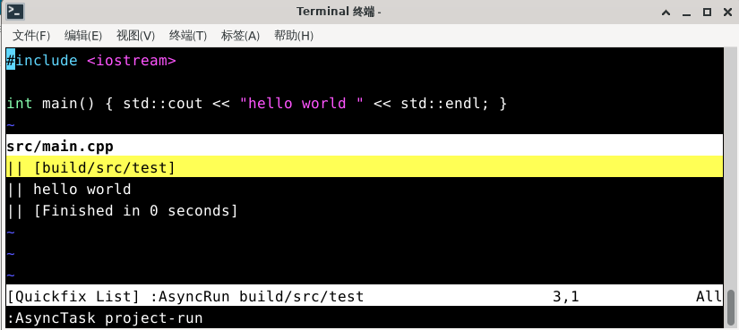

# 第22.4节 C/C++ 环境的配置

## 在 vim 下那些配置

安装 C/C++ 环境的包

下面的内容中需要使用到 llvm 的组件，其中

clangd 是 language server,用于代码补全，编译错误，定义跳转等
clang-format 用于格式化语言代码

此处作一说明，FreeBSD 自带 clang 编译器，但并不含 llvm 中其它组件如 clangd，clang-format 。所以要安装 llvm ，这里各版本的 llvm 都可用，不过至少不应比系统自带的 clang 版本低，在 FreeBSD 13.1 中 clang 版本为 13 。下文使用 llvm15 ，安装后对应的 程序名为 clang15 clang++15 clangd15 clang-format15 。而系统自带的 clang ，程序名为clang 。如果使用不同版本请注意对照。  

```
# pkg install llvm15 cmake git-lite
```

### vim 及插件管理器安装

```
# pkg install vim
```

先来个 vim 插件管理器 vim-plug, 用其它插件管理器的，请自行调整

```
$ mkdir -p ~/.vim/autoload
$ fetch -o ~/.vim/autoload/plug.vim https://raw.githubusercontent.com/junegunn/vim-plug/master/plug.vim
```

### coc.nvim 加 clangd 补全

Coc.nvim 是一个基于 NodeJS 的适用于 Vim, Neovim 的 Vim 智能补全插件。 拥有完整的 LSP (语言服务协议 Language Server Protocol，简称 LSP ） 支持。配置、使用方式及插件系统的整体风格类似 VSCode. clangd 用于支持 c/c++ 的 LSP 。


安装 coc.nvim 依赖

```
# pkg install npm
```

其中 node 作为依赖自动安装

在 ~/.vimrc 中写入

```
call plug#begin('~/.vim/plugged')
Plug 'neoclide/coc.nvim',{'branch':'release'}
call plug#end()
```

进入 vim 

```
:PlugInstall
```

插件安装完成，仍在 vim 中,安装 json clangd cmake 补全插件

```
:CocInstall coc-json coc-clangd coc-cmake
```

配置 clangd 补全,在 vim 中

```
:CocConfig
```

打开配置文件后,输入并保存

```
{
	"clangd.path":"clangd15"
}
```

此时已经可以使用 coc 进来补全了

对简单的小程序，在源文件目录下新建 `compile_flags.txt` 文件,输入

```
-I/usr/local/include 
```

如此可在 coc 可以用 `/usr/local/include` 下的头文件可以补全。

对于复杂的项目，使用 `compile_commands.json` 文件设置补全。 clangd 会在你文件的父目录中查找，也会在名为 build/ 的子目录中查找。例如，正在编辑 `$SRC/gui/window.cpp`, 会查找 `$SRC/gui/`, `$SRC/gui/build/`, `$SRC/`, `$SRC/build/`,等

以基于CMake的项目为例,在项目文件夹下

项目结构如下所示



```
$ mkdir build
$ cd build
$ cmake -DCMAKE_EXPORT_COMPILE_COMMANDS=1 ..
```

或者在 CMakeLists.txt 中

```
set(CMAKE_EXPORT_COMPILE_COMMANDS ON)
```

可自动生成 `compile_commands.json` 文件,有了这个文件再编辑源文件时就可以使用补全功能了。

cmake 默认使用的是 系统自带的 clang (FreeBSD 13.1 自带 clang13 ），可以用

```
$ export CC=clang15
$ export CXX=clang++15
```

再执行 cmake 以使用 clang15 

可以在 `.xprofile` 等文件中写入

```
export CC=clang15
export CXX=clang++15
```

以使得 clang15 clang++15 成为默认，但这应该根据项目要求进行。




此时已生成 compile_commands.json 文件，可以在 vim 中进行补全



注意，以下操作在 sh/bash/zsh 中使用，csh/tcsh 请作相应改动

### clang-format 代码美化

clang-format代码美化需安装 vim-clang-format 插件，方法如下

`~/.vimrc` 中加入

```
Plug 'rhysd/vim-clang-format'
```

并在 `~/.vimrc` 中设置

```
let g:clang_format#code_style="google"
let g:clang_format#command="clang-format15"
let g:clang_format#auto_format=1
let g:clang_format#auto_format_on_insert_leave=1
```

保存 `~/.vimrc` 后

```
:PlugInstall
```

安装插件后可以使用

如



退出插入模式



### asynctasks.vim 构建任务系统

asynctasks.vim插件  为 Vim 引入类似 vscode 的 tasks 任务系统，用统一的方式系统化解决各类：编译/运行/测试/部署任务。

安装插件

```
Plug 'skywind3000/asynctasks.vim'
Plug 'skywind3000/asyncrun.vim'
```

在 `~/.vimrc` 中设置

```
let g:asyncrun_open = 6
let g:asyncrun_rootmarks = ['.git', '.svn', '.root', '.project']
```

其中 asyncrun_rootmarks 用于指定标记项目根目录的文件/文件夹

asynctasks.vim 在每个项目的根文件夹下面放一个 `.tasks` 来描述针对该项目的局部任务，同时维护一份 `~/.vim/tasks.ini` 的全局任务配置，适配一些通用性很强的项目，避免每个项目重复写 `.tasks` 配置。

vim 可以用 `:AsyncTaskEdit` 来编辑本地任务，`:AsyncTaskEdit!` 来编辑全局任务。

如

```
[project-build]
command=cd build && cmake .. && make
# 设置在当前项目的根目录处运行 make
cwd=$(VIM_ROOT)

[project-run]
command=src/test
# <root> 是 $(VIM_ROOT) 的别名，写起来容易些
cwd=<root>
```

参考 

* https://github.com/skywind3000/asynctasks.vim/blob/master/README-cn.md

简单易用

最后以最简单的 C++ hello world 项目为例

项目文件结构如下

```
$ ls -R
CMakeLists.txt	build		src

./build:

./src:
CMakeLists.txt	main.cpp
```

根 `CMakeLists.txt` 文件

```
$ cat CMakeLists.txt 
cmake_minimum_required(VERSION 3.10)
project(test)

set(CMAKE_EXPORT_COMPILE_COMMANDS ON)

include_directories(/usr/local/include)

add_subdirectory(src)
```

`src` 目录 `CMakeLists.txt` 文件

```
$ cat src/CMakeLists.txt 
add_executable(test main.cpp)
```

`main.cpp` 文件

```
$ cat src/main.cpp
#include <iostream>

int main() { std::cout << "hello world " << std::endl; }
```

编译运行

```
$ cd build
$ cmake ..
$ src/test
```



或者在 vim 中 运行 `:AsyncTask project-build` , `:AsyncTask project-run` :





