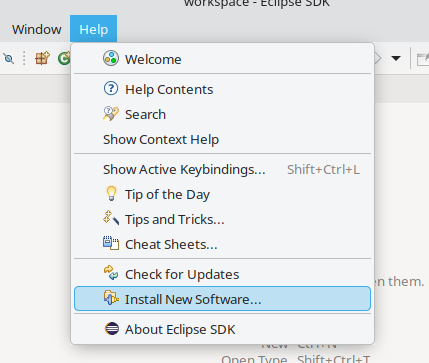
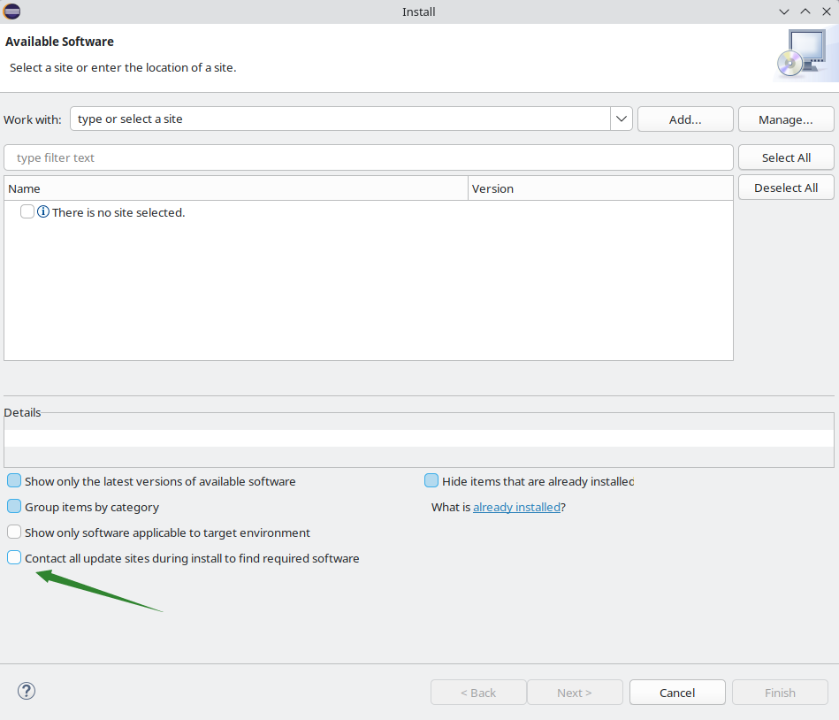
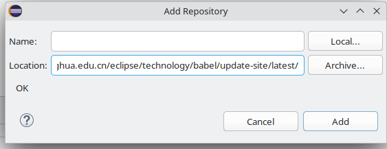
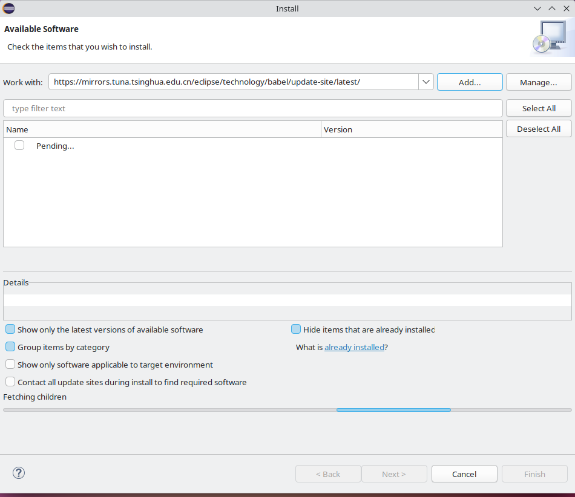
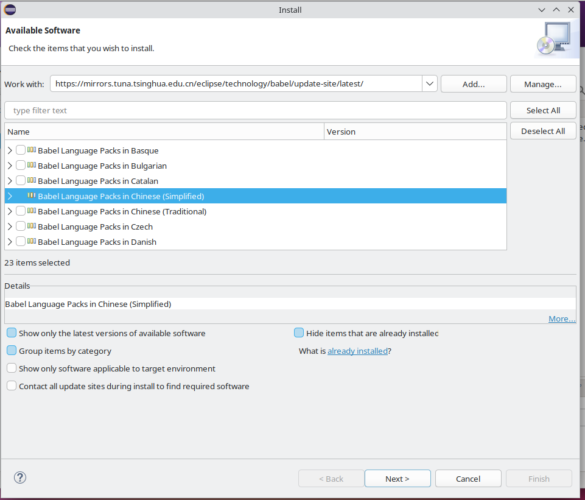
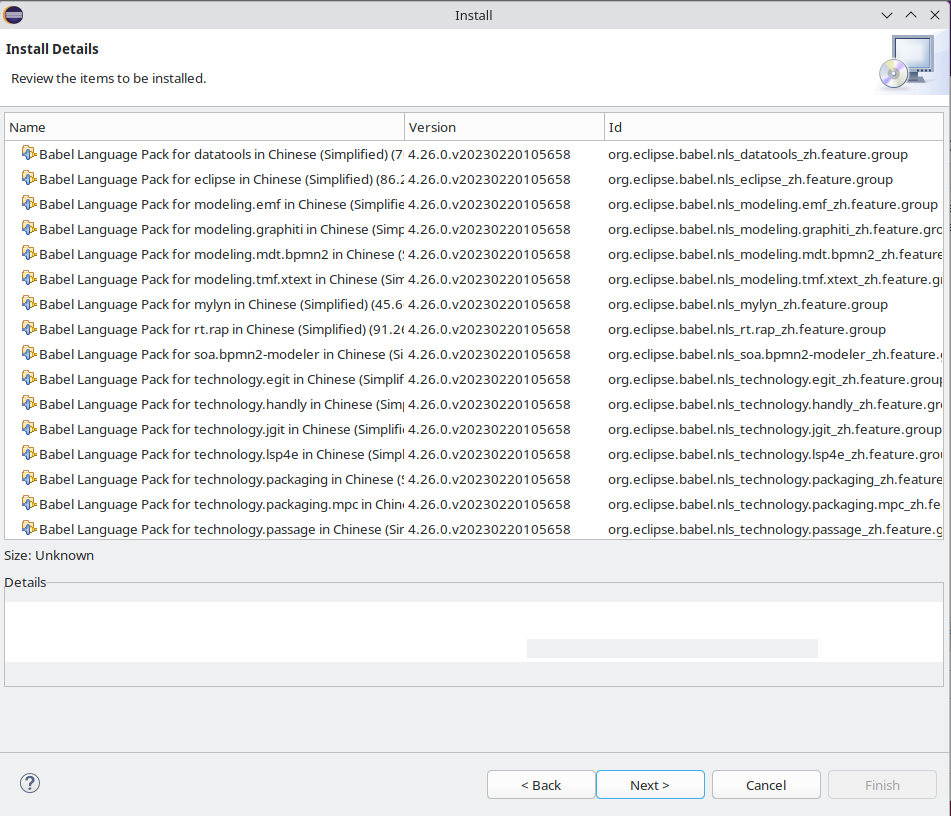
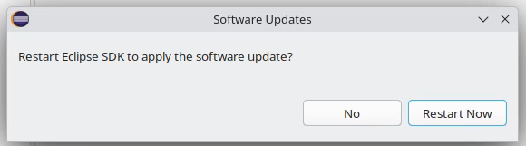
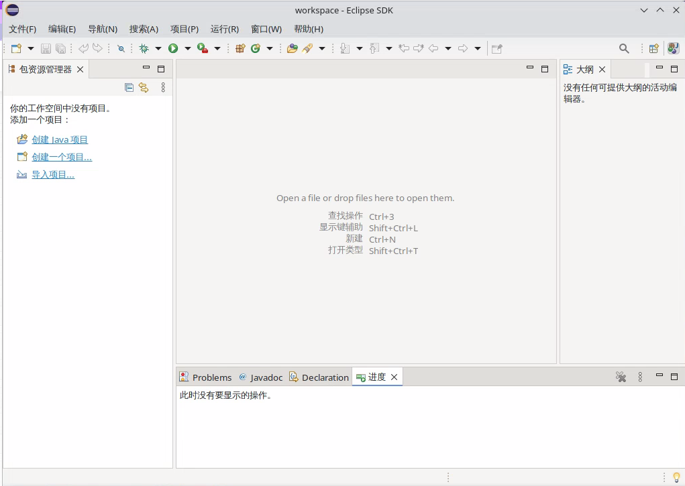
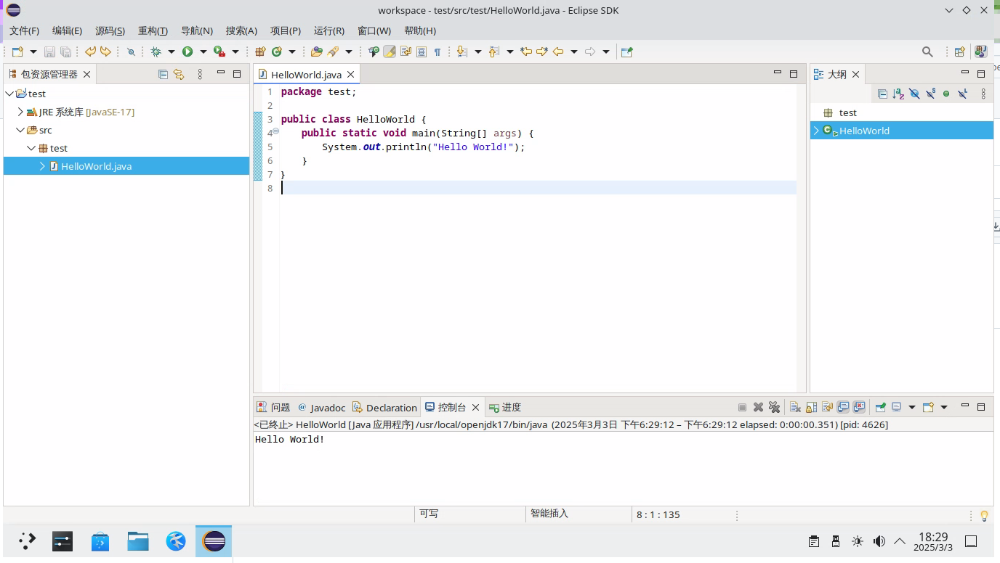

# 第 22.5 节 Java 环境的配置

FreeBSD 支持 OracleJDK 与 OpenJDK。OracleJDK 不是原生支持，需要使用 Linux 二进制兼容层。参见 [https://www.freebsd.org/java/](https://www.freebsd.org/java/)。

## JDK

### OracleJDK


`java/linux-oracle-jdk18` 不可用，太久没更新，兼容层所需链接已经失效了。

```sh
=> Attempting to fetch http://distcache.FreeBSD.org/ports-distfiles/centos/libXtst-1.2.3-1.el7.i686.rpm
fetch: http://distcache.FreeBSD.org/ports-distfiles/centos/libXtst-1.2.3-1.el7.i686.rpm: No error: 0
=> Couldn't fetch it - please try to retrieve this
=> port manually into /usr/ports/distfiles/centos and try again.
*** Error code 1

Stop.
make[1]: stopped in /usr/ports/x11/linux-c7-xorg-libs
*** Error code 1

Stop.
make: stopped in /usr/ports/java/linux-oracle-jdk18
```


#### 参考文献

- [oracle 账号共享](https://www.cnblogs.com/g012/p/15594372.html)

### OpenJDK

查看支持的版本：

```sh
root@ykla:~ # pkg search -o jdk
java/bootstrap-openjdk11       Java Development Kit 11
java/bootstrap-openjdk17       Java Development Kit 17
java/bootstrap-openjdk8        Java Development Kit 8
java/openjdk11                 Java Development Kit 11
java/openjdk11-jre             Java Runtime Environment 11
java/openjdk17                 Java Development Kit 17
java/openjdk17-jre             Java Runtime Environment 17
java/openjdk18                 Java Development Kit 18
java/openjdk19                 Java Development Kit 19
java/openjdk20                 Java Development Kit 20
java/openjdk21                 Java Development Kit 21
java/openjdk22                 Java Development Kit 22
java/openjdk23                 Java Development Kit 23
java/openjdk8                  Java Development Kit 8
java/openjdk8-jre              Java Runtime Environment 8
comms/rxtx                     Native interface to serial ports in Java
```

以 `java/openjdk23` 为例：

### 安装 openjdk23


```sh
# pkg ins openjdk23
```

或者

```sh
# cd /usr/ports/java/openjdk23
# make install clean
```

查看版本：

```sh
root@ykla:/ # java -version
openjdk version "23.0.2" 2025-01-21
OpenJDK Runtime Environment (build 23.0.2+7-1)
OpenJDK 64-Bit Server VM (build 23.0.2+7-1, mixed mode, sharing)
```

但是并未配置 `$JAVA_HOME` 变量

```sh
root@ykla:/ # echo $JAVA_HOME

```

查看安装路径：

```sh
root@ykla:/ # ls /usr/local/openjdk23/
/usr/local/openjdk23/bin/     /usr/local/openjdk23/include/ /usr/local/openjdk23/lib/
/usr/local/openjdk23/conf/    /usr/local/openjdk23/jmods/   /usr/local/openjdk23/man/
/usr/local/openjdk23/demo/    /usr/local/openjdk23/legal/   /usr/local/openjdk23/release
```


#### 配置环境变量

将

```sh
export JAVA_HOME="/usr/local/openjdk23"
export PATH=$JAVA_HOME/bin:$PATH
```

写入 `~/.bashrc`（bash）、`~/.profile`（不知道什么就写这里吧）、`~/.shrc`（FreeBSD 默认的 sh）或  `~/.zshrc`（zsh）

刷新环境变量：

```sh
root@ykla:/ # . ~/.shrc # 注意那个 2 个点
root@ykla:/ # echo $JAVA_HOME
/usr/local/openjdk23
root@ykla:/ # echo $PATH
/usr/local/openjdk23/bin:/sbin:/bin:/usr/sbin:/usr/bin:/usr/local/sbin:/usr/local/bin:/root/bin
```

## Eclipse

### 安装 eclipse

```sh
# pkg ins eclipse
```

或

```sh
# cd /usr/ports/java/eclipse
# make install clean
```

### 设置中文

点击 `Help`，点击 `Install New Software`。



取消勾选 `Contact all update sites during install to find required software`，然后点击 `Add`：



清除 `Location` 原有内容，加入 `https://mirrors.tuna.tsinghua.edu.cn/eclipse/technology/babel/update-site/latest/`。再点击 `Add`：


、

加载中：



勾选 `Babel Language Packs in Chinese (Simplified)`。点击 `Next`。




点击 `Next`。



同意协议：


这里最好先随便点一下底部，再全选，否则会卡死。


重启即可：





#### 参考文献

- [Eclipse 2024.03 安装教程（附中文语言设置教程）](https://www.ittel.cn/archives/35394.html)

### HelloWorld

点击 `创建 Java 项目`，项目名 `test`。


右键创建一个 `包`，再创建一个 `java 类`，名称 `test`。


写入以下内容


```java
package test;

public class HelloWorld {
	  public static void main(String[] args) {
		    System.out.println("Hello World!");
		  }
}
```

点击绿色三角，即可看到输出




#### 参考文献

- [Eclipse 使用配置全面讲解](https://www.cnblogs.com/xxhxs-21/articles/16417603.html)

## IntelliJ IDEA

### 安装 IntelliJ IDEA Ultimate

```sh
# pkg ins intellij-ultimate
```

或

```sh
# cd /usr/ports/java/intellij-ultimate
# make install clean
```

#### 查看安装后说明


```sh
# pkg info -D intellij-ultimate
intellij-ultimate-2024.3.1.1:
On install:
There is a native (faster) file watching support backed by kqueue which is
enabled by default.  If you encounter problems with watching large
trees, you can disable it by adding the following property via the menu
entry Help -> Edit Custom Properties...

      idea.filewatcher.disabled=true
有一个由 kqueue 支持的本地（更快的）文件监视功能，默认启用。如果你在监视大的文件树时遇到问题，可以通过菜单项 Help -> Edit Custom Properties... 添加以下属性来禁用它：

      idea.filewatcher.disabled=true
```

---

系统默认启用了基于 kqueue 的内置（更快的）文件监视支持。若您监视大型目录结构时出现了问题，可以通过菜单路径 `Help`（帮助） -> `Edit Custom Properties...`（编辑自定义属性……）添加以下属性来禁用该功能：

```ini
  idea.filewatcher.disabled=true
```

## 使用

似乎无法使用，一直报错 `编辑器中的文件不可运行`，但是 Windows 版本下是正常的，已经报告 [Bug 285130 - Port java/intellij-ultimate always show This file in the editor in not runnable](https://bugs.freebsd.org/bugzilla/show_bug.cgi?id=285130)

社区版是正常的，但是很久没有更新了。还是 2020.2。

### 故障排除与未竟事宜

- 提示“the file in the editor is not runnable”，待解决
  


