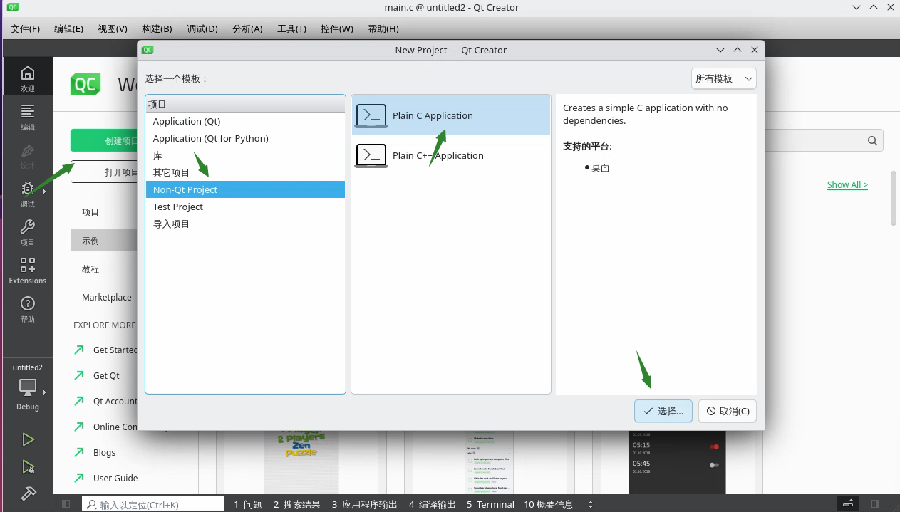
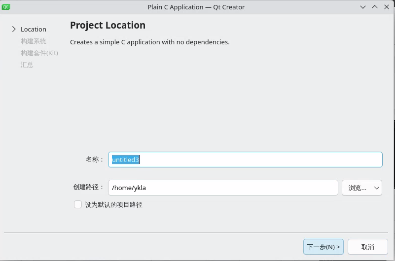
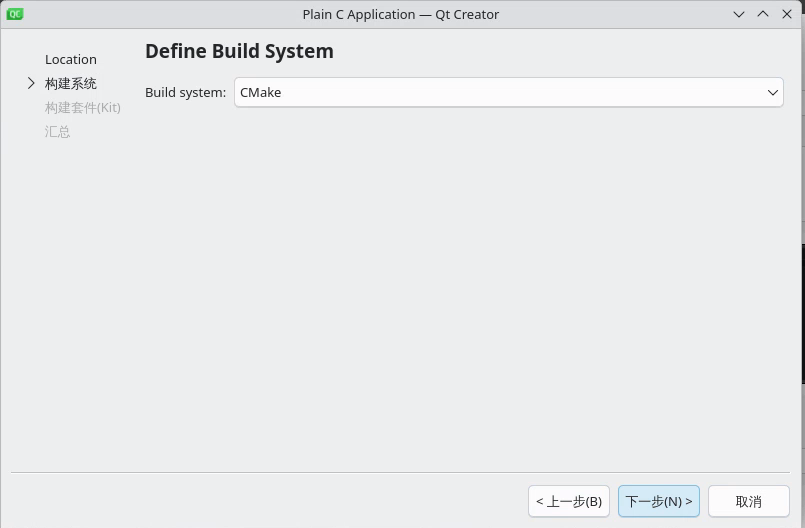
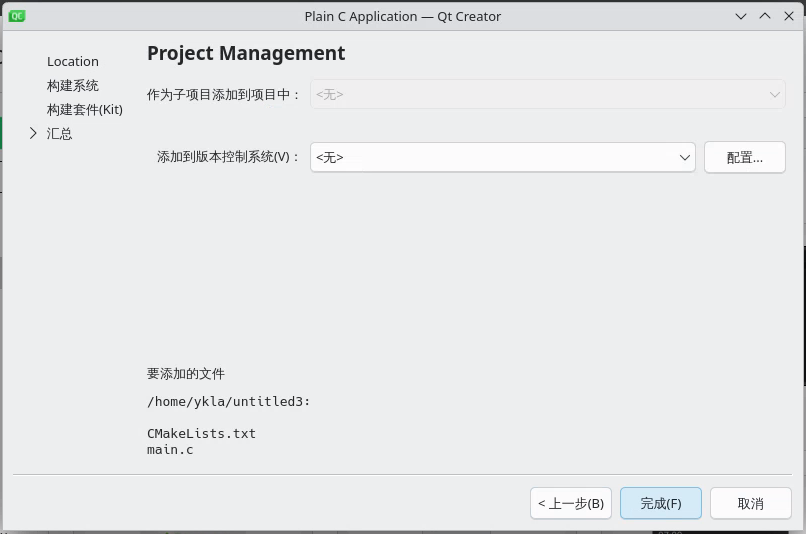
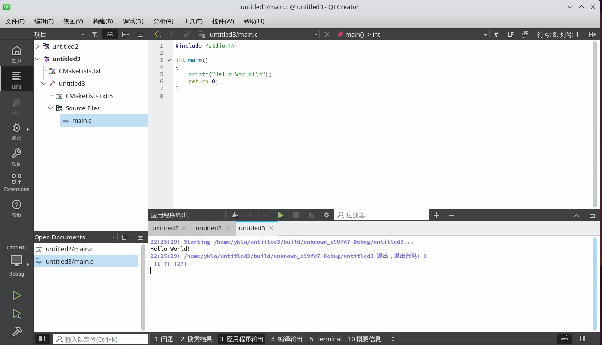
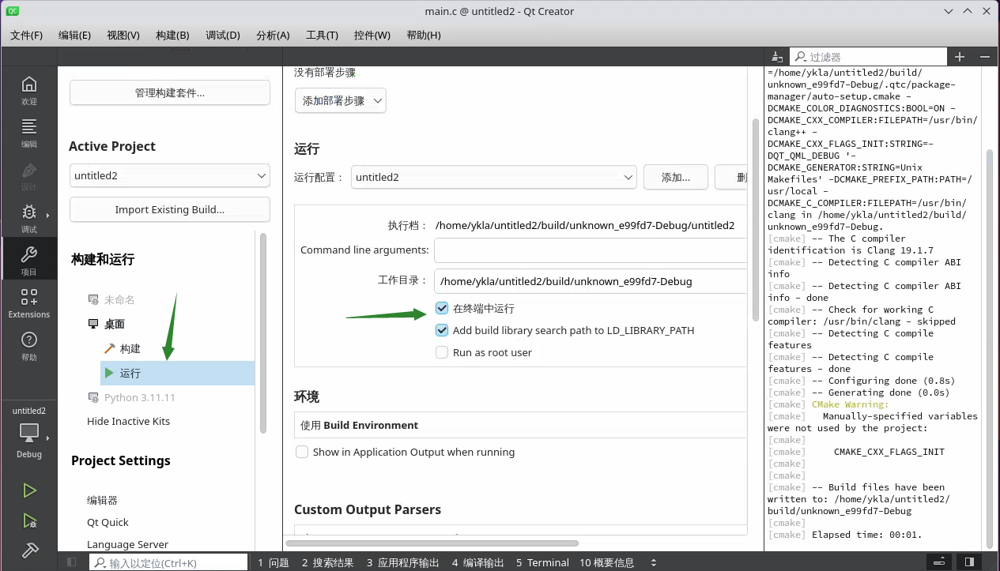
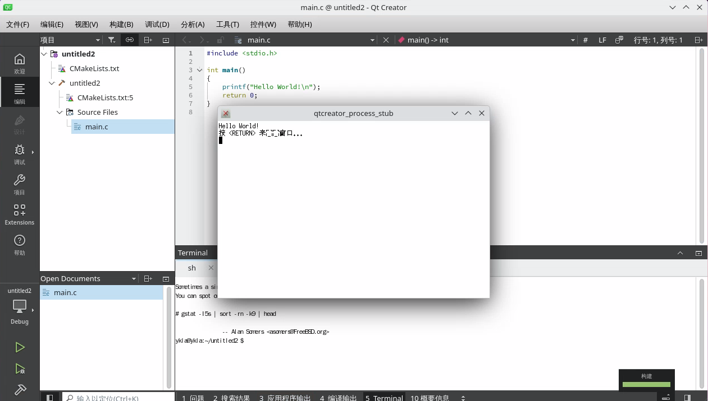

# 22.6 Qt 环境的配置

## 安装 Qt Creator

>**技巧**
>
>可能还需要安装 CMake（`cmake`）工具。

使用 Ports 安装（不建议使用 Qt Creator 的二进制包）：

```sh
# cd /usr/ports/devel/qtcreator/ && make install clean # 安装 Qt Creator 本体
# cd /usr/ports/misc/qt5-l10n/ && make install clean # 安装 Qt Creator 本地化语言包（如中文）
```

或使用 pkg 命令安装：

```sh
# pkg install qtcreator qt5-l10n
```

## Qt Creator 中文化

参见 [Bug 236518 - devel/qtcreator unsupported other languages](https://bugs.freebsd.org/bugzilla/show_bug.cgi?id=236518)

Qt Creator 界面语言默认跟随系统。如果未随系统更改，请在菜单中依次选择 `Edit` -> `Preferences` -> `Environment` -> `Interface` -> `Language` 手动设置。

编译器和调试器通常无需手动配置。

在 Qt Creator 中开发的程序可能无法输入中文，这是因为 Qt 支持输入法依赖插件机制。

列出 Qt5 平台输入上下文（Platform Input Context）插件目录下的文件：

```sh
$ ls /usr/local/lib/qt5/plugins/platforminputcontexts
```

可以看到以下输出：

```sh
libfcitx5platforminputcontextplugin.so   # Fcitx5 输入法平台插件
libibusplatforminputcontextplugin.so     # IBus 输入法平台插件
```

这些插件分别对应 IBus 和 Fcitx 5。无法输入中文可能是因为这两个插件依赖的库版本存在不兼容问题。

为解决此类问题，应通过 Ports 编译安装 Qt Creator，而非使用 pkg 安装。

### 界面翻译不完整问题

有志于参与 Qt 翻译的人应关注以下资源：

- [Qt Localization](https://wiki.qt.io/Qt_Localization)
- [qttranslations](https://invent.kde.org/qt/qt/qttranslations)

## Hello World（示例程序）












## 在终端输出





## 故障排除与未竟事宜

### 终端汉字显示缺失

此问题尚未解决。

