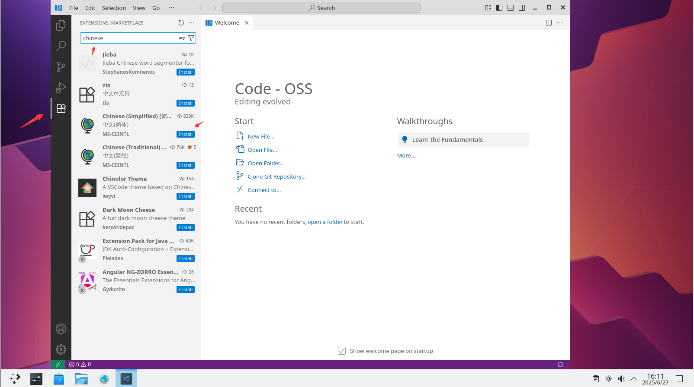
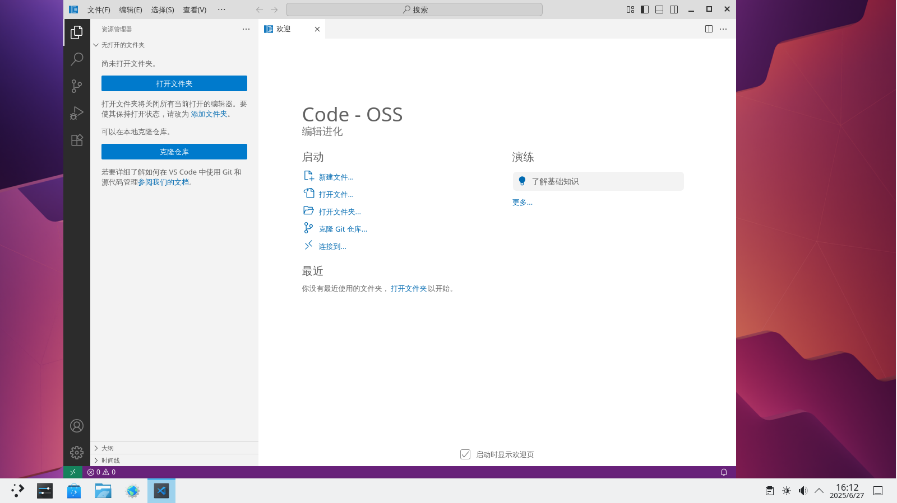

# 22.7 Python 和 VS Code

## Python

在 FreeBSD 中，不同的 Python 版本被分开封装。也就是说，Python 3.11 和 Python 3.13 属于不同的包，例如 Port `lang/python310`、`lang/python311`、`lang/python312`。


在不同时间节点，FreeBSD 的 Ports 对于不同版本的 Python，其通过 pkg 包管理器构建的二进制包的支持程度也有所不同。

例如，当前 `lang/python`（它实际上只是一个元包，即指向其他软件）可能指向 Python 3.11，那么通过 pkg 安装的其他 Python 包（如 Python-XX）在默认情况下也会基于此版本构建，包括其他依赖 Python 的软件，它们所依赖的 Python 版本也相同。

而那些基于最新 Python 版本构建的 Python 包或软件，在 FreeBSD 上的支持可能不够完善（可能需要通过 Ports 构建，或者无法获得）。

>**技巧**
>
>这类似于 Gentoo Linux 中的 Python USE。只要你指定了 Python 版本，所有基于 Python 的软件都会使用你所选择的版本。

所以想要安装 Python，我们建议你这样做：

- 使用 pkg 安装 Python 和 py-pip 包：

```sh
# pkg install python devel/py-pip
```

- 当然你也可以通过 Ports 安装：

```sh
cd /usr/ports/lang/python/ && make install clean   # 进入 Python Ports 目录并编译安装，同时清理临时文件
cd /usr/ports/devel/py-pip/ && make install clean  # 进入 py-pip Ports 目录并编译安装，同时清理临时文件
```

如果要安装特定版本的 Python，建议统一通过 USE 全局指定 Python 版本。

### 如何指定 Ports 编译的 Python 版本？

>**注意**
>
>实际上，`lang/python` 指向的版本最终是由 USE 设置控制的。

假设 Python 现在默认的编译版本是 3.11，要改为 3.13：

```sh
# echo "DEFAULT_VERSIONS+= python=3.13  python3=3.13" >> /etc/make.conf
```

将默认 Python 版本设置为 3.13，并将其追加到 `/etc/make.conf` 文件中。


>**技巧**
>
>如果只设置了单个参数，那么出现警告是正常的，见 [Bug 243034 - Mk/Uses/python.mk: WARNING when python version is set to non-default version in make.conf](https://bugs.freebsd.org/bugzilla/show_bug.cgi?id=243034)
>
>```sh
>/!\ WARNING /!\
>
>PYTHON_DEFAULT must be a version present in PYTHON2_DEFAULT or PYTHON3_DEFAULT,
>if you want more Python flavors, set BUILD_ALL_PYTHON_FLAVORS in your make.conf
>```


### 参考资料

- [Ports/DEFAULT_VERSIONS](https://wiki.freebsd.org/Ports/DEFAULT_VERSIONS)
- [Python](https://wiki.freebsd.org/Python)

## VS Code

- 使用 pkg 安装：

```sh
# pkg install vscode
```

- 或者使用 Ports 安装：

```sh
# cd /usr/ports/editors/vscode/ 
# make install clean
```

需要注意的是，以这种方式安装的 VS Code 实际上是 [Code - OSS](https://github.com/microsoft/vscode)。Code - OSS 与 VS Code 的区别主要在于许可证不同以及可用的闭源资源不同，类似 Chromium 与 Chrome 的关系。

感兴趣的读者可以自行 [阅读原文](https://github.com/microsoft/vscode/wiki/Differences-between-the-repository-and-Visual-Studio-Code)。

目前已知微软的 Python 插件以及 LLVM 的 clangd 插件都可以直接在 Code - OSS 上运行，但同步设置服务暂时无法使用。

### 设置中文环境






