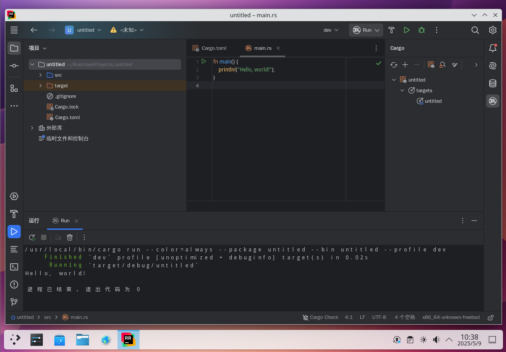
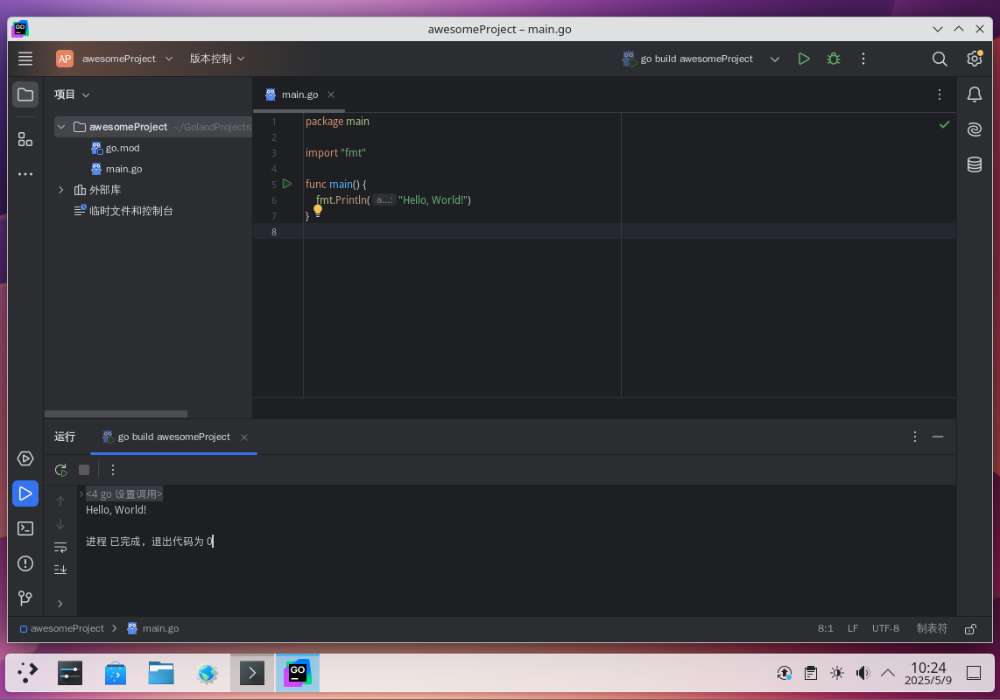

# 第 22.8 节 Rust/Go 环境的配置

## Rust

Rust 旨在实现内存安全和线程安全，并发编程是 Rust 的又一个设计目标。从现状来看，Rust 正在蚕食 C/C++ 的地盘。

### 安装 Rust

- 使用 pkg 安装：

```sh
# pkg install rust
```

- 或者使用 Ports 安装：

```sh
# cd /usr/ports/lang/rust/ 
# make install clean
```

>**技巧**
>
>最新开发版在 `lang/rust-nightly`

---

安装成功后，查看软件版本：

```sh
$ rustc --version
rustc 1.88.0-nightly (10fa3c449 2025-04-26) (built from a source tarball)
$ cargo --version
cargo 1.88.0-nightly (d811228b1 2025-04-15) (built from a source tarball)
```

### 为美好的世界献上祝福

```sh
$ cd ~
$ mkdir projects && cd projects
$ cargo new greeting
$ cd greeting
```

新建并编辑 `src/main.rs`，添加如下文本（默认应该就有）：

```rust
fn main() {
    println!("Hello, world!");
}
```

保存后，运行：

```rust
$ cargo run
   Compiling greeting v0.1.0 (/home/ykla/projects/greeting)
    Finished `dev` profile [unoptimized + debuginfo] target(s) in 0.58s
     Running `target/debug/greeting`
Hello, world!
```

### JetBrains Rust IDE

- 使用 pkg 安装：

```sh
# pkg install jetbrains-rustrover
```

- 或者使用 Ports 安装：

```sh
# cd /usr/ports/devel/jetbrains-rustrover/ 
# make install clean
```

---



## Go 语言

Go 语言是由谷歌开发的一种原生支持并发的编程语言。

### 安装 Go

- 使用 pkg 安装：

```sh
# pkg install go
```

- 或者使用 Ports 安装：

```sh
# cd /usr/ports/lang/go/ 
# make install clean
```

安装成功后，查看软件版本：

```sh
$ go version
go version go1.21.13 freebsd/amd64
```

### 为美好的世界献上祝福

新建名为 `helloWorld.go` 的文本，添加如下内容：

```go
package main

import "fmt"

func main() {
    fmt.Println("Hello, World!")
}
```

保存后，在终端执行下列命令即可输出代码：

```go
$ go run helloWorld.go
Hello, World!
```

### JetBrains GoLand IDE

- 使用 pkg 安装：

```sh
# pkg install jetbrains-goland
```

- 或者使用 Ports 安装：

```sh
# cd /usr/ports/devel/jetbrains-goland/ 
# make install clean
```

---


