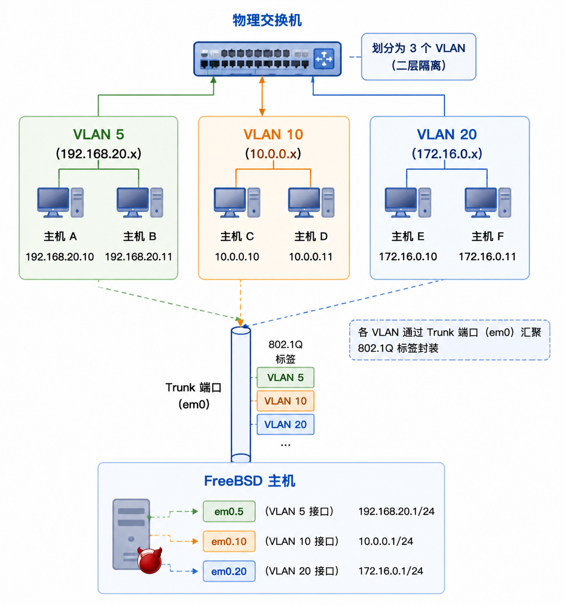

# 22.4 VLAN

VLAN（虚拟局域网）是一个局域网的逻辑分段（每个段都拥有自己的广播域）。VLAN 与局域网的其他分段隔离，其他分段上的计算机仅能通过具有过滤功能的连接单元对其进行访问。

VLAN 逻辑分割示意图：



> **注意**
>
> VLAN 之间是二层隔离的，不同 VLAN 之间的通信必须通过路由器或三层交换机进行转发。

在 FreeBSD 上，VLAN 硬件卸载功能需网卡驱动程序支持；若驱动不支持，VLAN 标签处理将由软件完成，但性能可能受影响。要查看哪些驱动程序支持 VLAN 硬件卸载，可参阅 [vlan(4)](https://man.freebsd.org/cgi/man.cgi?query=vlan&sektion=4&format=html) 手册页。

配置 VLAN 时，需了解以下信息：一是所用的网络接口，二是 VLAN 标签。

## 定义 VLAN

假设使用的网卡为 `em0`，VLAN 标签为 `5`，则命令如下：

```sh
# ifconfig em0.5 create vlan 5 vlandev em0 inet 192.168.20.20/24
```

> **注意**
>
> 须注意，接口名称包括网卡驱动程序名称和 VLAN 标签，并通过点号分隔。这是最佳实践，尤其在机器上配置了多个 VLAN 时，能方便地管理 VLAN 配置。

> **注意**
>
> 定义 VLAN 时，须确保同时配置和启用了父网络接口。上面的示例中，最简单的配置为：
>
> ```sh
> # ifconfig em0 up
> ```

要在启动时配置 VLAN，必须更新 **/etc/rc.conf**。若需复现上述配置，需添加以下内容：

```sh
vlans_em0="5"
ifconfig_em0_5="inet 192.168.20.20/24"
```

只需将标签添加到 `vlans_em0` 字段，并为该 VLAN 标签的接口配置网络，即可添加更多 VLAN。

> **注意**
>
> 在 /etc/rc.conf 中定义 VLAN 时，须确保同时配置和启用了父网络接口。上面的示例中，最简单配置为：
>
> ```sh
> ifconfig_em0="up"
> ```

## 为接口指定符号名称

为接口指定符号名称具有实用价值：当更换关联的硬件时，只需更新少数几个配置变量。例如，安全摄像头需在 `em0` 上运行 VLAN 1，若日后将 `em0` 网卡替换为使用 ixgbe(4) 驱动程序的网卡，则无需将所有指向 `em0.1` 的引用更改为 `ixgbe0.1`。

要在网卡`em0` 上配置 VLAN `5`，并为接口指定名称 `cameras`，为其分配 IP 地址 `192.168.20.20/24`，使用以下命令：

```sh
# ifconfig em0.5 create vlan 5 vlandev em0 name cameras inet 192.168.20.20/24
```

如果父接口使用的是其他网卡（例如 `video`，代表系统中另一块物理网卡），则使用以下命令：

```sh
# ifconfig video.5 create vlan 5 vlandev video name cameras inet 192.168.20.20/24
```

在 **/etc/rc.conf** 中添加以下内容以在启动时应用更改：

```sh
vlans_video="cameras"
create_args_cameras="vlan 5"
ifconfig_cameras="inet 192.168.20.20/24"
```
