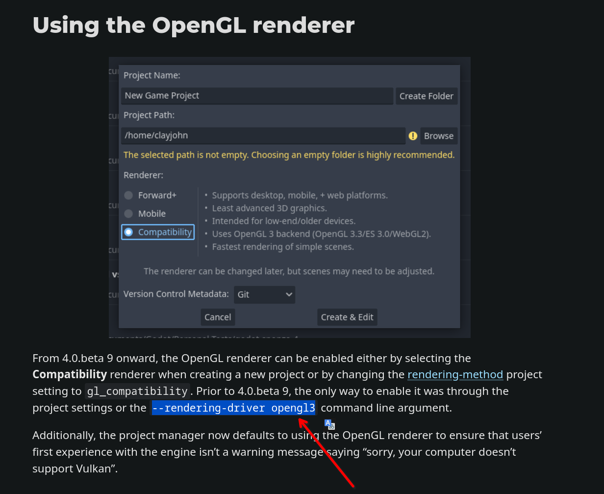

# 22.2 Godot 开源游戏引擎

## 概述

Godot 是开源 2D/3D 游戏引擎，FreeBSD 通过 Ports 提供 godot-tools（编辑器）和 godot（导出模板）两个软件包。本节涵盖安装与基础项目配置。

## 安装 Godot

使用 pkg 安装：

```sh
# pkg install godot-tools godot
```

或者使用 Ports 安装：

```sh
# cd /usr/ports/devel/godot-tools/ && make install clean
# cd /usr/ports/devel/godot/ && make install clean
```

## 使用 Godot

本小节介绍 Godot 引擎的基本使用方法与性能优化技巧。

安装完成后新建项目并进入编辑器，可能会发现界面卡顿且 CPU 占用率较高。这是因为在 FreeBSD 默认配置下，Godot 的渲染由 CPU 进行软件光栅化处理，并且仅使用单个线程，这种方式会对系统性能造成较大负担。

此时需为 `godot-tools` 添加启动参数，以启用硬件加速渲染。OpenGL 3 驱动能够利用图形处理器的并行计算能力，将渲染工作从 CPU 转移至 GPU。

使用 OpenGL 3 渲染驱动启动 Godot 工具：

```sh
$ godot-tools --rendering-driver opengl3
```

如此在打开项目并进入 Godot 编辑器后，通过系统监视器观察，在缩放 Godot 窗口时 CPU 占用率没有明显变化，表明渲染工作已由 GPU 处理。

还需要注意项目的创建方式。如果遇到上述卡顿问题并使用了 OpenGL 参数，在创建项目时应选择“兼容”，而非 Forward+ 或“移动”。Forward+ 和“移动”模式使用 RenderingDevice，这是一种更现代的渲染抽象层，其特性与兼容性要求可在创建窗口的说明中查看。只有“兼容”模式使用 OpenGL 3 后端。




## 参考文献

- Godot Engine. Godot documentation — Rendering drivers[EB/OL]. [2026-04-17]. <https://docs.godotengine.org/en/stable/tutorials/rendering/renderers.html>. Godot 4.x 渲染驱动说明，兼容模式使用 OpenGL 3 后端，Forward+ 和移动模式使用 Vulkan 后端。

## 课后习题

1. 查找 Godot 引擎的官方源代码，在 FreeBSD 上构建其开发版本，并分析其构建系统如何处理不同渲染后端（如 OpenGL 3、Vulkan）的配置与选择。
2. 使用 Godot 引擎运行一款游戏。
3. Godot 作为 MIT 许可证的开源引擎与 Unity 和 Unreal 的商业引擎形成竞争。分析开源游戏引擎在资产市场、教育生态与主机平台认证三个层面的结构性劣势，并讨论 FreeBSD 平台在 Godot 项目中的参与能否借助开源引擎的优势而获得突破。
