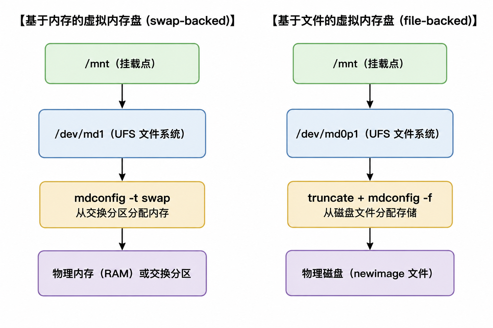

# 28.2 虚拟内存盘

除了物理磁盘，FreeBSD 还支持创建和使用虚拟内存盘。虚拟内存盘的典型用途之一是访问 ISO 文件系统的内容，而无需先将其刻录到 CD 或 DVD，随后再挂载 CD/DVD 媒体。参见“使用 DVD 安装软件”一节了解更多。

FreeBSD 还支持使用 `mdconfig` 命令创建基于内存或基于文件的虚拟内存盘，分别从内存区域或硬盘分配存储。前者为基于内存的虚拟内存盘，后者为基于文件的虚拟内存盘。

两种虚拟内存盘比较：



## 创建基于内存的虚拟内存盘

要创建一块基于内存的虚拟内存盘，请使用 `-t swap` 指定内存盘类型，并指定要创建的虚拟内存盘大小。

随后格式化虚拟内存盘，再挂载。此示例创建了一块大小为 50MB 的虚拟内存盘，编号为 `1`。

```sh
# mdconfig -a -t swap -s 50m -u 1
```

查看内存盘编号：

```sh
# mdconfig -l
md1
```

将该虚拟内存盘格式化为 UFS 文件系统，随后挂载：

```sh
# newfs -U md1
/dev/md1: 50.0MB (102400 sectors) block size 32768, fragment size 4096
	using 4 cylinder groups of 12.53MB, 401 blks, 1664 inodes.
	with soft updates
super-block backups (for fsck_ffs -b #) at:
 192, 25856, 51520, 77184
# mount /dev/md1 /mnt
```

查看内存盘文件系统：

```sh
# df -h  /mnt
Filesystem    Size    Used   Avail Capacity  Mounted on
/dev/md1       48M    8.0K     44M     0%    /mnt
```

## 创建基于文件的虚拟内存盘

要创建一块基于文件的虚拟内存盘，首先从磁盘中分配一个区域。此示例创建了 50MB 稀疏文件 **newimage**：

```sh
# truncate -s 50M newimage
```

接下来，将该文件附加到虚拟内存盘：

```sh
# mdconfig -f newimage -u 0
```

为虚拟内存盘分配 GPT 分区表：

```sh
# gpart create -s GPT md0
# gpart add -t freebsd-ufs md0
```

将其格式化为 UFS 文件系统：

```sh
# newfs -U md0p1
/dev/md0p1: 50.0MB (102320 sectors) block size 32768, fragment size 4096
	using 4 cylinder groups of 12.50MB, 400 blks, 1664 inodes.
	with soft updates
super-block backups (for fsck_ffs -b #) at:
 192, 25792, 51392, 76992
```

挂载虚拟内存盘：

```sh
# mount /dev/md0p1 /mnt
```

验证文件支持的磁盘大小：

```sh
# df -h /mnt
Filesystem    Size    Used   Avail Capacity  Mounted on
/dev/md0p1     48M    8.0K     44M     0%    /mnt
```
