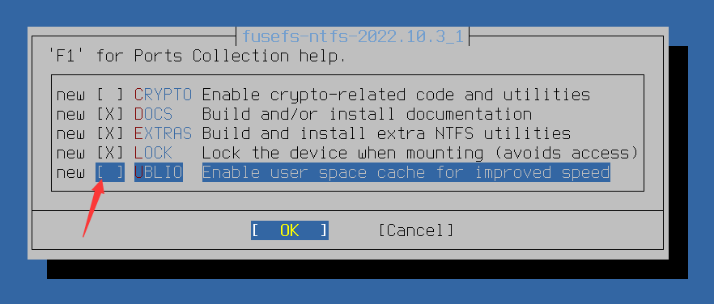

# 23.4 Windows 文件系统

本节介绍 NTFS 和 FAT32 文件系统在 FreeBSD 上的挂载、格式化与自动配置方法。

## 目录结构

```sh
/
├── usr
│   ├── local
│   │   └── bin
│   │       └── ntfs-3g              # NTFS-3G 可执行文件
│   └── ports
│       └── filesystems
│           └── ntfs                  # ntfs-3g Ports 目录
├── etc
│   ├── rc.conf                        # 系统启动配置文件
│   └── fstab                          # 持久化挂载配置文件
├── dev
│   ├── da0                            # 磁盘设备
│   └── da0s1                          # NTFS 分区
├── media
│   └── NTFS                           # NTFS 挂载点
└── mnt
    ├── NTFS                           # NTFS 挂载点（备用）
    └──                                 # 通用挂载点
```

## NTFS 文件系统

### 安装 ntfs-3g

UBLIO（User space Block I/O）是一个用户空间块 I/O 库，用于提升 FUSE 文件系统的性能。然而，由于 UBLIO 在 FreeBSD 环境下与 ntfs-3g 协同工作时可能引发文件系统损坏及数据丢失风险（[Bug 206978 - sysutils/fusefs-ntfs: Disable UBLIO as it breaks mkntfs](https://bugs.freebsd.org/bugzilla/show_bug.cgi?id=206978)、[Bug 194526 - sysutils/fusefs-ntfs: ntfs-3g with libublio lost files](https://bugs.freebsd.org/bugzilla/show_bug.cgi?id=194526)），因此不建议采用 pkg 二进制安装方式，而应通过 Ports 系统进行源代码编译：

```sh
# cd /usr/ports/filesystems/ntfs
# make config
```



取消勾选 `UBLIO` 选项后，再执行编译安装：

```sh
# make BATCH=yes install clean
```

### 配置 ntfs-3g

将 NTFS 格式的硬盘或 U 盘插入计算机。此时可观察到其设备名称，例如 `da0`（对应设备文件为 `/dev/da0`）。

编辑 `/etc/rc.conf` 配置文件，将 fusefs 内核模块添加至系统启动加载列表：

```sh
# sysrc kld_list+="fusefs"
```

### 创建 NTFS 分区

可以在 MBR 或 GPT 分区表上创建 NTFS 分区：

#### MBR 分区表方案

```sh
# gpart create -s mbr da0   # 在 da0 磁盘上创建 MBR 分区表，若磁盘已为 MBR 分区表，则可跳过此步骤
# gpart add -t ntfs da0     # 在 da0 磁盘上添加 NTFS 类型的分区
```

#### GPT 分区表方案

```sh
# gpart create -s gpt da0  # 在 da0 磁盘上创建 GPT 分区表，若磁盘已为 GPT 分区表，则可跳过此步骤
# gpart add -t ntfs da0  # 在 da0 磁盘上添加 NTFS 类型的分区
```

### 格式化 NTFS 分区

在 `/dev/da0s1` 分区下创建 NTFS 文件系统：

```sh
# mkntfs -vf /dev/da0s1
```

参数说明：

- `-f`：表示执行快速格式化操作
- `-v`：表示显示详细输出信息

### NTFS 的自动挂载配置

为实现开机自动挂载，需修改 `/etc/fstab` 配置文件，添加如下内容：

```sh
/dev/da0s1  /media/NTFS ntfs  rw,mount_prog=/usr/local/bin/ntfs-3g,late  0  0
```

该配置将 `/dev/da0s1` 分区挂载至 `/media/NTFS` 目录。

配置中使用 ntfs-3g 驱动以读写模式挂载，`late` 选项表示延迟挂载，即等待系统基本启动完成后再执行挂载操作，避免因设备未就绪导致的启动问题。

### NTFS 的手动挂载操作

手动挂载 NTFS 分区可以通过以下方式：

1. 使用 ntfs-3g 将 `/dev/da0s1` 挂载至 `/media/NTFS`，设置读写权限，并指定文件所有者和权限掩码：

```sh
# ntfs-3g  /dev/da0s1  /media/NTFS   -o  rw,uid=1000,gid=1000,umask=0
```

2. 若不确定哪个磁盘分区为 NTFS 格式，可使用以下命令检测 `/dev/da0s1` 分区的文件系统类型：

```sh
# fstyp /dev/da0s1
```

3. 若在挂载过程中出现报错，可尝试删除休眠文件：

```sh
# ntfs-3g  /dev/da0s1 /mnt/NTFS -o remove_hiberfile
```

该命令使用 ntfs-3g 将 `/dev/da0s1` 挂载至 `/mnt/NTFS`，并删除休眠文件以解除文件系统锁定。

4. 若上述方法仍无法解决问题，可尝试修复 `/dev/da0s1` 上的 NTFS 文件系统错误（轻量级修复，功能类似 Windows 系统的 chkdsk）：

```sh
# ntfsfix /dev/da0s1
```

执行修复操作后，重新尝试挂载。

## FAT32 文件系统

在使用 `gpart show` 命令时，FAT32 文件系统通常被显示为 `ms-basic-data` 类型。

以下命令显示 `nda1` 磁盘及其分区的详细信息，包括起始位置、大小和类型：

```sh
# gpart show -p nda1  # 已忽略其他无用输出信息
=>      34  41942973    nda1  GPT  (20G)
  29360128   4194304  nda1p3  ms-basic-data  (2.0G) # 即为 fat32
```

> **注意**
>
> 必须显式声明文件系统类型才能进行挂载操作。

将 `/dev/nda1p3` 分区挂载为 msdosfs 文件系统，并显示挂载过程的详细信息：

```sh
# mount -v -t msdosfs  /dev/nda1p3  /mnt  # 测试挂载。-v 参数用于显示详细信息（Verbose）；-t 参数用于指定文件系统类型
/dev/nda1p3 on /mnt (msdosfs, local, writes: sync 1 async 0, reads: sync 512 async 0, fsid 7d00000032000000, vnodes: count 1 )
# ls /mnt/  # 列出挂载目录下的内容
me	test1	test2
# umount /mnt  # 卸载文件系统
```

## 参考文献

- FreeBSD Project. ntfs-3g manpage[EB/OL]. [2026-03-25]. <https://www.freebsd.org/cgi/man.cgi?query=ntfs-3g&format=html>. ntfs-3g 官方技术文档，详细说明各项参数配置与使用方法
- Stephen Sherratt. NTFS on FreeBSD[EB/OL]. (2020-12-18)[2026-03-25]. <https://www.gridbugs.org/ntfs-on-freebsd/>. 系统阐述了 NTFS 文件系统在 FreeBSD 上的挂载技术实现方案

## 课后习题

1. 通过 Ports 编译安装 ntfs-3g（取消勾选 UBLIO 选项），创建一个 NTFS 分区并格式化，配置 /etc/fstab 实现开机自动挂载，重启后验证挂载和文件读写操作。

2. 分析为什么 ntfs-3g 需要通过 Ports 源代码编译而不能直接使用 pkg 安装，重构一个最小化的 NTFS 挂载脚本。

3. 尝试挂载一个处于休眠状态的 NTFS 分区，分别使用 remove_hiberfile 和 ntfsfix 选项，验证两种方法的行为差异。
