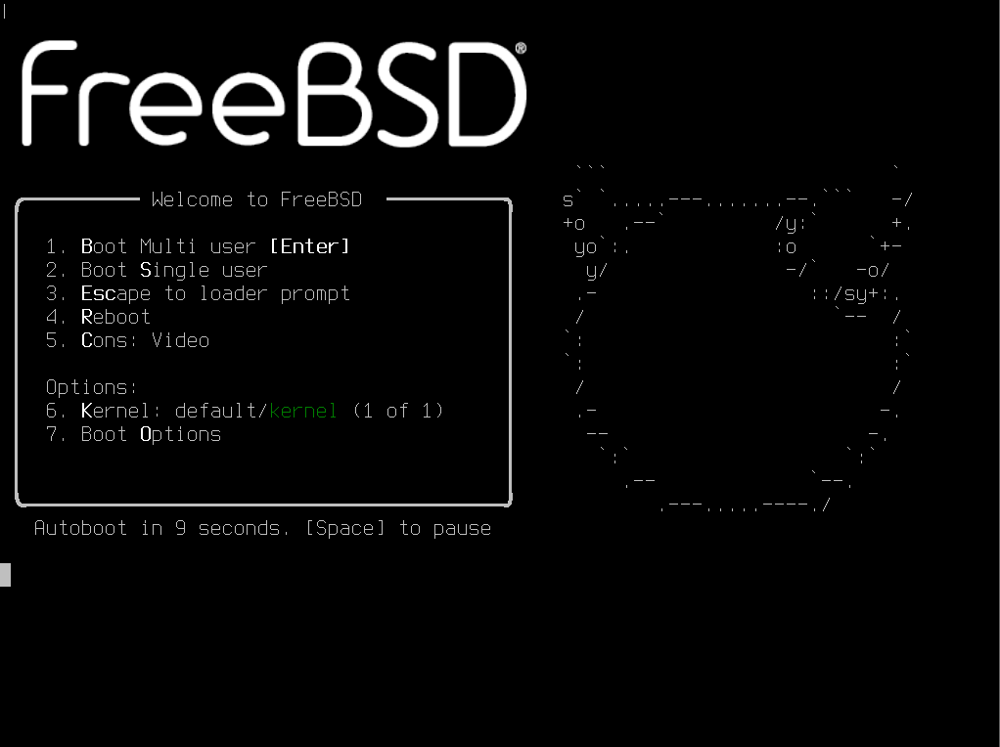
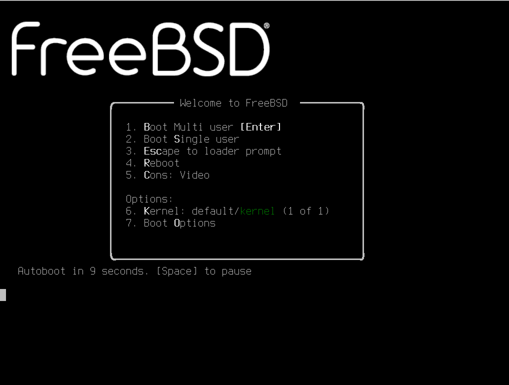

# 第 23.4 节 引导界面

## 调整引导选择界面的时间为 2 秒

```sh
# ee /boot/loader.conf
```

修改：

```sh
autoboot_delay="2"
```
## 精简启动输出

```sh
# echo boot_mute="YES"  >> /boot/loader.conf # 启动显示一个 FreeBSD 的 Logo
# echo debug.acpi.disabled="thermal" >> /boot/loader.conf # 屏蔽可能存在的 ACPI 报错
# sysrc rc_startmsgs="NO" # 关闭进程启动信息
# sysrc dhclient_flags="-q" # 安静输出
# sysrc background_dhclient="YES" # 后台 DHCP
# sysrc synchronous_dhclient="YES" # 启动时同步 DHCP  
# sysrc defaultroute_delay="0" # 立即添加默认路由
# sysrc defaultroute_carrier_delay="1" # 接收租约时间为 1 秒
```


参考文献：

- [FreeBSD Desktop – Part 1 – Simplified Boot](https://vermaden.wordpress.com/2018/03/29/freebsd-desktop-part-1-simplified-boot/)
- [rc.conf -- system configuration information](https://man.freebsd.org/cgi/man.cgi?rc.conf(5))
- [acpi -- Advanced	Configuration and Power	Management support](https://man.freebsd.org/cgi/man.cgi?acpi(4))

## 调整引导界面和 TTY 分辨率

### 修改“gop”（通用方法）

在出来 FreeBSD 菜单的时候，按下 **ESC** 键，脱离引导。会出现提示符 `OK `。输入 `gop list` 可以看到所有支持的分辨率列表：


```sh
OK gop list
mode 0: 1920x1080x32, stride=1920
mode 1: 640x480x32, stride=640
mode 2: 800x600x32, stride=800
mode 3: 1024x768x32, stride=1024
mode 4: 1280x720x32, stride=1280
mode 5: 1280x1024x32, stride=1280
```

我这里选择 `mode 0`，先测一下效果：

```sh
OK gop set 0
```

当即立现。

如果合适，继续引导：

```sh
OK menu
```


把配置写进 `/boot/loader.conf`：

```sh
exec="gop set 0"
```


### `efi_max_resolution`（UEFI）或 `vbe_max_resolution`（BIOS）

根据文档 [LOADER.CONF(5)](https://man.freebsd.org/cgi/man.cgi?loader.conf(5))，两个变量接受以下值：

```sh
值	           分辨率
480p	        640x480
720p	        1280x720
1080p	       1920x1080
1440p	       2560x1440
2160p	       3840x2160
4k	          3840x2160
5k	          5120x2880
宽x高        宽x高
```

本文测试使用 `efi_max_resolution`：

将 `efi_max_resolution="1080p"` 写入 `/boot/loader.conf`，重启后效果与 gop 方法一致。

#### 参考文献

- [gop set \<mode\> being ignored in /boot/loader.conf](https://forums.freebsd.org/threads/gop-set-mode-being-ignored-in-boot-loader-conf.77779/)，`efi_max_resolution` 方法参考本文
- [How to find the valid values of efi_max_resolution](https://forums.freebsd.org/threads/how-to-find-the-valid-values-of-efi_max_resolution.84840/)，gop 方法参考本文，里面有个动图有点用

## 自定义引导加载程序 Logo

根据 man 页面 [BEASTIE.4TH(8)](https://man.freebsd.org/cgi/man.cgi?query=beastie.4th&sektion=8&manpath=FreeBSD)，默认有几种 logo 可选：

- `fbsdbw`
- `beastie`
- `beastiebw`
- `orb`（14.2 中默认，UEFI 下）
- `orbbw`
- `none`（无 Logo）
  
以 `fbsdbw` 为例，在 `/boot/loader.conf` 写入

```sh
loader_logo="fbsdbw"
```

重启效果：






#### 参考文献

- [customize boot loader logo](https://forums.freebsd.org/threads/customize-boot-loader-logo.72903/)。本文主要来自此处
- [How to change the FreeBSD logo which appears as soon it boots with that of the little devil.](https://forums.freebsd.org/threads/how-to-change-the-freebsd-logo-which-appears-as-soon-it-boots-with-that-of-the-little-devil.85934/)，试过了一样不生效退回原 logo。
- [loader: Load a splash screen if "splash" variable is defined](https://reviews.freebsd.org/D45932)，可能有用，但是试过了也不行