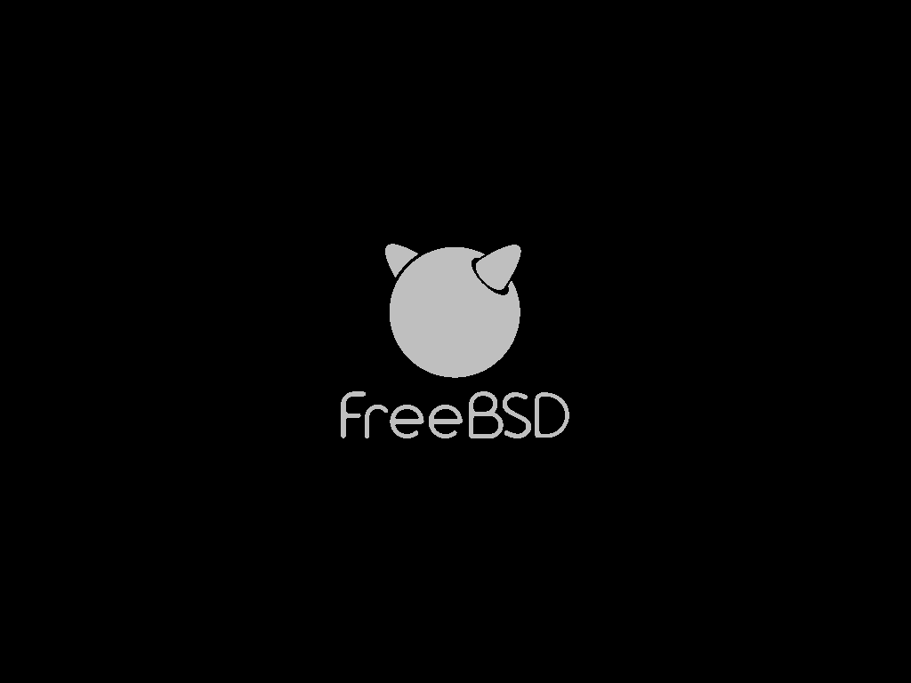

# 第 23.4 节 引导界面

## 调整引导选择界面的时间为 2 秒

```shell
# ee /boot/loader.conf
```

修改：

```shell
autoboot_delay="2"
```
## 精简启动输出

```shell
# echo boot_mute="YES"  >> /boot/loader.conf # 启动显示一个 FreeBSD 的 Logo
# echo debug.acpi.disabled="thermal" >> /boot/loader.conf # 屏蔽可能存在的 ACPI 报错
# sysrc rc_startmsgs="NO" # 关闭进程启动信息
```



参考文献：

- <https://vermaden.wordpress.com/2018/03/29/freebsd-desktop-part-1-simplified-boot/>
- <https://man.freebsd.org/cgi/man.cgi?rc.conf(5)>
- <https://man.freebsd.org/cgi/man.cgi?acpi(4)>

