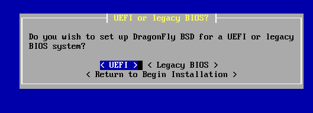
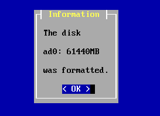
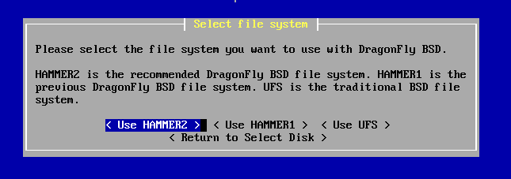
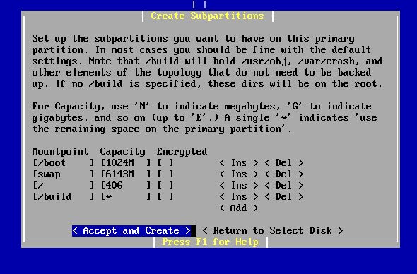
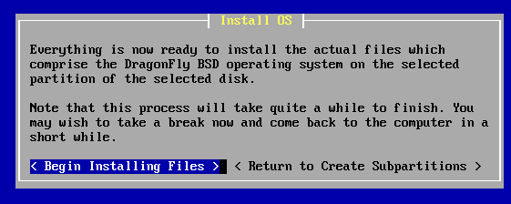
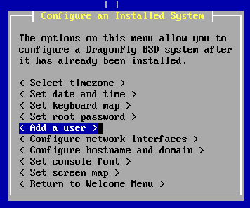
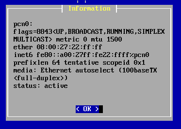
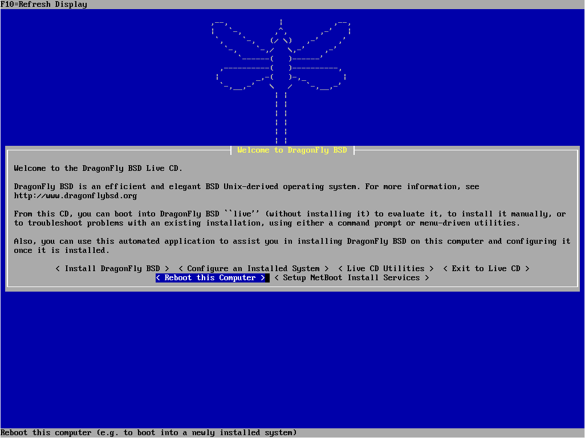

# 第 24.2 节 安装 DragonFly BSD

安装视频：[安装 DragonFly BSD 6.4](https://www.bilibili.com/video/BV1BM41187pD/)

DragonFly BSD 下载页面在 <https://www.dragonflybsd.org/download/>。

U 盘安装应使用 `USB: dfly-x86_64-6.4.0_REL.img as bzip2 file`：解压出 `dfly-x86_64-6.4.0_REL.img` 使用 Rufus 刻录 U 盘。 

本文使用 `Uncompressed ISO: dfly-x86_64-6.4.0_REL.iso`。

---

  

  

  

  

  

  

  

  

  

 

  

  

  

  

  

  

  

  

  

 

  

  

  

 

 

  

 

  

  

  

  

 

  

  

  

  

  

输入用户名 `root`，回车即可登录，无密码。

