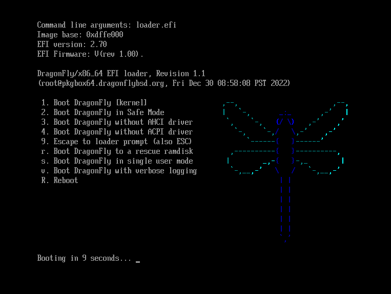
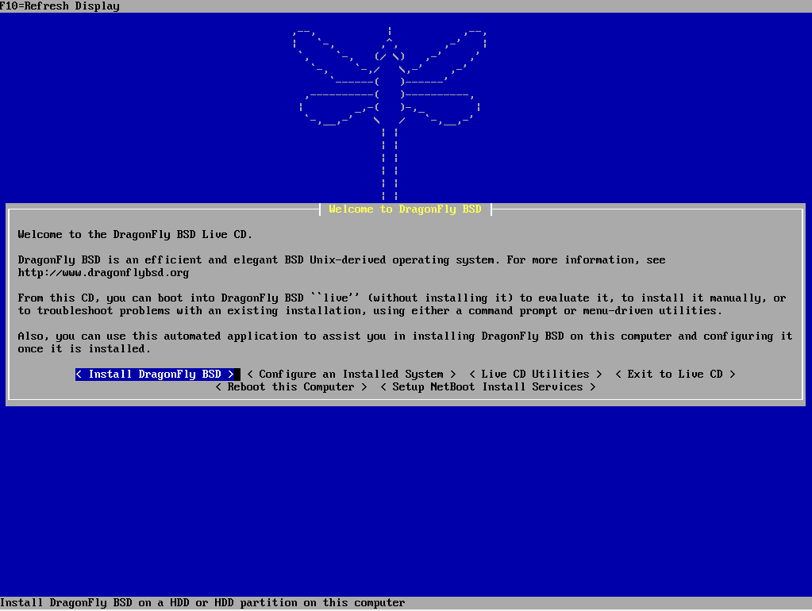
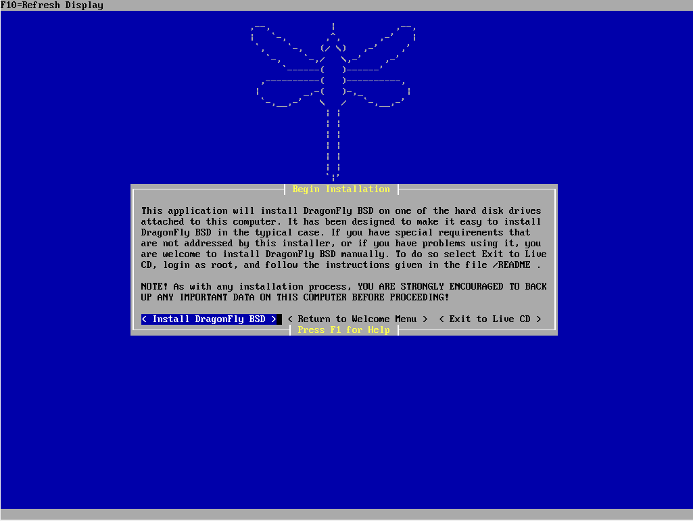
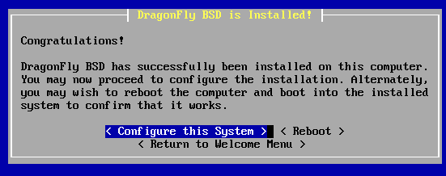
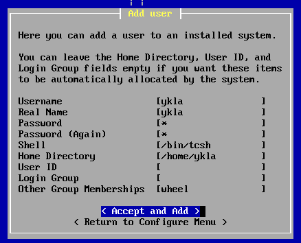
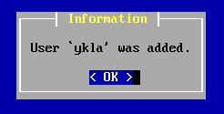
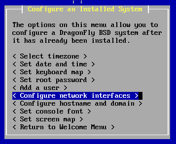
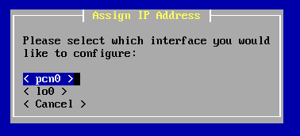
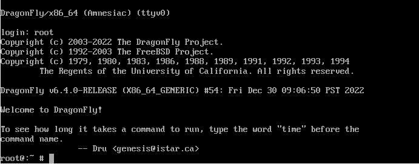

# 第 24.2 节 安装 DragonFly BSD

安装视频：[安装 DragonFly BSD 6.4](https://www.bilibili.com/video/BV1BM41187pD/)

DragonFly BSD 下载页面在 <https://www.dragonflybsd.org/download/>。

U 盘安装应使用 `USB: dfly-x86_64-6.4.0_REL.img as bzip2 file`：解压出 `dfly-x86_64-6.4.0_REL.img` 使用 Rufus 刻录 U 盘。 

本文使用 `Uncompressed ISO: dfly-x86_64-6.4.0_REL.iso`。

---

## 启动安装盘

  

输入用户名 `intaller`（即安装的意思）开始安装。

  

选择 `Install DragonFly BSD`（安装 DragonFly BSD）。

  

选择 `Install DragonFly BSD`（安装 DragonFly BSD）。

  

## 写入硬盘与引导

本文基于 UEFI，我们选择 `UEFI`。新电脑（2016+）都应选择 UEFI。

  

选择要安装的硬盘。

  

确认硬盘。

  

格式化完成。

  

选择文件系统，此处我们选择 `HAMMER2`

  

进行分区操作，完毕后选择 `Accept and Create`（确认并创建）

 

一些警告信息，点 `OK` 确认

  

`Being Installing Files`（开始安装文件）

  

正在解压缩文件到硬盘：

## 配置系统

选择 `Configure this System`（配置此系统）

  

配置时区（`Select timezone`）：

  

选择 `No`，手动配置时区：

选择 `Asia`，亚洲

  

选择 `Shanghai`，上海，即北京时间

  

时区配置完成。

  

设置日期和时间（`Set date and time`）：

  

点击 `OK` 完成配置。

 

时间和日期配置完成。

  

键盘布局（`Set keyboard map`）无需配置，默认即可。

  

设置 root 密码（`Set root password`）：

输入密码并确认：

  

root 密码设置完成。

 

添加用户：

 

设置完成后点 `Accept and Add`（确认并添加）

  

用户添加成功。

 

配置网络（`Configure network interface`）：

  

选择网卡接口

  

使用 DHCP

  

配置完成。

  

设置主机名和域名。

 

## 结束安装

完成设置。

  

结束安装。

 

重启：

  

确认重启

  

## 开机

  

输入用户名 `root`，输入设置的密码，回车即可登录。

