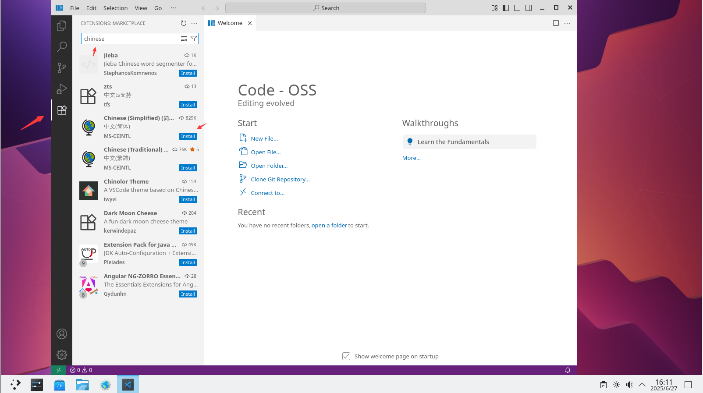
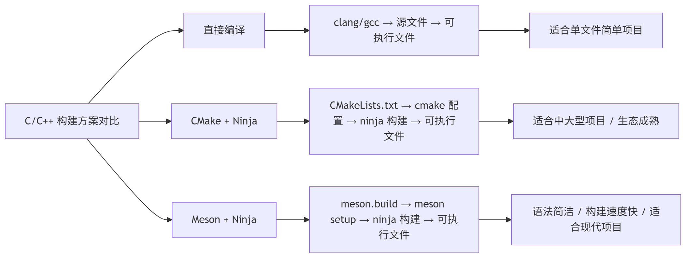
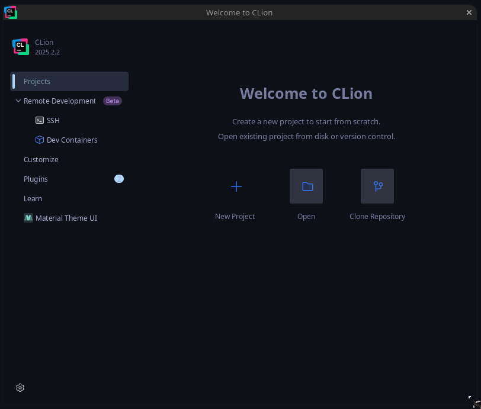

# 24.1 C/C++ 开发环境

## C/C++ 概述

C 与 C++ 广泛应用于系统编程、高性能计算、嵌入式开发等领域。

FreeBSD 内核及大量用户态工具均以 C 语言编写。

## LLVM / Clang 概述

FreeBSD 基本系统内置 Clang 编译程序，但并不包含 LLVM 中的其他组件，如 clangd（语言服务器，用于代码补全、编译错误提示和定义跳转等）、Clang-Tidy（代码风格诊断器）以及 clang-format（用于格式化 C/C++ 代码）。

FreeBSD 基本系统与 Ports 中 LLVM 组件的对照关系如下：

| FreeBSD 基本系统（内置） | Ports 安装（devel/llvm\*） |
| ------------------------ | -------------------------- |
| clang（C 编译器） | clangd（LSP 语言服务器） |
| clang++（C++ 编译器） | Clang-Tidy（代码风格诊断器） |
| lld（链接器） | clang-format（代码格式化工具） |
| | lldb（调试器） |

两者共同构成完整开发环境。

如需安装 LLVM，可使用任意版本的 LLVM，但版本不应低于系统自带的 Clang。

查看 FreeBSD 16 中 Clang 编译程序的版本信息：

```sh
$ clang -v
FreeBSD clang version 21.1.8 (https://github.com/llvm/llvm-project.git llvmorg-21.1.8-0-g2078da43e25a)
Target: x86_64-unknown-freebsd16.0
Thread model: posix
InstalledDir: /usr/bin
Build config: +assertions
```

下文使用 LLVM 22（撰写时版本），安装后对应的程序名为 `clang22`、`clang++22`、`clangd22` 和 `clang-format22`。系统自带的 Clang 程序名为 `clang`。若使用不同版本，请注意对应的程序名称。

### LLVM 项目上游的 LLVM 版本号

LLVM 项目上游源代码中，LLVM 19 的版本号由文件 **llvm/CMakeLists.txt** 规定，[此次提交](https://github.com/llvm/llvm-project/commit/81e20472a0c5a4a8edc5ec38dc345d580681af81) 之后版本号改由源文件 [cmake/Modules/LLVMVersion.cmake](https://github.com/llvm/llvm-project/blob/main/cmake/Modules/LLVMVersion.cmake) 规定。

```cmake
# The LLVM Version number information
# LLVM 版本号信息

if(NOT DEFINED LLVM_VERSION_MAJOR)
  set(LLVM_VERSION_MAJOR 23) # 代表本节撰写时主线版本为 LLVM 23

……省略其他内容……
```

### FreeBSD 基本系统中的 LLVM 版本号

FreeBSD 将 LLVM 导入基本系统源代码，但并非直接导入，而是经过处理。撰写本节时 FreeBSD src 内置的 LLVM 仍为 LLVM 21，注明版本号的源代码文件路径位于 **lib/clang/include/clang/Basic/Version.inc**：

```c
#define	CLANG_VERSION			21.1.8
#define	CLANG_VERSION_STRING		"21.1.8"
#define	CLANG_VERSION_MAJOR		21
#define	CLANG_VERSION_MAJOR_STRING	"21"
#define	CLANG_VERSION_MINOR		1
#define	CLANG_VERSION_PATCHLEVEL	8
#define MAX_CLANG_ABI_COMPAT_VERSION	21

#define	CLANG_VENDOR			"FreeBSD "
```

### 从 Ports 安装 Clang 环境包

基本系统内置的 Clang 版本可能较低，无法满足日常需求，因此需要从 Ports 安装更高版本的 Clang。

- 使用 pkg 安装：

```sh
# pkg install llvm22 cmake git
```

- 或者使用 Ports 安装：

```sh
# cd /usr/ports/devel/llvm22/ && make install clean
# cd /usr/ports/devel/cmake/ && make install clean
# cd /usr/ports/devel/git/ && make install clean
```

## FreeBSD 部分 C/C++ 开发工具概览

| 工具 | 简介 | 主要开发语言 | 编辑器类型 |
| ---- | ---- | ------------ | ---------- |
| [Code-OSS](https://github.com/microsoft/vscode) | Visual Studio Code 的开源版本，去除了微软闭源组件和遥测功能，功能完备的可扩展代码编辑器 | TypeScript / JavaScript（Electron 框架） | 轻度至中度（通过扩展可接近 IDE 功能） |
| [JetBrains CLion](https://www.jetbrains.com/clion/) | 专为 C/C++ 开发的跨平台集成开发环境（IDE），提供智能代码辅助、重构和深度调试集成，适合大型项目 | Java（基于 IntelliJ 平台） | 重度 IDE |
| [Zed](https://zed.dev/) | 高性能现代代码编辑器，由 Atom 和 Tree-sitter 的创建者打造，注重速度和流畅性，内置协作功能 | Rust | 轻度至中度（原生性能高，但功能聚焦于编辑） |

### 参考文献

- Jianping-Duan. algcl[EB/OL]. [2026-03-26]. <https://github.com/Jianping-Duan/algcl>. 提供了可直接在 FreeBSD 上运行的 C 语言算法与数据结构编程实例。
- Zed Industries. Zed[EB/OL]. [2026-04-17]. <https://zed.dev/>. 由 Atom 和 Tree-sitter 创建者开发的高性能代码编辑器。

## 使用 VSCode（Code-OSS）开发 C/C++

C 与 C++ 在语法、工具链及编译流程上具有较高相似性，本节以 C 语言为例介绍开发环境的配置方法，C++ 开发可依此类推。

Visual Studio Code 是一款兼具代码编辑器简洁性与核心开发功能（编辑、构建、调试）的工具，提供全面的编辑和调试支持、可扩展性模型以及与现有工具的轻量集成。

### 安装 VS Code

- 使用 pkg 安装：

```sh
# pkg install vscode
```

- 或者使用 Ports 安装：

```sh
# cd /usr/ports/editors/vscode/
# make install clean
```

以这种方式安装的 VS Code 实际上是 [Code-OSS](https://github.com/microsoft/vscode)。Code-OSS 与 VS Code 的区别主要是许可证不同以及可用的闭源组件不同，类似 Chromium 与 Chrome 的关系。可阅读 [原文](https://github.com/microsoft/vscode/wiki/Differences-between-the-repository-and-Visual-Studio-Code) 了解二者的区别。

| 类比项 | 开源版 | 闭源组件版 |
| ------ | ------ | ---------- |
| 浏览器 | Chromium（开源） | Chrome（闭源组件） |
| 代码编辑器 | Code-OSS（开源） | VS Code（闭源组件） |

目前微软的 Python 插件以及 LLVM 的 clangd 插件都可以直接在 Code-OSS 上运行，但同步设置服务暂时无法使用。

### 设置中文环境




### 安装必要的软件

安装相关工具，以便在编辑器中正常运行和调试。

- 使用 pkg 安装：

```sh
# pkg install llvm lldb-mi cmake meson ninja ccls
```

- 使用 Ports 安装：

```sh
# cd /usr/ports/devel/llvm/ && make install clean # LLVM 默认版本工具链的元 Port
# cd /usr/ports/devel/lldb-mi/ && make install clean # LLDB 调试器的机器接口驱动
# cd /usr/ports/devel/cmake/ && make install clean # 用于连接所有 CMake 组件的元 Port
# cd /usr/ports/devel/meson/ && make install clean # 高性能构建系统
# cd /usr/ports/devel/ccls/ && make install clean # C/C++/ObjC 语言服务器
```

可选：安装 GNU 工具链 `gcc`、`gdb`。

### 安装所需插件

FreeBSD Ports 中的 VSCode 实际为 Visual Studio Code 的开源版本 Code-OSS，该版本移除了微软的闭源组件及遥测功能，因此无法直接访问微软官方的扩展市场，也无法安装或使用依赖微软专有库的官方 C/C++ 扩展。

请按以下步骤安装所需插件：

1. 打开 VSCode 扩展视图（Ctrl+Shift+X）。
2. 搜索并安装以下三个插件：
   - `llvm-vs-code-extensions.vscode-clangd`：基于 Clang 的语言服务器，提供代码补全、语法检查、跳转定义等功能。
   - `webfreak.debug`：调试适配器客户端，支持多种调试器后端（如 lldb-mi）的集成。
   - `KylinIdeTeam.cppdebug`：专为 C/C++ 设计的调试扩展，与 lldb-mi 等调试器配合，实现断点、变量监视等调试能力。

本节选取三种典型组合作为示例，分别对应调试适配器 `lldb-mi`，以及构建系统 `CMake + Ninja` 和 `Meson + Ninja`。本节以 Visual Studio Code 作为前端开发环境，说明如何在编辑器中集成这些底层工具。

### 调试器集成：基于 lldb-mi 的配置

首先，进入项目根目录（即 `test` 文件夹），该目录下包含 `main.c` 文件。在该目录下应有隐藏文件夹 `.vscode`（如不存在则手动创建）。

文件结构：

```sh
project/                   ← 上层路径
└── test/                  ← 进入这个目录（自行创建），假设将此目录作为项目根目录
    ├── main.c
    └── .vscode/           ← 在这里创建（隐藏文件夹）
```

随后，在 `.vscode` 文件夹内新建两个 VSCode 所需的配置文件：`launch.json` 用于定义调试器的启动参数与行为，`tasks.json` 则用于配置构建任务的执行流程。

相关文件结构：

```sh
project/                          ← 假设设置根目录
└── test/                         ← 项目根目录
    ├── main.c
    └── .vscode/                  ← VS Code 配置目录（隐藏）
        ├── launch.json           ← 调试配置文件
        └── tasks.json            ← 构建任务配置文件
```

准备好后，在 `launch.json` 文件中写入：

```json
{
    "version": "0.2.0",                                     // launch.json 文件格式版本
    "configurations": [                                     // 所有调试/运行配置的列表
        {                                                   // 配置 1：带调试模式
            "name": "Debug with LLDB-MI",                   // 配置名称，在下拉菜单中显示
            "type": "cppdbg",                               // 使用 cppdbg 调试适配器
            "request": "launch",                            // 请求类型：启动新程序
            "program": "${workspaceFolder}/test",           // 要调试的可执行文件路径
            "cwd": "${workspaceFolder}",                    // 程序运行时的工作目录
            "MIMode": "lldb",                               // 使用 LLDB 作为 MI 调试后端
            "miDebuggerPath": "/usr/local/bin/lldb-mi",     // LLDB-MI 可执行文件的路径
            "stopAtEntry": true,                            // 启动后立即在 main 入口暂停
            "preLaunchTask": "Build with Clang"             // 启动调试前先运行构建任务
        },
        {                                                   // 配置 2：不带调试，直接运行
            "name": "Run without Debugging",                // 配置名称
            "type": "cppdbg",                               // 同样使用 cppdbg 适配器
            "request": "launch",                            // 启动程序
            "program": "${workspaceFolder}/test",           // 要运行的可执行文件
            "cwd": "${workspaceFolder}",                    // 运行时工作目录
            "stopAtEntry": false,                           // 不暂停，直接运行到程序结束
            "preLaunchTask": "Build with Clang"             // 先构建再运行
        }
    ]
}
```

在 `tasks.json` 文件中写入：

```json
{
    "version": "2.0.0",                         // tasks.json 文件格式版本
    "tasks": [                                  // 所有任务的数组
        {                                       // 唯一的构建任务
            "label": "Build with Clang",        // 任务名称，在 VS Code 任务列表中显示
            "type": "shell",                    // 任务类型：在 shell/终端中执行
            "command": "clang",                 // 主命令：使用 clang 编译程序
            "args": [                           // 传递给 clang 的参数
                "-g",                           // 生成调试符号（debug 信息）
                "-o",                           // 指定输出文件名
                "test",                         // 输出可执行文件名为 test
                "main.c"                        // 要编译的源文件
            ],
            "group": {                          // 任务分组设置
                "kind": "build",                // 这是一个构建任务
                "isDefault": true               // 按 Ctrl+Shift+B 时默认执行这个任务
            },
        }
    ]
}
```

随后即可使用 VSCode 的运行与调试功能。

### 构建系统集成：CMake + Ninja

需要使用 CMake，因此在项目根目录创建 `CMakeLists.txt` 文件。

```sh
project/
└── test/                          ← 项目根目录
    ├── main.c
    └── CMakeLists.txt             ← CMake 构建脚本，手动创建
```

将以下内容写入 `CMakeLists.txt` 文件中：

```cmake
cmake_minimum_required(VERSION 3.10)          # 指定最低要求的 CMake 版本（3.10 或更高）
project(test C)                               # 项目名称为 test，使用 C 语言
add_executable(test main.c)                   # 创建可执行文件 test，源文件是 main.c
```

> **提示**
>
> 这是一个最简单的 CMake 配置，应根据实际情况进行调整。

同样地，在 `.vscode` 目录下创建 `launch.json` 文件和 `tasks.json` 文件。

```sh
project/
└── test/                          ← 项目根目录
    ├── main.c
    ├── CMakeLists.txt             ← CMake 构建脚本，手动创建
    └── .vscode/
        ├── launch.json
        └── tasks.json
```

在 `launch.json` 文件中写入：

```json
{
    "version": "0.2.0",                                                 // launch.json 文件格式版本
    "configurations": [                                                 // 调试/运行配置列表
        {                                                               // 配置 1：带调试（使用 LLDB-MI）
            "name": "Debug with LLDB-MI (CMake)",                       // 配置名称（下拉菜单显示）
            "type": "cppdbg",                                           // 调试器类型：cppdbg
            "request": "launch",                                        // 启动新程序
            "program": "${workspaceFolder}/build/test",                 // 要调试的可执行文件路径
            "cwd": "${workspaceFolder}",                                // 程序运行的工作目录
            "MIMode": "lldb",                                           // MI 模式使用 LLDB
            "miDebuggerPath": "/usr/local/bin/lldb-mi",                 // LLDB-MI 的路径
            "stopAtEntry": true,                                        // 启动后立即在 main 入口暂停
            "preLaunchTask": "CMake Build",                             // 调试前先运行构建任务
            "setupCommands": [                                          // 启动 LLDB 时的额外命令
                {
                    "description": "Enable pretty-printing for lldb",   // 描述
                    "text": "-enable-pretty-printing",                  // 启用 LLDB 美化输出
                    "ignoreFailures": true                              // 忽略失败
                }
            ]
        },
        {                                                               // 配置 2：不带调试，直接运行
            "name": "Run without Debugging (CMake)",                    // 配置名称
            "type": "cppdbg",                                           // 仍然使用 cppdbg 适配器
            "request": "launch",                                        // 启动程序
            "program": "${workspaceFolder}/build/test",                 // 可执行文件路径
            "cwd": "${workspaceFolder}",                                // 工作目录
            "stopAtEntry": false,                                       // 不暂停，直接运行到结束
            "preLaunchTask": "CMake Build",                             // 先构建
            "console": "integratedTerminal"                             // 输出使用 VS Code 内置终端
        }
    ]
}
```

在 `tasks.json` 文件中写入：

```json
{
    "version": "2.0.0",                         // tasks.json 文件格式版本
    "tasks": [                                  // 所有任务的数组
        {                                       // 任务 1：CMake 配置阶段
            "label": "CMake Configure",         // 任务名称
            "type": "shell",                    // 在 shell/终端中执行
            "command": "cmake",                 // 主命令：cmake
            "args": [                           // 传递给 cmake 的参数
                "-S", ".",                      // 源代码目录：当前目录（.）
                "-B", "build",                  // 构建目录：build 文件夹
                "-G", "Ninja",                  // 生成器：使用 Ninja（比 make 更快）
                "-DCMAKE_BUILD_TYPE=Debug"      // 设置构建类型为 Debug（带调试符号）
            ],
            "group": "build"                    // 归类为构建组
        },
        {                                       // 任务 2：实际编译阶段
            "label": "CMake Build",             // 任务名称
            "type": "shell",                    // shell 类型
            "command": "ninja",                 // 使用 ninja 进行构建
            "args": [                           // 参数
                "-C", "build"                   // 在 build 目录下执行 ninja
            ],
            "dependsOn": "CMake Configure",     // 依赖：必须先完成 CMake 配置
            "group": {                          // 分组设置
                "kind": "build",                // 属于构建任务
                "isDefault": true               // Ctrl+Shift+B 默认执行这个任务
            },
        }
    ]
}
```

### 构建系统集成：Meson + Ninja

Meson 构建系统以 `meson.build` 文件为核心配置文件，用于定义项目的构建规则。

```sh
project/
└── test/                         ← 项目根目录
    ├── main.c
    └── meson.build               ← Meson 构建描述文件，手动创建
```

在项目的根目录创建 `meson.build` 文件，并写入：

```cmake
project('myapp', 'c')          # 项目名称可自行指定，不影响编译
executable('hello', 'main.c')  # 可执行文件 hello
```

> **技巧**
>
> 这是一个最简单的 Meson 配置，应根据实际情况进行调整。

随后，在 `.vscode` 目录下创建 `launch.json` 和 `tasks.json` 文件。

```sh
project/
└── test/
    ├── main.c
    ├── meson.build               ← Meson 构建描述文件，手动创建
    └── .vscode/
        ├── launch.json           ← 调试配置文件
        └── tasks.json            ← 构建任务配置文件
```

在 `launch.json` 文件中写入：

```json
{
    "version": "0.2.0",                                     // launch.json 文件格式版本
    "configurations": [                                     // 所有调试/运行配置的数组
        {                                                   // 配置 1：待调试的 Meson 项目
            "name": "Debug with LLDB-MI (Meson)",           // 配置名称，在下拉菜单中显示
            "type": "cppdbg",                               // 使用 cppdbg 调试器适配器
            "request": "launch",                            // 请求类型：启动新程序
            "program": "${workspaceFolder}/build/hello",    // 要调试的可执行文件完整路径
            "cwd": "${workspaceFolder}",                    // 程序运行时的工作目录
            "MIMode": "lldb",                               // 使用 LLDB 作为 MI 调试器后端
            "miDebuggerPath": "/usr/local/bin/lldb-mi",     // LLDB-MI 可执行文件的路径
            "stopAtEntry": true,                            // 启动后立即在 main 函数入口处暂停
            "preLaunchTask": "Meson Build"                  // 启动调试前先运行的构建任务
        },
        {                                                   // 配置 2：不带调试，直接运行
            "name": "Run without Debugging (Meson)",        // 配置名称
            "type": "cppdbg",                               // 同样使用 cppdbg 适配器
            "request": "launch",                            // 启动程序
            "program": "${workspaceFolder}/build/hello",    // 要运行的可执行文件
            "cwd": "${workspaceFolder}",                    // 运行时工作目录
            "preLaunchTask": "Meson Build",                 // 先构建再运行
            "stopAtEntry": false,                           // 不需要在入口暂停，直接运行到结束
            "externalConsole": false                        // 输出使用 VS Code 内置终端
        }
    ]
}
```

在 `tasks.json` 文件中写入：

```json
{
    "version": "2.0.0",                         // tasks.json 文件格式版本
    "tasks": [                                  // 所有任务的数组定义
        {                                       // 第一个任务：配置 Meson 项目
            "label": "Meson Configure",         // 任务名称，在 VS Code 任务列表中显示
            "type": "shell",                    // 任务类型：在终端中执行命令
            "command": "meson",                 // 要执行的主命令：meson
            "args": [                           // 传递给 meson 的参数列表
                "setup",                        // 子命令：初始化/配置构建目录
                "build",                        // 构建目录名称（这里是 build 文件夹）
                "--buildtype=debug"             // 设置构建类型为 debug（带调试符号）
            ],
            "group": "build"                    // 归类为构建组
        },
        {                                       // 第二个任务：实际编译项目
            "label": "Meson Build",             // 任务名称
            "type": "shell",                    // 同样是 shell 类型
            "command": "ninja",                 // 使用 ninja 作为构建工具
            "args": [                           // 传递给 ninja 的参数
                "-C",                           // 指定工作目录
                "build"                         // ninja 在 build 目录下执行
            ],
            "dependsOn": "Meson Configure",     // 依赖关系：必须先运行 "Meson Configure" 任务
            "group": {                          // 任务分组设置
                "kind": "build",                // 这是一个构建任务
                "isDefault": true               // 按 Ctrl+Shift+B 时默认执行这个任务
            },
        }
    ]
}
```

以上介绍了三种构建方案，其层次关系如下：



## 使用 CLion 开发 C/C++

### 安装 CLion

使用 pkg 安装：

```sh
# pkg install jetbrains-clion
```

或者使用 Ports 构建：

```sh
# cd /usr/ports/devel/jetbrains-clion/
# make install clean
```

### 文件结构

```sh
/usr/
├── ports/
│   └── devel/
│       └── jetbrains-clion/ # CLion IDE Port
└── local/
    ├── bin/
    │   └── lldb-mi # LLDB 调试器的机器接口驱动
    └── share/
        └── jetbrains/
            └── clion/
                └── plugins/
                    └── plugin-classpath.txt # CLion 插件类路径配置文件
```

### 配置 CLion

CLion 使用 CMake，因此使用方法比 VSCode 更简单，只需正确配置 `CMakeLists.txt` 文件即可（可参照上文 VSCode 的配置），不再赘述。

> **注意**
>
> 在 FreeBSD 上使用 CLion 开发 C/C++ 项目，如无特殊情况，建议优先使用 `gcc` 和 `gdb` 工具链，以避免潜在的错误。

### 故障排除

从 FreeBSD 软件源获取的 CLion 可能无法正常启动，并提示以下错误：

```sh
java.lang.IllegalArgumentException: Missing extension point: com.intellij.flsConfigurationProvider
Caused by: java.lang.ClassNotFoundException: com.jetbrains.rider.protocol.ProtocolManagerInitializer
    [Plugin: org.jetbrains.plugins.clion.radler]
```

要修复此问题，需编辑 CLion 的 **/usr/local/share/jetbrains/clion/plugins/plugin-classpath.txt** 文件，删除其中的乱码（删至 `<idea-plugin>`），重启 CLion 后即可正常启动。



#### 参考文献

- FreeBSD Bugzilla. Bug 290663 - devel/jetbrains-clion: fails to start[EB/OL]. [2026-03-26]. <https://bugs.freebsd.org/bugzilla/show_bug.cgi?id=290663>. 该 Bug 记录了 CLion 在 FreeBSD 上的启动问题及解决方案。

## 使用 Zed 开发 C/C++

### 安装 Zed

使用 pkg 安装：

```sh
# pkg install zed-editor
```

或者使用 Ports 构建：

```sh
# cd /usr/ports/editors/zed
# make install clean
```

### 配置 Zed

Zed 的调试功能主要通过调试适配器协议（Debug Adapter Protocol，DAP）实现，并默认依赖特定的调试适配器，例如 `CodeLLDB`（用于 LLDB 后端）或 `GDB`，以支持包括 Rust、C/C++ 在内的多种语言的调试。CodeLLDB 作为主要的 LLDB DAP 适配器，其官方支持平台仅限于 Linux、macOS 和 Windows，未包含 FreeBSD 或其他 BSD 变体。这导致在 FreeBSD 环境下，CodeLLDB 调试路径默认不可用，从而使 Zed 的内置调试功能受到限制。

Zed 本身支持 LLDB 作为调试后端（例如在调试 Zed 自身源代码时可通过 `rust-lldb` 完成调试），但其通用调试系统严格依赖 DAP 协议，而非 LLDB 的 Machine Interface（MI）接口（如 `LLDB-MI`）。因此，直接集成 `LLDB-MI` 并非 Zed 的标准支持方式。如果需要使用 LLDB，必须通过兼容的 DAP 适配器（如 `CodeLLDB` 或官方 `lldb-dap`）实现，而这些适配器在 FreeBSD 上要么缺乏官方支持，要么存在兼容性问题。

理论上，可尝试通过 Zed 的扩展系统配置其他 DAP 适配器以实现调试支持，但 FreeBSD 并非 Zed 的官方支持平台。因此，在 FreeBSD 环境下，即使 GDB 调试能够在 Zed 中运行，其行为本质上与在终端直接使用 GDB 相同，仅通过 Zed 的图形界面封装，仍需依赖手动输入命令。

综合上述情况，在当前阶段可将 Zed 定位为纯粹的代码编辑器，用于编码和文本编辑，而将程序的构建、运行及调试交由命令行工具（如 `clang`、`ninja`、`lldb`、`gdb`）或其他调试前端完成。


## 故障排除与未竟事宜

> **思考题**
>
> 本节介绍的开发方法主要围绕编译程序、调试器以及基础的构建工具展开，并未将 Neovim、Emacs 等高度可定制化的编辑器作为核心推荐。
>
> 这些工具的功能和配置方式在本书其他章节中已有简要说明。
>
> 然而，每个开发者的学习习惯和目标各不相同：
>
> - 你是否认为投入大量时间配置和美化编辑器，能够实质性地提升你的编码能力或学习效率？
> - 在初学阶段，将精力集中于理解语言特性、系统接口和调试技巧，与沉浸于工具定制之间，你更倾向于如何权衡？
> - 有人将深度定制工具链视为一种“苦难哲学”（即以复杂配置为荣），你认为这种观点是否适用于学习路径？
>
> 请根据自身的实际需求和长期目标，审慎选择适合的开发环境与工作流程。
