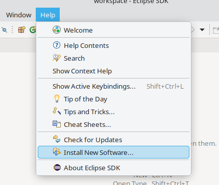
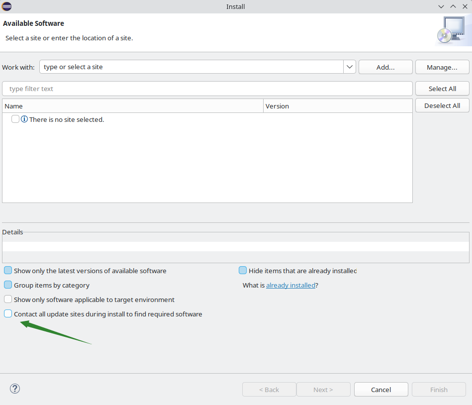
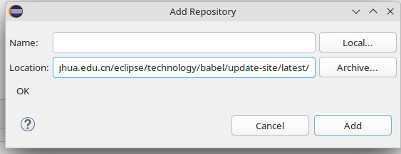
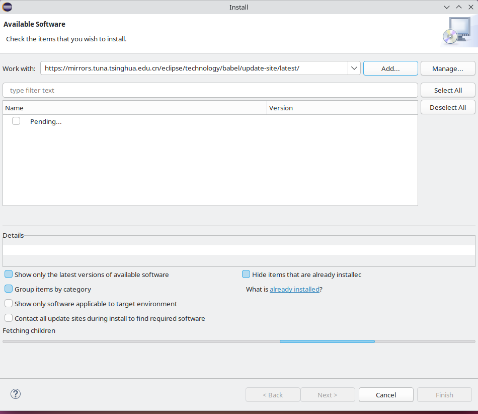
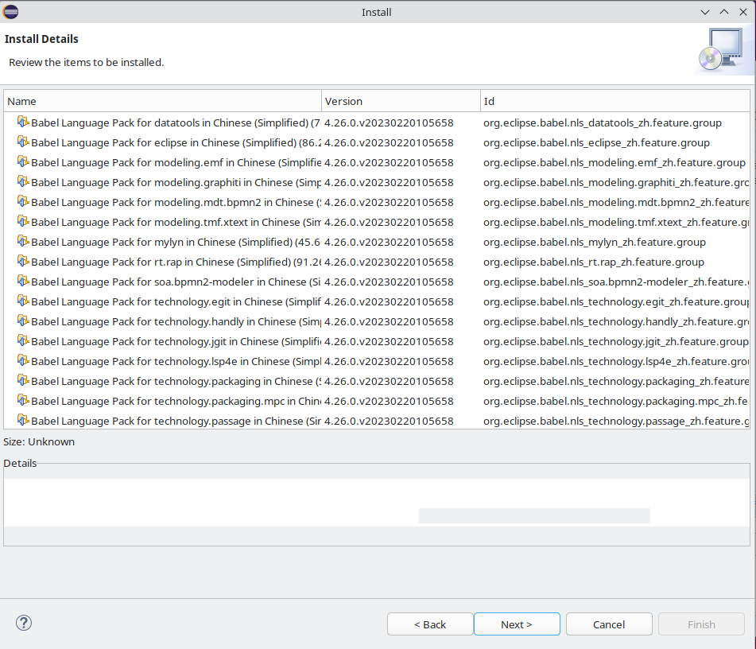

# 24.2 Java 开发环境

Java 作为跨平台编程语言的典范，其理念是“一次编写，到处运行”。

## JDK

参见：FreeBSD Project. java[EB/OL]. [2026-03-26]. <https://www.freebsd.org/java/>. 这是 FreeBSD 官方 Java 开发环境配置指南。FreeBSD Ports 中的默认 Java 版本由 Ports `Mk/bsd.default-versions.mk` 文件中的 `JAVA_DEFAULT` 控制，当前 AMD64 架构的默认值为 OpenJDK 25:

```makefile
# Possible values: 8, 11, 17, 21, 23, 24, 25
.  if ${ARCH:Marmv*} || ${ARCH} == powerpc	# ARMv 系列和 PowerPC 架构使用 Java 11
JAVA_DEFAULT?=		11
.  elif ${ARCH:Mi386}
JAVA_DEFAULT?=		21	# i386 架构使用 Java 21
.  else
JAVA_DEFAULT?=		25	# 其余架构使用 Java 25
.  endif
```

### OpenJDK

搜索名称或描述中包含“jdk”的软件包：

```sh
# pkg search -o jdk
java/bootstrap-openjdk11       Java Development Kit 11
java/bootstrap-openjdk17       Java Development Kit 17
java/bootstrap-openjdk8        Java Development Kit 8
java/openjdk11                 Java Development Kit 11
java/openjdk11-jre             Java Runtime Environment 11
java/openjdk17                 Java Development Kit 17
java/openjdk17-jre             Java Runtime Environment 17
java/openjdk18                 Java Development Kit 18
java/openjdk19                 Java Development Kit 19
java/openjdk20                 Java Development Kit 20
java/openjdk21                 Java Development Kit 21
java/openjdk22                 Java Development Kit 22
java/openjdk23                 Java Development Kit 23
java/openjdk8                  Java Development Kit 8
java/openjdk8-jre              Java Runtime Environment 8
comms/rxtx                     Native interface to serial ports in Java
```

本节以 `java/openjdk23` 为例。

### 安装 OpenJDK 23

使用 pkg 安装 OpenJDK 23：

```sh
# pkg install openjdk23
```

或者使用 ports 安装：

```sh
# cd /usr/ports/java/openjdk23
# make install clean
```

显示已安装 Java 的版本信息：

```sh
# java -version
openjdk version "23.0.2" 2025-01-21
OpenJDK Runtime Environment (build 23.0.2+7-1)
OpenJDK 64-Bit Server VM (build 23.0.2+7-1, mixed mode, sharing)
```

安装完成后尚未配置 `$JAVA_HOME` 环境变量，可使用以下命令查看其当前值：

```sh
# echo $JAVA_HOME

```

查看 OpenJDK 23 安装路径：

```sh
# ls /usr/local/openjdk23/
/usr/local/openjdk23/bin/     /usr/local/openjdk23/include/ /usr/local/openjdk23/lib/
/usr/local/openjdk23/conf/    /usr/local/openjdk23/jmods/   /usr/local/openjdk23/man/
/usr/local/openjdk23/demo/    /usr/local/openjdk23/legal/   /usr/local/openjdk23/release
```

相关文件结构：

```sh
/usr/local/
└── openjdk23/
    ├── bin/ # Java 可执行文件
    ├── include/ # C/C++ 头文件
    ├── lib/ # Java 库文件
    ├── conf/ # 配置文件
    ├── jmods/ # JMOD 模块文件
    ├── man/ # 手册页
    ├── demo/ # 示例程序
    ├── legal/ # 法律文件
    └── release # 发布信息文件
```

### 配置环境变量

请根据 Shell 选择合适的路径。

```sh
~/
├── .bashrc # Bash 配置文件
├── .profile # 通用配置文件
├── .shrc # FreeBSD 默认 sh 配置文件
└── .zshrc # Zsh 配置文件
```

将以下内容写入：

```ini
export JAVA_HOME="/usr/local/openjdk23"          # 设置 JAVA_HOME 环境变量指向 OpenJDK 23 安装路径
export PATH=$JAVA_HOME/bin:$PATH                # 将 JAVA_HOME/bin 添加到 PATH，确保 java 命令可用
```

刷新 shell 环境变量：

```sh
# . ~/.shrc # 重新加载 ~/.shrc 配置文件（注意前面的点表示 source）
# echo $JAVA_HOME	# 显示当前 JAVA_HOME 环境变量值
/usr/local/openjdk23
# echo $PATH	# 显示当前 PATH 环境变量值，包含 JAVA_HOME/bin
/usr/local/openjdk23/bin:/sbin:/bin:/usr/sbin:/usr/bin:/usr/local/sbin:/usr/local/bin:/root/bin
```

## Eclipse

### 安装 Eclipse

使用 pkg 安装：

```sh
# pkg install eclipse
```

或者使用 ports 安装：

```sh
# cd /usr/ports/java/eclipse
# make install clean
```

### 设置中文

点击菜单 `Help`，然后选择 `Install New Software`。



取消勾选 `Contact all update sites during install to find required software`，然后点击 `Add`：



清除 `Location` 原有内容，加入 `<https://mirrors.tuna.tsinghua.edu.cn/eclipse/technology/babel/update-site/latest/>`。再点击 `Add`：



加载中：



勾选 `Babel Language Packs in Chinese (Simplified)`。点击 `Next`。


点击 `Next`。



同意协议：


建议先点击界面底部的任意位置，然后再进行全选，否则可能导致界面卡顿。


重启即可：


#### 参考文献

- ittel. Eclipse 2024.03 安装教程（附中文语言设置教程）[EB/OL]. [2026-03-26]. <https://www.ittel.cn/archives/35394.html>. 提供 Eclipse IDE 安装与中文本地化的详细步骤。

### HelloWorld

点击“创建 Java 项目”，项目名 test。


右键创建一个 `包`，再创建一个 `java 类`，名称 `test`。


在类文件中写入以下代码：

```java
package test;

public class HelloWorld {
	  public static void main(String[] args) {
		    System.out.println("Hello World!");
		  }
}
```

点击绿色三角，即可看到输出。


#### 参考文献

- xxhxs-21. Eclipse 使用配置全面讲解[EB/OL]. [2026-03-26]. <https://www.cnblogs.com/xxhxs-21/articles/16417603.html>. 介绍 Eclipse IDE 的常用配置与开发技巧。

## IntelliJ IDEA

### 安装 IntelliJ IDEA Ultimate

使用 pkg 安装：

```sh
# pkg install intellij-ultimate
```

或者使用 ports 安装：

```sh
# cd /usr/ports/java/intellij-ultimate
# make install clean
```

## 使用

在 FreeBSD 上使用时可能会出现报错“编辑器中的文件不可运行”，而 Windows 版本则正常。该问题已报告为 [Bug 285130 - Port java/intellij-ultimate always shows This file in the editor is not runnable](https://bugs.freebsd.org/bugzilla/show_bug.cgi?id=285130)，记录 IntelliJ IDEA 在 FreeBSD 上的运行问题。

IntelliJ IDEA 社区版可以正常使用，但长期未更新，最新版本仍为 2020.2。

### 故障排除与未竟事宜

#### 提示“the file in the editor is not runnable”

该问题仍待解决。

## 课后习题

1. 配置最新版本的 OpenJDK 开发环境，使用 Eclipse 创建一个简单的 Java Swing 程序并运行，验证中文显示。
2. 分析 IntelliJ IDEA 在 FreeBSD 上文件不可运行的 bug，尝试通过 Ports 构建不同版本复现并定位问题。
3. 比较 OpenJDK 与 OracleJDK 在 FreeBSD 上的性能差异。
