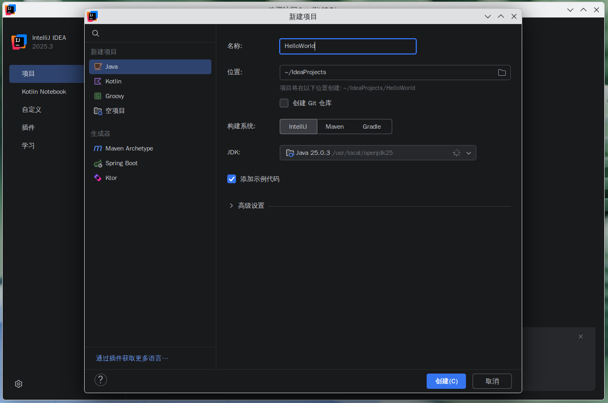
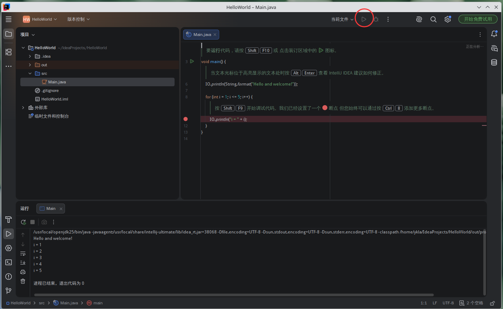
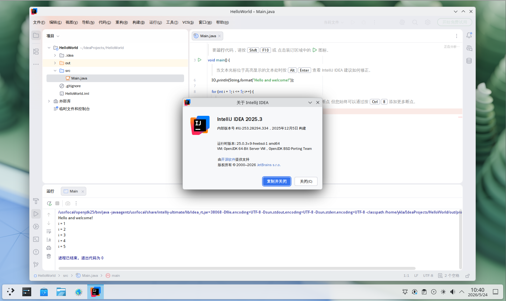

# 24.2 Java 开发环境

FreeBSD Ports 通过 **Mk/bsd.default-versions.mk** 中的 `JAVA_DEFAULT` 控制默认 JDK 版本，当前 AMD64 架构默认值为 OpenJDK 25（LTS）。

可通过 [Oracle Java SE Support Roadmap](https://www.oracle.com/java/technologies/java-se-support-roadmap.html) 获取每个 Java 版本的支持计划。

## JDK

参见：FreeBSD Project. java[EB/OL]. [2026-03-26]. <https://www.freebsd.org/java/>. 这是 FreeBSD 官方 Java 开发环境配置指南。FreeBSD Ports 中的默认 Java 版本由 Ports **Mk/bsd.default-versions.mk** 文件中的 `JAVA_DEFAULT` 控制，当前 AMD64 架构的默认值为 OpenJDK 25:

```makefile
# Possible values: 8, 11, 17, 21, 23, 24, 25
.  if ${ARCH:Marmv*} || ${ARCH} == powerpc	# ARMv 系列和 PowerPC 架构使用 Java 11
JAVA_DEFAULT?=		11
.  elif ${ARCH:Mi386}
JAVA_DEFAULT?=		21	# i386 架构使用 Java 21
.  else
JAVA_DEFAULT?=		25	# 其余架构使用 Java 25
.  endif
```

## OpenJDK

搜索名称或描述中包含“jdk”的软件包：

```sh
# pkg search -o jdk
ykla@ykla:~ $ pkg search -o jdk
java/bootstrap-openjdk11       Java Development Kit 11
java/bootstrap-openjdk17       Java Development Kit 17
java/bootstrap-openjdk8        Java Development Kit 8
java/openjdk11                 Java Development Kit 11
java/openjdk11-jre             Java Runtime Environment 11
java/openjdk17                 Java Development Kit 17
java/openjdk17-jre             Java Runtime Environment 17
java/openjdk21                 Java Development Kit 21
java/openjdk21-jre             Java Runtime Environment 21
java/openjdk24                 Java Development Kit 24
java/openjdk25                 Java Development Kit 25
java/openjdk25                 Java Development Kit (headless version) 25
java/openjdk25                 Java Runtime Environment 25
java/openjdk25                 Java Runtime Environment (headless version) 25
java/openjdk26                 Java Development Kit 26
java/openjdk26                 Java Development Kit (headless version) 26
java/openjdk26                 Java Runtime Environment 26
java/openjdk26                 Java Runtime Environment (headless version) 26
java/openjdk8                  Java Development Kit 8
java/openjdk8-jre              Java Runtime Environment 8
comms/rxtx                     Native interface to serial ports in Java
```

本节以 `java/openjdk25` 为例。

## 安装 OpenJDK 25

使用 pkg 安装 OpenJDK 25：

```sh
# pkg install openjdk25
```

或者使用 Ports 安装：

```sh
# cd /usr/ports/java/openjdk25
# make install clean
```

显示已安装 Java 的版本信息：

```sh
# java -version
openjdk version "25.0.3" 2026-04-21
OpenJDK Runtime Environment (build 25.0.3+9-freebsd-1)
OpenJDK 64-Bit Server VM (build 25.0.3+9-freebsd-1, mixed mode, sharing)
```

安装完成后 `$JAVA_HOME` 环境变量尚未配置，可使用以下命令查看其当前值：

```sh
# echo $JAVA_HOME

```

查看 OpenJDK 25 安装路径：

```sh
# ls /usr/local/openjdk25/
bin	conf	demo	include	jmods	legal	lib	release
```

相关文件结构：

```sh
/usr/local/
└── openjdk25/
    ├── bin/ # Java 可执行文件
    ├── include/ # C/C++ 头文件
    ├── lib/ # Java 库文件
    ├── conf/ # 配置文件
    ├── jmods/ # JMOD 模块文件
    ├── demo/ # 示例程序
    ├── legal/ # 许可证文件
    └── release # 发布信息文件
```

## 配置环境变量

### shell 配置文件

请根据 shell 选择合适的路径。

```sh
~/
├── .bashrc # Bash 配置文件
├── .profile # 通用配置文件
├── .shrc # FreeBSD 默认 sh 配置文件
└── .zshrc # Zsh 配置文件
```

将以下内容写入对应的 shell 配置文件路径：

```ini
export JAVA_HOME="/usr/local/openjdk25"          # 设置 JAVA_HOME 环境变量指向 OpenJDK 25 安装路径
export PATH=$JAVA_HOME/bin:$PATH                # 将 JAVA_HOME/bin 添加到 PATH，确保 java 命令可用
```

### 刷新 shell 环境变量

重新加载 `~/.shrc` 配置文件（注意前面的点 `.` 表示 source）：

```sh
# . ~/.shrc
```

显示当前 JAVA_HOME 环境变量值：

```sh
# echo $JAVA_HOME
/usr/local/openjdk25
```

显示当前 PATH 环境变量值（包含 JAVA_HOME/bin）：

```sh
# echo $PATH
/usr/local/openjdk25/bin:/sbin:/bin:/usr/sbin:/usr/bin:/usr/local/sbin:/usr/local/bin:/home/ykla/bin
```

## Eclipse

Eclipse 是一款开放且可扩展的集成开发环境（IDE），适用于多种开发场景。它提供了构建和运行集成软件开发工具的基础模块与平台，支持工具开发者独立开发并与其他工具集成。

### 安装 Eclipse

使用 pkg 安装：

```sh
# pkg install eclipse
```

或者使用 ports 安装：

```sh
# cd /usr/ports/java/eclipse
# make install clean
```

### 启动 Eclipse

点击菜单中的“Eclipse”栏启动 Eclipse：


设置默认工作区：


### 中文环境

点击菜单 `Help`，随后选择 `Install New Software`。


取消勾选 `Contact all update sites during install to find required software`：


随后点击 `Add`：清除 `Location` 原有内容，加入 <https://mirrors.tuna.tsinghua.edu.cn/eclipse/technology/babel/update-site/latest/>。再点击 `Add`：


加载中：


勾选 `Babel Language Packs in Chinese (Simplified)`。点击 `Next`。


点击 `Next`。


同意协议：


建议先点击界面底部的任意位置，再进行全选，否则可能导致界面响应迟缓。


重启后即可生效：


### 为美好世界献上祝福

点击“创建 Java 项目”，项目名 test。


右键新建一个包，再新建一个 Java 类，名称设为 `TEST`。


在类文件中写入以下代码：

```java
package test;

public class TEST {
	  public static void main(String[] args) {
		    System.out.println("Hello World!");
		  }
}
```

点击运行按钮，可查看输出。


### 参考文献

- xxhxs-21. Eclipse 使用配置全面讲解[EB/OL]. [2026-03-26]. <https://www.cnblogs.com/xxhxs-21/articles/16417603.html>. 介绍 Eclipse IDE 的常用配置与开发技巧。
- ittel. Eclipse 2024.03 安装教程（附中文语言设置教程）[EB/OL]. [2026-03-26]. <https://www.ittel.cn/archives/35394.html>. 提供 Eclipse IDE 安装与中文本地化的详细步骤。

## IntelliJ IDEA

IntelliJ IDEA 自 2025.3 起不再区分社区版与旗舰版（Ultimate），合并为统一产品。FreeBSD Ports 中的 `intellij-ultimate` 当前版本为 2025.3，已与上游同步。

### 安装 IntelliJ IDEA

使用 pkg 安装：

```sh
# pkg install intellij-ultimate
```

或者使用 ports 安装：

```sh
# cd /usr/ports/java/intellij-ultimate
# make install clean
```

## 启动 IntelliJ IDEA

点击菜单中的“IntelliJ IDEA Ultimate Edition”栏启动 IntelliJ IDEA：


设置语言和区域：


接受用户协议：


根据需要选择发送或不发送匿名统计信息：


IntelliJ IDEA 主界面：


### 为美好世界献上祝福

点击“新建项目”，“名称”写入“HelloWorld”：



IDE 将自动填充部分代码，点击顶部工具栏的运行按钮即可运行：



可在“设置”→“主题...”中修改主题：


