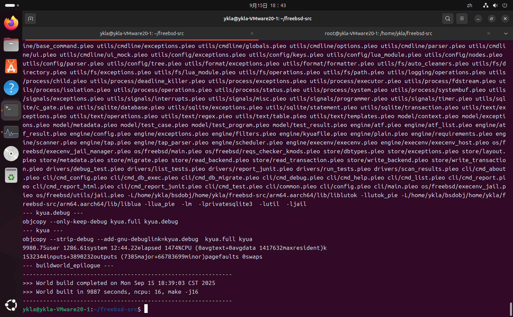
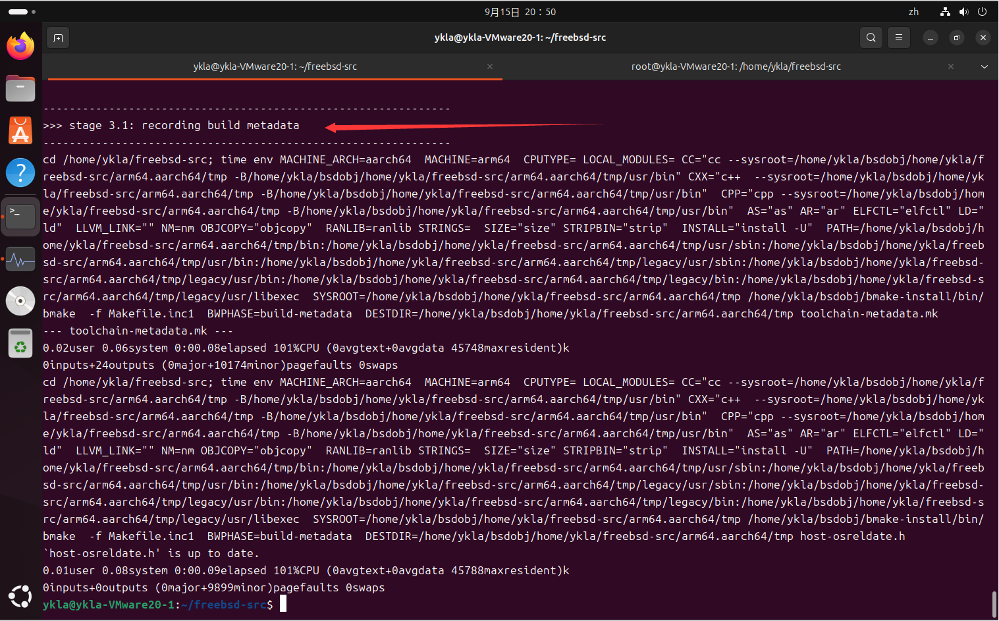
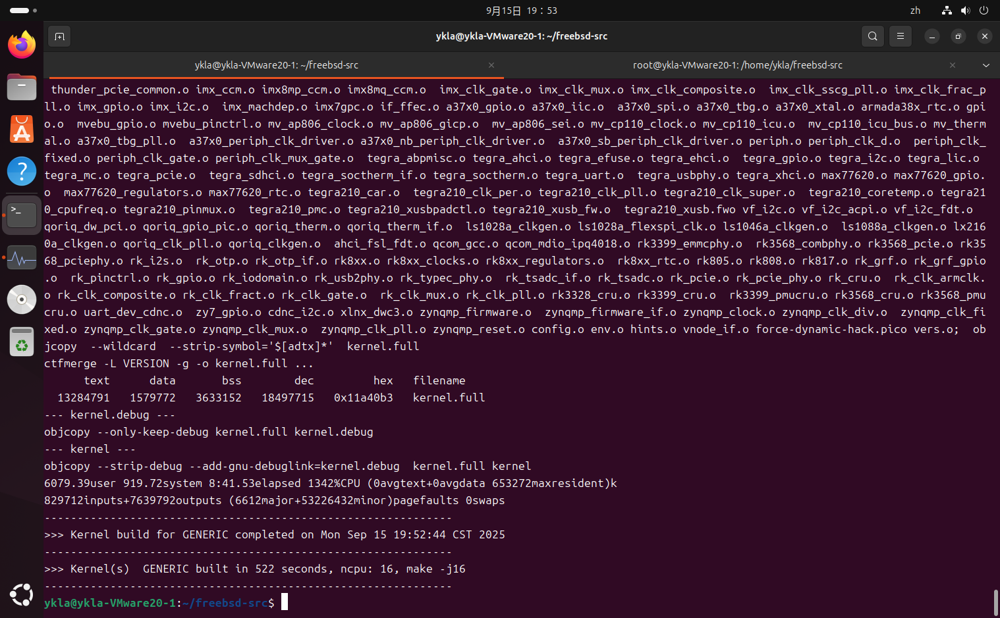
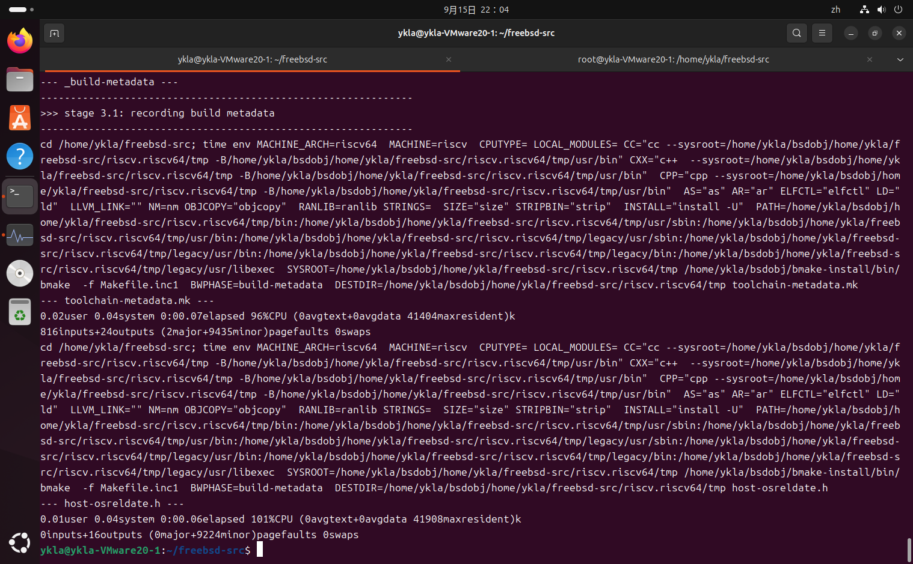
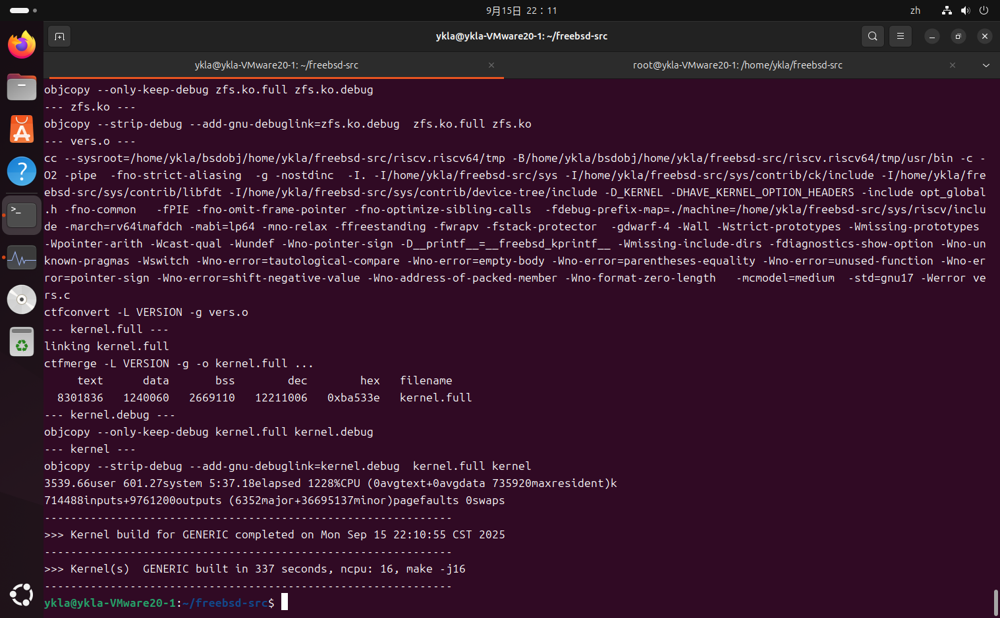

# 24.5 在 Linux 系统上交叉构建 FreeBSD

## 设备环境

- Ubuntu 24.04 LTS
- 内存建议不低于 12G
- Swap 建议 16G

## 安装软件包

```sh
# apt update # 刷新软件源，部分用户可能需要换源
# apt install git build-essential libbz2-dev libarchive-dev libssl-dev flex # 安装构建所需软件包和库
```

## 禁用息屏

“设置” ——> “电源” ——> “节电选项”。然后将选项“息屏”设置为“从不”。

## 禁用 systemd-oomd

自 Ubuntu 22.04 LTS（Desktop）以降，系统默认启用了 systemd-oomd 这一服务，该服务会在系统达到某阈值时强制结束当前高占用的进程，导致构建失败。且这一动作不会有任何提示信息告知用户。

- 禁用 systemd-oomd 自启，并立刻中止

```sh
# systemctl mask --now systemd-oomd systemd-oomd.socket
```

- 检查 systemd-oomd 的运行状态

```sh
# systemctl status systemd-oomd systemd-oomd.socket
○ systemd-oomd.service # 注意此处，应为黑框圆圈，代表正常。如果为绿色说明服务正在运行
     Loaded: masked (Reason: Unit systemd-oomd.service is masked.)
     Active: inactive (dead) since Mon 2025-09-15 16:08:39 CST; 4h 17min ago
   Duration: 2min 18.952s
   Main PID: 170032 (code=exited, status=0/SUCCESS)
     Status: "Shutting down..."
        CPU: 217ms

9月 15 16:06:20 ykla-VMware20-1 systemd[1]: Starting systemd-oomd.service - Userspace Out-Of-Memory (OOM) Killer...
9月 15 16:06:20 ykla-VMware20-1 systemd[1]: Started systemd-oomd.service - Userspace Out-Of-Memory (OOM) Killer.
9月 15 16:08:39 ykla-VMware20-1 systemd[1]: Stopping systemd-oomd.service - Userspace Out-Of-Memory (OOM) Killer...
9月 15 16:08:39 ykla-VMware20-1 systemd[1]: systemd-oomd.service: Deactivated successfully.
9月 15 16:08:39 ykla-VMware20-1 systemd[1]: Stopped systemd-oomd.service - Userspace Out-Of-Memory (OOM) Killer.

○ systemd-oomd.socket # 注意此处，应为黑框圆圈，代表正常。如果为绿色说明服务正在运行
     Loaded: masked (Reason: Unit systemd-oomd.socket is masked.)
     Active: inactive (dead)

……省略一部分日志输出……
```


## 创建放置构建产物的目录

```sh
$ mkdir -p /home/ykla/bsdobj 
```

## 使用 git 拉取 FreeBSD 源代码

```sh
$ cd /home/ykla # 切换到用户主目录
$ git clone --depth 1 https://git.FreeBSD.org/src.git # 拉取源码
```

拉取完成后，源代码应位于 `/home/ykla/freebsd-src`（`freebsd-src` 是 git 自动创建的）。

## 构建工具链与世界（用户空间）

```sh
$ cd /home/ykla/freebsd-src # 切换到源码根目录下
$ MAKEOBJDIRPREFIX=/home/ykla/bsdobj tools/build/make.py --bootstrap-toolchain -j16 TARGET=arm64 TARGET_ARCH=aarch64 WITH_LLVM_TARGET_AARCH64=yes WITH_LLVM_TARGET_ARM=yes WITHOUT_LIB32=yes buildworld # 虽然很长，但这是一行！下同。
```

注释：

| 项目                                     | 说明                           |
| -------------------------------------- | ---------------------------- |
| **MAKEOBJDIRPREFIX=/home/ykla/bsdobj** | 指定所有构建产物的输出的目录     |
| **tools/build/make.py**                | 在非 FreeBSD 机器上启动构建流程的官方脚本所在   |
| **--bootstrap-toolchain**              | 用源码树里的 LLVM/Clang/LLD 自举工具链，而非通过 apt 安装，使之更接近原生构建 |
| **-j16**                               | 启用 16 个并行任务编译。一般采用内核线程数，如 4 线程即 `-j4`      |
| **TARGET=arm64**                       | 目标平台设为 arm64           |
| **TARGET\_ARCH=aarch64**               | 目标 CPU 架构设为 aarch64         |
| **WITH\_LLVM\_TARGET\_AARCH64=yes**    | 启用 LLVM 的 AArch64 后端     |
| **WITH\_LLVM\_TARGET\_ARM=yes**        | 启用 LLVM 的 ARM 后端         |
| **WITHOUT\_LIB32=yes**                 | 禁用 32 位兼容库和相关组件，因为笔者测试未通过             |
| **buildworld**                         | 构建 FreeBSD 用户空间（world）      |


验证：



## 构建内核工具链

```sh
$ cd /home/ykla/freebsd-src # 确保你仍在该路径下
$ MAKEOBJDIRPREFIX=/home/ykla/bsdobj tools/build/make.py --bootstrap-toolchain -j16 TARGET=arm64 TARGET_ARCH=aarch64 WITH_LLVM_TARGET_AARCH64=yes WITH_LLVM_TARGET_ARM=yes WITHOUT_LIB32=yes kernel-toolchain
```

除了末尾的 `kernel-toolchain` 有变化，其他选项参数均一致。

验证：



## 构建内核

```sh
$ cd /home/ykla/freebsd-src # 确保你仍在该路径下
$ MAKEOBJDIRPREFIX=/home/ykla/bsdobj tools/build/make.py --bootstrap-toolchain -j16 TARGET=arm64 TARGET_ARCH=aarch64 WITH_LLVM_TARGET_AARCH64=yes WITH_LLVM_TARGET_ARM=yes WITHOUT_LIB32=yes buildkernel
```

除了末尾的 `buildkernel` 有变化，其他选项参数均一致。

验证：



## 附录：RISC-V 64

- 内核工具链

```sh
$ MAKEOBJDIRPREFIX=/home/ykla/bsdobj tools/build/make.py --bootstrap-toolchain TRY_GCC_BROKEN=yes  -j16 TARGET=riscv TARGET_ARCH=riscv64  kernel-toolchain
```

验证：



- 内核

```
$ MAKEOBJDIRPREFIX=/home/ykla/bsdobj tools/build/make.py --bootstrap-toolchain TRY_GCC_BROKEN=yes  -j16 TARGET=riscv TARGET_ARCH=riscv64  buildkernel
```

验证：



## 故障排除与未竟事宜

### 基于 Archlinux 构建 FreeBSD

要在 Arch 上编译，需要设置临时环境变量：

```sh
$ export CFLAGS="-DSTRERROR_R_CHAR_P=1"
```

否则会卡在 krb5。这是由于 glibc 同时支持 POSIX 以及 GNU 导致的。

除此外，你必须保证 hostname 命令有输出，且命令本身存在。还必须安装 `time` 等软件包。

### 32 位构建的问题

15.0 已经不再支持 32 位。

### Ubuntu 原生的 LLVM 工具链

待测试

### 构建更多体系结构（如 amd64）

待解决

## 参考文献

- [Jammy Jellyfish Release Notes](https://discourse.ubuntu.com/t/jammy-jellyfish-release-notes/24668)，Ubuntu 22.04 LTS 发行说明，参见 systemd v249.11 这一小节。
- [FreeBSD 手册](https://docs.freebsd.org/en/books/handbook/cutting-edge/#building-on-non-freebsd-hosts)，26.9. Building on non-FreeBSD Hosts，只提供了基本思路，参考价值有限
- [Building on non-FreeBSD hosts](https://wiki.freebsd.org/BuildingOnNonFreeBSD)，只提供了基本思路，参考价值有限
- [man src.conf](https://man.freebsd.org/cgi/man.cgi?src.conf)，构建参数参考此处
