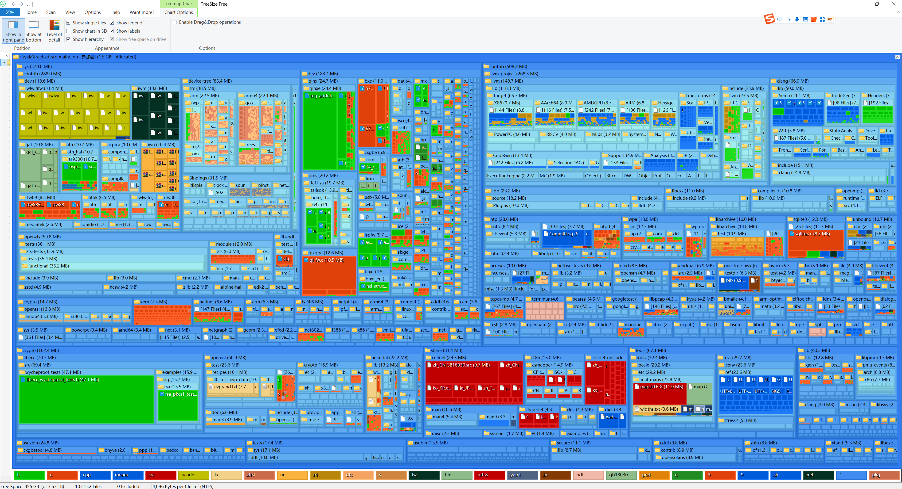
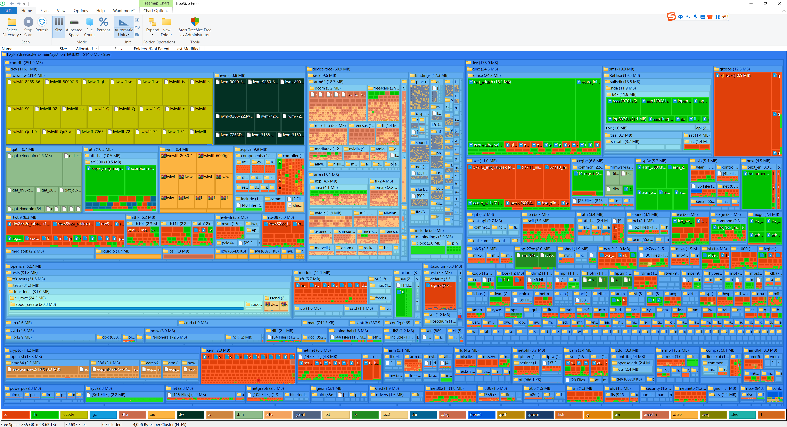
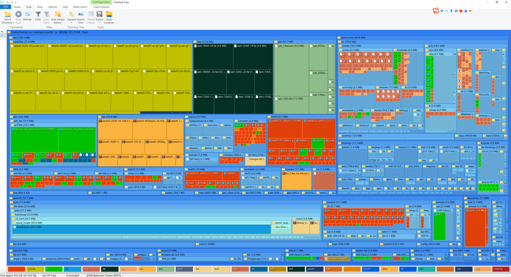

# 24.6 FreeBSD 源代码目录结构

## FreeBSD src 目录结构



图片由 [treesize_free](https://www.jam-software.com/treesize_free ) 生成。


```sh
\freebsd-src-main\
├── .arcconfig Phabricator 是 FreeBSD 的代码审查工具，这是其配置文件
├── .arclint Lint 检查用
├── .cirrus-ci Cirrus CI 指定了安装 pkg 的脚本，CI 用
├── .cirrus.yml Cirrus CI 配置文件
├── .clang-format  ClangFormat 工具的配置文件，设置了代码风格
├── .git-blame-ignore-revs Git 配置文件，它用于忽略特定提交（如代码格式化）的影响
├── .gitattributes 指定 Git 在 git diff 时使用特定的差异比较方式
├── .github Github 相关配置。提交模板、工作流、代码维护者
├── .gitignore 使 git 忽略相关文件，不提交诸如日志、编译产物、临时文件等
├── .mailmap 用于将作者（author）和提交者（committer）的姓名及电子邮件地址映射到规范化的真实姓名和电子邮件地址。
├── CONTRIBUTING.md Github 贡献指南
├── COPYRIGHT 版权说明
├── LOCKS 本文件记录了已由核心团队批准的代码审核要求
├── MAINTAINERS 关于 FreeBSD 维护者流程和职责（建议性）
├── Makefile 用于定义项目的构建过程
├── Makefile.inc1 用于在构建过程中设置和管理各种环境变量、工具路径和配置选项。
├── Makefile.libcompat 用于兼容性库的 Makefile，其主要目的是在某些 64 位架构上提供 32 位兼容库。
├── Makefile.sys.inc 在构建过程中某些文件被包含的顺序，以及在此阶段应注意的事项。
├── ObsoleteFiles.inc 该文件用于列出需要在系统更新后删除的过时文件、库和目录，以保持系统的整洁和安全。
├── README.md 阅读我，说明文件
├── RELNOTES FreeBSD 15.0 发行说明
├── UPDATING FreeBSD-CURRENT 重大变动说明
├── bin 系统命令和用户命令
├── cddl 各种在通用开发与发行许可（CDDL）下的命令和库，比如 ZFS
├── contrib 第三方软件
├── crypto 用于存放加密相关的源代码。crypto 和 contrib 目录的分离源于美国早期的出口管制法律，这些法律将加密源代码视为受限技术，因此需要将其与其他源代码分开存放。
├── etc /etc 模板
├── gnu GPL 和 LGPL 授权的软件
├── include 系统 include 文件
├── kerberos5 Heimdal Kerberos5 实现的 FreeBSD 软件
├── lib 系统库 
├── libexec 系统守护进程（daemons）
├── release 构建 iso、img 及虚拟机/云平台镜像的工具链
├── rescue 构建静态链接的 /rescue 工具的构建系统
├── sbin 系统命令
├── secure 加密库和命令
├── share 共享资源
├── stand Boot loader 源代码
├── sys 内核源码
├── targets 支持实验性的 DIRDEPS_BUILD
├── tests 可以通过 Kyua 运行的回归测试
├── tools 用于回归测试和其他杂项任务的工具
├── usr.bin 用户命令
└── usr.sbin 系统管理员命令
```

## FreeBSD 内核源代码目录结构





```sh
\freebsd-src-main\sys
├── Makefile  用于定义项目的构建过程
├── README.md 阅读我，说明文件
├── amd64 x86-64 架构支持
├── arm 32 位 arm 架构支持
├── arm64 64 位 arm 架构支持
├── bsm OpenBSM，开源的审计框架
├── cam Common Access Method（CAM）通用访问方法。包含 cam(4) 和 ctl(4)
├── cddl CDDL 许可证下的源代码，如 DTrace
├── compat Linux 兼容层、FreeBSD 32 位兼容性
├── conf 内核构建粘合层
├── contrib 第三方软件，如 OpenZFS、zstd(1)
│   └── dev 包含一些无线网卡驱动，如 iwlwifi(4)、rtw88(4)、rtw89(4)、ath10k、ath11k、ath12k、rtwn(4) 等
├── crypto 加密驱动程序
├── ddb 交互式内核调试器 ddb(4)
├── dev 设备驱动程序和其他架构无关代码，如 iscsi(4)、iwx(4)、iwm(4)、xz(1)
├── dts Device Tree Source 设备树源码
├── fs 除了 UFS、NFS、ZFS 以外的文件系统
├── gdb 内核远程 GDB 存根 gdb(4)
├── geom GEOM 框架 geom(4)
├── gnu GPL 和 LGPL 授权的软件，目前仅剩 bwn(4)、支持和实现 GCC 的 gcov 功能
├── i386 32 位 X86 架构支持
├── isa 工业标准结构（Industry Standard Architecture）ISA 总线相关
├── kern 内核主要部分
├── kgssapi GSSAPI 相关文件、含 Kerberos 5
├── libkern 为内核提供的类似 libc 的函数和其他支持功能
├── modules 内核模块基础设施
├── net 核心网络代码
├── net80211 无线网络（IEEE 802.11）net80211(4)
├── netgraph 基于图的网络子系统 netgraph(4)
├── netinet IPv4 协议实现 inet(4)
├── netinet6 IPv6 协议实现 inet(6)
├── netipsec IPsec 协议实现 ipsec(4)
├── netlink Netlink 套接字实现（RFC 3549）
├── netpfil 包过滤器：ipfw(4)、pf(4)、ipfilter(4) 实现
├── netsmb SMB 协议实现
├── nfs NFS 网络文件系统（Network File System）
├── nfsclient NFS 客户端
├── nfsserver NFS 服务器
├── nlm Network Lock Manager（NLM） 协议，NFS 用
├── ofed OFED（OpenFabrics Enterprise Distribution）相关
├── opencrypto OpenCrypto 框架 crypto(7)
├── powerpc PowerPC/POWER (32、64 位）架构支持
├── riscv 64 位 RISC-V 支持
├── rpc 远程过程调用（Remote Procedure Call，RPC）相关
├── security 安全功能 audit(4) 和 mac(4)
├── sys 内核头文件
├── teken  终端仿真器（Terminal Emulator） 相关
├── tests 内核单元测试
├── tools 内核构建和开发相关的工具和脚本
├── ufs UFS 文件系统 ffs(4)
├── vm 虚拟内存系统
├── x86 x86-64 和 i386 架构共享的代码。
├── xdr 外部数据表示（External Data Representation，XDR） 相关，RPC 用
└── xen 开放源代码虚拟机监视器 xen(4)
```
