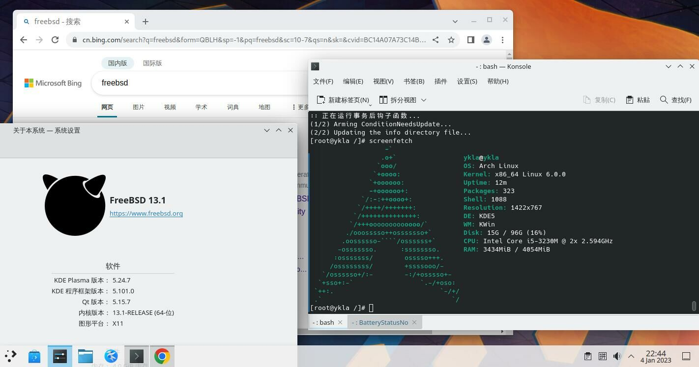
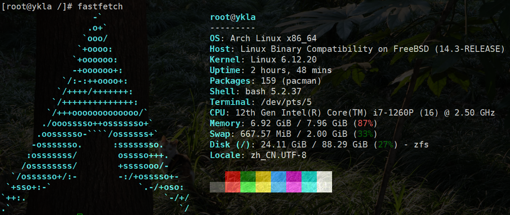

# 24.4 Arch Linux 兼容层（基于 Arch Linux bootstrap）

Arch Linux 兼容层基于 Arch bootstrap 镜像构建。当前存在 Bash/Zsh 在 chroot 后无终端输出（termios2 ioctls 未实现，FreeBSD 15.0-STABLE 已修复）。本节给出构建脚本。

> **注意**
>
> 在完成兼容层构建并执行 chroot 进入环境后，终端界面可能看似无响应；Bash 进程虽未产生输出，但仍可正常接收输入并执行命令。即使将默认 Shell 切换至 Zsh，该现象仍然存在，且 TTY 终端会报告错误：`linux: jid 0 pid 1154 (bash): linux_ioctl_fallback fd=0, cmd=0x802c542a ('T',42) is not implemented`。

根据 FreeBSD 源代码仓库中的相关提交记录 [linux: support termios2 ioctls](https://github.com/freebsd/freebsd-src/pull/1949)，该 bug 已在 FreeBSD 15.0-STABLE 版本中得到修复。

视频教程：[07-FreeBSD-Arch Linux 兼容层脚本使用说明](https://www.bilibili.com/video/BV1wg4y1w7QV)





Arch Linux 兼容层占用的系统资源略高于 Ubuntu 兼容层，这是由于 Google Chrome 浏览器在后台运行所致。

## 构建基本系统

构建 Arch Linux 兼容层需要先处理必要的服务项和设置。

### 处理所需服务项

#### Linux 服务项

```sh
# service linux enable   # 设置 Linux 兼容层服务开机自启
# service linux start    # 启动 Linux 兼容层服务
```

##### D-Bus

桌面环境通常已配置 D-Bus 服务。若未安装，请先安装 D-Bus。

设置 D-Bus 服务开机自启：

```sh
# service dbus enable
```

启动 D-Bus 服务：

```sh
# service dbus start
```

### 调整 Linux 兼容层默认内核版本

对于滚动发行版，Linux 兼容层的默认内核版本通常较低。若直接构建，Arch Linux 兼容层在 chroot 时会报错 `FATAL: kernel too old`。因此，需要将 Linux 兼容层的内核版本调整为 6.12.63（或其他较高版本）。

- 查看当前 Linux 兼容层的内核版本：

```sh
# sysctl compat.linux.osrelease
compat.linux.osrelease: 5.15.0
```

> **注意**
>
> 必须先启动 `linux` 服务才能查看当前的 Linux 内核版本。

- 将其调整到较新的版本号（参见：Kernel.org. The Linux Kernel Archives[EB/OL]. [2026-03-26]. <https://www.kernel.org/>. 可获得所需版本号）：

```sh
# echo "compat.linux.osrelease=6.12.63" >> /etc/sysctl.conf   # 将 Linux 兼容内核版本写入 sysctl 配置文件，实现持久化
# sysctl compat.linux.osrelease=6.12.63                      # 立即生效设置，无需重启
```

### 安装自举系统

```sh
# mkdir -p /compat/arch   # 创建挂载 Linux 系统的目录
# fetch https://ftp.sjtu.edu.cn/archlinux/iso/latest/archlinux-bootstrap-x86_64.tar.zst   # 下载 Arch Linux bootstrap 压缩包
# tar --use-compress-program=unzstd -xpvf archlinux-bootstrap-x86_64.tar.zst --strip-components=1 -C /compat/arch --numeric-owner   # 解压压缩包到 /compat/arch：同时保持原有 GID 和 UID。若出现 tar 报错通常可忽略
```

`--strip-components=1` 即在解压 `archlinux-bootstrap-x86_64.tar.zst` 文件时去掉外层路径 `root.x86_64`，直接解压到指定路径中。

## 挂载文件系统

将 `nullfs_load="YES"` 写入 **/boot/loader.conf** 文件（如需立刻生效，可使用 `kldload nullfs`）。

将以下内容添加到 **/etc/fstab** 文件中：

```sh
devfs           /compat/arch/dev      devfs           rw,late                      0       0
tmpfs           /compat/arch/dev/shm  tmpfs           rw,late,size=1g,mode=1777    0       0
fdescfs         /compat/arch/dev/fd   fdescfs         rw,late,linrdlnk             0       0
linprocfs       /compat/arch/proc     linprocfs       rw,late                      0       0
linsysfs        /compat/arch/sys      linsysfs        rw,late                      0       0
/tmp            /compat/arch/tmp      nullfs          rw,late                      0       0
```

加入后的 **/etc/fstab** 文件示例（**请勿复制粘贴下方代码**）：

```sh
# Device                Mountpoint      FStype  Options         Dump    Pass#
/dev/gpt/efiboot0               /boot/efi       msdosfs rw              2       2
/dev/nda0p2             none    swap    sw              0       0
devfs           /compat/arch/dev      devfs           rw,late                      0       0
tmpfs           /compat/arch/dev/shm  tmpfs           rw,late,size=1g,mode=1777    0       0
fdescfs         /compat/arch/dev/fd   fdescfs         rw,late,linrdlnk             0       0
linprocfs       /compat/arch/proc     linprocfs       rw,late                      0       0
linsysfs        /compat/arch/sys      linsysfs        rw,late                      0       0
/tmp            /compat/arch/tmp      nullfs          rw,late                      0       0
```

> **警告**
>
> 请严格遵照上面的操作，否则将需要进入急救模式！

检查挂载过程中是否有报错：

```sh
# mount -al
```

挂载 **/etc/fstab** 文件中所有未挂载的文件系统。

## 基本配置

### 初始化 pacman 密钥环

```sh
# cp /etc/resolv.conf /compat/arch/etc/   # 在 FreeBSD 中将 DNS 配置复制到 Arch 兼容层
# chroot /compat/arch /bin/bash           # 切换到 Arch 兼容层环境
# pacman-key --init                        # 初始化 pacman 密钥环
# pacman-key --populate archlinux          # 导入 Arch Linux 官方密钥
```

### 切换软件源

由于新安装的 Arch 未安装文本编辑器，需要在 FreeBSD 中编辑相关文件，设置 Arch Linux 的 pacman 使用清华大学镜像源：

```sh
# ee /compat/arch/etc/pacman.d/mirrorlist # 此时位于 FreeBSD！将下行添加至文件顶部。

Server = https://mirrors.tuna.tsinghua.edu.cn/archlinux/$repo/os/$arch
```

### 启用 DisableSandbox

需要为 pacman 启用 DisableSandbox，否则将触发错误 `error: restricting filesystem access failed because landlock is not supported by the kernel!`，因为 FreeBSD 未实现此沙盒。

在 pacman.conf 文件中取消 DisableSandbox 选项的注释：

```sh
# sed -E -i '' 's/^[[:space:]]*#[[:space:]]*DisableSandbox/DisableSandbox/' /compat/arch/etc/pacman.conf
```

检查是否启用成功，在 pacman.conf 中查找 DisableSandbox 所在行及行号：

```sh
# grep -n 'DisableSandbox' /compat/arch/etc/pacman.conf
```

使用 pacman 安装基本系统、开发工具、文本编辑器 nano、AUR 助手 yay 以及文泉驿字体 wqy-zenhei：

```sh
# pacman -S base base-devel nano yay wqy-zenhei
```

#### 参考文献

- Arch Linux Project. pacman.conf(5)[EB/OL]. [2026-03-25]. <https://man.archlinux.org/man/pacman.conf.5.en>. 指出“在 Linux 系统上，禁用为下载文件进程应用默认的 sandbox。当因当前 Linux 内核不支持该特性而导致下载文件时出现 landlock 相关失败时，这会很有用。” 该文档系统说明 pacman 配置项 DisableSandbox 的用途，为本章节配置提供官方技术依据。

#### archlinuxcn 源配置

配置 Arch Linux CN 仓库使用清华大学镜像：

```sh
# nano /etc/pacman.conf # 将下两行添加至文件底部。

[archlinuxcn]
Server = https://mirrors.tuna.tsinghua.edu.cn/archlinuxcn/$arch
```

安装 Arch Linux CN 仓库密钥环：

```sh
# pacman -S archlinuxcn-keyring
```

> **技巧**
>
> 在 `==> Locally signing trusted keys in keyring...` 这一步可能需要十分钟或更长时间。请耐心等待。

由于 yay 及其他用于安装 AUR 的软件禁止以 root 用户直接操作，因此需要在 chroot 中创建一个具有普通权限的新用户（经验证，FreeBSD 中现有普通用户不适用于此场景）。

创建用户 test，并加入 wheel 组，同时创建用户主目录：

```sh
# useradd -G wheel -m test
```

使用文本编辑器编辑 sudoers 文件 **/etc/sudoers**，配置用户权限（若有红色警告请忽略）：

删除 `# %wheel ALL=(ALL) ALL` 前的注释符号 `#`。

删除 `# %sudo ALL=(ALL:ALL) ALL` 前的注释符号 `#`。

卸载 fakeroot 并安装 fakeroot-tcp，否则无法使用 AUR。

该 bug 见 [Problem with fakeroot and qemu](https://archlinuxarm.org/forum/viewtopic.php?t=14466)。

使用 pacman 安装 fakeroot-tcp 工具：

```sh
# pacman -S fakeroot-tcp # 会询问是否卸载 fakeroot，请确认并卸载。
```

> **技巧**
>
> 若为用户 `test` 设置了密码后仍提示密码错误，需打开一个新终端，执行 `reboot` 命令重启 FreeBSD，然后继续操作。

### 区域设置

> **提示**
>
> 如果不进行此设置，Arch Linux 的图形化程序将无法使用中文输入法。

编辑 **/etc/locale.gen** 文件，将 `zh_CN.UTF-8 UTF-8` 前面的注释 `#` 删掉。

生成系统本地化语言环境：

```sh
# locale-gen
```

## Shell 脚本

脚本内容如下：

```sh
#!/bin/sh                                                 # 指定脚本使用的 shell

rootdir=/compat/arch                                     # 定义 Arch 兼容层根目录
url="https://ftp.sjtu.edu.cn/archlinux/iso/latest/archlinux-bootstrap-x86_64.tar.zst"  # Arch Linux bootstrap 下载地址

echo "Starting Arch Linux installation..."                   # 输出安装开始信息
echo "check modules ..."                                 # 输出模块检查信息

# 检查 linux 模块
if [ "$(sysrc -n linux_enable)" = "NO" ]; then          # 检查 Linux 内核模块是否启用
        echo "linux module should be loaded. Continue? (Y|n)"  # 提示是否继续
        read answer                                     # 读取用户输入
        case $answer in                                 # 处理用户选择
                [Nn][Oo]|[Nn])
                        echo "linux module not loaded" # 提示模块未加载
                        exit 1                         # 退出脚本
                        ;;
                [Yy][Ee][Ss]|[Yy]|"")
                        sysrc linux_enable=YES         # 启用 Linux 内核模块
                        ;;
        esac
fi
echo "start linux"                                       # 输出启动 Linux 信息
service linux start                                      # 启动 Linux 内核模块

# 检查 dbus
if ! /usr/bin/which -s dbus-daemon;then                 # 检查 dbus-daemon 是否存在
        echo "dbus-daemon not found. Install it [Y|n]"  # 提示安装 dbus
        read  answer                                    # 读取用户输入
        case $answer in
            [Nn][Oo]|[Nn])
                echo "dbus not installed"               # 提示未安装 dbus
                exit 2                                  # 退出脚本
                ;;
            [Yy][Ee][Ss]|[Yy]|"")
                pkg install -y dbus                     # 安装 dbus
                ;;
        esac
    fi

if [ "$(sysrc -n dbus_enable)" != "YES" ]; then         # 检查 dbus 服务是否启用
        echo "dbus should be enabled. Continue? (Y|n)"  # 提示是否启用
        read answer                                     # 读取用户输入
        case $answer in
            [Nn][Oo]|[Nn])
                        echo "dbus not running"        # 提示 dbus 未运行
                        exit 2                          # 退出脚本
                        ;;
            [Yy][Ee][Ss]|[Yy]|"")
                        service dbus enable             # 启用 dbus 服务开机自启
                        ;;
        esac
fi
echo "start dbus"                                        # 输出启动 dbus 信息
service dbus start                                       # 启动 dbus 服务

echo "now we will bootstrap Arch Linux"                  # 输出 bootstrap 开始信息

fetch ${url}                                             # 下载 Arch Linux bootstrap 压缩包
mkdir -p ${rootdir}                                           # 创建挂载目录
tar --use-compress-program=unzstd -xpvf archlinux-bootstrap-x86_64.tar.zst --strip-components=1 -C ${rootdir} --numeric-owner  # 解压压缩包
rm archlinux-bootstrap-x86_64.tar.zst                  # 删除压缩包

if [ ! "$(sysrc -f /boot/loader.conf -qn nullfs_load)" = "YES" ]; then  # 检查 nullfs 是否加载
        echo "nullfs_load should load. Continue? (Y|n)"  # 提示是否继续
        read answer                                     # 读取用户输入
        case $answer in
            [Nn][Oo]|[Nn])
                echo "nullfs is not loaded"                  # 提示未加载
		exit 3                                      # 退出脚本
                ;;
            [Yy][Ee][Ss]|[Yy]|"")
                sysrc -f /boot/loader.conf nullfs_load=yes  # 设置 nullfs 开机自启
                ;;
        esac
fi

if ! kldstat -n nullfs >/dev/null 2>&1;then            # 检查 nullfs 模块是否已加载
        echo "load nullfs module"                      # 输出加载信息
        kldload -v nullfs                               # 加载 nullfs 模块
fi

echo "mount some fs for linux"                         # 输出挂载文件系统信息
echo "devfs ${rootdir}/dev devfs rw,late 0 0" >> /etc/fstab        # devfs 挂载
echo "tmpfs ${rootdir}/dev/shm tmpfs rw,late,size=1g,mode=1777 0 0" >> /etc/fstab  # tmpfs 挂载
echo "fdescfs ${rootdir}/dev/fd fdescfs rw,late,linrdlnk 0 0" >> /etc/fstab        # fdescfs 挂载
echo "linprocfs ${rootdir}/proc linprocfs rw,late 0 0" >> /etc/fstab               # linprocfs 挂载
echo "linsysfs ${rootdir}/sys linsysfs rw,late 0 0" >> /etc/fstab                  # linsysfs 挂载
echo "/tmp ${rootdir}/tmp nullfs rw,late 0 0" >> /etc/fstab                         # /tmp 挂载
#echo "/home ${rootdir}/home nullfs rw,late 0 0" >> /etc/fstab                     # /home 挂载，可选
mount -al                                               # 挂载 fstab 中所有文件系统

echo "For Arch Linux, we should change 'compat.linux.osrelease'. Continue? (Y|n)"  # 提示修改 Linux 内核版本
read answer                                             # 读取用户输入
case $answer in
	[Nn][Oo]|[Nn])
		echo "close to success"                        # 提示跳过修改
		exit 4
		;;
	[Yy][Ee][Ss]|[Yy]|"")
		echo "compat.linux.osrelease=6.12.63" >> /etc/sysctl.conf  # 持久化设置 Linux 内核版本
		sysctl compat.linux.osrelease=6.12.63                     # 立即生效
                ;;
esac
echo "complete!"                                        # 提示完成
echo "to use: chroot ${rootdir} /bin/bash"             # 提示使用 chroot 进入 Arch 兼容层
echo ""
echo "but for ease of use, I can do some initial config"     # 提示可进行初始化配置
echo "if agree:"                                        # 提示用户选择
echo "   I set resolv.conf to Ali DNS"                  # 将 DNS 设置为阿里云公共 DNS
echo "   init pacman keyring"                            # 初始化 pacman 密钥环
echo "   use Tsinghua mirror"                            # 使用清华镜像
echo "Continue? [Y|n]"                                   # 提示是否继续
read answer                                             # 读取用户输入
case $answer in
	[Nn][Oo]|[Nn])
		echo "set up your Arch Linux by yourself. Bye!"   # 提示用户自行配置
		exit 0
		;;
	[Yy][Ee][Ss]|[Yy]|"")
		echo "nameserver 223.5.5.5" >> ${rootdir}/etc/resolv.conf    # 设置 DNS
		chroot ${rootdir} /bin/bash -c "pacman-key --init"           # 初始化 pacman 密钥
		chroot ${rootdir} /bin/bash -c "pacman-key --populate archlinux"  # 导入官方密钥
		cat ${rootdir}/etc/pacman.d/mirrorlist > mlst.tmp             # 备份镜像列表
		echo 'Server = https://mirrors.tuna.tsinghua.edu.cn/archlinux/$repo/os/$arch' > ${rootdir}/etc/pacman.d/mirrorlist  # 设置清华镜像
		cat mlst.tmp >> ${rootdir}/etc/pacman.d/mirrorlist            # 恢复原有镜像列表内容
		rm mlst.tmp                                                    # 删除临时文件
		echo '[archlinuxcn]' >> ${rootdir}/etc/pacman.conf             # 添加 archlinuxcn 仓库
		echo 'Server = https://mirrors.tuna.tsinghua.edu.cn/archlinuxcn/$arch' >> ${rootdir}/etc/pacman.conf  # 设置 archlinuxcn 镜像
		echo "Refresh sources and system"                              # 输出刷新信息
		echo "Now we will enable DisableSandbox for pacman or you will get the error: restricting filesystem access failed because landlock is not supported by the kernel!"  # 提示禁用 Sandbox
		sed -E -i '' 's/^[[:space:]]*#[[:space:]]*DisableSandbox/DisableSandbox/' ${rootdir}/etc/pacman.conf  # 取消注释 DisableSandbox
		grep -n 'DisableSandbox' ${rootdir}/etc/pacman.conf           # 验证 DisableSandbox
		chroot ${rootdir} /bin/bash -c "pacman -Syyu --noconfirm"     # 更新系统
		echo "Refresh keys"                                             # 输出刷新密钥信息
    		chroot ${rootdir} /bin/bash -c "pacman -S --noconfirm archlinuxcn-keyring"  # 安装 archlinuxcn-keyring
		echo "Install yay"                                             # 输出安装 yay 信息
		chroot ${rootdir} /bin/bash -c "pacman -S --noconfirm yay base base-devel nano wqy-zenhei"  # 安装软件
		echo "Create user"                                             # 输出创建用户信息
		chroot ${rootdir} /bin/bash -c "useradd -G wheel -m test"      # 创建用户 test 并加入 wheel 组
		echo "Now modify the sudo configuration"                       # 输出修改 sudoers 信息
		echo '%wheel ALL=(ALL) ALL' >> ${rootdir}/etc/sudoers          # 允许 wheel 组 sudo 权限
		echo '%sudo ALL=(ALL:ALL) ALL' >> ${rootdir}/etc/sudoers       # 允许 sudo 组 sudo 权限
		echo "change fakeroot"                                         # 输出安装 fakeroot-tcp 信息
		chroot ${rootdir} /bin/bash -c "pacman -S --noconfirm fakeroot-tcp"  # 安装 fakeroot-tcp
		echo "Make localised settings"                                  # 输出本地化设置信息
		echo 'zh_CN.UTF-8 UTF-8' >> ${rootdir}/etc/locale.gen           # 添加中文 UTF-8
		chroot ${rootdir} /bin/bash -c "locale-gen"                     # 生成语言环境
		echo "all done."                                                # 输出完成信息
                ;;
esac
echo "Now you can run '#chroot /compat/arch/ /bin/bash' to enter Arch Linux"   # 提示用户进入 Arch Linux
```

## 参考文献

- FreeBSD Project. linux(4)[EB/OL]. [2026-03-25]. <https://man.freebsd.org/cgi/man.cgi?linux(4)>. 该文档详细介绍 FreeBSD Linux 兼容层的技术原理与配置方法。
- Arch Linux 中文维基. 从现有 Linux 发行版安装 Arch Linux[EB/OL]. [2026-03-25]. <https://wiki.archlinuxcn.org/wiki/%E4%BB%8E%E7%8E%B0%E6%9C%89_Linux_%E5%8F%91%E8%A1%8C%E7%89%88%E5%AE%89%E8%A3%85_Arch_Linux>. 该文档提供从现有系统安装 Arch Linux 的标准流程指引。

## 课后习题

1. 在 FreeBSD 14.x 上复现 Arch Linux 兼容层的 termios2 ioctl 问题，对比 FreeBSD 15.x 的修复方案，分析该 bug 产生的原因。

2. 在 Arch Linux 兼容层中，保持 `DisableSandbox` 启用或在 FreeBSD 内核中实现 landlock，以实现 pacman 的沙盒机制。

3. 分析为什么必须在兼容层内创建新用户才能使用 yay，而不能直接使用 FreeBSD 的现有用户，优化这一机制。
