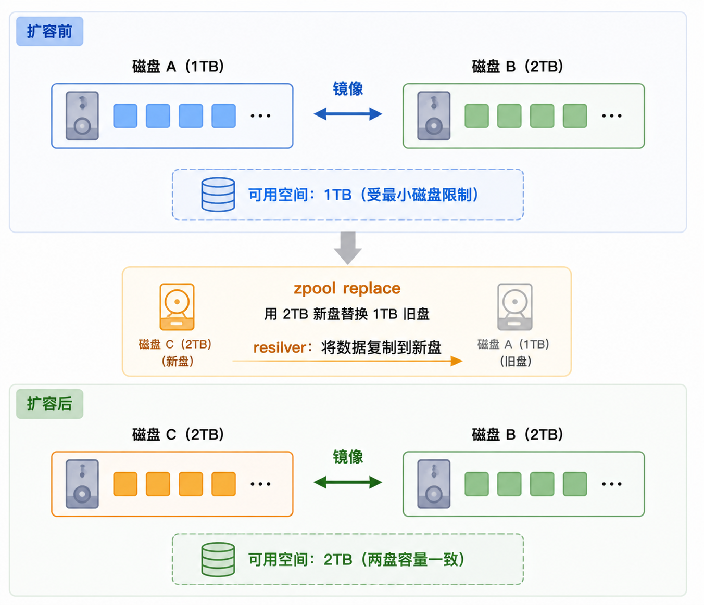

# 24.3 ZFS 存储池管理

本节介绍若干 ZFS 存储池管理方法。

## ZFS 存储池扩展

ZFS 支持在线扩展存储池，无需中断服务。扩容过程分为两步：先调整底层分区大小以利用新增空间，随后通过 ZFS 命令使存储池重新识别设备的新容量。

冗余池的可用容量取决于各 vdev 中最小的设备。使用更大容量的设备替换最小设备后，池的容量即可扩展。

replace 或重建操作完成后，池的可用空间将增长至新设备的容量。

以 1TB 和 2TB 硬盘构成的镜像池为例：此时可用空间为 1TB。将 1TB 硬盘替换为另一块 2TB 硬盘后，重建操作会将现有数据复制到新硬盘。

两块硬盘的容量现在均为 2TB，因此镜像池的可用空间将增至 2TB。

镜像池扩容过程示例（1TB + 2TB → 2TB + 2TB）如下图所示：



> **警告**
>
> ZFS 存储池只能扩展，不能缩小。因此无法撤销更改。

### 调整分区大小

显示当前磁盘分区表和分区信息：

```sh
# gpart show
=>       40  167772087  nda0  GPT  (80G)
         40     532480     1  efi  (260M)
     532520       1024     2  freebsd-boot  (512K)
     533544        984        - free -  (492K)
     534528    4194304     3  freebsd-swap  (2.0G)
    4728832  142071775     4  freebsd-zfs  (68G)
  146800607   20971520        - free -  (10G)
```

由输出可知，`free` 空闲空间是 10 GB。

根据分区表信息，选择位于空闲空间前方的 freebsd-zfs 分区（本例中为第 4 个分区）扩容，操作前需确认分区序号正确：

```sh
# gpart resize -i 4 nda0	# 将 nda0 磁盘上第 4 个分区扩展至全部可用空间
nda0p4 resized
```

显示当前磁盘分区表和分区信息：

```sh
# gpart show
=>       40  167772087  nda0  GPT  (80G)
         40     532480     1  efi  (260M)
     532520       1024     2  freebsd-boot  (512K)
     533544        984        - free -  (492K)
     534528    4194304     3  freebsd-swap  (2.0G)
    4728832  163043295     4  freebsd-zfs  (78G)
```

列出系统中所有 ZFS 池及其状态信息：

```sh
# zpool list
NAME    SIZE  ALLOC   FREE  CKPOINT  EXPANDSZ   FRAG    CAP  DEDUP    HEALTH  ALTROOT
zroot  67.5G  2.20G  65.3G        -         -     2%     3%  1.00x    ONLINE  -	# 分区扩容仅调整了分区表，ZFS 池尚未感知底层设备的空间变化，需单独扩展
```

显示 ZFS 池的详细状态信息，包括健康状况和错误信息：

```sh
# zpool status
  pool: zroot
 state: ONLINE
status: Some supported and requested features are not enabled on the pool.
	The pool can still be used, but some features are unavailable.
action: Enable all features using 'zpool upgrade'. Once this is done,
	the pool may no longer be accessible by software that does not support
	the features. See zpool-features(7) for details.
config:

	NAME        STATE     READ WRITE CKSUM
	zroot       ONLINE       0     0     0	# 默认池名
	  nda0p4    ONLINE       0     0     0	# 对应分区

errors: No known data errors
```

### 扩展 ZFS 池

扩展 ZFS 池：

```sh
# zpool online -e zroot nda0p4	# 在线扩展 ZFS 池 zroot 中的 nda0p4 分区（-e 表示 expand）
```

查看扩容后的所有 ZFS 池及其容量、使用情况和健康状态：

```sh
# zpool list
NAME    SIZE  ALLOC   FREE  CKPOINT  EXPANDSZ   FRAG    CAP  DEDUP    HEALTH  ALTROOT
zroot  77.5G  2.20G  75.3G        -         -     2%     2%  1.00x    ONLINE  -	# 扩容后可用容量为 75.3G，符合预期
```

扩容操作已完成。此外，可通过设置池属性 `autoexpand` 使池在磁盘替换或底层设备扩容后自动扩展，无需每次手动执行 `zpool online -e`：

```sh
# zpool set autoexpand=on zroot
```

### 附录

本附录介绍了 `gpart` 命令的额外用法。可以通过 `gpart show` 命令获取分区编号，也可以使用参数 `-p` 以完整路径显示所有磁盘及分区信息：

```sh
# gpart show -p
=>       40  244277168    mmcsd0  GPT  (116G)
         40     532480  mmcsd0p1  efi  (260M)
     532520       2008            - free -  (1.0M)
     534528  243740672  mmcsd0p2  freebsd-zfs  (116G)
  244275200       2008            - free -  (1.0M)

=>       34  976773101    nda0  GPT  (466G)
         34          6          - free -  (3.0K)
         40     567256  nda0p1  efi  (277M)
     567296  419436064  nda0p2  ms-basic-data  (200G)
  420003360  310592132  nda0p3  ms-basic-data  (148G)
  730595492          4          - free -  (2.0K)
  730595496  177626968  nda0p4  ms-basic-data  (85G)
  908222464   67100672  nda0p5  freebsd-swap  (32G)
  975323136    1445937  nda0p6  ms-recovery  (706M)
  976769073       4062          - free -  (2.0M)
```

- 打印分区类型 GUID（适用于 GPT）或原始分区类型（适用于 MBR）：

以可重现和完整的路径形式显示磁盘及分区信息：

```sh
# gpart show -rp
=>       40  244277168    mmcsd0  GPT  (116G)
         40     532480  mmcsd0p1  c12a7328-f81f-11d2-ba4b-00a0c93ec93b  (260M)
     532520       2008            - free -  (1.0M)
     534528  243740672  mmcsd0p2  516e7cba-6ecf-11d6-8ff8-00022d09712b  (116G)
  244275200       2008            - free -  (1.0M)

=>       34  976773101    nda0  GPT  (466G)
         34          6          - free -  (3.0K)
         40     567256  nda0p1  c12a7328-f81f-11d2-ba4b-00a0c93ec93b  (277M)
     567296  419436064  nda0p2  ebd0a0a2-b9e5-4433-87c0-68b6b72699c7  (200G)
  420003360  310592132  nda0p3  ebd0a0a2-b9e5-4433-87c0-68b6b72699c7  (148G)
  730595492          4          - free -  (2.0K)
  730595496  177626968  nda0p4  ebd0a0a2-b9e5-4433-87c0-68b6b72699c7  (85G)
  908222464   67100672  nda0p5  516e7cb5-6ecf-11d6-8ff8-00022d09712b  (32G)
  975323136    1445937  nda0p6  de94bba4-06d1-4d40-a16a-bfd50179d6ac  (706M)
  976769073       4062          - free -  (2.0M)
```

- 显示磁盘 `mmcsd0` 的详细分区信息：

```sh
# gpart list mmcsd0
```

### 故障排除

#### `gpart: table 'ada0' is corrupt: Operation not permitted`

提示分区表错误，需要重置 GPT 分区表。`gpart recover` 命令会从备份的 GPT 表头恢复主分区表信息。此问题多发生在直接导入的裸磁盘镜像上。

```sh
# gpart recover ada0
```

### 参考文献

- Yubao Liu. FreeBSD root on ZFS 千古奇坑[EB/OL]. (2019-02-18)[2026-04-02]. <https://dieken.gitlab.io/posts/bsd-as-desktop-system/>. 记录类似的 ZFS 启动错误案例。
- FreeBSD Forums. 10.1 doesn't boot anymore from zroot after applying p25[EB/OL]. [2026-04-02]. <https://forums.freebsd.org/threads/10-1-doesn't-boot-anymore-from-zroot-after-applying-p25.54422/#post-308876>. FreeBSD 论坛上的相关问题讨论。
- FreeBSD Forums. Solved-extend ZFS partition[EB/OL]. [2026-04-02]. <https://forums.freebsd.org/threads/extend-zfs-partition.55964/>. FreeBSD 论坛上的 ZFS 分区扩容解决方案。

## 创建和销毁存储池

创建 ZFS 存储池时，有些决策不可更改，其中最重要的是物理磁盘按何种 vdev 类型分组。创建池后，镜像（mirror）允许向 vdev 添加新磁盘；条带（stripe）也可以通过将新磁盘附加到 vdev 来升级为镜像。启用 `raidz_expansion` 功能标志后，RAID-Z vdev 也可扩展。尽管添加新的 vdev 可以扩展池，vdev 类型在创建后无法更改。此时只能备份数据、销毁池，而后重新创建。

### 创建简单镜像池

创建简单的镜像池：

```sh
# zpool create mypool mirror /dev/nda1 /dev/nda2
```

查看池状态：

```sh
# zpool status mypool
  pool: mypool
 state: ONLINE
config:

	NAME        STATE     READ WRITE CKSUM
	mypool      ONLINE       0     0     0
	  mirror-0  ONLINE       0     0     0
	    nda1    ONLINE       0     0     0
	    nda2    ONLINE       0     0     0

errors: No known data errors
```

### 创建多个 vdev

要在单个命令中创建多个 vdev，请指定由 vdev 类型关键字（本例中为 `mirror`）分隔的磁盘组：

```sh
# zpool create mypool mirror /dev/nda1 /dev/nda2 mirror /dev/nda3 /dev/nda4
```

查看池状态：

```sh
# zpool status mypool
  pool: mypool
 state: ONLINE
config:

	NAME        STATE     READ WRITE CKSUM
	mypool      ONLINE       0     0     0
	  mirror-0  ONLINE       0     0     0
	    nda1    ONLINE       0     0     0
	    nda2    ONLINE       0     0     0
	  mirror-1  ONLINE       0     0     0
	    nda3    ONLINE       0     0     0
	    nda4    ONLINE       0     0     0

errors: No known data errors
```

### 使用分区创建池

池也可以使用分区而非整个磁盘。将 ZFS 置于单独的分区后，同一磁盘的剩余空间可供其他用途。特别是，可以添加包含启动代码和启动文件系统的分区，从而使池成员磁盘兼具启动能力。使用分区而非整个磁盘不会给 FreeBSD 带来额外的性能负担。此外，分区还支持 **低配** 磁盘操作——即分配的空间小于磁盘总容量。若未来替换的磁盘名义大小与原始磁盘相同但实际容量略小，较小的分区仍可以装入替换磁盘。

使用分区创建一个 RAID-Z2 池：

```sh
# zpool create mypool raidz2 /dev/ada0p3 /dev/ada1p3 /dev/ada2p3 /dev/ada3p3 /dev/ada4p3 /dev/ada5p3
# zpool status
  pool: mypool
 state: ONLINE
  scan: none requested
config:

        NAME        STATE     READ WRITE CKSUM
        mypool      ONLINE       0     0     0
          raidz2-0  ONLINE       0     0     0
            ada0p3  ONLINE       0     0     0
            ada1p3  ONLINE       0     0     0
            ada2p3  ONLINE       0     0     0
            ada3p3  ONLINE       0     0     0
            ada4p3  ONLINE       0     0     0
            ada5p3  ONLINE       0     0     0

errors: No known data errors
```

### dRAID 参数与 IO 公式

- **分布式 RAID-Z (dRAID)**：dRAID 从 RAID-Z 理念演进而来，是独立的 vdev 类型，提供集成的分布式热备盘，支持更快的顺序重建（sequential resilver）。dRAID 由多个内部 raidz 组构成，每组包含 D 个数据设备和 P 个奇偶校验设备，这些组分布于所有子设备之上以充分利用磁盘性能——这种技术称为奇偶校验去聚类（parity declustering）。此外，dRAID 通过精心选择的预计算置换映射来随机排列子 vdev，确保无论哪块磁盘故障，重建 I/O（读写均包括）都能均匀分布于所有幸存磁盘，从而大幅加速重建过程。dRAID 使用固定条带宽度（必要时以零填充），这允许顺序重建，但固定条带宽度会显著影响可用容量和 IOPS。例如，默认 D=8 且 4 KiB 磁盘扇区时，最小分配大小为 32 KiB；使用压缩时，较大的分配大小可能降低有效压缩比。dRAID 的随机 IOPS 可近似为 `floor((N-S)/(D+P)) × 单盘 IOPS`。如果 dRAID 池将存放大量小块数据，建议额外添加镜像 special vdev。使用 ZFS 卷与 dRAID 时，默认 `volblocksize` 属性会自动增大以适应分配大小。支持 draid1（单奇偶校验）、draid2（双奇偶校验）和 draid3（三重奇偶校验），draid 是 draid1 的别名。

    创建 dRAID vdev 的语法：

    ```sh
    # zpool create <pool> draid[<parity>][:<data>d][:<children>c][:<spares>s] <vdevs...>
    ```

    dRAID 参数说明：

    | 参数 | 说明 | 默认值 |
    | ---- | ---- | ------ |
    | parity | 奇偶校验级别（1-3） | 1 |
    | data | 每个冗余组的数据设备数。较小的 D 值会提高 IOPS、改善压缩比并加速重建，但代价是减少总可用容量 | 8（除非 N-P-S 小于 8） |
    | children | 预期的子设备数，用作交叉验证 | - |
    | spares | 分布式热备盘数量 | 0 |

    例如，创建一个 11 盘 dRAID 池，使用 4+1 冗余和 1 个分布式热备盘：

    ```sh
    # zpool create tank draid:4d:1s:11c /dev/ada0 /dev/ada1 /dev/ada2 /dev/ada3 /dev/ada4 /dev/ada5 /dev/ada6 /dev/ada7 /dev/ada8 /dev/ada9 /dev/ada10
    ```

    dRAID 的主要优势在于支持顺序重建：重建性能随磁盘数除以条带宽度（D+P）而扩展，可大幅缩短重建时间并更快恢复完全冗余。磁盘故障被检测到时，ZFS 事件守护进程（ZED）会自动开始向分布式热备盘重建——对 dRAID 使用顺序重建，而 RAID-Z 必须使用传统愈合式重建。

### 销毁存储池

销毁不再需要的池以重新利用磁盘。`zpool destroy` 会自动卸载所有数据集；若数据集正在使用（有进程打开文件），销毁操作将失败，此时可使用 `-f` 强制销毁。

## 添加和移除设备

有两种方式可以将磁盘添加到池中：使用 `zpool attach` 将磁盘附加到现有的 vdev，或使用 `zpool add` 向池中添加新的 vdev。部分 vdev 类型可以在创建后添加磁盘。

### 附加磁盘到现有 vdev

由单块磁盘创建的池不具备冗余能力：可以检测到损坏，但缺乏数据副本，无法修复。副本（copies）属性可能从小的故障（如坏道）中恢复数据，但其保护级别不如镜像或 RAID-Z。若当前池只包含一个单磁盘 vdev，可以使用 `zpool attach` 将新磁盘附加到该 vdev 来创建镜像。也可以使用 `zpool attach` 向现有镜像组添加新磁盘，从而增强冗余并提升读取性能。若磁盘使用了分区，应将第一块磁盘的分区布局复制到第二块磁盘。使用 `gpart backup` 和 `gpart restore` 可以简化该过程。

通过附加 **nda1p1**，将单个磁盘（条带）vdev **nda0p3** 升级为镜像：

> **警告**
>
> `gpart create -s gpt` 将清除目标磁盘上现有的分区表，所有原有分区和数据将不可恢复。请务必确认 **/dev/nda1** 是正确的目标磁盘，而非系统盘或其他数据盘。

首先查看当前池的配置，确认仅有单个磁盘 vdev：

```sh
# zpool status
  pool: zroot
 state: ONLINE
config:

	NAME        STATE     READ WRITE CKSUM
	zroot       ONLINE       0     0     0
	  nda0p3    ONLINE       0     0     0

errors: No known data errors
```

在新磁盘上创建 GPT 分区表并添加 ZFS 分区：

```sh
# gpart create -s gpt /dev/nda1
nda1 created
# gpart add -t freebsd-zfs /dev/nda1
nda1p1 added

```

将新分区附加到现有 vdev，从而创建镜像：

```sh
# zpool attach zroot nda0p3 nda1p1
```

查看重建进度，此时镜像正在同步数据：

```sh
# zpool status
  pool: zroot
 state: ONLINE
status: One or more devices is currently being resilvered.  The pool will
	continue to function, possibly in a degraded state.
action: Wait for the resilver to complete.
  scan: resilver in progress since Tue May 12 13:03:48 2026
	888M / 888M scanned, 843M / 888M issued at 421M/s
	848M resilvered, 94.90% done, 00:00:00 to go
config:

	NAME        STATE     READ WRITE CKSUM
	zroot       ONLINE       0     0     0
	  mirror-0  ONLINE       0     0     0
	    nda0p3  ONLINE       0     0     0
	    nda1p1  ONLINE       0     0     0  (resilvering)

errors: No known data errors
```

重建完成后，确认镜像状态恢复正常：

```sh
# zpool status zroot
  pool: zroot
 state: ONLINE
  scan: resilvered 912M in 00:00:33 with 0 errors on Tue May 12 13:04:21 2026
config:

	NAME        STATE     READ WRITE CKSUM
	zroot       ONLINE       0     0     0
	  mirror-0  ONLINE       0     0     0
	    nda0p3  ONLINE       0     0     0
	    nda1p1  ONLINE       0     0     0

errors: No known data errors
```

### 向池添加新 vdev

若不希望向现有 vdev 添加磁盘，替代方案是向池中添加另一个 vdev。添加 vdev 可以将写入分布到多个 vdev，从而提升性能。每个 vdev 各自提供冗余。`mirror` 和 `RAID-Z` 类型的 vdev 可以混合使用，但此做法不受推荐。向包含镜像或 RAID-Z vdev 的池中添加非冗余 vdev 会危及整个池的数据安全——由于写入是分布式的，非冗余磁盘一旦发生故障，将导致池中每个数据块都有部分内容丢失。

ZFS 在各 vdev 之间条带化数据。例如，使用两个镜像 vdev 实际上构成了 RAID 10，写入会条带化到两个镜像组上。ZFS 分配空间时力求各 vdev 同步达到 100% 占用。由于更多写入会流向剩余空间较多的 vdev，vdev 之间的可用空间不均衡会降低性能。

向启动池添加新设备时，需注意更新启动代码。

将第二个镜像组（**nda2p1** 和 **nda3p1**）作为新 vdev 添加到池中：

首先查看当前池的配置：

```sh
# zpool status
  pool: zroot
 state: ONLINE
  scan: resilvered 912M in 00:00:33 with 0 errors on Tue May 12 13:04:21 2026
config:

	NAME        STATE     READ WRITE CKSUM
	zroot       ONLINE       0     0     0
	  mirror-0  ONLINE       0     0     0
	    nda0p3  ONLINE       0     0     0
	    nda1p1  ONLINE       0     0     0

errors: No known data errors
```

为新磁盘创建 GPT 分区表并添加 ZFS 分区：

```sh
# gpart create -s gpt /dev/nda2
nda2 created
# gpart add -t freebsd-zfs /dev/nda2
nda2p1 added
# gpart create -s gpt /dev/nda3
nda3 created
# gpart add -t freebsd-zfs /dev/nda3
nda3p1 added
```

将新磁盘作为第二个镜像 vdev 添加到池中：

```sh
# zpool add zroot mirror nda2p1 nda3p1
```

添加完成后，确认池中已包含两个镜像 vdev：

```sh
# zpool status
  pool: zroot
 state: ONLINE
  scan: resilvered 912M in 00:00:33 with 0 errors on Tue May 12 13:04:21 2026
config:

	NAME        STATE     READ WRITE CKSUM
	zroot       ONLINE       0     0     0
	  mirror-0  ONLINE       0     0     0
	    nda0p3  ONLINE       0     0     0
	    nda1p1  ONLINE       0     0     0
	  mirror-1  ONLINE       0     0     0
	    nda2p1  ONLINE       0     0     0
	    nda3p1  ONLINE       0     0     0

errors: No known data errors
```

### 移除顶层 vdev

启用功能标志 `device_removal` 后，即可从池中移除顶层 vdev。

查询当前池是否已开启了该功能：

```sh
# zpool get feature@device_removal zroot
NAME   PROPERTY                VALUE                   SOURCE
zroot  feature@device_removal  enabled                 local
```

### 从镜像中移除磁盘

还可以从镜像中移除磁盘，前提是剩余冗余充足。若镜像组中仅剩一块磁盘，该组将不再作为镜像运行，而退化为条带；此磁盘一旦发生故障，将危及整个池的数据。

从镜像组中移除一块磁盘：

先查看当前池的配置：

```sh
# zpool status
  pool: zroot
 state: ONLINE
  scan: resilvered 912M in 00:00:33 with 0 errors on Tue May 12 13:04:21 2026
config:

	NAME        STATE     READ WRITE CKSUM
	zroot       ONLINE       0     0     0
	  mirror-0  ONLINE       0     0     0
	    nda0p3  ONLINE       0     0     0
	    nda1p1  ONLINE       0     0     0
	  mirror-1  ONLINE       0     0     0
	    nda2p1  ONLINE       0     0     0
	    nda3p1  ONLINE       0     0     0

errors: No known data errors
```

从第二个镜像组中移除一块磁盘，查看移除后的状态：

```sh
# zpool detach zroot nda3p1
# zpool status
  pool: zroot
 state: ONLINE
  scan: resilvered 912M in 00:00:33 with 0 errors on Tue May 12 13:04:21 2026
config:

	NAME        STATE     READ WRITE CKSUM
	zroot       ONLINE       0     0     0
	  mirror-0  ONLINE       0     0     0
	    nda0p3  ONLINE       0     0     0
	    nda1p1  ONLINE       0     0     0
	  nda2p1    ONLINE       0     0     0

errors: No known data errors
```

移除剩余的一块：

```sh
zpool detach zroot nda2p1
```

移除进行中，查看数据撤离进度：

```sh
# zpool status

  pool: zroot
 state: ONLINE
  scan: resilvered 912M in 00:00:33 with 0 errors on Tue May 12 13:04:21 2026
remove: Evacuation of /dev/nda2p1 in progress since Tue May 12 13:21:33 2026
	444K copied out of 444K at 14.8K/s, 100.00% done, 0h0m to go
config:

	NAME        STATE     READ WRITE CKSUM
	zroot       ONLINE       0     0     0
	  mirror-0  ONLINE       0     0     0
	    nda0p3  ONLINE       0     0     0
	    nda1p1  ONLINE       0     0     0
	  nda2p1    ONLINE       0     0     0  (removing)
```

移除完成，池回到单个镜像组：

```sh
  pool: zroot
 state: ONLINE
  scan: resilvered 912M in 00:00:33 with 0 errors on Tue May 12 13:04:21 2026
remove: Removal of vdev 1 copied 444K in 0h0m, completed on Tue May 12 13:22:03 2026
	648 memory used for removed device mappings
config:

	NAME          STATE     READ WRITE CKSUM
	zroot         ONLINE       0     0     0
	  mirror-0    ONLINE       0     0     0
	    nda0p3    ONLINE       0     0     0
	    nda1p1    ONLINE       0     0     0

errors: No known data errors
```

## 检查池的状态

监控池的状态很重要。若某块硬盘脱机，或 ZFS 检测到读取、写入或校验和错误，对应的错误计数将增加。`status` 输出会显示池中每个设备的配置和状态，以及整个池的状态，还会显示最近一次 `scrub` 的操作详情。

```sh
# zpool status
  pool: zroot
 state: ONLINE
  scan: resilvered 912M in 00:00:33 with 0 errors on Tue May 12 13:04:21 2026
config:

	NAME        STATE     READ WRITE CKSUM
	zroot       ONLINE       0     0     0
	  mirror-0  ONLINE       0     0     0
	    nda0p3  ONLINE       0     0     0
	    nda1p1  ONLINE       0     0     0
	  nda2p1    ONLINE       0     0     0

errors: No known data errors
```

## 清除错误

检测到错误后，ZFS 会增加读取、写入或校验和对应的错误计数。使用 `zpool clear <mypool>` 可清除错误消息并重置计数。清除错误状态对自动化脚本至关重要——这些脚本会在池遇到错误时提醒管理员。若不清除旧错误，脚本可能无法报告后续错误。

## 替换正常的设备

有时需要用不同的物理磁盘替换现有磁盘。替换正常磁盘时，旧磁盘在操作期间保持在线，池不会进入降级（degraded）状态，从而降低数据丢失的风险。运行 `zpool replace` 即可将数据从旧磁盘复制到新磁盘。操作完成后，ZFS 会将旧磁盘从 vdev 中断开。

替换池中的正常设备：

先查看当前池的配置：

```sh
# zpool status
  pool: zroot
 state: ONLINE
  scan: none requested
config:

	NAME          STATE     READ WRITE CKSUM
	zroot         ONLINE       0     0     0
	  mirror-0    ONLINE       0     0     0
	    nda0p3    ONLINE       0     0     0
	    nda1p1    ONLINE       0     0     0

errors: No known data errors
```

执行替换操作，使用新磁盘 nda2p1 替换 nda0p3：

```sh
# zpool replace zroot nda0p3 nda2p1
```

查看替换进度，此时正在重建数据：

```sh
# zpool status
  pool: zroot
 state: ONLINE
status: One or more devices is currently being resilvered.  The pool will
	continue to function, possibly in a degraded state.
action: Wait for the resilver to complete.
  scan: resilver in progress since Tue May 12 13:27:31 2026
	889M / 889M scanned, 889M / 889M issued at 444M/s
	912M resilvered, 100.00% done, 00:00:00 to go
config:

	NAME             STATE     READ WRITE CKSUM
	zroot            ONLINE       0     0     0
	  mirror-0       ONLINE       0     0     0
	    replacing-0  ONLINE       0     0     0
	      nda0p3     ONLINE       0     0     0
	      nda2p1     ONLINE       0     0     0  (resilvering)
	    nda1p1       ONLINE       0     0     0

errors: No known data errors
```

重建完成后，确认新磁盘已上线、旧磁盘已移除：

```sh
# zpool status
  pool: zroot
 state: ONLINE
  scan: resilvered 913M in 00:00:33 with 0 errors on Tue May 12 13:28:04 2026
config:

	NAME          STATE     READ WRITE CKSUM
	zroot         ONLINE       0     0     0
	  mirror-0    ONLINE       0     0     0
	    nda2p1    ONLINE       0     0     0
	    nda1p1    ONLINE       0     0     0

errors: No known data errors
```

更新 EFI 引导条目，让新磁盘也能引导：

```sh
# efibootmgr -a -c -l /boot/efi/efi/freebsd/loader.efi -L "FreeBSD 15.0"
```

## 处理故障设备

池中的磁盘发生故障时，该磁盘所在的 vdev 会进入降级（degraded）状态。数据仍然可用，但由于 ZFS 需要从冗余数据中计算出缺失的数据，性能会有所下降。要将 vdev 恢复到完全正常的状态，需要替换故障物理设备，接着指示 ZFS 开始重建操作。ZFS 会从可用的冗余数据中重新计算出故障设备上的数据，并将其写入替换设备。操作完成后，vdev 会恢复到在线（online）状态。

若 vdev 没有冗余，或者设备已故障且冗余不足以弥补，池会进入故障（faulted）状态。此时除非有足够多的设备重新接入，否则池将不可用，必须从备份中恢复数据。

替换故障磁盘后，故障磁盘的名称会更改为新磁盘的 GUID。若替换设备的名称与原设备相同，`zpool replace` 无需指定新设备名称。

使用 `zpool replace` 命令替换故障磁盘：

先查看池状态，确认故障设备及其 GUID：

```sh
# zpool status
  pool: mypool
 state: DEGRADED
status: One or more devices could not be opened.  Sufficient replicas exist for
        the pool to continue functioning in a degraded state.
action: Attach the missing device and online it using 'zpool online'.
   see: http://illumos.org/msg/ZFS-8000-2Q
  scan: none requested
config:

        NAME                    STATE     READ WRITE CKSUM
        mypool                  DEGRADED     0     0     0
          mirror-0              DEGRADED     0     0     0
            ada0p3              ONLINE       0     0     0
            316502962686821739  UNAVAIL      0     0     0  was /dev/ada1p3

errors: No known data errors
```

用故障设备的 GUID 和新磁盘来执行替换：

```sh
# zpool replace mypool 316502962686821739 ada2p3
```

查看重建进度：

```sh
# zpool status
  pool: mypool
 state: DEGRADED
status: One or more devices is currently being resilvered.  The pool will
        continue to function, possibly in a degraded state.
action: Wait for the resilver to complete.
  scan: resilver in progress since Mon Jun  2 14:52:21 2014
        641M scanned out of 781M at 49.3M/s, 0h0m to go
        640M resilvered, 82.04% done
config:

        NAME                        STATE     READ WRITE CKSUM
        mypool                      DEGRADED     0     0     0
          mirror-0                  DEGRADED     0     0     0
            ada0p3                  ONLINE       0     0     0
            replacing-1             UNAVAIL      0     0     0
              15732067398082357289  UNAVAIL      0     0     0  was /dev/ada1p3/old
              ada2p3                ONLINE       0     0     0  (resilvering)

errors: No known data errors
```

重建完成，池恢复到 ONLINE 状态：

```sh
# zpool status
  pool: mypool
 state: ONLINE
  scan: resilvered 781M in 0h0m with 0 errors on Mon Jun  2 14:52:38 2014
config:

        NAME        STATE     READ WRITE CKSUM
        mypool      ONLINE       0     0     0
          mirror-0  ONLINE       0     0     0
            ada0p3  ONLINE       0     0     0
            ada2p3  ONLINE       0     0     0

errors: No known data errors
```

## 设备脱机与联机

`zpool offline` 可将物理设备脱机——脱机期间 ZFS 不会对设备执行任何读写。此操作不适用于备盘。如果仅有一个设备，将报错：`cannot offline nda1: no valid replicas`。

在 **/tmp** 下创建 2 个 1G 大的虚拟磁盘用于演示：

```sh
# truncate -s 1G /tmp/vdisk1
# truncate -s 1G /tmp/vdisk2
```

创建镜像池 **mypool**，再查看其状态：

```sh
# zpool create mypool mirror /tmp/vdisk1 /tmp/vdisk2
# zpool status mypool
  pool: mypool
 state: ONLINE
config:

	NAME             STATE     READ WRITE CKSUM
	mypool           ONLINE       0     0     0
	  mirror-0       ONLINE       0     0     0
	    /tmp/vdisk1  ONLINE       0     0     0
	    /tmp/vdisk2  ONLINE       0     0     0

errors: No known data errors
```

将设备 **/tmp/vdisk1** 从存储池 **mypool** 脱机：

```sh
# zpool offline mypool /tmp/vdisk1
```

查看池状态确认设备已脱机：

```sh
# zpool status mypool
  pool: mypool
 state: DEGRADED
status: One or more devices has been taken offline by the administrator.
	Sufficient replicas exist for the pool to continue functioning in a
	degraded state.
action: Online the device using 'zpool online' or replace the device with
	'zpool replace'.
config:

	NAME             STATE     READ WRITE CKSUM
	mypool           DEGRADED     0     0     0
	  mirror-0       DEGRADED     0     0     0
	    /tmp/vdisk1  OFFLINE      0     0     0
	    /tmp/vdisk2  ONLINE       0     0     0

errors: No known data errors
```

- `-t` 选项使脱机状态仅临时生效——系统重启后设备恢复之前的状态。
- `-f` 选项将设备强制标记为故障（FAULTED）而非脱机，且故障状态在导入/导出间持续（除非同时使用 `-t`）。

`zpool online` 将已脱机的设备重新联机：

```sh
# zpool online mypool /tmp/vdisk1
```

联机后，若设备在脱机期间有未写入的数据，ZFS 会自动触发 resilver 以同步数据。对于镜像或 RAID-Z 中的设备，只有所有设备均扩展后新空间才对池可用。

如果设备只是暂时断开连接，可以直接将其重新联机，而不需要执行完整的替换流程。

## 数据完整性检查（scrub）

建议定期对池执行 scrub，最好每月至少一次。

`scrub` 操作会消耗磁盘资源，因此在运行时会降低性能。避免在高负载时期安排 `scrub` 操作，或者使用 `vfs.zfs.scrub_delay` 调整 `scrub` 的相对优先级，以免影响其他工作负载。

对池执行数据完整性检查：

```sh
# zpool scrub zroot
```

查看 scrub 的执行进度：

```sh
# zpool status
  pool: zroot
 state: ONLINE
  scan: scrub in progress since Tue May 12 13:38:00 2026
	889M / 889M scanned, 889M / 889M issued at 98.8M/s
	0B repaired, 100.00% done, 00:00:00 to go
config:

	NAME          STATE     READ WRITE CKSUM
	zroot         ONLINE       0     0     0
	  mirror-0    ONLINE       0     0     0
	    nda2p1    ONLINE       0     0     0
	    nda1p1    ONLINE       0     0     0

errors: No known data errors

```

如果需要取消 scrub 操作，可以运行 `zpool scrub -s 存储池`。

## 磁盘初始化

新磁盘加入存储池前，可先执行磁盘初始化（initialize）操作。

`zpool initialize` 会向磁盘上所有未分配区域写入数据（默认为零），使 ZFS 能够提前发现潜在的坏块——一旦初始化过程中遇到不可恢复的读写错误，磁盘会立即报告故障，从而避免数据写入坏块的风险。仅数据设备和日志设备可被初始化。

初始化池中的所有设备：

```sh
# zpool initialize mypool
```

初始化 **mypool** 池中的单块磁盘：

```sh
# zpool initialize mypool nda1
```

可通过 `zpool status` 查看初始化进度：

```sh
# zpool status mypool
  pool: mypool
 state: ONLINE
config:

	NAME        STATE     READ WRITE CKSUM
	mypool      ONLINE       0     0     0
	  nda1      ONLINE       0     0     0  (initializing)

errors: No known data errors
```

选项 `-w` 可使命令在初始化完成后再返回：

```sh
# zpool initialize -w mypool
```

可以取消（`-c`）、暂停（`-s`）初始化或清除初始化状态（`-u`）：

```sh
# zpool initialize -c mypool
```

清除初始化状态后，可再次从零开始初始化设备。与 `zpool trim` 不同，`initialize` 是一次性操作，而 trim 用于通知 SSD 回收已释放的块。

## 存储池检查点

`zpool checkpoint` 可创建整个存储池的即时检查点，保存池的完整一致状态。之后若执行了破坏性操作（如 `zpool upgrade` 或误删数据集），可通过导出后再导入并回退到检查点时刻恢复。

创建检查点：

```sh
# zpool checkpoint zroot
```

检查点存在期间，无法执行以下命令：`zpool remove`、`zpool attach`、`zpool detach`、`zpool split`、`zpool reguid`。此外，若池空闲空间不足，检查点可能打破预留空间限制。

查看检查点状态：

```sh
# zpool status zroot
  pool: zroot
 state: ONLINE
checkpoint: created Wed May 13 13:26:06 2026, consumes 288K # 注意此行
config:

	NAME        STATE     READ WRITE CKSUM
	zroot       ONLINE       0     0     0
	  nda0p3    ONLINE       0     0     0

errors: No known data errors
```

通过 `zpool list` 查看检查点占用空间（CKPOINT 列）：

```sh
# zpool list zroot
NAME    SIZE  ALLOC   FREE  CKPOINT  EXPANDSZ   FRAG    CAP  DEDUP    HEALTH  ALTROOT
zroot  51.5G   890M  50.6G     288K         -     0%     1%  1.00x    ONLINE  -
```

丢弃检查点以释放空间：

```sh
# zpool checkpoint -d zroot
```

`-w` 选项使命令在检查点丢弃完成后再返回：

```sh
# zpool checkpoint -d -w zroot
```

回退到检查点需先导出池，再以 `--rewind-to-checkpoint` 导入：

```sh
# zpool export 存储池
# zpool import --rewind-to-checkpoint 存储池
```

> **警告**
>
> 如果 zroot 作为根分区，并且正在使用，禁止导出。

检查点的典型使用场景是在池级升级或高风险管理操作之前建立回退点。

## 导入和导出池

将池迁移到另一台系统之前，应先 **导出** 池。ZFS 会卸载所有数据集，并将每个设备标记为已导出，同时锁定设备以防止其他磁盘子系统占用。导出的池可以在其他支持 ZFS 的计算机、操作系统乃至不同硬件架构上 **导入**（存在若干注意事项）。若数据集有打开的文件，可使用 `zpool export -f` 强制导出池，但需小心操作。强制导出会强制卸载数据集，若应用程序在卸载时仍持有打开的文件，可能引发意外行为。

导出一个未使用的池：

```sh
# zpool export mypool
```

导入池会自动挂载数据集。若不希望自动挂载，可使用 `zpool import -N` 加以阻止。`zpool import -o` 可以为当次导入设置临时属性。`zpool import -R` 可为导入池指定基本挂载点，替代文件系统根目录。也可使用 `zpool import -o altroot=` 设置。若池之前曾在另一系统上运行且未正确导出，可使用 `zpool import -f` 强制导入。`zpool import -a` 则导入所有未被其他系统占用的池。

列出所有可用的池便于导入：

```sh
# zpool import
  pool: healer
    id: 16015915091752228231
 state: ONLINE
action: The pool can be imported using its name or numeric identifier.
config:

	healer      ONLINE
	  mirror-0  ONLINE
	    nda2    ONLINE
	    nda3    ONLINE
```

使用替代根目录导入池：

```sh
# zpool import -o altroot=/mnt healer
```

确认数据集已挂载在替代根目录下：

```sh
# zfs list healer
NAME     USED  AVAIL  REFER  MOUNTPOINT
healer   736K  57.7G   100K  /mnt/healer
```

## 自我修复

### 自我修复原理

ZFS 的自我修复能力源于校验和与存储冗余的结合。每个数据块均附带校验和，所用算法为数据集属性。读取时校验和自动透明验证，使 ZFS 能够检测静默数据损坏。如果数据与预期校验和不匹配，ZFS 会尝试利用可用冗余（镜像或 RAID-Z）恢复。每个块使用的校验和算法存储在块指针（元数据）中，在块写入时计算，因此更改算法仅影响更改后发生的写入。

```sh
ZFS 自我修复流程（以镜像池为例）：

  读取数据块
     │
     │  计算校验和
     ▼
  与元数据中的校验和比对
     │
     ├── 匹配 ──► 返回正确数据
     │
     │ 不匹配（检测到静默损坏）
     ▼
  从镜像副本（或其他冗余）读取
     │
     │  重新计算校验和
     ▼
  副本校验和正确？
     │
     ├── 是 ──► 返回正确数据
     │          │
     │          │  用正确数据修复损坏副本
     │          ▼
     │          损坏块被覆盖（自我修复）
     │
     │ 否（所有副本均损坏）
     ▼
  返回错误（无法修复）
```

更改数据集的校验和算法：

```sh
# zfs set checksum=sha256 存储池/数据集
```

支持的校验和算法：

| 算法 | 适用于去重和 nopwrite？ | 与其他 ZFS 实现兼容？ | 说明 |
| ---- | ----------------------- | --------------------- | ---- |
| on | 见说明 | 是 | 非去重数据集为 `fletcher4`，去重数据集为 `sha256` |
| off | 否 | 是 | 不应禁用校验和 |
| fletcher2 | 否 | 是 | 已弃用，仅因向后兼容而保留，不应在新数据集上使用，应使用 `fletcher4` |
| fletcher4 | 否 | 是 | Fletcher 算法，也用于 `zfs send` 流 |
| sha256 | 是 | 是 | 去重数据集的默认算法 |
| noparity | 否 | 是 | 不应使用 `noparity`，此选项仅因向后兼容而保留 |
| sha512 | 是 | 需启用 `org.illumos:sha512` | 加盐 sha512，当前不支持用于启动池上的任何文件系统 |
| skein | 是 | 需启用 `org.illumos:skein` | 加盐 skein，当前不支持用于启动池上的任何文件系统 |
| edonr | 见说明 | 需启用 `org.illumos:edonr` | 加盐 edonr，出于谨慎，与去重配合使用时自动启用 `verify`；当前不支持用于启动池上的任何文件系统 |
| blake3 | 是 | 需启用 `org.openzfs:blake3` | 加盐 blake3，当前不支持用于启动池上的任何文件系统 |

虽然禁用校验和以提升 CPU 性能看似诱人，但 ZFS 社区普遍认为这是一个极不明智的做法。不应禁用校验和。

### 自我修复演示

以下示例使用两个 md(4) 内存磁盘 (`md0`、`md1`) 构建镜像池 `healer`，安全地演示自我修复行为——`md` 伪设备仅在内存中创建，重启后自动消失，绝无损坏真实磁盘的风险。

创建两个 128 MB 内存磁盘：

```sh
# mdconfig -a -t swap -s 128m
md0
# mdconfig -a -t swap -s 128m
md1
```

用内存磁盘创建镜像池：

```sh
# zpool create healer mirror /dev/md0 /dev/md1
```

查看新建镜像池的状态：

```sh
# zpool status healer
  pool: healer
 state: ONLINE
config:

	NAME        STATE     READ WRITE CKSUM
	healer      ONLINE       0     0     0
	  mirror-0  ONLINE       0     0     0
	    md0     ONLINE       0     0     0
	    md1     ONLINE       0     0     0

errors: No known data errors
```

查看池的容量和分配情况：

```sh
# zpool list healer
NAME     SIZE  ALLOC   FREE  CKPOINT  EXPANDSZ   FRAG    CAP  DEDUP    HEALTH  ALTROOT
healer   112M   372K   112M        -         -    23%     0%  1.00x    ONLINE  -
```

将若干 **非重要数据** 复制到 `healer` 存储池中，以防数据因错误而损坏，再生成池的校验和以供后续比较。

本例中以 **Philosophische-untersuchungen.pdf** 文件做示例。

```sh
# cp /home/ykla/Philosophische-untersuchungen.pdf /healer/
```

确认文件已写入池中：

```sh
# zfs list healer
NAME     USED  AVAIL  REFER  MOUNTPOINT
healer  28.0M  28.0M  27.6M  /healer
```

为文件生成 SHA-256 校验和，以供后续比对：

```sh
# sha256 /healer/Philosophische-untersuchungen.pdf > checksum.txt
```

查看校验和文件内容：

```sh
# cat checksum.txt
SHA256 (/healer/Philosophische-untersuchungen.pdf) = 7fb17d5a0554bad9eef45803f3b24a50e0aadcaccee122037f3dfd54ef586436
```

向镜像中的一块磁盘写入随机数据可以模拟数据损坏。为阻止 ZFS 在检测到损坏后自动修复数据，先导出池，完成损坏后再重新导入。

> **安全说明**
>
> 本示例使用 `md` 内存磁盘——写入 `/dev/md1` 仅影响内存中的伪设备，**绝不会威胁物理磁盘**。`md` 设备在系统重启或执行 `mdconfig -d` 后彻底消失。整个演示完全独立于真实存储硬件。若需在其他环境中模拟，应始终使用 `md` 磁盘或文件 vdev（`truncate -s` 创建），**严禁** 对真实池成员磁盘执行以下操作。

先导出池，在离线状态下模拟数据损坏：

```sh
# zpool export healer
```

向镜像中的一块内存磁盘写入随机数据，模拟磁盘损坏：

```sh
# dd if=/dev/random of=/dev/md1 bs=1m count=20
20+0 records in
20+0 records out
20971520 bytes transferred in 0.089384 secs (234622722 bytes/sec)
```

重新导入池，ZFS 将尝试识别并修复检测到的数据错误：

```sh
# zpool import healer
```

池状态显示 md1 设备出现了校验和错误，但应用程序读到的数据没有出错——ZFS 从完好的 md0 镜像盘提供了数据：

```sh
# zpool status healer
  pool: healer
 state: ONLINE
status: One or more devices has experienced an unrecoverable error.  An
	attempt was made to correct the error.  Applications are unaffected.
action: Determine if the device needs to be replaced, and clear the errors
	using 'zpool clear' or replace the device with 'zpool replace'.
   see: https://openzfs.github.io/openzfs-docs/msg/ZFS-8000-9P
config:

	NAME        STATE     READ WRITE CKSUM
	healer      ONLINE       0     0     0
	  mirror-0  ONLINE       0     0     0
	    md0     ONLINE       0     0     0
	    md1     ONLINE       0     0     1	# 注意此处

errors: No known data errors
```

ZFS 检测到错误并利用未受影响的 **md0** 镜像磁盘中的冗余数据修复了错误。对比原始校验和，可以确认池数据是否一致。

```sh
# sha256 /healer/Philosophische-untersuchungen.pdf >> checksum.txt
# cat checksum.txt
SHA256 (/healer/Philosophische-untersuchungen.pdf) = 7fb17d5a0554bad9eef45803f3b24a50e0aadcaccee122037f3dfd54ef586436
SHA256 (/healer/Philosophische-untersuchungen.pdf) = 7fb17d5a0554bad9eef45803f3b24a50e0aadcaccee122037f3dfd54ef586436
```

对比有意破坏数据前后生成的校验和，可以看到数据仍然一致。这说明 ZFS 即使在校验和不一致的情况下，也能自动检测并修复错误。

注意，此能力仅在池具备足够冗余时才成立——单独设备构成的池没有自我修复能力。也正因如此，校验和在 ZFS 中不可或缺，不应以任何理由禁用校验和。

借此机制，ZFS 无需借助传统的文件系统一致性检查程序（fsck）即可检测并修复这些问题，同时在发生问题时保持池的可用性。

使用 `zpool clear` 清除池状态中的错误消息。

```sh
# zpool clear healer
```

清除错误后，确认池已恢复完全正常状态，所有错误计数归零：

```sh
# zpool status healer
  pool: healer
 state: ONLINE
  scan: scrub repaired 4.33M in 00:00:00 with 0 errors on Thu Apr 16 11:59:56 2026
config:

	NAME        STATE     READ WRITE CKSUM
	healer      ONLINE       0     0     0
	  mirror-0  ONLINE       0     0     0
	    md0     ONLINE       0     0     0
	    md1     ONLINE       0     0     0

errors: No known data errors
```

至此，池已恢复到完全正常运行的状态，所有错误计数归零。

演示结束后，使用以下命令回收资源：

> **警告**
>
> 以下命令将永久销毁 ZFS 存储池 `healer` 并删除 `md` 内存磁盘设备，池中所有数据将无法恢复。请确认操作对象正确无误后再执行。

```sh
# zpool destroy healer
# mdconfig -d -u 0
# mdconfig -d -u 1
```

## 显示记录的池历史

ZFS 会记录所有改变池状态的命令，包括创建数据集、更改属性或替换磁盘。查看池的创建历史有助于追溯管理操作，也可确认特定用户在何时执行了哪些操作。历史记录不保存在日志文件中，而是池结构的组成部分。查看池 `zroot` 历史记录的命令便是 `zpool history`：

```sh
# zpool history zroot
History for 'zroot':
2026-04-16.19:46:03 zpool create -o altroot=/mnt -O compression=on -O atime=off -m none -f zroot nda0p3
2026-04-16.19:46:03 zfs create -o mountpoint=none zroot/ROOT
2026-04-16.19:46:03 zfs create -o mountpoint=/ zroot/ROOT/default

……省略部分输出……
```

输出显示了 `zpool` 和 `zfs` 命令如何以时间戳记录改变池状态的操作。像 `zfs list` 这样的命令不会包含在内。若不指定池名称，ZFS 会显示所有池的历史记录。

如果指定选项 `-i` 或 `-l`，`zpool history` 可以显示更多信息。`-i` 会显示用户发起的事件以及内部记录的 ZFS 事件。

```sh
# zpool history -i zroot
History for 'zroot':
2026-04-16.19:51:01 [txg:75] permission update zroot/home/ykla (1668) ud$1001 mount
2026-04-16.19:51:01 [txg:75] permission update zroot/home/ykla (1668) ud$1001 snapshot
2026-04-16.19:51:01 zfs allow ykla create,destroy,mount,snapshot zroot/home/ykla
2026-04-16.19:51:01 [txg:78] inherit zroot/home/ykla (1668) mountpoint=/home
2026-04-16.19:51:01 zfs inherit mountpoint zroot/home/ykla
1970-01-01.08:00:04 [txg:82] open pool version 5000; software version zfs-2.4.99-468-g3ee08abd2; uts  16.0-CURRENT 1600015 amd64

……省略部分输出……
```

加上 `-l` 可显示更多细节。长格式的历史记录会显示执行命令的用户以及命令发生的主机名信息。

```sh
# zpool history -l zroot
History for 'zroot':
2026-04-16.19:46:34 zpool set cachefile=/mnt/boot/zfs/zpool.cache zroot [user 0 (root) on ykla:freebsd]
2026-04-16.19:46:34 zfs set canmount=noauto zroot/ROOT/default [user 0 (root) on ykla:freebsd]
2026-04-16.19:50:30 zfs create -u zroot/home/ykla [user 0 (root) on ykla:freebsd]
2026-04-16.19:50:30 zfs set mountpoint=legacy zroot/home/ykla [user 0 (root) on ykla:freebsd]

……省略部分输出……
```

输出表明 `root` 用户以 **/dev/nda0p3** 创建了单磁盘池 `zroot`，并随后创建了 `ROOT` 和 `ROOT/default` 数据集。主机名 `freebsd` 也出现在池创建后的命令记录中（见 `-l` 输出中的 `ykla:freebsd`）。池从一个系统导出再导入到另一台系统时，主机名信息尤为关键——管理员可以通过主机名区分在其他系统上执行的命令。

合并使用两个选项后，`zpool history` 可以提供有关池的最详细信息。池历史记录可用于追踪操作和调试。

## 性能监控

ZFS 内建了监控系统，可以实时显示池的 I/O 统计数据，包括已用空间和空闲空间、每秒读写操作以及 I/O 带宽。

默认情况下，ZFS 会监控并显示系统中所有池的状态。若仅需监控某个特定池，可以指定其名称。以下为基本示例：

```sh
# zpool iostat
              capacity     operations     bandwidth
pool        alloc   free   read  write   read  write
----------  -----  -----  -----  -----  -----  -----
healer       736K  59.5G      0      1  5.57K  9.53K
zroot        889M  50.6G      0      2  13.0K  11.0K
----------  -----  -----  -----  -----  -----  -----
```

要持续查看 I/O 活动，可以在命令末尾指定一个数字参数，表示每次更新的间隔时间（以秒为单位）。每隔该间隔，系统会输出一次统计数据。按下 **Ctrl** + **C** 可停止连续监控。若要同时指定显示的统计次数，可以在命令行中添加第二个数字。

使用 `-v` 可以显示更详细的 I/O 统计数据，池中每个设备各占一行。通过查看每个设备的读写操作，可以判断是否有某个设备拖慢了池的性能。以下为一个包含两个设备的镜像池示例：

```sh
# zpool iostat -v
              capacity     operations     bandwidth
pool        alloc   free   read  write   read  write
----------  -----  -----  -----  -----  -----  -----
healer       736K  59.5G      0      1  5.03K  8.61K
  mirror-0   736K  59.5G      0      1  5.03K  8.61K
    nda2        -      -      0      0  2.69K  4.30K
    nda3        -      -      0      0  2.34K  4.30K
----------  -----  -----  -----  -----  -----  -----
zroot        889M  50.6G      0      2  12.7K  11.1K
  nda0p3     889M  50.6G      0      2  12.7K  11.1K
----------  -----  -----  -----  -----  -----  -----
```

## 拆分存储池

ZFS 可以将包含一个或多个镜像 vdev 的池拆分为两个池。除非另行指定，ZFS 会从每个镜像中分离出最后一个成员，并创建一个包含相同数据的新池。正式执行前，建议先使用 `-n` 选项模拟运行——它会显示请求操作的详细过程，而不实际执行。这有助于确认操作将按预期进行。
