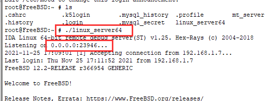
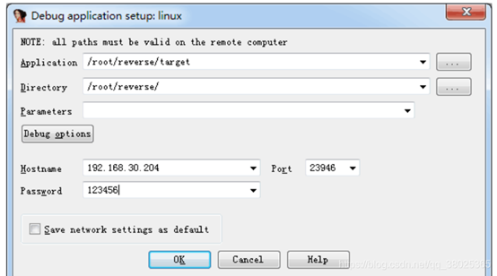
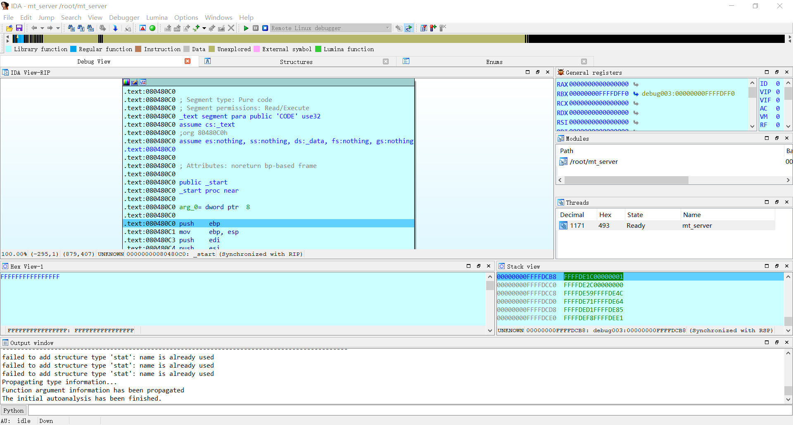

# 25.6 IDA Pro 调试 FreeBSD

IDA Pro 采用客户端-服务器架构支持远程调试：在 Windows 端运行 IDA Pro 客户端，在 FreeBSD 端通过 Linux 兼容层运行 linux_server64 调试服务器。本节给出从环境搭建到连接调试的完整配置步骤。

> **注意**
>
> Windows、IDA 和 FreeBSD 均需要 64 位版本，否则可能无法正常使用。

## 远程调试原理

IDA Pro 的远程调试采用客户端-服务器架构：在目标系统（FreeBSD）上运行调试服务器程序，在分析系统（Windows）上运行 IDA Pro 客户端。两者通过网络通信，实现对目标程序的控制与调试信息交互。

FreeBSD 系统可通过 Linux 二进制兼容层运行 IDA 提供的 `linux_server64` 调试服务器。该服务器负责监控目标程序执行、处理断点、获取寄存器与内存状态，并将信息传回 IDA Pro 客户端。

## 配置步骤

### 1. 准备调试服务器

首先在 Windows 系统中 IDA 的安装路径下，找到 dbgsrv 文件夹中的 `linux_server64` 文件。该文件是 IDA 提供的 Linux 调试服务器程序，可通过 FreeBSD 的 Linux 兼容层运行。

将 `linux_server64` 复制到 FreeBSD 系统中，可使用 WinSCP、SCP 或其他文件传输工具。同时将需要远程调试的目标文件一并复制。

在 FreeBSD 系统中创建工作目录并放置文件：

```sh
# mkdir -p /root/reverse
# cp /path/to/linux_server64 /root/reverse/
# cp /path/to/target /root/reverse/
```

相关文件结构：

```sh
/root/
└── reverse/ # 逆向工程工作目录
    ├── linux_server64 # IDA 远程调试服务器
    └── target # 需要调试的目标文件
```

### 2. 启动调试服务器

为调试服务器设置执行权限并启动：

```sh
# cd /root/reverse
# chmod 755 linux_server64
# ./linux_server64
```

运行后调试服务器将监听默认端口，等待 IDA Pro 客户端连接。

### 3. 配置 IDA Pro 客户端

请使用 64 位 IDA，按照如下步骤进行操作：





在调试配置界面中填写以下信息：

- **第一处**：要调试的文件在虚拟机中的名称；
- **第二处**：要调试的文件在虚拟机中的完整路径，例如 **/root/reverse/target**；
- **第三处**：传递给 main 函数的参数，一般情况下无需填写。

接下来填写 FreeBSD 系统的连接信息：

- **Hostname**：FreeBSD 系统的主机 IP 地址；
- **Port**：调试服务器监听的端口号（默认通常为 23946）；
- **Password**：调试服务器设置的密码（如未设置可留空）。

在 FreeBSD 系统终端中执行以下命令查看本机 IP 地址：

```sh
# ifconfig -a
```

配置完成后连接调试服务器，连接成功后即可开始调试。



## 课后习题

1. 配置 IDA Pro 远程调试环境，编写一个简单的 FreeBSD C 程序，设置断点并调试其系统调用过程。
2. 分析 IDA Pro 在调试 FreeBSD 程序时的权限模型。
3. 尝试替代方案，使用 GDB 或 LLDB 调试一个 FreeBSD 二进制程序，对比与 IDA Pro 的调试体验差异。
