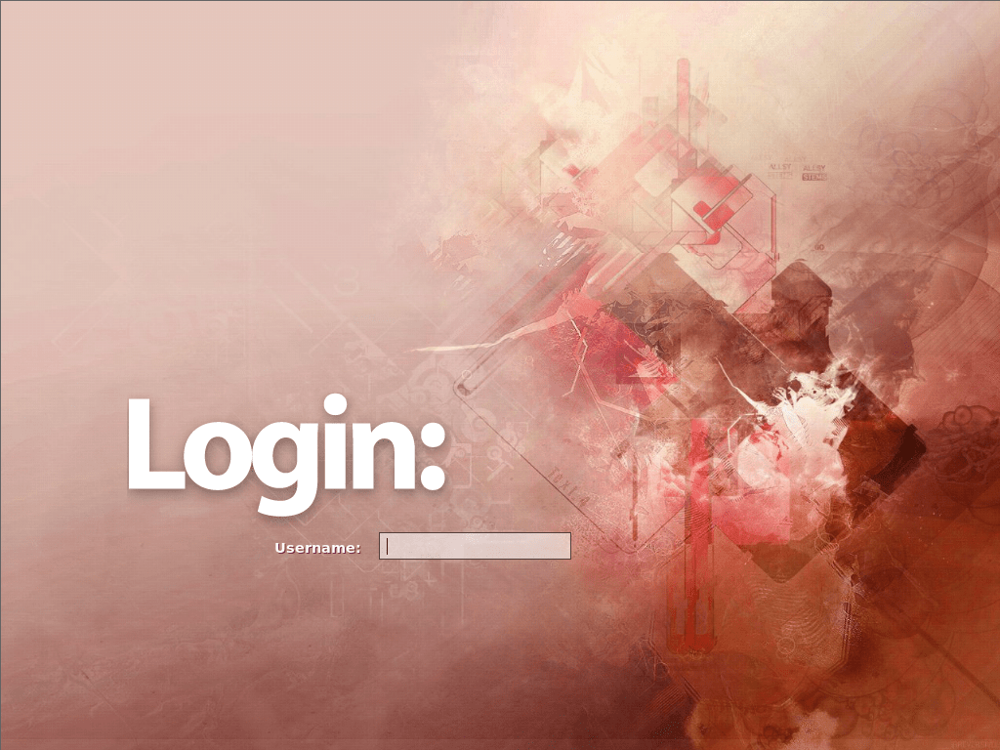
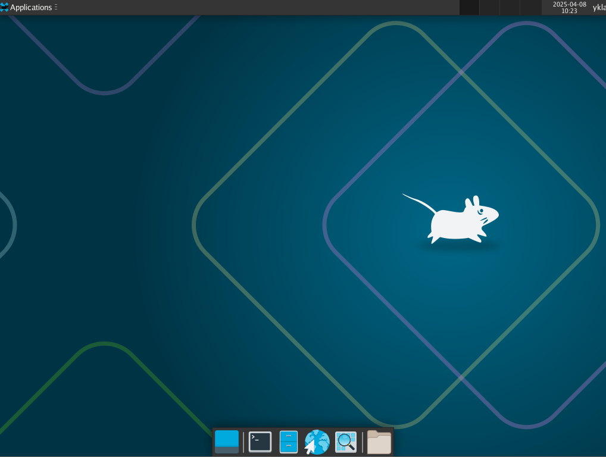
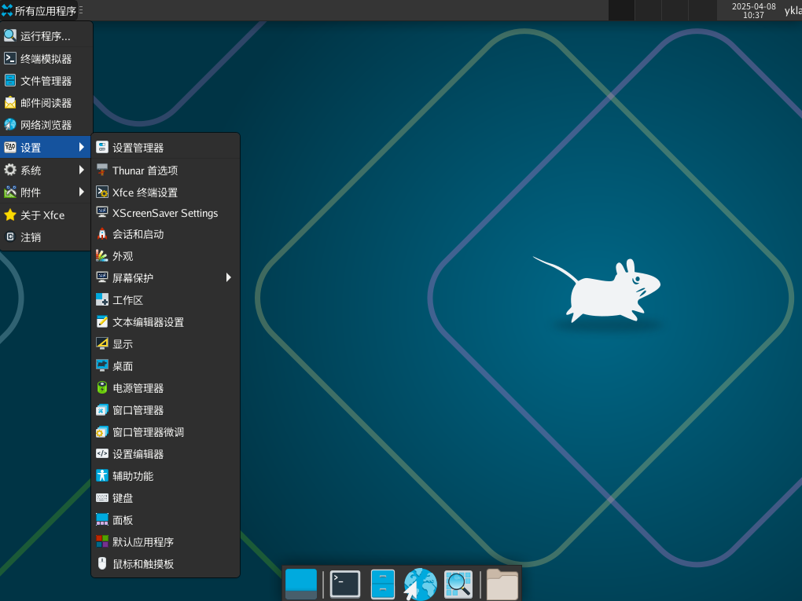
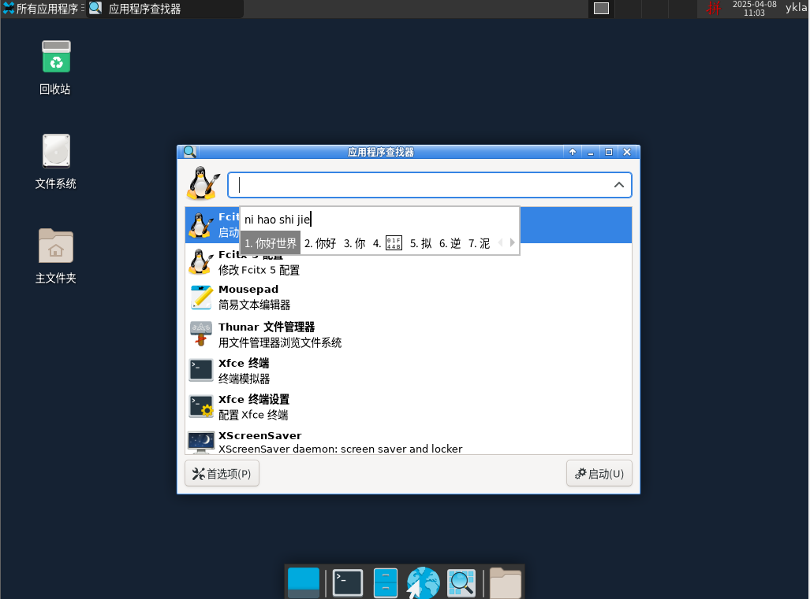
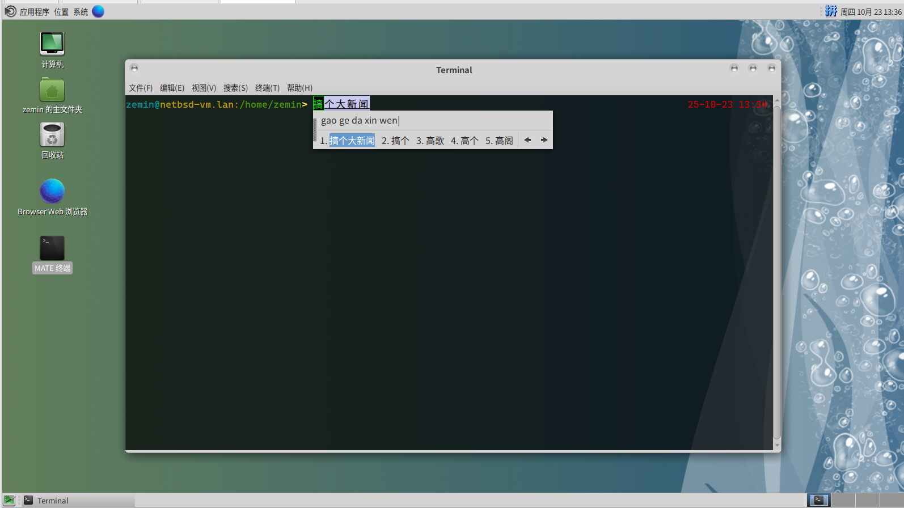

# 26.4 桌面及中文软件配置

在 27.3 节介绍 NetBSD 包管理系统的基础上，本节系统介绍 NetBSD 下常见桌面环境（Xfce、MATE、KDE 4）的安装与配置方法，以及中文本地化环境的构建方案，为读者提供完整的桌面使用实践参考。

## 设置中文环境

配置中文环境是使用中文桌面的前提条件。创建或编辑 `~/.xinitrc` 文件，该文件是 Xorg 启动时的用户初始化脚本，应以将要登录的用户身份进行修改，可使用 `su` 命令切换到该用户。在该文件的最上方加入下列几行：

```ini
export LANG=zh_CN.UTF-8       # 设置系统语言环境为中文 UTF-8
export LC_CTYPE=zh_CN.UTF-8   # 设置字符类型本地化为中文 UTF-8
export LC_ALL=zh_CN.UTF-8     # 设置所有本地化环境变量为中文 UTF-8，优先级最高
```

## Fcitx 中文输入法

Fcitx 是一个广泛应用的中文输入法框架。安装 Fcitx 5 输入法框架及其 Qt 和 GTK 支持模块，以及中文输入法插件：

```sh
# pkgin install fcitx5 fcitx5-qt fcitx5-gtk fcitx5-chinese-addons
```

fcitx5 是主程序，fcitx5-qt 和 fcitx5-gtk 分别提供 Qt 和 GTK 应用程序的输入法支持，fcitx5-chinese-addons 包含中文输入法插件。

创建或编辑 `~/.xinitrc` 文件，应以将要登录的用户身份进行修改。在已设置中文环境变量的下方加入以下内容：

```ini
export XMODIFIERS='@im=fcitx'     # 设置 XIM 修饰符，使用 fcitx 输入法
export GTK_IM_MODULE=fcitx        # 指定 GTK 输入法模块为 fcitx
export QT_IM_MODULE=fcitx         # 指定 Qt 输入法模块为 fcitx
```

创建 Fcitx 用户配置目录：

```sh
$ mkdir -p ~/.config/fcitx
```

## IBus 中文输入法

IBus 是另一个常用的输入法框架。安装 IBus 输入法框架及其中文拼音输入法引擎：

```sh
# pkgin install ibus ibus-pinyin
```

创建或编辑 `~/.xinitrc` 文件，应以将要登录的用户身份进行修改，可使用 `su` 切换到该用户。在中文环境变量下面加入：

```ini
export GTK_IM_MODULE=ibus           # 设置 GTK 输入法模块为 IBus
export QT_IM_MODULE=ibus            # 设置 Qt 输入法模块为 IBus
export XMODIFIERS=@im=ibus          # 设置 XIM 修饰符，使用 IBus 输入法
ibus-daemon --daemonize --xim       # 启动 IBus 守护进程，--daemonize 表示后台运行，--xim 启用 XIM 支持
```

## Xfce

### 安装 Xfce

Xfce 是一个轻量级的桌面环境，以下是其安装步骤。首先需要安装 Xfce 桌面环境、FAM 文件监控服务、SLiM 显示管理器、中文字体以及 ee 文本编辑器：

```sh
# pkgin install xfce4 fam slim noto-cjk-fonts ee
```

xfce4 是桌面环境本体，fam 提供文件变更监控服务，slim 是轻量级显示管理器，noto-cjk-fonts 提供中文等 CJK 字体支持，ee 是一个简单的文本编辑器（注意：ee 是 FreeBSD 基本系统自带的编辑器，在 NetBSD 中需通过 pkgsrc 安装）。

### 配置 Xfce

安装完成后，需要进行相关配置。使用 `ee` 编辑器编辑 `/etc/rc.conf` 文件，该文件控制系统启动服务，将其中的 `xdm=YES` 修改为 `xdm=NO`，因为将使用 SLiM 作为显示管理器，其他类似配置同理。

然后执行以下命令进行配置：

```sh
# cp /usr/pkg/share/examples/rc.d/famd /etc/rc.d/   # 将 famd 服务示例脚本复制到 rc.d 目录
# cp /usr/pkg/share/examples/rc.d/dbus /etc/rc.d/  # 将 dbus 服务示例脚本复制到 rc.d 目录，dbus 提供进程间通信服务
# cp /usr/pkg/share/examples/rc.d/slim /etc/rc.d/  # 将 slim 显示管理器示例脚本复制到 rc.d 目录
# echo rpcbind=YES >> /etc/rc.conf                   # 在 rc.conf 中启用 rpcbind 服务
# echo famd=YES >> /etc/rc.conf                      # 在 rc.conf 中启用 famd 服务
# echo dbus=YES >> /etc/rc.conf                      # 在 rc.conf 中启用 dbus 服务
# echo slim=YES >> /etc/rc.conf                      # 在 rc.conf 中启用 slim 显示管理器
$ echo xfce4-session >> ~/.xinitrc                  # 将 XFCE4 会话写入 .xinitrc，以便 startx 启动
$ ln ~/.xinitrc ~/.xsession                          # 创建 .xsession 链接，兼容 X 显示管理器启动
```

以下是 NetBSD 桌面环境配置相关的目录和文件结构：

```sh
/
├── etc/
│   ├── rc.conf # 系统启动服务配置文件
│   ├── rc.d/ # 系统服务启动脚本目录
│   └── X11/
│       └── xorg.conf # Xorg 配置文件
├── root/
│   └── xorg.conf.new # 生成的 Xorg 配置文件
├── var/
│   └── run/
│       └── vmblock-fuse/ # VMware 文件共享挂载点
├── dev/
│   └── wsmouse # 鼠标设备文件，wscons 控制台的鼠标接口
└── usr/
    └── pkg/
        └── share/
            └── examples/
                └── rc.d/ # rc.d 服务示例脚本目录
                    ├── famd # FAM 服务示例脚本
                    ├── dbus # DBus 服务示例脚本
                    ├── slim # SLiM 显示管理器示例脚本
                    └── avahidaemon # Avahi 守护进程示例脚本
```

```sh
~
├── .xinitrc # Xorg 初始化脚本
├── .xsession # X 会话配置（与 .xinitrc 链接）
└── .config/
    └── fcitx/ # Fcitx 输入法配置目录
```

首次启动桌面环境可能需要一定时间。配置完成后，可以看到 Xfce 桌面的初始化界面：







Fcitx 输入法配置后的界面：



### 参考文献

- Slice2. HOWTO install the XFCE 4 Desktop on NetBSD 8.1[EB/OL]. (2019-09-21)[2026-03-25]. <https://slice2.com/2019/09/21/howto-install-the-xfce-4-desktop-on-netbsd-8-1/?amp=1>. 提供 Xfce 4 在 NetBSD 上的详细安装步骤。

## MATE

### 安装 MATE

MATE 是一个传统风格的桌面环境，以下是其安装步骤。首先需要安装 MATE 桌面环境及其组件、SLiM 显示管理器、Marco 窗口管理器、FAM 文件监控服务、中文字体，以及 ee 文本编辑器：

```sh
# pkgin in mate-desktop mate slim marco fam noto-cjk-fonts ee
```

> **技巧**
>
> `pkgin in` 即 `pkgin install` 的缩写。要查看其他可用缩写，可直接运行 `pkgin` 命令而不带参数。

### 配置 MATE

安装完成后，执行以下命令配置 MATE 桌面环境：

```sh
# cp /usr/pkg/share/examples/rc.d/famd /etc/rc.d/       # 将 famd 服务示例脚本复制到 rc.d 目录
# cp /usr/pkg/share/examples/rc.d/dbus /etc/rc.d/      # 将 dbus 服务示例脚本复制到 rc.d 目录
# cp /usr/pkg/share/examples/rc.d/slim /etc/rc.d/      # 将 slim 显示管理器示例脚本复制到 rc.d 目录
# echo rpcbind=YES >> /etc/rc.conf                     # 在 rc.conf 中启用 rpcbind 服务
# echo famd=YES >> /etc/rc.conf                        # 在 rc.conf 中启用 famd 服务
# echo dbus=YES >> /etc/rc.conf                        # 在 rc.conf 中启用 dbus 服务
# echo slim=YES >> /etc/rc.conf                        # 在 rc.conf 中启用 slim 显示管理器
# echo avahidaemon=YES >> /etc/rc.conf                 # 在 rc.conf 中启用 avahidaemon 服务
$ echo exec mate-session >> ~/.xinitrc                 # 将 MATE 会话写入 .xinitrc，以便 startx 启动
# cp /usr/pkg/share/examples/rc.d/avahidaemon /etc/rc.d/  # 将 avahidaemon 服务示例脚本复制到 rc.d 目录，avahi 提供零配置网络发现服务
$ ln ~/.xinitrc ~/.xsession                             # 创建 .xsession 链接，兼容 X 显示管理器启动
```

配置完成后，可以看到 MATE 桌面环境的界面：



### 参考文献

- gracefeld. 成功尝试在 NetBSD 9.0 中安装 Mate 桌面环境[EB/OL]. [2026-03-25]. <https://www.bilibili.com/read/cv17144331>. 记录 NetBSD 9.0 上 MATE 桌面环境的配置过程。

## KDE 4

KDE 4 是一个功能丰富的桌面环境，以下是相关安装和配置说明。

以下配置在物理机 UEFI 模式下测试通过。

> **警告**
>
> 在 VirtualBox、VMware 等虚拟化环境下目前无法正常进入桌面（UEFI 模式），启动后会出现黑屏现象，该问题已报告至 [NetBSD Problem Report #57554](https://gnats.netbsd.org/cgi-bin/query-pr-single.pl?number=57554)，如果读者知道原因欢迎告知。

### 安装 KDE 4

首先需要安装 KDE 桌面环境、中文字体、Readline 库、CUPS（Common UNIX Printing System，通用 UNIX 打印系统）打印系统，以及 ee 文本编辑器：

```sh
# pkgin in kde4 noto-cjk-fonts readline libcups ee
```

kde4 是桌面环境元包，readline 提供命令行编辑功能，libcups 是打印系统库。

### 配置 KDE 4

安装完成后，执行以下命令配置 KDE 4 桌面环境。将所有服务示例脚本复制到 rc.d 目录，以便需要时可以启用：

```sh
# cp /usr/pkg/share/examples/rc.d/* /etc/rc.d           # 将所有 rc.d 服务示例脚本复制到 /etc/rc.d 目录
# echo dbus=YES >> /etc/rc.conf                        # 在 rc.conf 中启用 dbus 服务
# echo kdm=YES >> /etc/rc.conf                         # 在 rc.conf 中启用 KDM 显示管理器
# echo rpcbind=YES >> /etc/rc.conf                     # 在 rc.conf 中启用 rpcbind 服务
# echo avahidaemon=YES >> /etc/rc.conf                 # 在 rc.conf 中启用 avahidaemon 服务
# echo hostname=ykla >> /etc/rc.conf                   # 设置主机名为“ykla”，请读者根据需要修改为实际主机名
```

输入命令 `reboot` 重启系统。

默认状态下允许 root 登录。

### 故障排除

#### 无中文环境

由于 KDE 4 已被上游停止维护，其中文语言包已从 pkgsrc 中移除，详见 [NOTICE: This package has been removed from pkgsrc](https://pkgsrc.se/x11/kde4-l10n-zh_CN)。

### 参考文献

- NetBSD Project. NetBSD Wiki/GNOME[EB/OL]. [2026-03-25]. <https://wiki.netbsd.org/GNOME/>. 提供 NetBSD 上 GNOME 桌面环境的安装指南。
- Espinatel. How can I start kde5 in netBSD9 ?[EB/OL]. [2026-03-25]. <https://www.unix.com/unix-for-beginners-questions-and-answers/283891-how-can-i-start-kde5-netbsd9.html>. 讨论 NetBSD 9 中 KDE 5 的启动配置。
- Barry Scott. Re: How to install KDE on NetBSD?[EB/OL]. (2020-09-19)[2026-03-25]. <https://www.mail-archive.com/netbsd-users@netbsd.org/msg13146.html>. 提供 KDE 在 NetBSD 上的安装方法。

## 在 VMware 中安装 NetBSD

### 安装 open-vm-tools

在 NetBSD 中尚未提供 xf86-video-vmware、xf86-input-vmmouse、open-vm-kmod 等组件，这些组件分别提供 VMware 显卡驱动、鼠标驱动和内核模块，仅需安装 open-vm-tools 即可。以下是具体安装步骤：

安装 VMware 虚拟机工具 open-vm-tools，用于增强虚拟机性能和功能：

```sh
# pkgin install open-vm-tools
```

安装完成后，需运行以下命令进行配置：

```sh
# mkdir /var/run/vmblock-fuse                # 创建 vmblock-fuse 挂载点目录，用于 VMware 文件共享
# vmware-vmblock-fuse /var/run/vmblock-fuse # 启动 vmware-vmblock-fuse 服务，支持 VMware 文件共享
# echo vmtools=YES >> /etc/rc.conf           # 在 rc.conf 中启用 open-vm-tools 服务开机启动
```

编辑 `~/.xinitrc` 文件，添加以下内容，应以将要登录的用户身份进行修改：

```ini
vmware-user-suid-wrapper   # 启动 VMware 用户工具的 SUID 包装器，以提升权限执行特定操作
vmware-user                 # 启动 VMware 用户工具，用于增强虚拟机内的桌面集成功能
```

重启系统即可。

### 鼠标无法正常使用的问题

NetBSD 默认的 Xorg 配置可能存在兼容性问题，导致鼠标无法正常使用。wsmouse 是 NetBSD wscons 控制台框架提供的鼠标设备接口。需要在退出 Xorg 后手动生成并修改配置文件，操作步骤如下：

如果系统启动时启用了 Xorg 和 SLiM 显示管理器，可在 `/etc/rc.conf` 文件中添加以下行，以禁用 SLiM 显示管理器：

```ini
slim=NO        # 如果有 slim=YES，请修改为此行
```

生成并修改 Xorg.conf 文件：

```sh
# Xorg -configure                           # 自动生成 Xorg 配置文件
# mv /root/xorg.conf.new /etc/X11/xorg.conf # 将生成的 Xorg 配置文件移动到系统 X11 配置目录
```

编辑 `/etc/X11/xorg.conf` 文件，修改以下段落。AutoAddDevices 用于控制 Xorg 是否自动探测和配置输入设备，禁用它可以避免与 wsmouse 驱动冲突：

```ini
Section "ServerLayout"
        Identifier     "X.org Configured"
        Screen      0  "Screen0" 0 0
        InputDevice    "Mouse0" "CorePointer"
        InputDevice    "Keyboard0" "CoreKeyboard"
        Option          "AutoAddDevices" "Off"		# 禁用自动添加输入设备，防止 Xorg 自动识别和配置新硬件，避免与 wsmouse 冲突
EndSection

…………此处省略一部分…………

Section "InputDevice"
        Identifier  "Mouse0"
        Driver      "mouse"
        Option      "Protocol" "auto"        # 设置协议为 auto，以便自动识别设备类型
        Option      "Device" "/dev/wsmouse"
        Option      "ZAxisMapping" "4 5 6 7"
EndSection

```

## 课后习题

1. 在 VMware 或 VirtualBox 中复现 KDE 4 在 UEFI 模式下的黑屏问题，尝试解决。
