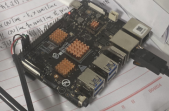
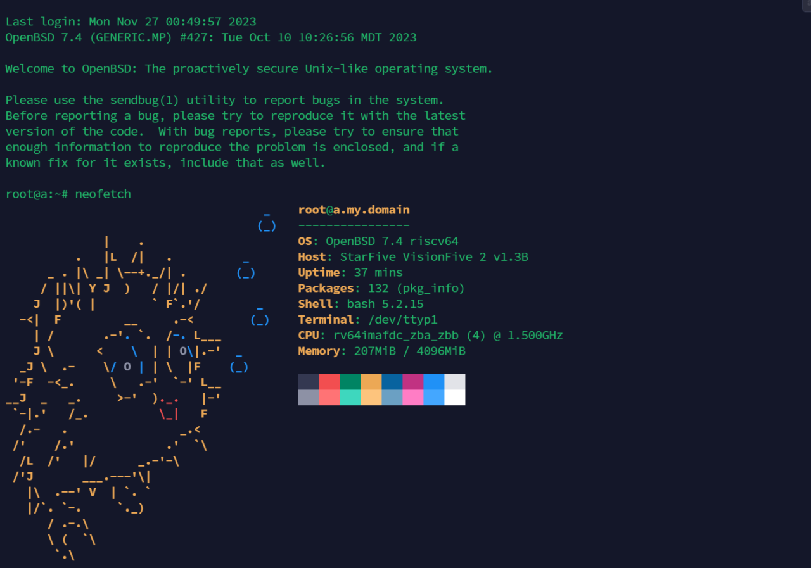

# 26.6 在昉·星光 2 开发板（RISC-V）上安装 OpenBSD

RISC-V 是一种基于精简指令集（RISC）原则的开源指令集架构，其诞生地与 FreeBSD 相同：加州大学伯克利分校。RISC-V 的指令集规范使用 CC BY 4.0 许可证（一种类似于 BSD 许可证的宽松许可证，要求署名但允许自由使用和修改）。该架构被认为具有成为未来主流处理器架构的潜力。FreeBSD 是最早支持 RISC-V 的开源操作系统之一。

随着开源指令集架构 RISC-V 的持续发展，OpenBSD 也逐步扩展了对该架构的支持，为嵌入式系统与开源硬件领域提供了安全可靠的操作系统选择。

本节介绍如何在昉·星光 2 开发板上安装 OpenBSD 系统。

本节基于 StarFive VisionFive 2 和 OpenBSD 7.4。

在此之前，建议先了解 RISC-V 开发板的基本启动流程。相关文档可参考 [https://doc.rvspace.org/VisionFive2/PDF/VisionFive2_QSG.pdf](https://doc.rvspace.org/VisionFive2/PDF/VisionFive2_QSG.pdf)。



## 关键概念说明

在开始安装前，了解以下关键概念有助于理解安装流程：

- **OpenSBI（Open Source Supervisor Binary Interface）**：RISC-V 架构的固件实现，提供 SBI 接口与底层运行时支持，为操作系统提供标准化调用环境。
- **设备树（DTB，Device Tree Blob）**：描述硬件拓扑与配置的二进制数据结构，由引导程序传递给操作系统用于硬件识别。
- **U-Boot**：通用引导加载程序，负责加载操作系统内核、设备树及相关启动参数并启动系统。

RISC-V 的启动方式不同于树莓派。树莓派通常从存储介质中的引导分区加载启动文件，而在许多 RISC-V 开发板上，系统启动依赖预先写入 SPI Flash 等非易失性存储中的固件与引导程序。通常需要将 OpenSBI 和 U-Boot 刷入闪存中，由 OpenSBI 提供底层运行时支持并将控制权交给 U-Boot，再由 U-Boot 加载设备树（DTB）和操作系统内核以完成系统启动。OpenSBI 本身也位于闪存中，并可独立升级。

## 安装前准备

在开始安装前，需要准备好以下硬件和软件环境。

- 一块支持 OpenBSD 的 RISC-V 开发板，本节以 StarFive VisionFive 2 为例
- 一张 SD 卡，至少 8 GB
- 一根 USB TTL 串口线，本节使用 FT232 芯片（推荐使用 CH340 芯片以获得更好兼容性）
- 通过串口线与 StarFive VisionFive 2 交互的计算机
- 一台 TFTP 服务器（可以是虚拟机）

## OpenBSD 镜像准备

准备工作完成后，需要下载 OpenBSD 镜像文件和相关设备树文件。

从 OpenBSD 官方网站下载镜像文件 `miniroot74.img`。

从 <https://marc.info/?l=openbsd-misc&m=169046816826966&q=p3> 下载 `jh7110-starfive-visionfive-2-v1.3b.dtb` 并上传到 TFTP 服务器。

将 `miniroot74.img` 烧录到 SD 卡中。本文使用 [BalenaEtcher](https://etcher.balena.io/) 工具进行操作。

启动 VisionFive 2，并在串口输出显示 `Hit any key to stop autoboot` 时，在电脑的串口软件上按任意键，只有成功中断自动启动（autoboot）才能进入 U-Boot 环境。

串口输出如下：

```sh
U-Boot SPL 2021.10 (Dec 25 2022 - 20:59:18 +0800)
DDR version: dc2e84f0.
Trying to boot from SPI

OpenSBI v1.0
   ____                    _____ ____ _____
  / __ \                  / ____|  _ \_   _|
 | |  | |_ __   ___ _ __ | (___ | |_) || |
 | |  | | '_ \ / _ \ '_ \ \___ \|  _ < | |
 | |__| | |_) |  __/ | | |____) | |_) || |_
  \____/| .__/ \___|_| |_|_____/|____/_____|
        | |
        |_|

……省略一部分……

Model: StarFive VisionFive V2
Net:   eth0: ethernet@16030000, eth1: ethernet@16040000
switch to partitions #0, OK
mmc1 is current device
found device 1
bootmode flash device 1
Hit any key to stop autoboot:  0  # 在电脑的串口软件上按任意键输入，否则会启动没有准备好的 OpenBSD
StarFive #  # 已经进入 U-Boot 环境
```

## 通过 U-Boot 设置 IP 并加载 DTB 文件

成功进入 U-Boot 后，需要配置网络并加载必要的文件来启动 OpenBSD。

在 U-Boot 环境下执行以下操作：

```sh
dhcp                                     # 启用 DHCP 获取网络配置
setenv serverip 192.168.1.169            # 设置 TFTP 服务器 IP（示例，需要替换为实际 IP）
tftpboot ${fdt_addr_r} jh7110-starfive-visionfive-2-v1.3b.dtb  # 通过 TFTP 加载设备树文件
load mmc 1:1 ${kernel_addr_r} efi/boot/bootriscv64.efi         # 从 MMC 加载 EFI 内核文件
bootefi ${kernel_addr_r} ${fdt_addr_r}  # 启动 EFI 内核并加载设备树，引导 OpenBSD
```

该镜像从内存启动，可直接覆盖安装。安装过程与标准 OpenBSD 安装相同，关于安装的详细说明请参见其他章节。

如果重启后出现提示 `root device:`，请重新从 TFTP 服务器下载相关文件。



## 在 OpenBSD 中启用性能模式

系统安装完成后，用户可以根据需要调整系统性能设置，以获得更好的使用体验。

如果不进行设置，系统默认 `hw.cpuspeed` 参数为 750（这意味着 CPU 的默认运行频率为 750 MHz）。

临时设置硬件性能策略为高性能模式：

```sh
# sysctl hw.perfpolicy=high
```

将该设置写入系统配置文件以在开机时生效（如果文件不存在，请自行创建）：

```sh
# echo "hw.perfpolicy=high" >> /etc/sysctl.conf
```

验证设置是否生效：

```sh
# sysctl hw.perfpolicy
```

## 参考教程

- RISC-V International. RISC-V Instruction Set Manual Snapshot Specification[EB/OL]. (2026-03-20)[2026-04-17]. <https://riscv.github.io/riscv-isa-manual/snapshot/spec/>. RISC-V 指令集手册，中文版位于 <https://gitee.com/riscv-ei/riscv-isa-manual>。
- Feng S. FreeBSD 与 RISC-V: 开源物联网生态系统的未来[EB/OL]. (2019-06)[2026-03-25]. <https://feng.si/posts/2019/06/freebsd-and-risc-v-the-future-of-open-source-iot-ecosystem/>. 探讨了 RISC-V 架构在开源物联网领域的应用前景。
- FreeBSD Project. wiki/riscv[EB/OL]. (2024-03-25)[2026-03-25]. <https://wiki.freebsd.org/riscv>. FreeBSD 官方 RISC-V 架构支持文档，提供技术参考。
- Gordon C S. Installing OpenBSD 7.3-current on a VisionFive2[EB/OL]. (2024-03-25)[2026-03-25]. <https://gist.github.com/csgordon/74658096f7838382b40bd64e11f6983e>. 在 VisionFive2 开发板上安装 OpenBSD 的指南。
- Zhang M. Installing OpenBSD 7.4 on a MilkV Mars[EB/OL]. (2024-03-25)[2026-03-25]. <https://mzh.io/installing-openbsd-7-4-on-a-milkv-mars>. 在 MilkV Mars RISC-V 设备上安装 OpenBSD 7.4 的实践。
- OpenBSD Mailing List. JH7110 - VF2[EB/OL]. (2024-03-25)[2026-03-25]. <https://marc.info/?t=169039246400003&r=1&w=2>. 邮件列表讨论，记录 JH7110 芯片与 VisionFive2 的技术交流。

## 课后习题

1. 在 StarFive VisionFive 2 开发板上安装 OpenBSD 7.4，配置性能模式并测试 CPU 在不同频率下的基准性能，分析 OpenBSD 对 RISC-V 架构的支持现状及其限制。

2. 查找 OpenBSD 源代码中与 JH7110 芯片相关的设备驱动代码，分析其实现方式，并尝试为 VisionFive 2 添加一个新的外设驱动框架。

3. 修改 VisionFive 2 的启动流程，编写自动化脚本替代手动 TFTP 加载步骤。
