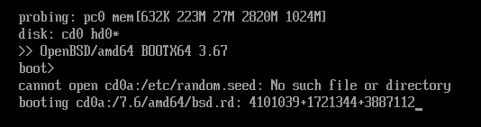

# 第 26.1 节 安装

## release 安装

### 下载镜像

以 OpenBSD 7.5，AMD 64 位架构为例，访问：<https://cdn.openbsd.org/pub/OpenBSD/7.5/amd64> 获取系统镜像。若是刻录 U 盘安装，就下载 `install75.img` （同时支持 UEFI+BIOS）；若是虚拟机体验，请下载 `install75.iso`（ISO 镜像同时支持 UEFI 、BIOS 启动，UEFI 初次加载需要多等几分钟）。（注：截止 OpenBSD 7.5 时，请勿使用 ventoy 引导实体机安装。）




### 安装模式

#### 安装过程（UEFI）

使用“install75.iso”，并开启 VMware 虚拟机的 UEFI 功能。

> Welcome to the OpenBSD/amd64 7.5 installation program.
>
> (I)nstall, (U)pgrade or (S)hell? `i`

选择 i 进行安装

> Choose your keyboard layout ('?', or 'L' for list) \[default]?

选择键盘格式，`回车` 选择默认的美国键盘即可。

> System hostname? (short form, e.g. 'foo') `ykla.cn`

系统主机名，可以选择一个字母少的，将来主机名会显示成 `ykla.cn` 这样。

> Available network interfaces are: em0 vlan0.
>
>>
>>Netuork interface to configure? (name, Lladdr , '?' , or 'done ' \[em0] #输入后，此处按 **回车键**
>>
>>IPu4 address for em0? (or 'autoconf' or 'none')[autoconf] #自动 DHCP IPv4
>>
>>IPv6 address for em0? (or 'autoconf' or 'none')[none] #不需要 IPv6
>>
>>Available network interfaces are: em0 vlan0.
>>
>>Netuork interface to configure? (name, Lladdr , '?' , or 'done ' \[done] #输入后，此处按 **回车键**，若设定错误，可输入 [em0] 退回到上面几步。

这一步选择网络连接。为免去不必要麻烦，请尽量选择有线网络。可先输入 `？`，详细了解网络名称后再选择。如本例中 `em0` 为有线网络。

后续配置直接 **回车键** 确认即可。

> Password for root account? (will not echo)

设置 root 账号密码，输入后回车确认（密码不会显示在屏幕上）。

> Password for root account? (again)

再次输入一遍 root 账号密码，按 **回车键** 确认。


> Start sshd(8) by default? \[yes] 

按 **回车键** 确认，开启 ssh：


> Do you want the X Windows System to be started by xenodm(1)? [no] yes
> 
打开 xenodm 以运行 X

> Setup a user? (enter a lower-case loginname, or 'no') \[no] `ykla`

设置用户名。

> Full user name for ykla?

用户全名，可随意输入或者回车默认。

> Password for ykla account? (will not echo)

为该账号设置密码（密码不会显示在屏幕上）。

> Password for ykla account? (again)

再次输入该用户名的密码。

> Allow root ssh login?（yes, no, prohibit-password）[no] yes

输入 yes 以允许 root 登录 ssh。

> What timezone are you in? ('?' for list) \[US/Eastern] `Asia/Shanghai`

设置时区。

> Available disks are: sd0.
> sd1
> sd2
> Encrypt the root disk? (disk,  'no' or '?' for details) [no]

回车，不加密磁盘。

> Available disks are: sd0 sd1 sd2
> Which one is the root disk? (or 'done') \[wd0] `?`

输入 `?` 查看硬盘：

```sh
Which disk is the root disk? (‘?‘ for details) [sd0] ?
sd0: NVMe, VMware Virtual N, 1.3 (80.0G)
sd1: NVMe, VMware Virtual N, 1.3 (1.0G)
sd2: NVMe, VMware Virtual N, 1.3 (0.1G)
Available disks are: sd0 sdl sd2.
Which disk is the root disk? (‘?‘ for details) [sd0]
```

这一步是选择要将系统安装在哪一块硬盘。按 `?` 列出识别的所有硬盘。请务必记住所有的盘符。然后输入需要安装的位置，如我们这里选择 `sd0`。输入 `sd0` 回车。

> Use (W)hole disk MBR, whole disk (G)PT or (E)dit? \[gpt]

回车。

> Use (A)uto layout, (E)dit auto layout, or create (C)ustom layout? \[a]

这里我们直接回车，选择系统默认分区。

>**技巧**
>
>文末附有自定义分区设置，仅供参考，不推荐新用户尝试。但是若你使用自动分区，你将大概率无法安装任何桌面（存储空间分配不合理）。

Available disk are: sd0.Which disk do you wish to initialize? (or 'done') \[done] 直接回车。

> Let's install the sets! Location of sets? (cd disk ftp http or 'done') \[cd] `disk`

软件地址，选择 `disk`。这里我们选择安装盘为软件地址。

> Is the disk partition already mounted? \[yes] `no`

需要提示一点的是，系统询问是否已识别 U 盘时，一定要选择否，否则系统不会识别。如不确定 U 盘编号，可输入 `?` 查看。

```sh
Which disk contains the install media? (Cor 'done') [sd1] 选择 sd1
a: 1358848 1024 2048 16384 16142
i: 960 64 MSDOS
Available sd1 partitions are: a i.
Which wdo partition has the install sets? Cor 'done') [a] 回车
Pathname to the sets? Cor 'done') [7.5/amd64] 回车
```
```sh
Select sets by entering a set name, a file name pattern or 'all'. De-select
sets by prepending a '-' to the set name, name pattern or 'all'. Selected sets are labelled `[X]`

[X] bsd      [X] bsd.rd        [X] comp75.tgz   [X] game75.tgz  [X] xshare75.tgz  [X] xserv75.tgz
[X] bsd.mp   [X] base75.tgz    [H] man75.tgz    [X] xbase75.tgz [X] xfont75.tgz


Set name(s)? (or 'abort' or 'done') [done] -game*
```

这里我们可输入 `-game*` 来取消 `game75.tgz`，其它都勾选。也可以直接回车。

注：即使不使用桌面，也请勾选 `X11` 相关选项，否则部分软件可能无法正常运行。

```sh
Set name(s)? (or 'abort' or 'done') [done] 输入 -game*

[X] bsd      [X] bsd.rd        [X] comp75.tgz   [ ] game75.tgz  [X] xshare75.tgz  [X] xserv75.tgz
[X] bsd.mp   [X] base75.tgz    [H] man75.tgz    [X] xbase75.tgz [X] xfont75.tgz

Set name(s)? (or 'abort' or 'done') [done] 回车
Directory does not contain SHA256sig. Continue without verification? [no] 输入 yes
```

> Location of sets? (cd disk ftp http or 'done') \[done]

如果不想卡在 `fw_update` 这一步，请在此处拔掉网线断开网络。

继续回车确认。此后开始安装系统。约 5 分钟后，会出现如下提示：

```sh
CONGRATULATIONS! Your OpenBSD install has been successfully completed!
To boot the new system, enter 'reboot' at the command prompt.
When you login to your new system the first time,
please read your mail using the 'mail' command.
```


自动安装的分区如下：

```sh
ykla# cat /etc/fstab                                                                                            
798e155a2c1de208.b none swap sw
798e155a2c1de208.a / ffs rw 1 1
798e155a2c1de208.l /home ffs rw,nodev,nosuid 1 2
798e155a2c1de208.d /tmp ffs rw,nodev,nosuid 1 2
798e155a2c1de208.f /usr ffs rw,nodev 1 2
798e155a2c1de208.g /usr/X11R6 ffs rw,nodev 1 2
798e155a2c1de208.h /usr/local ffs rw,wxallowed,nodev 1 2
798e155a2c1de208.k /usr/obj ffs rw,nodev,nosuid 1 2
798e155a2c1de208.j /usr/src ffs rw,nodev,nosuid 1 2
798e155a2c1de208.e /var ffs rw,nodev,nosuid 1 2
```
```sh
ykla# disklabel -h sd0
# /dev/rsd0c:
type: SCSI
disk: SCSI disk
label: VMware Virtual N
duid: 798e155a2c1de208
flags:
bytes/sector: 512
sectors/track: 63
tracks/cylinder: 255
sectors/cylinder: 16065
cylinders: 10443
total sectors: 167772160 # total bytes: 81920.0M
boundstart: 532544
boundend: 167772127

16 partitions:
#                size           offset  fstype [fsize bsize   cpg]
  a:          1024.0M           532544  4.2BSD   2048 16384 12960 # /
  b:          3343.4M          2629696    swap                    # none
  c:         81920.0M                0  unused                    
  d:          4096.0M          9477056  4.2BSD   2048 16384 12960 # /tmp
  e:          9268.1M         17865664  4.2BSD   2048 16384 12960 # /var
  f:          8567.8M         36846784  4.2BSD   2048 16384 12960 # /usr
  g:          1024.0M         54393600  4.2BSD   2048 16384 12960 # /usr/X11R6
  h:         11625.7M         56490752  4.2BSD   2048 16384 12960 # /usr/local
  i:           260.0M               64   MSDOS                    
  j:          2913.5M         80300160  4.2BSD   2048 16384 12960 # /usr/src
  k:          6144.0M         86267104  4.2BSD   2048 16384 12960 # /usr/obj
  l:         33653.4M         98850016  4.2BSD   2048 16384 12960 # /home
```

恭喜！系统已成功安装，重启后可进入系统。

### 附录：自定义分区


系统分区时，选择 `C`（`(C)ustom`），即 `自定义设置`。

> `p m`（注意之间的空格）

输入 `p m` 来显示硬盘。其它选项如下表：

| 代码 |     作用     |
| :--: | :----------: |
| p m  | 查看分区大小 |
|  A   | 自动分区    |
|  a   |   增加分区   |
|  d   |   删除分区   |
|  z   | 删除全部分区 |
|  q   |   确认分区   |

假设有 80GB 的容量，可设分区： `EFI 260MB`、`/` 75G、`swap` 为剩下的全部容量。**顺序不可动，否则无法启动！必须先分一个 /，再分 swap。基本思路：自动分区——>删去除了 i 分区以外的分区——>分 /——>分 swap**

>> 使用 `d` 删除现有的分区，但会保留 `i` 分区这个 EFI 分区（OpenBSD 7.5 及以上，7.5 以下请挨个删除）
>
> 即：
>
>>```sh
>>p m
>>OpenBSD area: 532544-167772127; size: 81660.0M; free: 81660.0M
>>#       size        offset    fstype [fsize bsize  cpg]
>>  c:    81920.0M          0    unused
>>  i:      260.0M         64    MSDOS
>>```
    

>> `a`
>
> partition: \[a]
>
> offset: \[532544]
>
> size: \[167239583] 75G
>
> FS type: \[4.2BSD]
>
> mount point: \[none] `/`


这里设置了 75GB 的 / 分区。


>> `a`
>
> partition: \[b]
>
> offset: \[157822560]
>
> size: \[9949567] 
>
> FS type: \[swap]


>>```sh
>>p m
>>OpenBSD area: 532544-167772127; size: 81660.0M; free: 81660.0M
>>#             size            offset    fstype   [fsize bsize  cpg]
>>  a:      76801.8M           532544      4.2BSD    2048 16384    1  #   /  
>>  b:       4858.2M        157822560        swap
>>  c:      81920.0M                0      unused
>>  i:        260.0M               64       MSDOS
>>```

注意 `size` 一栏里我们并未输入数值，而是直接回车，意味着上步余下的全部容量都给了该分区，即 `swap` 分区。

配置完毕，记得输入 `q` 确认。

>> `q`
>>
>> Write new label?: [y]

以上，分区完毕。

## 从 release 升级到 stable 或 current

OpenBSD [不建议](https://www.openbsd.org/faq/current.html)从 release 升级到 current，建议直接使用[快照版本](https://cdn.openbsd.org/pub/OpenBSD/snapshots/)（即预构建的 current）。

经过测试如果直接从 release 升级到 current 会卡在这里：

```sh
===> sbin/shutdown
install -c -s  -o root -g _shutdown  -m 4550 shutdown /sbin/shutdown
install -c -o root -g bin -m 444  /usr/src/sbin/shutdown/shutdown.8 /usr/share/man/man8/shutdown.8
install: unknown group _shutdown
*** Error 1 in target 'realinstall'
*** Error 1 in sbin/shutdown (<bsd.prog.mk>:157 'realinstall')
*** Error 2 in sbin (<bsd.subdir.mk>:48 'realinstall')
*** Error 2 in . (<bsd.subdir.mk>:48 'realinstall')
*** Error 2 in . (Makefile:97 'do-build')
*** Error 2 in /usr/src (Makefile:74 'build'
```

- current:
```sh
$ cd /usr
$ cvs -qd anoncvs@anoncvs.jp.openbsd.org:/cvs checkout -P src
$ cvs -qd anoncvs@anoncvs.jp.openbsd.org:/cvs checkout -P xenocara
$ cvs -qd anoncvs@anoncvs.jp.openbsd.org:/cvs checkout -P ports
```

- 7.3 -stable
```sh
$ cd /usr
$ cvs -qd anoncvs@anoncvs.jp.openbsd.org:/cvs checkout -rOPENBSD_7_3 -P src
$ cvs -qd anoncvs@anoncvs.jp.openbsd.org:/cvs checkout -rOPENBSD_7_3 -P xenocara
$ cvs -qd anoncvs@anoncvs.jp.openbsd.org:/cvs checkout -rOPENBSD_7_3 -P ports
```

```sh
# cd /sys/arch/$(machine)/compile/GENERIC.MP  # 要 cvs 拉取完才有该路径
# make obj
# make config
# make -j4 && make install # 编译内核
# cd /usr/src
# make obj && make -j4 build # 编译基本系统
# sysmerge
# cd /dev && ./MAKEDEV all
# cd /usr/xenocara
# make bootstrap 
# make obj
# make build # 编译 xorg
```


### 参考文献

- [Anonymous CVS](https://www.openbsd.org/anoncvs.html)
- [FAQ - Building the System from Source](https://www.openbsd.org/faq/faq5.html)
- [release — building an OpenBSD release](https://man.openbsd.org/release)
