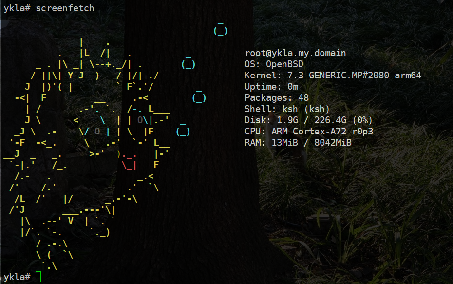
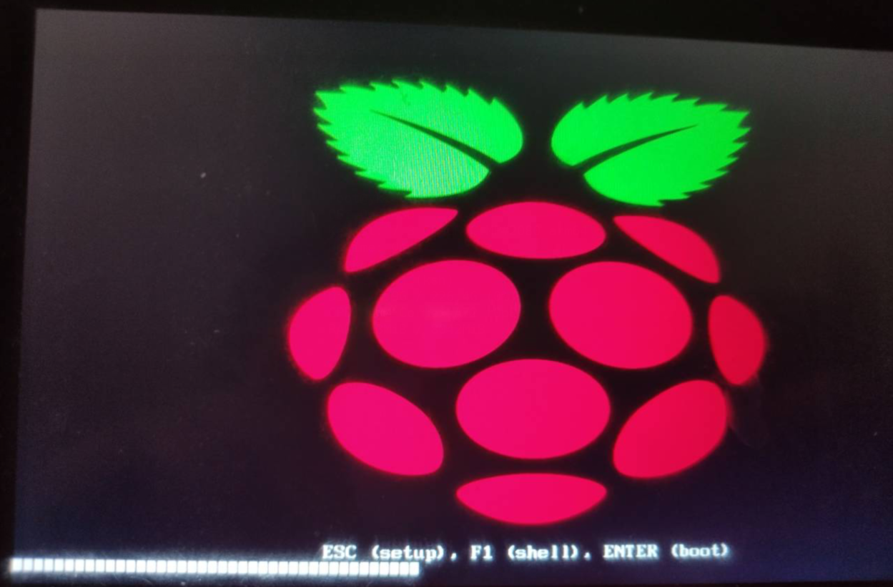
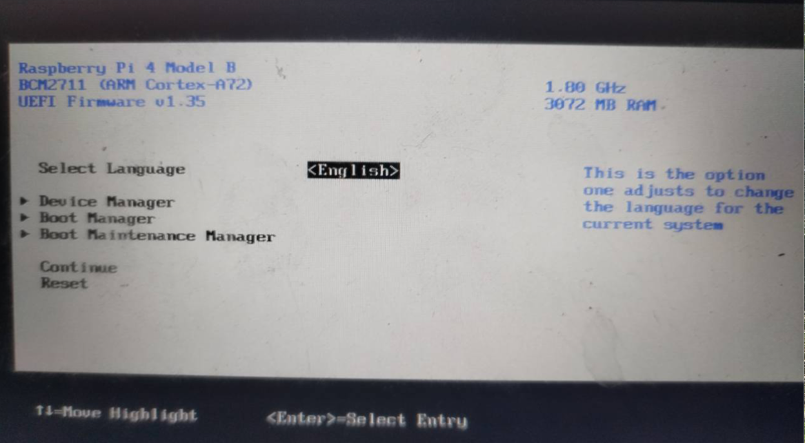
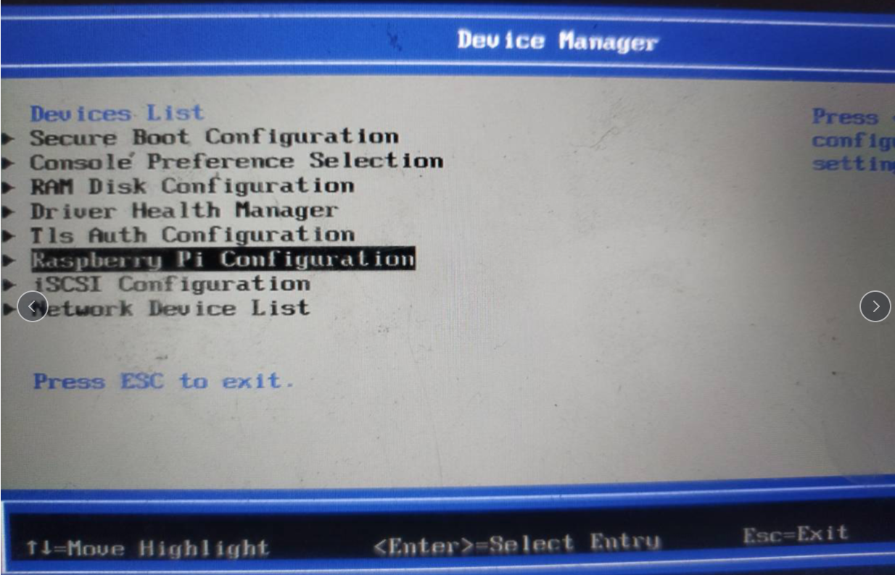
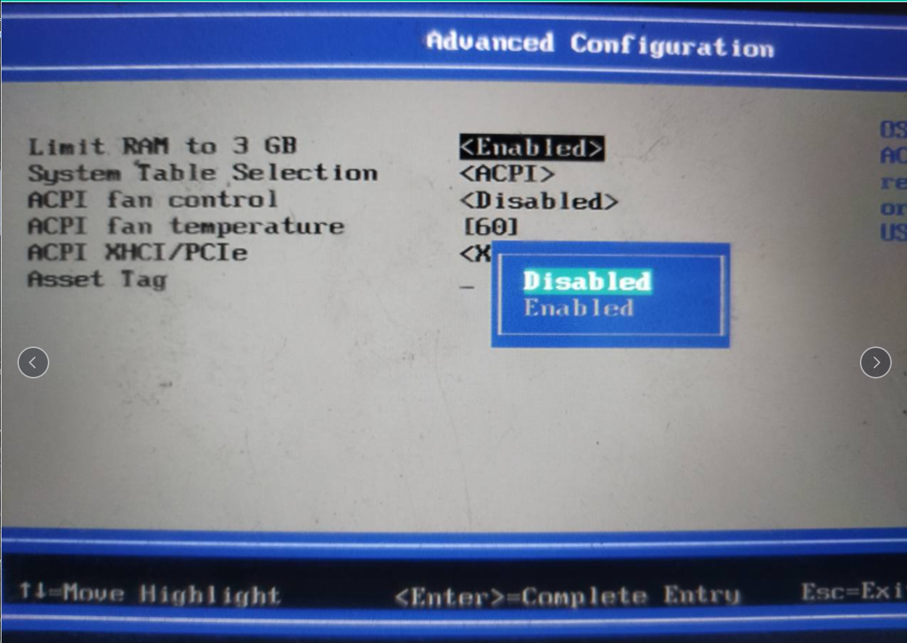

# 26.7 在树莓派上安装 OpenBSD

## RISC-V 简介

RISC-V 是一种基于精简指令集（RISC）原则的开源指令集架构，其诞生地与 FreeBSD 相同：加州大学伯克利分校。RISC-V 也使用 BSD 授权协议。有人认为它可能成为未来处理器的主流架构。FreeBSD 是世界上第一款支持 RISC-V 的开源操作系统。

## 树莓派 4B 8G V1.5 安装 OpenBSD 7.3

OpenBSD 系统当前支持树莓派的以太网卡、Wi-Fi、TF 卡及 USB 3.0 设备。

首先需要两个存储设备，可以是两个 U 盘，或者一个 U 盘加一张存储卡。因为 OpenBSD 的镜像与 FreeBSD 不同，它不是预构建的，需要用户自行安装。其中一个设备作为安装盘，另一个作为系统盘。本示例中使用两个 U 盘进行安装。

按照常规方法下载 [https://ftp.openbsd.org/pub/OpenBSD/7.3/arm64/install73.img](https://ftp.openbsd.org/pub/OpenBSD/7.3/arm64/install73.img)，并使用 Rufus 将其刻录到 U 盘中。刻录完成后，删除 FAT 分区中除 `efi` 文件夹以外的所有文件。

下载树莓派 UEFI 固件：[https://github.com/pftf/RPi4/releases](https://github.com/pftf/RPi4/releases)。本文使用的版本为 [RPi4\_UEFI\_Firmware\_v1.35.zip](https://github.com/pftf/RPi4/releases/download/v1.35/RPi4_UEFI_Firmware_v1.35.zip)。

下载完成后，将 UEFI 固件解压到前述 FAT 分区中。然后按常规方法启动并安装 OpenBSD。安装完成后，取出系统盘，并以相同方法处理 FAT 分区。




## 在 UEFI 固件中解除内存限制

开机时按 `ESC` 键进入 UEFI 固件设置界面。


选择 Device Manager > Raspberry Pi Configuration > Advanced Configuration：

```
Limit RAM to 3 GB        --->  "Disabled"
```

按 `F10` 后输入 `Y` 以保存设置。然后按 `ESC` 返回 UEFI 设置首页，选择 `Reset` 以退出并重启系统。










## 参考文献

- [FreeBSD 与 RISC-V: 开源物联网生态系统的未来](https://feng.si/posts/2019/06/freebsd-and-risc-v-the-future-of-open-source-iot-ecosystem/)
- [wiki/riscv](https://wiki.freebsd.org/riscv)
- [INSTALL.arm64](https://ftp.openbsd.org/pub/OpenBSD/7.3/arm64/INSTALL.arm64)
- [OpenBSD/arm64](https://www.openbsd.org/arm64.html)
- [OpenBSD 7.1 on Raspberry PI 4B 8GB](https://www.reddit.com/r/openbsd/comments/xcudgr/openbsd_71_on_raspberry_pi_4b_8gb/)
- [OpenBSD On A Raspberry Pi 4](https://www.mtsapv.com/rpi4obsd/)
- [树莓派官方文档简体中文版](https://rpicn.bsdcn.org)

