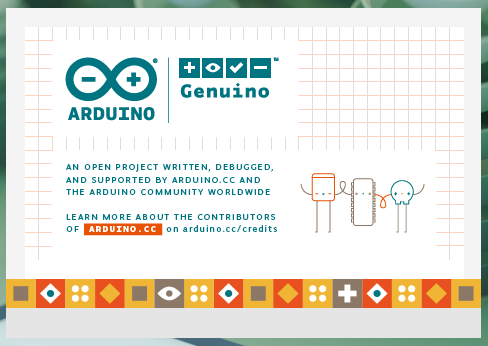

# 26.9 Arduino 开发环境

## Arduino 平台概述

Arduino 是面向电子爱好者与教育工作者的开源硬件平台。以下是在 FreeBSD 上的安装配置步骤。

[Arduino](https://www.arduino.cc/)（中文常译为阿尔杜伊诺）是一个开源电子原型开发平台，于 2005 年由意大利伊夫雷亚交互设计学院（Interaction Design Institute Ivrea，IDII）的师生共同发起创立。该项目的初衷是服务于教学用途（具体为交互设计硕士课程），让非专业背景的人士也能开展电子项目开发。2006 年，由于资金困难，伊夫雷亚交互设计学院（2001—2006 年存续）宣告停办，但 Arduino 项目原型却得以保留并持续发展。

Arduino 项目的愿景与 FreeBSD 项目的开源理念有共通之处，[Arduino 的官方愿景](https://www.arduino.cc/en/about/)明确提出要让 Arduino 平台可为任何人所使用。

> **背景知识**
>
> Arduino 这一名称源自一千多年前的一位意大利国王，伊夫雷亚的阿尔杜因（Arduin of Ivrea），其名字含义为“勇敢的朋友”。而在这位国王的出生地，意大利北部风景如画的伊夫雷亚镇（Ivrea），有一家酒吧“di Re Arduino”（意为“国王 Arduino 的”），Arduino 项目的联合创始人曾是这家酒吧的常客，项目名称即由此而来。

## Arduino 安装方法

**使用 pkg 二进制包管理器安装：**

```sh
# pkg install arduino18 uarduno
```

或者使用 ports 构建：

```sh
# cd /usr/ports/devel/arduino18 && make install clean      # Arduino IDE
# cd /usr/ports/comms/uarduno && make install clean       # Arduino Uno 内核驱动模块
```

编辑 **/boot/loader.conf** 文件，写入下行使其默认加载内核驱动：

```sh
uarduno_load="YES"
```

重启系统。

选择菜单中的“Arduino IDE”启动。




## 参考文献

- Arduino 中国官方微信公众号. Arduino，你的名字究竟该怎么读？[EB/OL]. (2016-12-09)[2026-03-25]. <https://mp.weixin.qq.com/s/O4wfBF_WlHksmoWbMs7QeA>. 详细介绍 Arduino 名称的由来与正确发音。微信公众号运营主体为 Arduino 在中国的外企独资公司，法定代表人为创始人 Federico Musto 先生。
- 大英百科全书. Arduin of Ivrea[EB/OL]. [2026-03-25]. <https://www.britannica.com/biography/Arduin-of-Ivrea>. 大英百科全书关于意大利国王阿尔杜因·德·伊夫雷亚的历史记载条目。
- Eclipse Foundation. Eclipse Theia FAQ[EB/OL]. [2026-04-17]. <https://theia-ide.org/docs/faq/>. 明确说明 Theia 并非 VS Code 的分支，而是独立开发的 IDE 平台。

## 故障排除与未竟事项

FreeBSD ports 上的 Arduino IDE 只有 1.8.x 版本，而最新的 Arduino IDE 已更新至 2.x 版本，这是因为 1.8.x 是基于 Java 编写的，易于移植，而 Arduino IDE 2.x（从 2.0 开始）基于 Eclipse Theia 框架和 Electron/Chromium，Theia 虽与 VS Code 共享 Monaco Editor、LSP 等底层技术，但并非 VS Code 的衍生品，而是由 Eclipse 基金会独立开发的 IDE 平台。因为依赖 Linux 专有组件，且 FreeBSD 的 Chromium port 存在兼容性问题，Electron 在 FreeBSD 上移植更为复杂。

如果对此感兴趣，可以尝试移植。