# 27.2 NetBSD 安装示例

在 27.1 节概述 NetBSD 项目特性的基础上，本节以 NetBSD 10.1 版本为研究对象，系统介绍其在 x86_64 架构下的安装流程，包括系统配置及常见问题处理，为读者提供可复现的标准化安装实践指南。

## 下载 NetBSD

NetBSD 官方提供了适用于不同硬件环境的安装镜像，用户可根据实际使用场景选择下载。常用下载链接如下：

- 面向虚拟机：[https://cdn.netbsd.org/pub/NetBSD/NetBSD-10.1/images/NetBSD-10.1-amd64.iso](https://cdn.netbsd.org/pub/NetBSD/NetBSD-10.1/images/NetBSD-10.1-amd64.iso)
- 面向物理机：[https://cdn.netbsd.org/pub/NetBSD/NetBSD-10.1/images/NetBSD-10.1-amd64-install.img.gz](https://cdn.netbsd.org/pub/NetBSD/NetBSD-10.1/images/NetBSD-10.1-amd64-install.img.gz)

## 安装图解

以下示例演示了在 VMware Workstation Pro 17 虚拟化环境中使用 `NetBSD-10.1-amd64.iso` 进行的 UEFI、GPT 分区表搭配 SATA 存储接口的安装过程，可参照以下步骤完成标准化安装。

> **警告**
>
> 若在 VMware Workstation Pro 17 虚拟化环境中安装 `NetBSD-10.1-amd64.iso`，需注意 NVMe 存储接口不受支持，可能导致系统卡住、无法卸载 DVD 或无法重启等问题。建议 CPU 核心数量不宜过多，经实验验证 4 个 CPU 核心可正常工作。

系统启动后，显示启动选择界面，按回车键启动系统。

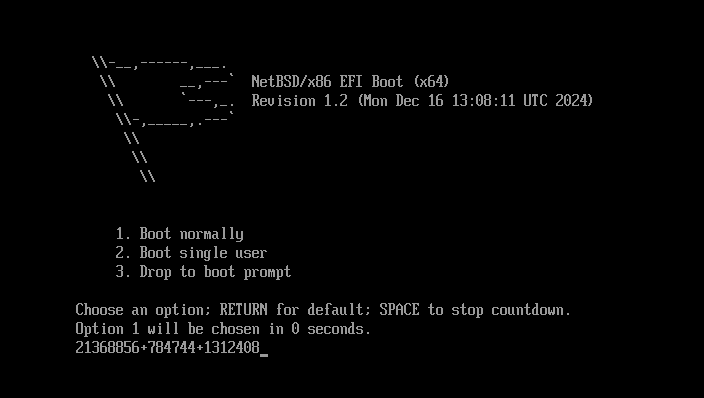

按下回车键选择英文安装。

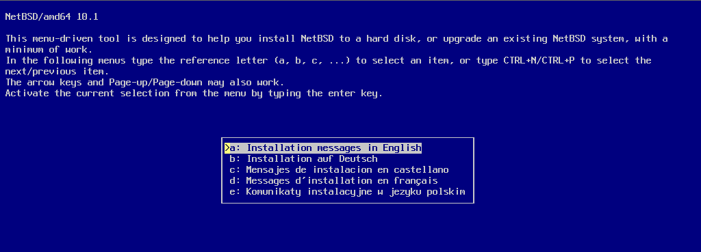

保持键盘布局为默认设置，然后按回车键。

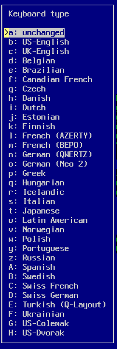

选择安装到硬盘上，按回车键。

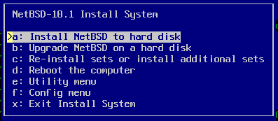

开始分区操作时，选择 `Yes` 并按回车键进入分区工具。

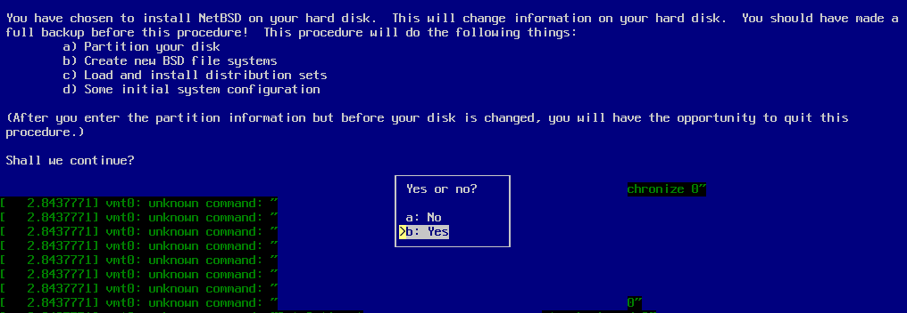

选择要安装 NetBSD 的硬盘。

选择使用 GPT 分区表。GPT 是现代 UEFI 启动方式的标准分区表格式，支持大于 2 TB 的磁盘和更多分区。

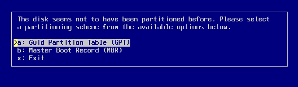

设置分区大小，按回车键。建议 EFI 分区设置为 200 MB-500 MB，根分区占用剩余空间。

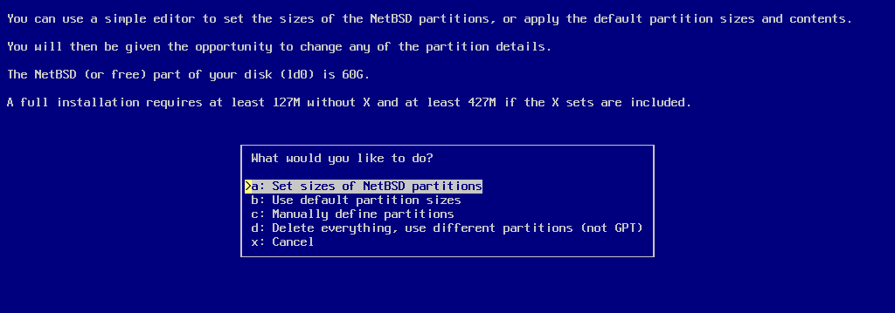

确认分区大小设置，按回车键。

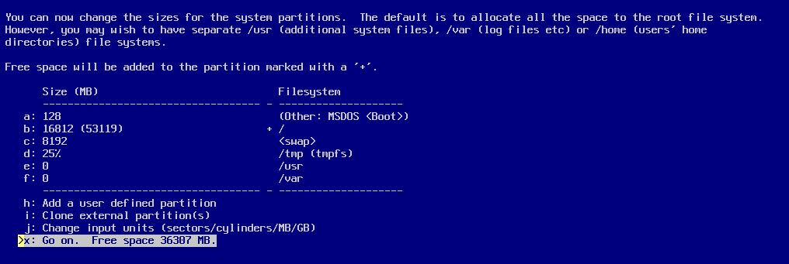

再次确认分区大小设置，按回车键。

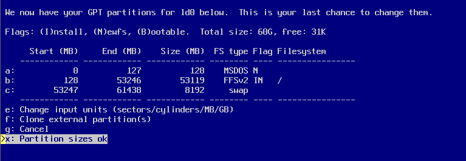

确认写入分区信息到硬盘，选择 OK 后按回车键。此操作将清空磁盘数据，请确保已备份重要文件。

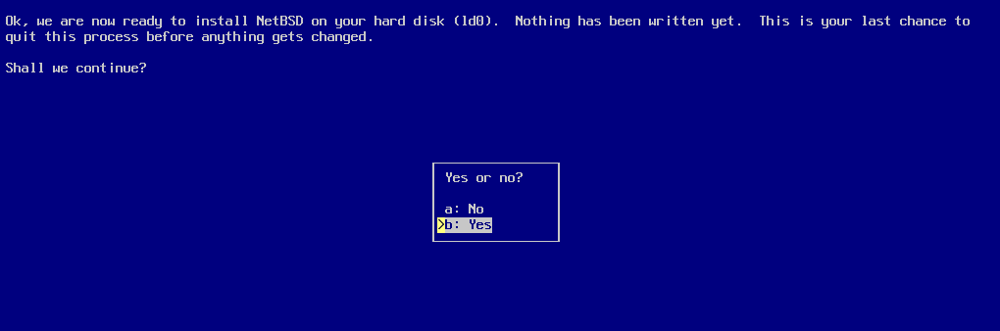

选择默认的完整安装（Full installation），然后按回车键。该选项将安装所有系统组件，适合大多数用户。

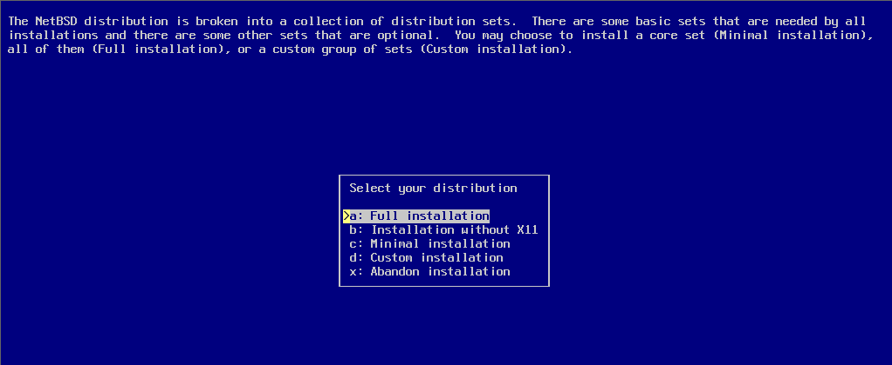

选择安装源，本示例选择 DVD，然后按回车键。

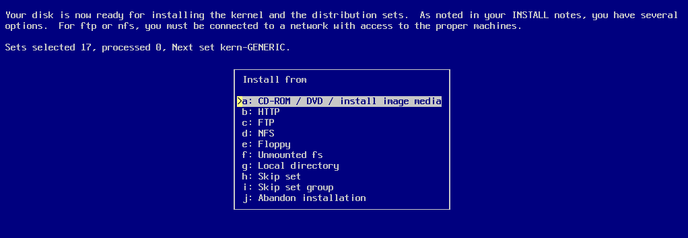

开始安装，等待安装完成。

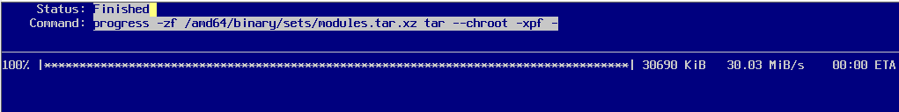

按回车键继续。

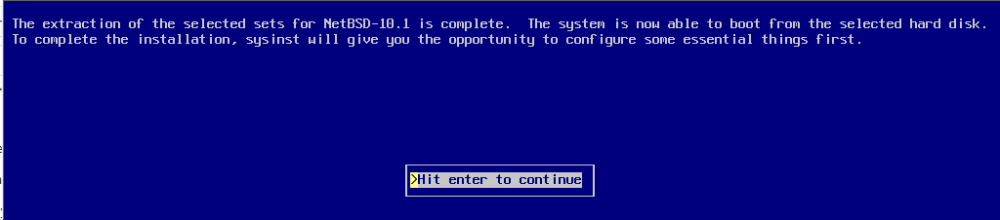

设置 `root` 用户的密码。root 是系统管理员账户，拥有最高权限。

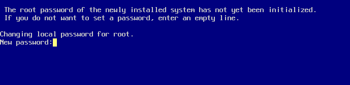

接下来将逐项进行系统配置。

> **警告**
>
> 以下界面显示的是默认设置，需根据实际情况进行修改，不建议直接使用默认值。

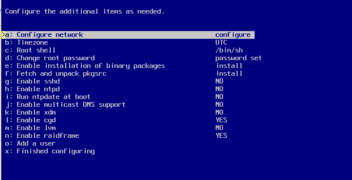

首先进行配置项 `a`：网络设置，选择要使用的网卡。

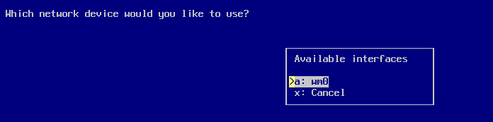

选择自动配置网络，通过 DHCP 自动获取 IP 地址。

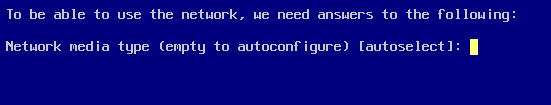

确认网络自动配置设置。

输入系统主机名和 DNS 域名。主机名用于标识网络中的本机。

确认网络设置是否正确，然后选择 `Yes`。

确认网络配置，并将设置写入系统。

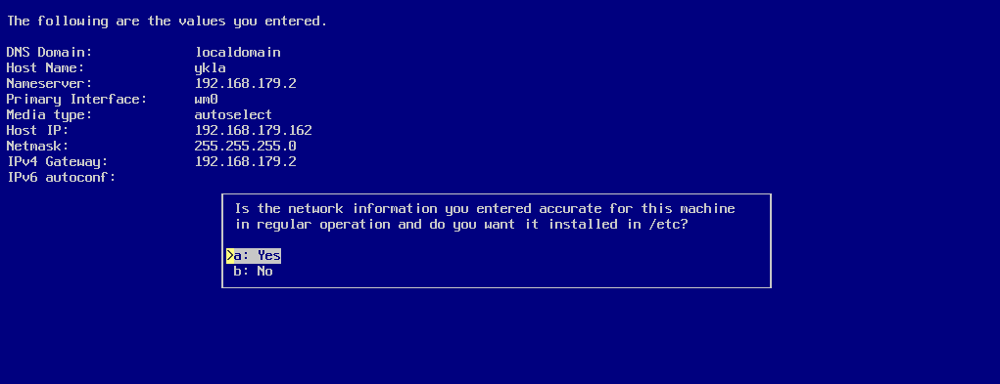

配置 `b` 时区，选择 `Asia`（亚洲）。

选择 `Asia/Shanghai`（北京时间）。

确认时区设置后，按回车键退出该界面（Exit）。

配置项 `e`：安装 `pkgin` 包管理器，直接按回车键继续。pkgin 是 NetBSD 的二进制包管理工具，能帮助用户轻松安装、更新和删除软件包。

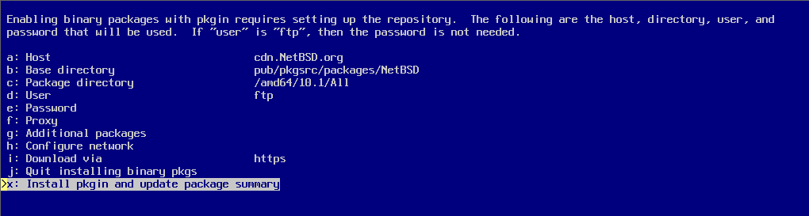

开始安装。

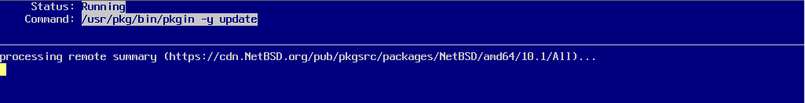

安装完毕，按回车键退出界面。

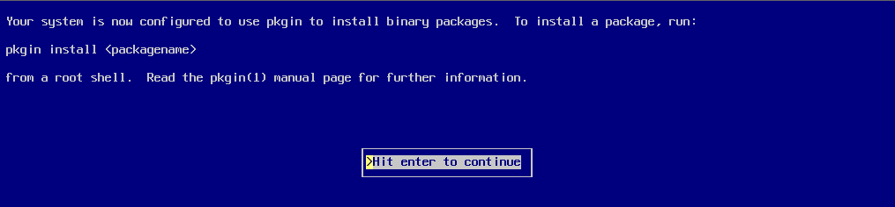

配置项 `f`：安装 `pkgsrc` 包管理器，直接按回车键开始安装。pkgsrc 是 NetBSD 的源代码包管理框架。

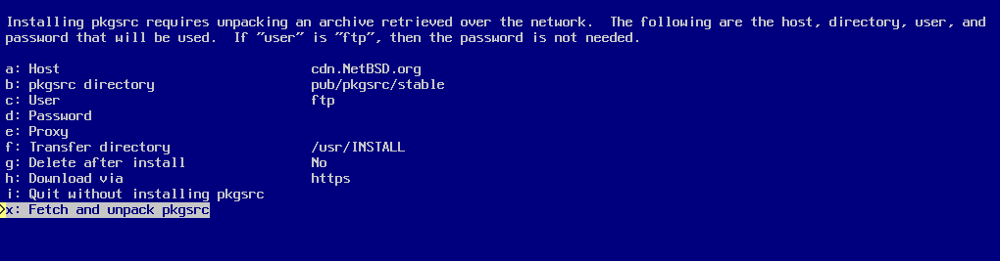

等待安装完成。

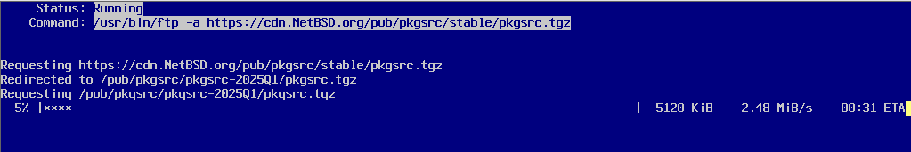

配置项 `o`：添加普通用户。输入用户名后按回车键，再按回车键将用户加入 `wheel` 组。wheel 组成员可使用 sudo 或 su 提升权限。

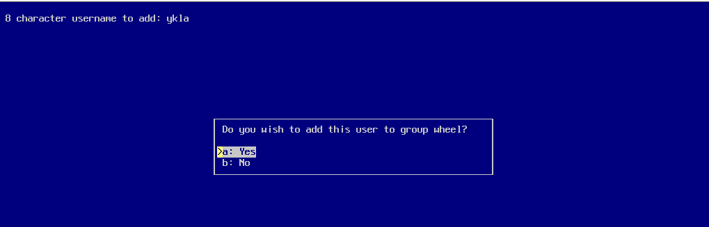

选择普通用户的 Shell 类型。

为普通用户设置密码。

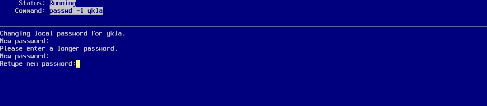

接下来配置各项系统服务参数：

- `g`：sshd 远程服务，用于安全远程登录
- `h`：打开时间同步，使用 NTP 协议同步系统时间
- `i`：开机校对时间，在启动时同步硬件时钟
- `j`：mDNS，用于局域网内设备发现
- `k`：xdm 图形界面，X 显示管理器
- `l`：磁盘加密模块，提供磁盘加密功能
- `m`：LVM（Logical Volume Manager，逻辑卷管理器），用于灵活管理磁盘空间
- `n`：软 RAID，提供软件磁盘阵列功能

请根据需要开启相应选项。

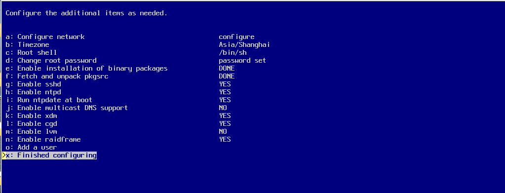

结束安装。

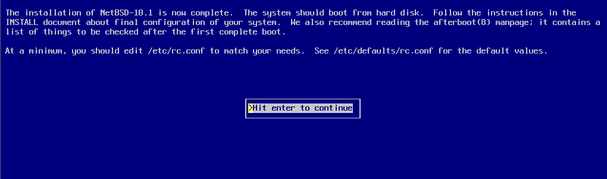

安装完成。

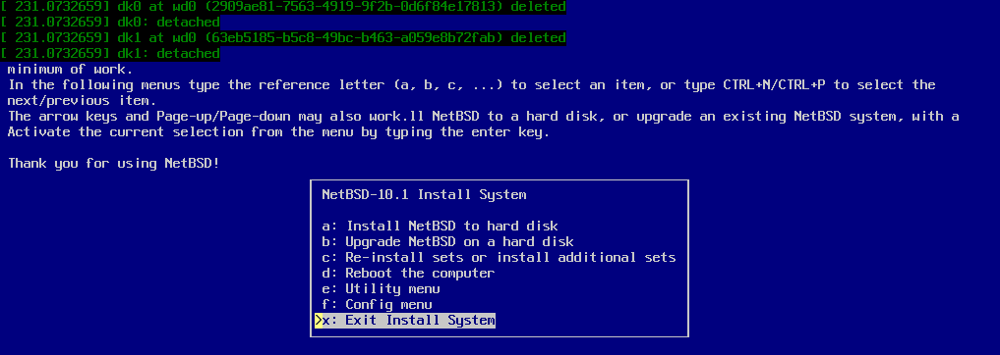

输入命令 `reboot` 重启系统。

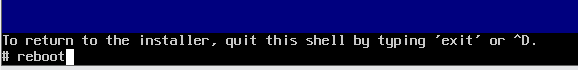

系统启动成功。

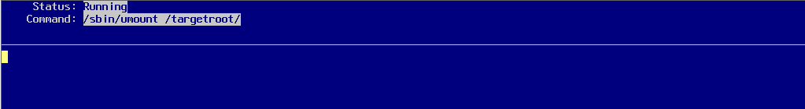

系统启动成功后，会显示登录提示。输入用户名和密码登录系统：

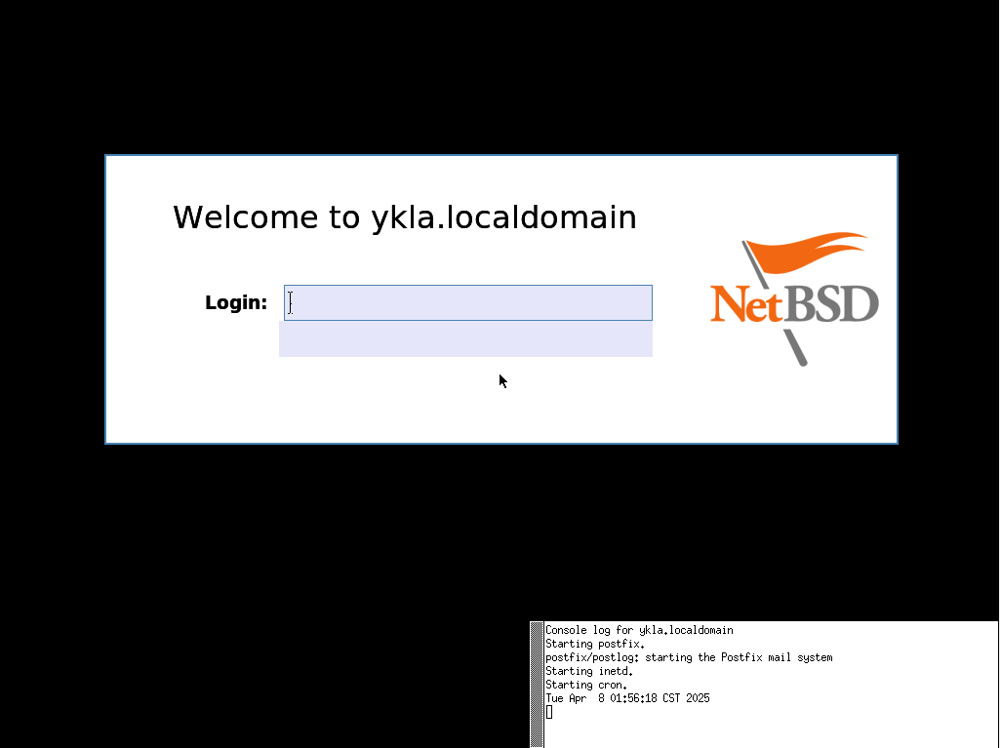

登录后，若已选择安装图形界面，将显示初始 xdm 系统界面：

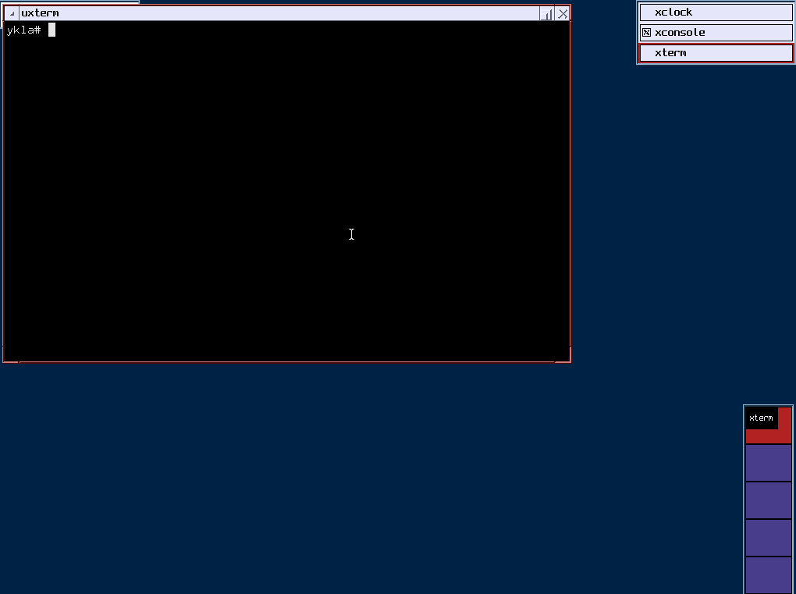

## 故障排除与未竟事项

在安装过程中可能会遇到一些问题，以下是相关的观察和说明。通过对照实验观察，使用 IDE 硬盘接口或较少的 CPU 核心配置时未出现类似问题，而当 CPU 核心数量设定为 16 时可能触发兼容性问题。建议在虚拟机设置中将 CPU 核心数量限制为 4 或 8 以确保稳定性。

## 课后习题

1. 在 VMware Workstation Pro 中复现 NetBSD 10.1 在 16 个 CPU 核心配置下的安装问题，对比 4 核心与 16 核心配置下的系统日志差异。

2. 选取 NetBSD 安装程序的分区管理模块，分析其在 GPT 分区表与 NVMe 存储接口交互中的设计决策。
