# 第 27.1 节 安装与配置

## 下载

下载地址：<https://cdn.netbsd.org/pub/NetBSD/NetBSD-9.3/images/NetBSD-9.3-amd64.iso>（虚拟机），<https://cdn.netbsd.org/pub/NetBSD/NetBSD-9.3/images/NetBSD-9.3-amd64-install.img.gz>（物理机）

## 安装图解

以下示例为使用 `NetBSD-9.3-amd64.iso` 进行的 UEFI+GPT 安装。

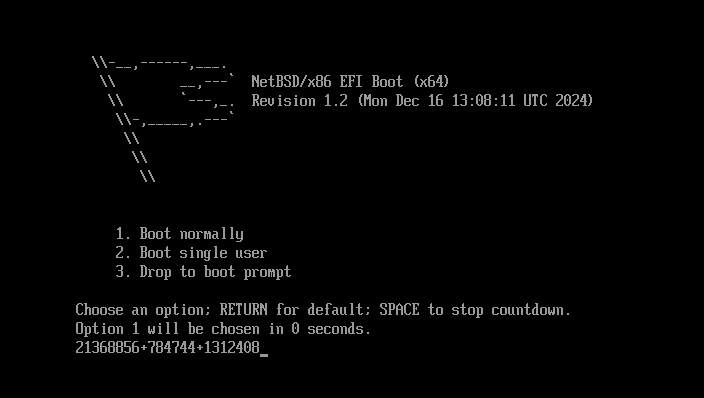

回车启动系统。

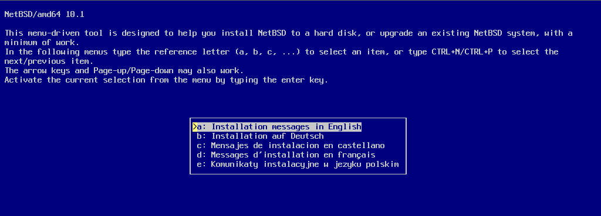

回车选择安装。

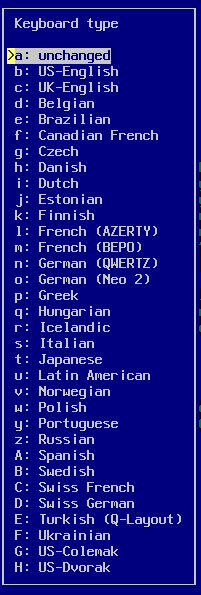

保持键盘默认值即可。回车。

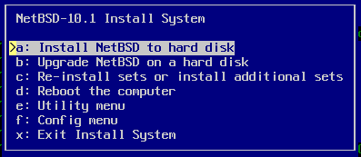

选择安装到磁盘上。回车。

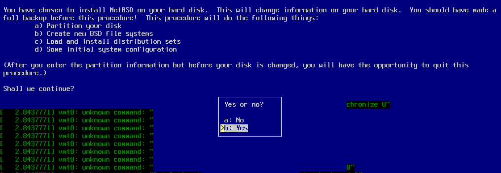

开始分区，选择 `Yes` 回车。

选择要安装 NetBSD 的硬盘。

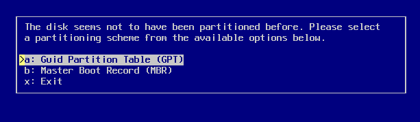

使用 GPT 分区。

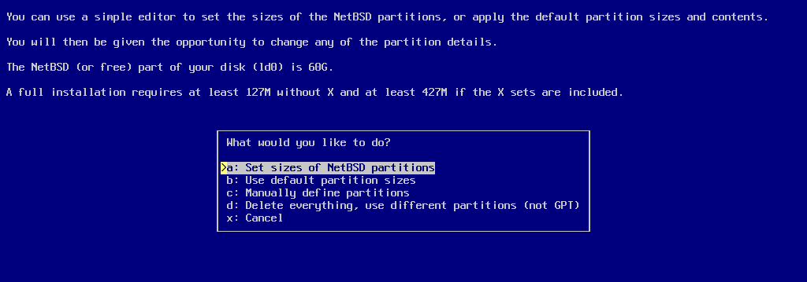

回车。

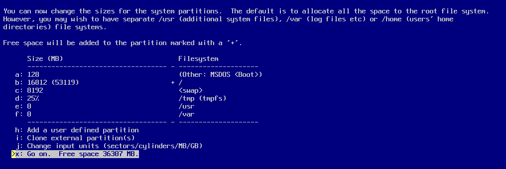

回车。

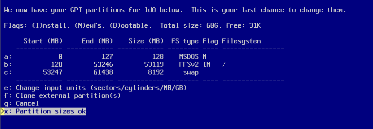

回车。

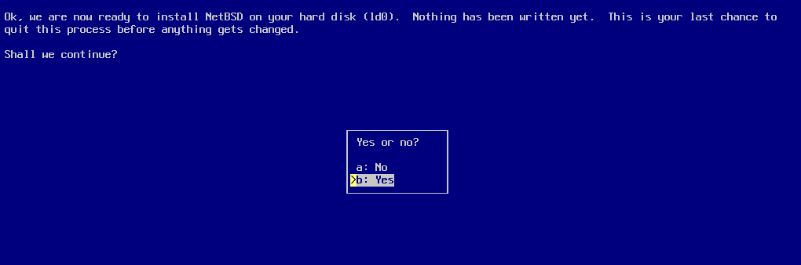

选择 OK 后回车。

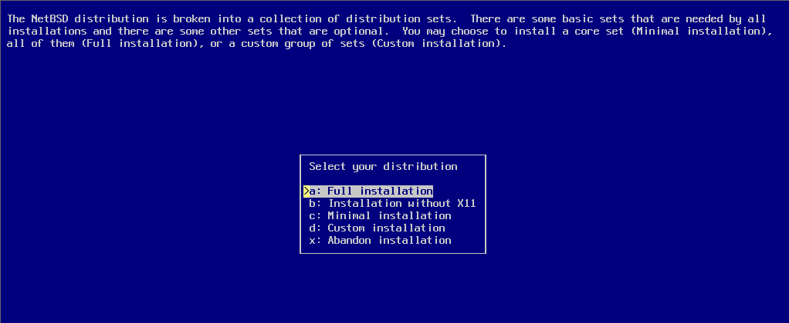

选择 Yes 后回车。

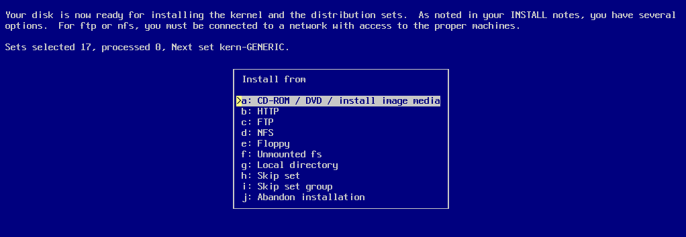

选择默认的完全安装，回车。

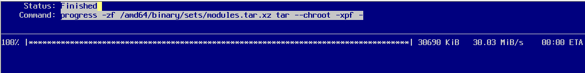

回车。

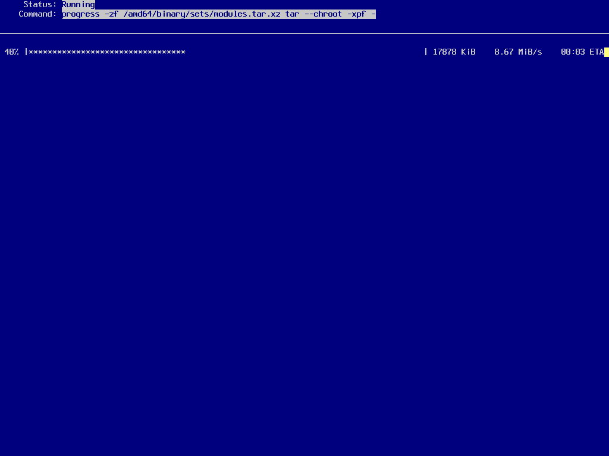

等待。

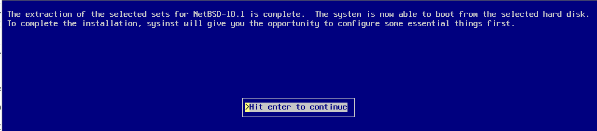

回车。

**注意箭头所指的选项要进行自己的设置。**

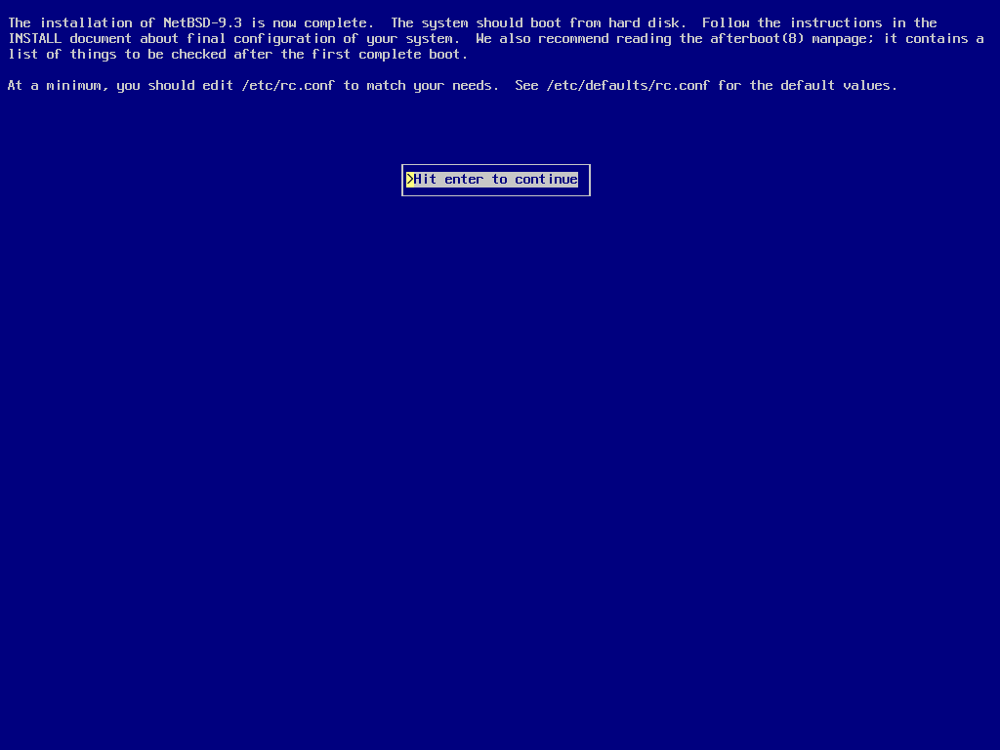

回车。

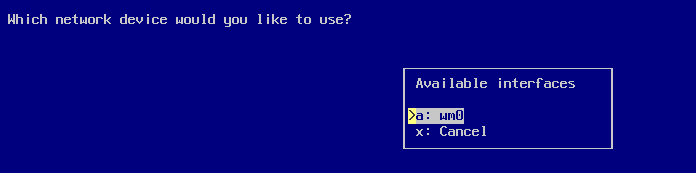

重启系统。
