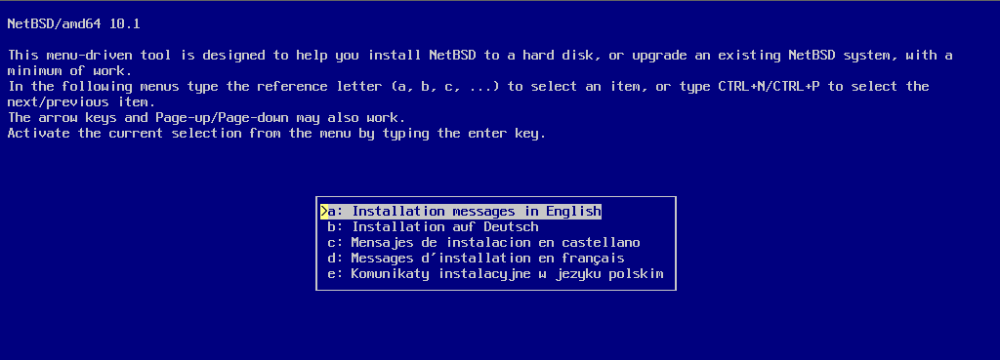
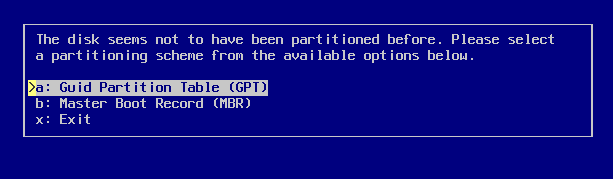
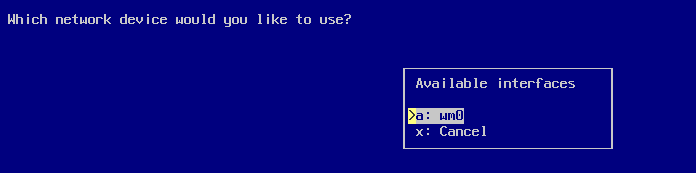
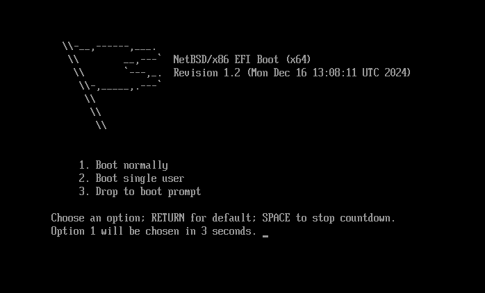

# 第 27.2 节 NetBSD 安装图解

## 下载

下载地址：<https://cdn.netbsd.org/pub/NetBSD/NetBSD-10.1/images/NetBSD-10.1-amd64.iso>（虚拟机），<https://cdn.netbsd.org/pub/NetBSD/NetBSD-10.1/images/NetBSD-10.1-amd64-install.img.gz>（物理机）

## 安装图解

以下示例为通过 VMware Workstation Pro 17 使用 `NetBSD-10.1-amd64.iso` 进行的 UEFI+GPT+SATA 安装过程。

>**警告**
>
>若通过 VMware Workstation Pro 17 虚拟机安装 `NetBSD-10.1-amd64.iso`，不支持 NVMe——会出现卡住、无法卸载 DVD、无法重启等故障。  CPU 数量也不要太多，经测试 4 个 CPU 没有问题。

回车启动系统。

回车选择英文安装。

保持键盘默认值即可。回车。

选择安装到硬盘上。回车。

开始分区，选择 `Yes` 回车。

选择要安装 NetBSD 的硬盘。

使用 GPT 分区。

设置分区大小。回车。

确认分区大小设置，回车。

确认分区大小设置，回车。

确认写入硬盘，选择 OK 后回车。

选择默认的完全安装，回车。

选择安装源，我们选 DVD，回车。

开始安装……等待。

回车以继续。

设置 `root` 用户密码。

接下来要逐一进行配置

>**警告**
>
>下面的界面是默认设置，我们需要改。而不要照着做！

首先配置 `a`，网络。选择网卡：

使用自动配置。

确认使用自动配置。

输入主机名和 DNS 域名：

看起来正常吗？Yes！

确认配置，写入系统。

配置 `b` 时区。选择 `Asia`（亚洲）

选择 `Asia/Shanghai`（上海）

确认后，回车退出（Exit）该界面。

配置 `e`，安装 `pkgin` 包管理器。直接按回车键。

开始安装……

安装完毕，按回车退出该界面。

配置 `f`，安装 `pkgsrc` 包管理器。直接按回车键安装。

等待安装……

配置 `o` 添加普通用户。输入用户名后回车，然后输入按回车加入 `wheel` 组。

选择用户 shell。

设置用户密码。

配置：

- `g`：sshd 远程服务
- `h`：打开时间同步
- `i`：开机校对时间
- `j`：mDNS
- `k`：xdm 图形界面
- `l`：磁盘加密模块。
- `m`：LVM（logical volume management）逻辑卷管理器 
- `n`：软 RAID。

请根据需要开启。

结束安装。

结束安装。

输入 `reboot` 可重启。

开机了！

输入用户名和密码登录系统：

初始 xdm 系统界面：

## 故障排除与未竟事项

- 影响安装的原因究竟是什么？看起来 IDE 硬盘或者少 CPU 数量都不存在类似问题。似乎不能指定的 CPU 数量等于 16。
