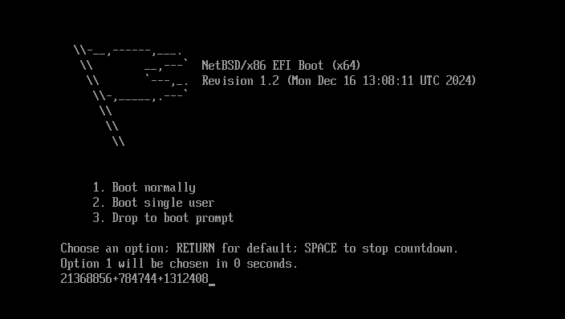
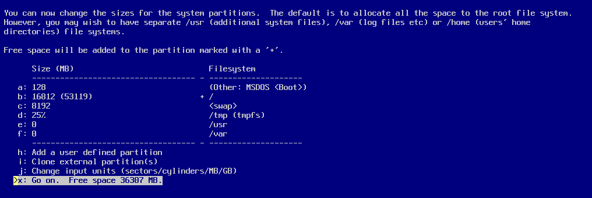
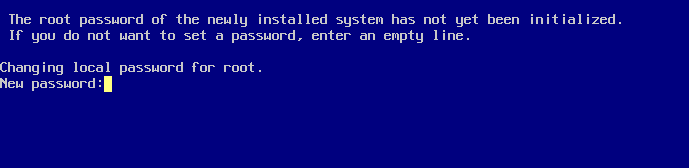
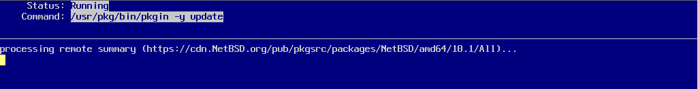

# 第 27.2 节 NetBSD 安装图解

## 下载

下载地址：<https://cdn.netbsd.org/pub/NetBSD/NetBSD-10.1/images/NetBSD-10.1-amd64.iso>（虚拟机），<https://cdn.netbsd.org/pub/NetBSD/NetBSD-10.1/images/NetBSD-10.1-amd64-install.img.gz>（物理机）

## 安装图解

以下示例为使用 `NetBSD-9.3-amd64.iso` 进行的 UEFI+GPT 安装。

回车启动系统。在几串数字这里可能会卡上几分钟。

回车选择英文安装。

保持键盘默认值即可。回车。

选择安装到硬盘上。回车。

开始分区，选择 `Yes` 回车。

选择要安装 NetBSD 的硬盘。

使用 GPT 分区。

设置分区大小。回车。

确认分区大小设置，回车。

确认分区大小设置，回车。

确认写入硬盘，选择 OK 后回车。

选择默认的完全安装，回车。

选择安装源，我们选 DVD，回车。

开始安装……等待。

回车以继续。

设置 `root` 用户密码。

接下来要逐一进行配置：

回车。

