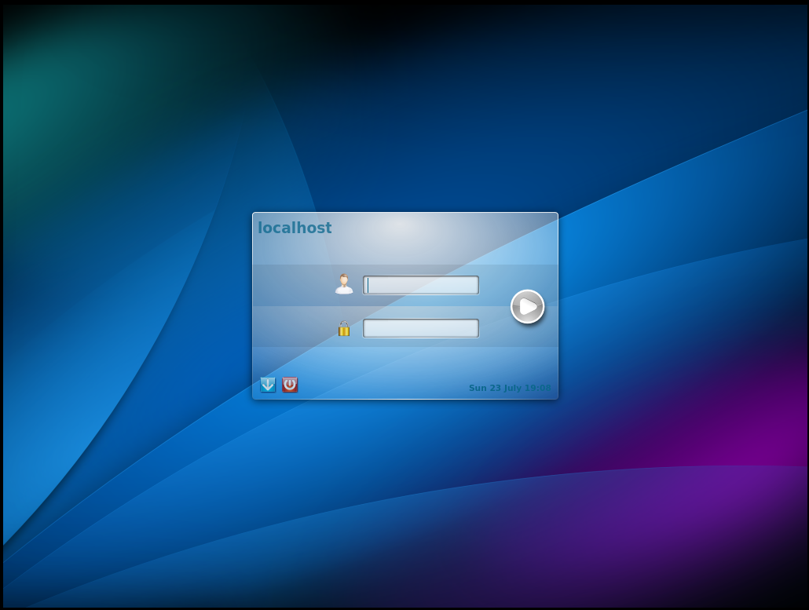

# 第 27.3 节 桌面与其他软件

NetBSD 可以使用常见的桌面，如 KDE 4、 GNOME。


## KDE 4

目前没有 kde5。需要注意的 NetBSD 的源比较混乱，有时候一个源不能满足要求，要多换几个源看看，换哪个直接谷歌搜索 包名+NetBSD，如 kde4 NetBSD，点进去诸如 <https://cdn.netbsd.org/pub/pkgsrc/current/pkgsrc/print/libcups/index.html> 域名所提供的。似乎自带了 xorg，不需要单独安装。

经常性的在以下源中进行切换：

```
# echo http://cdn.netbsd.org/pub/pkgsrc/packages/NetBSD/x86_64/9.0_current/All/  > /usr/pkg/etc/pkgin/repositories.conf
# echo http://cdn.netbsd.org/pub/pkgsrc/packages/NetBSD/x86_64/9.0_2023Q2/All/  > /usr/pkg/etc/pkgin/repositories.conf
```

```
# pkg install kde4
# cp /usr/pkg/share/examples/rc.d/kdm /etc/rc.d
# echo kdm=YES >> /etc/rc.conf
# echo avahidaemon=YES >> /etc/rc.conf
# echo dbus=YES >> /etc/rc.conf
# echo hostname=ykla >> /etc/rc.conf  
```

重启系统。

默认状态下 root 禁止登录。

### 开启 kdm root 登录

```
# nano /usr/pkg/etc/kdm/kdmrc
```
改成
```
# Allow root logins?
# Default is true
AllowRootLogin=true 
```



## 参考文献

- [https://wiki.netbsd.org/GNOME/](https://wiki.netbsd.org/GNOME/)
- [https://www.unix.com/unix-for-beginners-questions-and-answers/283891-how-can-i-start-kde5-netbsd9.html](https://www.unix.com/unix-for-beginners-questions-and-answers/283891-how-can-i-start-kde5-netbsd9.html)
- <https://www.mail-archive.com/netbsd-users@netbsd.org/msg13146.html>
