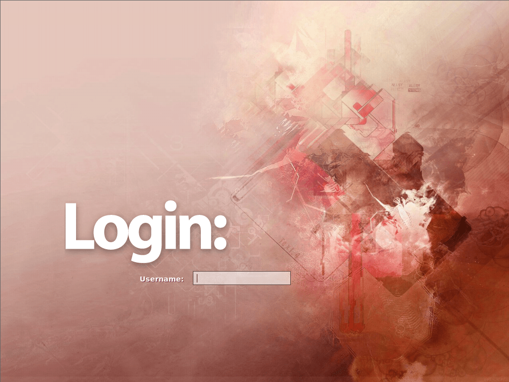

# 第 27.4 节 桌面与中文环境常用软件

NetBSD 可以使用常见的桌面，如 KDE 4、GNOME。自带了 xorg，不需要单独安装。

## 设置中文环境

创建或编辑  `~/.xinitrc`，用哪个用户登录就 `su` 到哪个用户下修改。在顶部加入：

```sh
export LANG=zh_CN.UTF-8
export LC_CTYPE=zh_CN.UTF-8
export LC_ALL=zh_CN.UTF-8
```

## Fcitx 中文输入法

```sh
# pkgin install fcitx5 fcitx5-qt fcitx-gtk fcitx5-chinese-addons 
```

创建或编辑  `~/.xinitrc`，用哪个用户登录就 `su` 到哪个用户下修改。在中文环境变量下面加入：

```sh
export XMODIFIERS='@im=fcitx'
export GTK_IM_MODULE=fcitx/xim
export QT_IM_MODULE=fcitx
```

创建运行目录：

```sh
$ mkdir -p ~/.config/fcitx
```

## ibus 中文输入法

```
# pkgin install ibus ibus-pinyin
```

创建或编辑  `~/.xinitrc`，用哪个用户登录就 `su` 到哪个用户下修改。在中文环境变量下面加入：

```sh
export GTK_IM_MODULE=ibus
export QT_IM_MODULE=ibus
export XMODIFIERS=@im=ibus
ibus-daemon --daemonize --xim
```

## Xfce

- 安装：

```sh
# pkgin install xfce4 fam slim noto-cjk-fonts ee
```

- 配置：

使用 `ee` 编辑 `/etc/rc.conf`，将 `/etc/rc.conf` 中的 `xdm=YES` 改为 `xdm=NO`。下同。

然后：

```sh
# cp /usr/pkg/share/examples/rc.d/famd /etc/rc.d/
# cp /usr/pkg/share/examples/rc.d/dbus /etc/rc.d/
# cp /usr/pkg/share/examples/rc.d/slim /etc/rc.d/
# echo rpcbind=YES >> /etc/rc.conf
# echo famd=YES >> /etc/rc.conf
# echo dbus=YES >> /etc/rc.conf
# echo slim=YES >> /etc/rc.conf
$ echo xfce4-session >> ~/.xinitrc
$ ln  ~/.xinitrc  ~/.xsession
```

启动桌面会比较慢（我这里 4 分钟才能完全加载），多等等……




### 参考文献

- [HOWTO install the XFCE 4 Desktop on NetBSD 8.1](https://slice2.com/2019/09/21/howto-install-the-xfce-4-desktop-on-netbsd-8-1/?amp=1)

## MATE

- 安装：

```sh
# pkgin in mate-desktop mate slim fam noto-cjk-fonts ee
```

>**技巧**
>
> `pkgin in` 是 `pkgin install` 的缩写。更多缩写可以用单条命令不加参数即 `pkgin` 查看。

- 配置：

```sh
# cp /usr/pkg/share/examples/rc.d/famd /etc/rc.d/
# cp /usr/pkg/share/examples/rc.d/dbus /etc/rc.d/
# cp /usr/pkg/share/examples/rc.d/slim /etc/rc.d/
# cp /usr/pkg/share/examples/rc.d/avahidaemon /etc/rc.d/
# echo rpcbind=YES >> /etc/rc.conf
# echo famd=YES >> /etc/rc.conf
# echo dbus=YES >> /etc/rc.conf
# echo slim=YES >> /etc/rc.conf
# echo avahidaemon=YES >> /etc/rc.conf
$ echo exec mate-session >> ~/.xinitrc 
$ ln  ~/.xinitrc  ~/.xsession
```


### 参考文献

- [成功尝试在 NetBSD9.0 中安装 Mate 桌面环境](https://www.bilibili.com/read/cv17144331)

## KDE 4

>**技巧**
>
>本节物理机在下测试成功。物理机能正常进入桌面（UEFI）。

>**警告**
>
>在 VB、VM 下目前无法正常进入桌面（UEFI），进去就黑屏，已经报告 [NetBSD Problem Report #57554](https://gnats.netbsd.org/cgi-bin/query-pr-single.pl?number=57554)，如果你知道什么原因请告诉我。

- 安装主要程序：

```sh
# pkgin in kde noto-cjk-fonts readline libcups ee
```

- 配置：

```sh
# cp /usr/pkg/share/examples/rc.d/* /etc/rc.d
# echo dbus=YES >> /etc/rc.conf
# echo kdm=YES >> /etc/rc.conf
# echo rpcbind=YES >> /etc/rc.conf
# echo avahidaemon=YES >> /etc/rc.conf
# echo hostname=ykla >> /etc/rc.conf # 设置主机名，可以替换为你的名字
```

`reboot` 重启系统。

默认状态下允许 root 登录。

### 故障排除

- 没有中文

因为 KDE5 的关系，中文语言包已经被删除了，见 [NOTICE: This package has been removed from pkgsrc](https://pkgsrc.se/x11/kde4-l10n-zh_CN)。

### 参考文献

- [NetBSD Wiki/GNOME](https://wiki.netbsd.org/GNOME/)
- [How can I start kde5 in netBSD9 ?](https://www.unix.com/unix-for-beginners-questions-and-answers/283891-how-can-i-start-kde5-netbsd9.html)
- [Re: How to install KDE on NetBSD?](https://www.mail-archive.com/netbsd-users@netbsd.org/msg13146.html)
