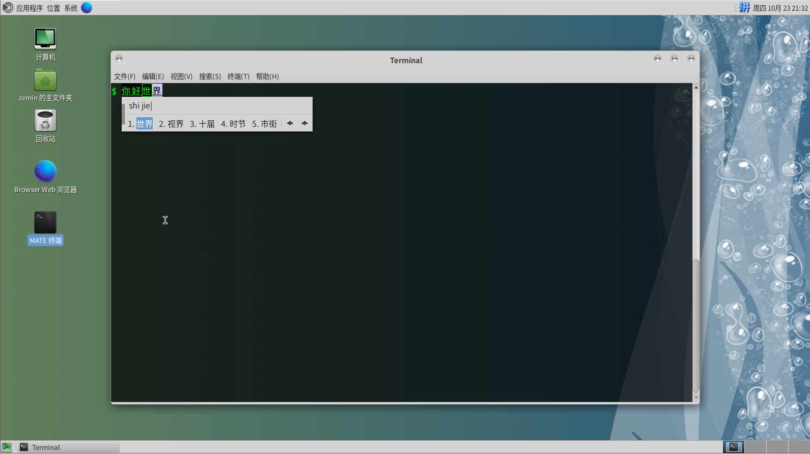

# 27.4 桌面和中文环境常用软件

NetBSD 可以使用常见的桌面环境，如 KDE 4、GNOME，并自带 Xorg，因此无需单独安装。

## 设置中文环境

创建或编辑 `~/.xinitrc` 文件，应以将要登录的用户身份进行修改，可使用 `su` 切换到该用户。在该文件的最上方加入下行：

```ini
export LANG=zh_CN.UTF-8       # 设置系统语言环境为中文 UTF-8
export LC_CTYPE=zh_CN.UTF-8   # 设置字符类型本地化为中文 UTF-8
export LC_ALL=zh_CN.UTF-8     # 设置所有本地化环境变量为中文 UTF-8
```

## Fcitx 中文输入法

安装 Fcitx 5 输入法框架及其 Qt 和 GTK 支持模块，以及中文输入法插件：

```sh
# pkgin install fcitx5 fcitx5-qt fcitx-gtk fcitx5-chinese-addons 
```

创建或编辑 `~/.xinitrc` 文件，应以将要登录的用户身份进行修改。在已设置中文环境变量的下方加入以下内容：

```ini
export XMODIFIERS='@im=fcitx'     # 设置 XIM 修饰符，使用 fcitx 输入法
export GTK_IM_MODULE=fcitx/xim    # 指定 GTK 输入法模块为 fcitx 的 XIM 支持
export QT_IM_MODULE=fcitx         # 指定 Qt 输入法模块为 fcitx
```

创建 Fcitx 用户配置目录：

```sh
$ mkdir -p ~/.config/fcitx
```

## IBus 中文输入法

安装 IBus 输入法框架及其中文拼音输入法引擎：

```sh
# pkgin install ibus ibus-pinyin
```

创建或编辑  `~/.xinitrc` 文件，用哪个用户登录就 `su` 到哪个用户下修改。在中文环境变量下面加入：

```ini
export GTK_IM_MODULE=ibus           # 设置 GTK 输入法模块为 IBus
export QT_IM_MODULE=ibus            # 设置 Qt 输入法模块为 IBus
export XMODIFIERS=@im=ibus          # 设置 XIM 修饰符，使用 IBus 输入法
ibus-daemon --daemonize --xim       # 启动 IBus 守护进程，并启用 XIM 支持
```

## Xfce
 
### 安装 Xfce

安装 Xfce 桌面环境、FAM 文件监控服务、SLiM 登录管理器、中文字体以及 ee 文本编辑器：

```sh
# pkgin install xfce4 fam slim noto-cjk-fonts ee
```

### 配置 Xfce

使用 `ee` 编辑器编辑 `/etc/rc.conf` 文件，将其中的 `xdm=YES` 修改为 `xdm=NO`，其他类似配置同理。

然后：

```sh
# cp /usr/pkg/share/examples/rc.d/famd /etc/rc.d/   # 将 famd 服务示例脚本复制到 rc.d 目录
# cp /usr/pkg/share/examples/rc.d/dbus /etc/rc.d/  # 将 dbus 服务示例脚本复制到 rc.d 目录
# cp /usr/pkg/share/examples/rc.d/slim /etc/rc.d/  # 将 slim 登录管理器示例脚本复制到 rc.d 目录
# echo rpcbind=YES >> /etc/rc.conf                   # 在 rc.conf 中启用 rpcbind 服务
# echo famd=YES >> /etc/rc.conf                      # 在 rc.conf 中启用 famd 服务
# echo dbus=YES >> /etc/rc.conf                      # 在 rc.conf 中启用 dbus 服务
# echo slim=YES >> /etc/rc.conf                      # 在 rc.conf 中启用 slim 登录管理器
$ echo xfce4-session >> ~/.xinitrc                  # 将 XFCE4 会话写入 .xinitrc，以便 startx 启动
$ ln ~/.xinitrc ~/.xsession                          # 创建 .xsession 链接，兼容 X 登录管理器启动
```

启动桌面可能较慢（在测试环境中约需 4 分钟才能完全加载），请耐心等待。


### 参考文献

- [HOWTO install the XFCE 4 Desktop on NetBSD 8.1](https://slice2.com/2019/09/21/howto-install-the-xfce-4-desktop-on-netbsd-8-1/?amp=1)

## MATE

### 安装 MATE

安装 MATE 桌面环境及其组件、SLiM 登录管理器、Marco 窗口管理器、FAM 文件监控服务、中文字体，以及 ee 文本编辑器：

```sh
# pkgin in mate-desktop mate slim marco fam noto-cjk-fonts ee 
```

> **技巧**
>
> `pkgin in` 即 `pkgin install` 的缩写。要查看其他可用缩写，可直接运行 `pkgin` 命令而不带参数。


### 配置 MATE

```sh
# cp /usr/pkg/share/examples/rc.d/famd /etc/rc.d/       # 将 famd 服务示例脚本复制到 rc.d 目录
# cp /usr/pkg/share/examples/rc.d/dbus /etc/rc.d/      # 将 dbus 服务示例脚本复制到 rc.d 目录
# cp /usr/pkg/share/examples/rc.d/slim /etc/rc.d/      # 将 slim 登录管理器示例脚本复制到 rc.d 目录
# cp /usr/pkg/share/examples/rc.d/avahidaemon /etc/rc.d/  # 将 avahidaemon 服务示例脚本复制到 rc.d 目录
# echo rpcbind=YES >> /etc/rc.conf                     # 在 rc.conf 中启用 rpcbind 服务
# echo famd=YES >> /etc/rc.conf                        # 在 rc.conf 中启用 famd 服务
# echo dbus=YES >> /etc/rc.conf                        # 在 rc.conf 中启用 dbus 服务
# echo slim=YES >> /etc/rc.conf                        # 在 rc.conf 中启用 slim 登录管理器
# echo avahidaemon=YES >> /etc/rc.conf                 # 在 rc.conf 中启用 avahidaemon 服务
$ echo exec mate-session >> ~/.xinitrc                 # 将 MATE 会话写入 .xinitrc，以便 startx 启动
$ ln ~/.xinitrc ~/.xsession                             # 创建 .xsession 链接，兼容 X 登录管理器启动
```



### 参考文献

- [成功尝试在 NetBSD9.0 中安装 Mate 桌面环境](https://www.bilibili.com/read/cv17144331)

## KDE 4

> **技巧**
>
> 本节在物理机下测试成功。物理机能正常进入桌面（UEFI）。

> **警告**
>
> 在 VB、VM 下目前无法正常进入桌面（UEFI），进去就黑屏，已经报告至 [NetBSD Problem Report #57554](https://gnats.netbsd.org/cgi-bin/query-pr-single.pl?number=57554)，如果你知道什么原因请告诉我。

### 安装 KDE 4

安装 KDE 桌面环境、中文字体、Readline 库、CUPS 打印系统，以及 ee 文本编辑器：

```sh
# pkgin in kde noto-cjk-fonts readline libcups ee
```

### 配置 KDE 4

```sh
# cp /usr/pkg/share/examples/rc.d/* /etc/rc.d           # 将所有 rc.d 服务示例脚本复制到 /etc/rc.d 目录
# echo dbus=YES >> /etc/rc.conf                        # 在 rc.conf 中启用 dbus 服务
# echo kdm=YES >> /etc/rc.conf                         # 在 rc.conf 中启用 KDM 显示管理器
# echo rpcbind=YES >> /etc/rc.conf                     # 在 rc.conf 中启用 rpcbind 服务
# echo avahidaemon=YES >> /etc/rc.conf                 # 在 rc.conf 中启用 avahidaemon 服务
# echo hostname=ykla >> /etc/rc.conf                   # 设置主机名为 "ykla"，请读者根据需要修改为实际主机名
```

`reboot` 重启系统。

默认状态下允许 root 登录。

### 故障排除

#### 没有中文

由于 KDE5 的原因，KDE4 的中文语言包已被删除，详见 [NOTICE: This package has been removed from pkgsrc](https://pkgsrc.se/x11/kde4-l10n-zh_CN)。

### 参考文献

- [NetBSD Wiki/GNOME](https://wiki.netbsd.org/GNOME/)
- [How can I start kde5 in netBSD9 ?](https://www.unix.com/unix-for-beginners-questions-and-answers/283891-how-can-i-start-kde5-netbsd9.html)
- [Re: How to install KDE on NetBSD?](https://www.mail-archive.com/netbsd-users@netbsd.org/msg13146.html)

## 在 VMware 中安装

### 安装 open-vm-tools

在 NetBSD 中尚未提供 xf86-video-vmware、xf86-input-vmmouse、open-vm-kmod 等组件，仅安装 open-vm-tools 即可。

安装 VMware 虚拟机工具 open-vm-tools，用于增强虚拟机性能和功能：

```shell
# pkgin install open-vm-tools
```

安装后需运行

```sh
# mkdir /var/run/vmblock-fuse                # 创建 vmblock-fuse 挂载点目录
# vmware-vmblock-fuse /var/run/vmblock-fuse # 启动 vmware-vmblock-fuse 服务，支持 VMware 文件共享
# echo vmtools=YES >> /etc/rc.conf           # 在 rc.conf 中启用 open-vm-tools 服务开机启动
```

编辑 `~/.xinitrc` 文件，添加以下内容，应以将要登录的用户身份进行修改。

```ini
vmware-user-suid-wrapper   # 启动 VMware 用户工具的 SUID 包装器，以提升权限执行特定操作
vmware-user                 # 启动 VMware 用户工具，用于增强虚拟机内的桌面集成功能
```

重启即可。

### 解决鼠标无法正常使用

NetBSD 默认的 Xorg 配置可能存在问题，需要在退出 Xorg 后手动生成并修改配置文件，操作步骤如下：

如果系统启动时启用了 Xorg 和 SLiM 登录管理器，可在 `/etc/rc.conf` 文件中添加以下行，以禁用 SLiM 登录管理器：


```ini
slim=NO        # 如果有 slim=YES，请修改如此行
```

生成并修改 Xorg.conf

```sh
# Xorg -configure                           # 自动生成 Xorg 配置文件
# mv /root/xorg.conf.new /etc/X11/xorg.conf # 将生成的 Xorg 配置文件移动到系统 X11 配置目录
```

编辑 `/etc/X11/xorg.conf` 文件，修改以下段落为（其他部分不需要动，保留原样即可）：

```ini
Section "ServerLayout"
        Identifier     "X.org Configured"
        Screen      0  "Screen0" 0 0
        InputDevice    "Mouse0" "CorePointer"
        InputDevice    "Keyboard0" "CoreKeyboard"
        Option          "AutoAddDevices" "Off"		# 禁用自动添加输入设备，防止 Xorg 自动识别和配置新硬件
EndSection

…………此处省略一部分…………

Section "InputDevice"
        Identifier  "Mouse0"
        Driver      "mouse"
        Option      "Protocol" "auto"        # 设置协议为 auto，以便自动识别设备类型
        Option      "Device" "/dev/wsmouse"
        Option      "ZAxisMapping" "4 5 6 7"
EndSection

```
