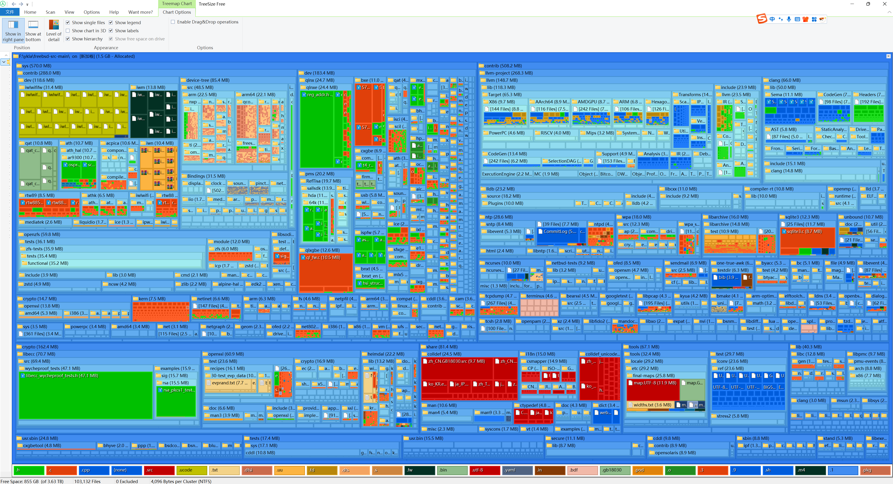
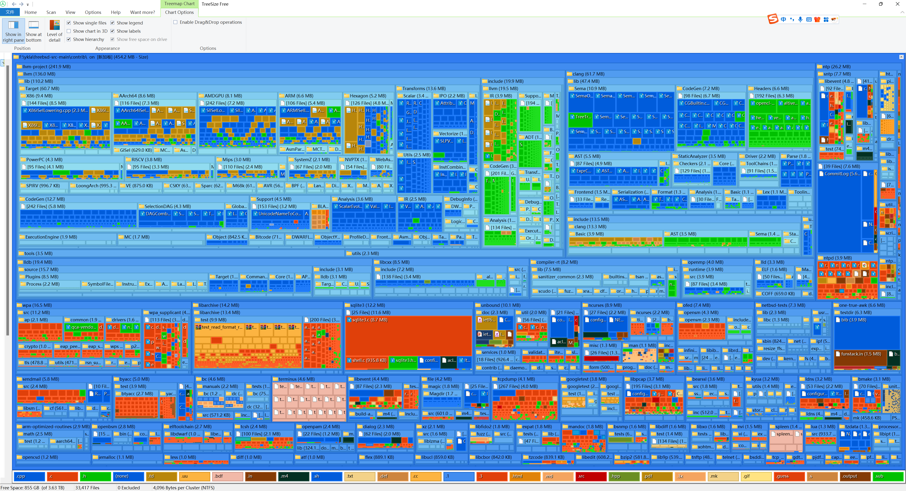

# 28.1 FreeBSD 源代码目录结构

FreeBSD 系统源代码按功能划分为 bin、lib、share、usr.bin 等目录层级，以树状图展示整体结构。理解此布局是内核开发与系统定制的基础。

## FreeBSD src 目录结构

了解 FreeBSD 源代码的目录结构有助于理解系统组织方式。



图片由 [treesize_free](https://www.jam-software.com/treesize_free) 生成。

contrib 目录包含了 FreeBSD 项目集成的第三方软件，下图展示了该目录的内容：



以下是 **/usr/src/** 目录的详细结构说明：

```sh
/usr/src/
├── .arcconfig                   # Phabricator 配置文件
├── .arclint                     # Lint 检查用
├── .cirrus-ci                   # Cirrus CI 指定安装 pkg 的脚本
├── .cirrus.yml                  # Cirrus CI 配置文件
├── .clang-format                # ClangFormat 工具的配置文件
├── .git-blame-ignore-revs      # Git 配置，用于忽略特定提交
├── .gitattributes               # Git 配置文件
├── .github/                     # GitHub 相关配置
├── .gitignore                   # Git 忽略文件配置
├── .mailmap                     # 作者和提交者姓名映射
├── CONTRIBUTING.md              # GitHub 贡献指南
├── COPYRIGHT                    # 版权说明
├── LOCKS                        # 代码审核要求
├── MAINTAINERS                  # FreeBSD 维护者流程
├── Makefile                     # 项目构建过程定义
├── Makefile.inc1                # 构建过程环境变量设置
├── Makefile.libcompat          # 兼容性库的 Makefile
├── Makefile.sys.inc             # 构建过程文件包含顺序
├── ObsoleteFiles.inc            # 需删除的过时文件列表
├── README.md                    # 说明文件
├── RELNOTES                     # 发行说明
├── UPDATING                     # FreeBSD-CURRENT 重大变动说明
├── bin/                         # 系统命令和用户命令
├── cddl/                        # CDDL 许可下的命令和库（DTrace 等）
├── contrib/                     # 第三方软件
├── crypto/                      # 加密相关的源代码
│   ├── heimdal/                 # Heimdal 的 Kerberos 5 实现
│   ├── krb5/                    # MIT 的 Kerberos 5 实现
│   ├── libecc/                  # 可移植的椭圆曲线密码学库
│   ├── openssh/                 # OpenSSH 源代码
│   └── openssl/                 # OpenSSL 源代码
├── etc/                         # /etc 模板
├── gnu/                         # GPL 和 LGPL 授权的软件
├── include/                     # 系统 include 文件
├── kerberos5/                   # Heimdal Kerberos 5 实现
├── lib/                         # 系统库
├── libexec/                     # 系统守护进程
├── release/                     # 构建 ISO、img 及镜像的工具链
├── rescue/                      # 构建静态链接的 /rescue 工具
├── sbin/                        # 系统命令
├── secure/                      # 加密库和命令
├── share/                       # 共享资源
├── stand/                       # Boot loader 源代码
├── sys/                         # 内核源代码
├── targets/                     # 实验性的 DIRDEPS_BUILD 机制（基于依赖的构建系统）
├── tests/                       # 可通过 Kyua 运行的回归测试
├── tools/                       # 回归测试和其他杂项任务的工具
├── usr.bin/                     # 用户命令
└── usr.sbin/                    # 系统管理员命令
```

## FreeBSD 内核源代码目录结构

内核源代码是 FreeBSD 系统的核心部分，了解其目录结构有助于理解系统的工作原理。下图展示了内核源代码的整体组织：


内核源代码中的 contrib 目录同样包含了重要的第三方组件，下图展示了该目录的内容：


以下是 **/usr/src/sys** 内核源代码目录的详细结构说明：

```sh
/usr/src/sys/
├── Makefile                     # 用于定义项目的构建过程
├── README.md                    # 说明文件
├── amd64/                       # x86-64 架构支持
├── arm/                         # 32 位 ARM 架构支持
├── arm64/                       # 64 位 ARM 架构支持
├── bsm/                         # OpenBSM，开源的审计框架
├── cam/                         # Common Access Method (CAM)，通用访问方法（存储子系统）
├── cddl/                        # CDDL 许可证下的源代码
├── compat/                      # Linux 兼容层和 FreeBSD 32 位兼容性
├── conf/                        # 内核构建配置层
├── contrib/                     # 第三方软件
│   └── dev/                     # 部分无线网卡驱动
├── crypto/                      # 加密驱动程序
├── ddb/                         # 交互式内核调试器（FreeBSD 内置调试器）
├── dev/                         # 设备驱动程序和其他架构无关代码
├── dts/                         # Device Tree Source (DTS) 设备树源代码
├── fs/                          # 除 UFS、NFS、ZFS 以外的文件系统
├── gdb/                         # 内核远程 GDB 存根实现
├── geom/                        # GEOM 框架（块设备层）
├── gnu/                         # GPL 和 LGPL 授权的软件
├── isa/                         # 工业标准结构 (ISA) 总线相关
├── kern/                        # 内核主要部分
├── kgssapi/                     # GSSAPI 相关文件
├── libkern/                     # 为内核提供类似 libc 的函数
├── modules/                     # 内核模块基础设施
├── net/                         # 核心网络代码
├── net80211/                    # 无线网络 (IEEE 802.11)
├── netgraph/                    # 基于图的网络子系统
├── netinet/                     # IPv4 协议实现
├── netinet6/                    # IPv6 协议实现
├── netipsec/                    # IPsec 协议实现
├── netlink/                     # Netlink 套接字实现
├── netpfil/                     # 包过滤器实现
├── netsmb/                      # SMB 协议实现
├── nfs/                         # NFS 网络文件系统
├── nfsclient/                   # NFS 客户端
├── nfsserver/                   # NFS 服务器
├── nlm/                         # Network Lock Manager (NLM) 协议
├── ofed/                        # OFED 相关（InfiniBand）
├── opencrypto/                  # OpenCrypto 框架
├── riscv/                       # 64 位 RISC-V 支持
├── rpc/                         # 远程过程调用 (RPC) 相关
├── security/                    # 安全功能
├── sys/                         # 内核头文件
├── teken/                       # 终端仿真器相关
├── tests/                       # 内核单元测试
├── tools/                       # 内核构建和开发相关的工具和脚本
├── ufs/                         # UFS 文件系统
├── vm/                          # 虚拟内存系统
├── x86/                         # x86-64 架构相关代码
├── xdr/                         # 外部数据表示 (XDR) 相关
└── xen/                         # 开放源代码虚拟机监视器
```

## 课后习题

1. FreeBSD 源代码中 contrib 目录存放什么？
2. 内核源代码位于哪个子目录？
3. sys/ 目录下的 cam 子目录有何用途？
