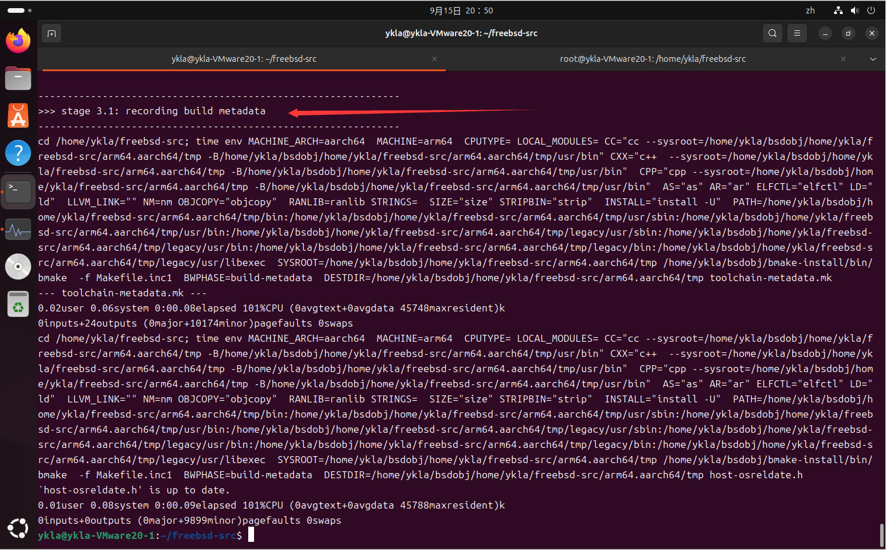
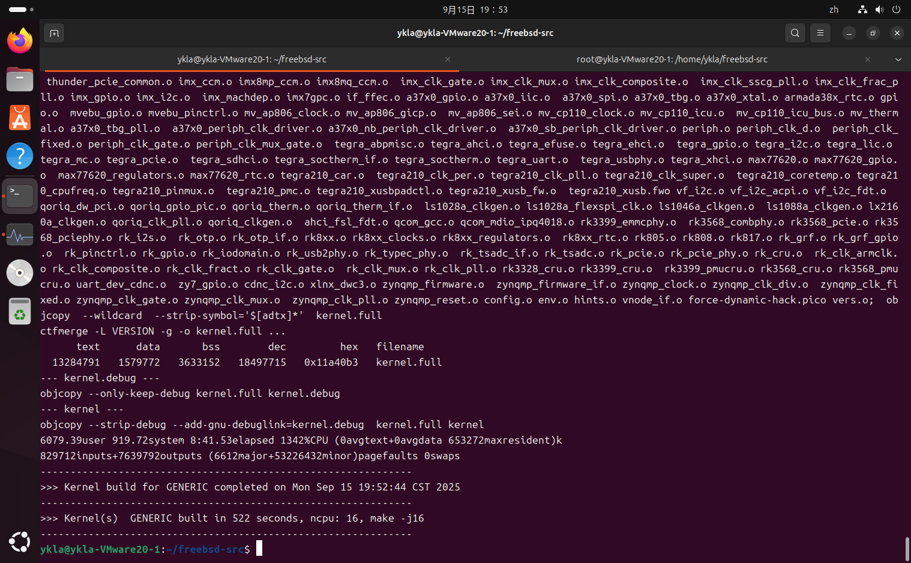
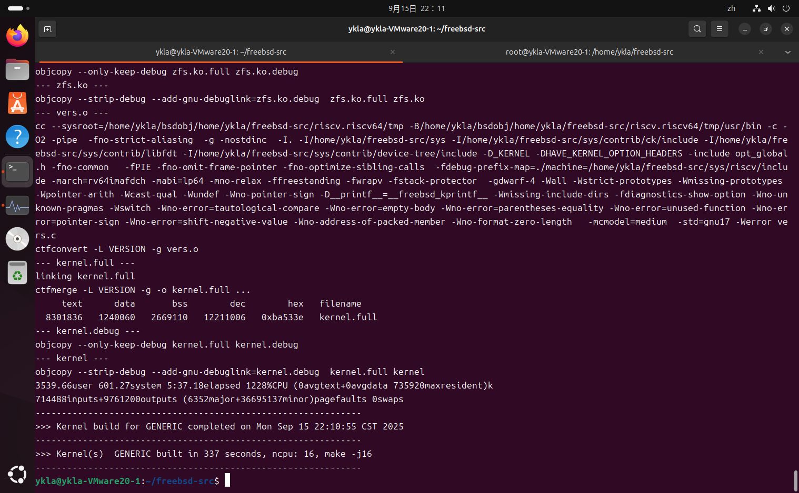

# 28.6 在 Linux 系统上交叉构建 FreeBSD

在 Linux（以 Ubuntu 24.04 LTS 为例）上交叉构建 FreeBSD 需至少 12 GB 内存与 16 GB swap。本节给出从环境准备到完整构建的步骤。

## 设备环境

本节以 Ubuntu 24.04 LTS 为例进行说明，其他 Linux 发行版也可参考。构建过程内存消耗较大，建议配置如下：

- 内存：建议容量不低于 12 GB。
- swap：建议容量为 16 GB。

若内存不足，构建过程可能因内存不足而失败。

## 安装软件包

构建 FreeBSD 需要安装以下软件包和开发库。以 root 权限执行：

```sh
apt update
apt install git build-essential libbz2-dev libarchive-dev libssl-dev flex
```

各软件包作用：

- `git`：版本控制工具，用于获取 FreeBSD 源代码
- `build-essential`：基础构建工具集合
- `libbz2-dev`：bzip2 压缩库开发文件
- `libarchive-dev`：归档库开发文件
- `libssl-dev`：SSL 库开发文件
- `flex`：词法分析器生成工具

部分用户可能需要根据网络环境更换软件源。

## 禁用熄屏

长时间构建过程中，避免系统自动熄屏可防止构建因意外休眠而中断。

对于 GNOME 桌面环境，可进入“设置”→“电源”→“节电选项”，将“熄屏”选项设置为“从不”。

若无图形界面，可使用终端复用工具（如 tmux 或 screen）保持会话运行。

## 禁用 systemd-oomd

自 Ubuntu 22.04 LTS（Desktop）起，系统默认启用 systemd-oomd 服务。该服务会在系统达到内存阈值时强制终止高占用进程，可能导致构建失败，且此操作不会向用户提供提示信息。

禁用 systemd-oomd 的自启动，并立即停止其运行：

```sh
systemctl mask --now systemd-oomd systemd-oomd.socket
```

检查 systemd-oomd 的运行状态：

```sh
# systemctl status systemd-oomd systemd-oomd.socket     # 查看 systemd-oomd 及其 socket 单元的运行状态
○ systemd-oomd.service # 注意此处应为黑色圆圈，表示正常状态；若为绿色则说明服务正在运行
     Loaded: masked (Reason: Unit systemd-oomd.service is masked.)
     Active: inactive (dead) since Mon 2025-09-15 16:08:39 CST; 4h 17min ago
   Duration: 2min 18.952s
   Main PID: 170032 (code=exited, status=0/SUCCESS)
     Status: "Shutting down..."
        CPU: 217ms

9月 15 16:06:20 ykla-VMware20-1 systemd[1]: Starting systemd-oomd.service - Userspace Out-Of-Memory (OOM) Killer...
9月 15 16:06:20 ykla-VMware20-1 systemd[1]: Started systemd-oomd.service - Userspace Out-Of-Memory (OOM) Killer.
9月 15 16:08:39 ykla-VMware20-1 systemd[1]: Stopping systemd-oomd.service - Userspace Out-Of-Memory (OOM) Killer...
9月 15 16:08:39 ykla-VMware20-1 systemd[1]: systemd-oomd.service: Deactivated successfully.
9月 15 16:08:39 ykla-VMware20-1 systemd[1]: Stopped systemd-oomd.service - Userspace Out-Of-Memory (OOM) Killer.

○ systemd-oomd.socket # 注意此处应为黑色圆圈，表示正常状态；若为绿色则说明服务正在运行
     Loaded: masked (Reason: Unit systemd-oomd.socket is masked.)
     Active: inactive (dead)

……省略一部分日志输出……
```

## 使用 git 拉取 FreeBSD 源代码

拉取 FreeBSD 源代码仓库：

```sh
cd /home/ykla
git clone --depth 1 https://github.com/freebsd/freebsd-src
```

`--depth 1` 指定浅克隆，仅获取最新一次提交，可大幅减少下载量和存储空间。如需完整历史记录，可省略此参数。

拉取完成后，源代码位于 **/home/ykla/freebsd-src**（目录 `freebsd-src` 由 Git 自动创建）。

如需构建特定版本（如 15.0-RELEASE），可在克隆后切换到对应分支：

```sh
cd freebsd-src
git checkout releng/15.0
```

## 创建用于存放构建产物的目录

创建目录 `bsdobj` 用于存放构建产物：

```sh
$ mkdir -p /home/ykla/bsdobj
```

选项 `-p`：若其父目录不存在，则一并创建。

目录结构如下：

```sh
/home/ykla/
├── freebsd-src/          # FreeBSD 源代码
└── bsdobj/               # 构建产物目录
```

## 构建工具链与世界（用户空间）

buildworld 目标用于构建 FreeBSD 的完整用户空间（world），包括系统库、命令行工具等。这是交叉构建的第一步。

切换到 FreeBSD 源代码根目录：

```sh
$ cd /home/ykla/freebsd-src
```

指定对象目录并使用 make.py 构建 arm64/aarch64 的基本系统，同时启用 AArch64 和 ARM 的 LLVM 后端，并禁用 32 位库支持：

```sh
MAKEOBJDIRPREFIX=/home/ykla/bsdobj tools/build/make.py --bootstrap-toolchain -j16 TARGET=arm64 TARGET_ARCH=aarch64 WITH_LLVM_TARGET_AARCH64=yes WITH_LLVM_TARGET_ARM=yes WITHOUT_LIB32=yes buildworld
```

选项说明：

| 项目 | 说明 |
| ---- | ---- |
| **MAKEOBJDIRPREFIX=/home/ykla/bsdobj** | 指定所有构建产物的输出目录 |
| **tools/build/make.py** | 在非 FreeBSD 系统上启动构建流程的官方脚本 |
| **--bootstrap-toolchain** | 用源代码树里的 LLVM/Clang/LLD 自举工具链，而非通过 apt 安装，使之更接近原生构建 |
| **-j16** | 启用 16 个并行编译任务。通常与 CPU 线程数一致，例如 4 线程可使用 `-j4` |
| **TARGET=arm64** | 目标平台设为 arm64 |
| **TARGET_ARCH=aarch64** | 目标 CPU 架构设为 aarch64 |
| **WITH_LLVM_TARGET_AARCH64=yes** | 启用 LLVM 的 AArch64 后端 |
| **WITH_LLVM_TARGET_ARM=yes** | 启用 LLVM 的 ARM 后端 |
| **WITHOUT_LIB32=yes** | 禁用 32 位兼容库及相关组件，当前测试未通过 |
| **buildworld** | 构建 FreeBSD 用户空间（world） |

buildworld 构建时间较长，视硬件配置可能需要数小时。构建成功后，可通过检查 `bsdobj` 目录下是否生成了对应架构的目录结构来验证。

验证构建结果是否成功，可参考下图：


## 构建内核工具链

确保当前仍位于 FreeBSD 源代码根目录：

```sh
$ cd /home/ykla/freebsd-src
```

使用与 buildworld 相同的参数构建内核工具链：

```sh
$ MAKEOBJDIRPREFIX=/home/ykla/bsdobj tools/build/make.py --bootstrap-toolchain -j16 TARGET=arm64 TARGET_ARCH=aarch64 WITH_LLVM_TARGET_AARCH64=yes WITH_LLVM_TARGET_ARM=yes WITHOUT_LIB32=yes kernel-toolchain
```

除末尾的 `kernel-toolchain` 不同外，其余选项参数均保持一致。

验证内核工具链的构建结果，可参考下图：



## 构建内核

确保当前仍位于 FreeBSD 源代码根目录：

```sh
$ cd /home/ykla/freebsd-src
```

使用指定参数构建 arm64/aarch64 内核：

```sh
$ MAKEOBJDIRPREFIX=/home/ykla/bsdobj tools/build/make.py --bootstrap-toolchain -j16 TARGET=arm64 TARGET_ARCH=aarch64 WITH_LLVM_TARGET_AARCH64=yes WITH_LLVM_TARGET_ARM=yes WITHOUT_LIB32=yes buildkernel
```

除末尾的 `buildkernel` 不同外，其余选项参数均保持一致。

验证内核的构建结果，可参考下图：



## 附录：RISC-V 64

使用引导工具链并忽略 GCC 检测，构建 riscv64 架构的内核工具链：

```sh
$ MAKEOBJDIRPREFIX=/home/ykla/bsdobj tools/build/make.py --bootstrap-toolchain TRY_GCC_BROKEN=yes -j16 TARGET=riscv TARGET_ARCH=riscv64 kernel-toolchain
```

验证 RISC-V 内核工具链的构建结果，可参考下图：


使用引导工具链并忽略 GCC 检测，构建 riscv64 内核：

```sh
$ MAKEOBJDIRPREFIX=/home/ykla/bsdobj tools/build/make.py --bootstrap-toolchain TRY_GCC_BROKEN=yes -j16 TARGET=riscv TARGET_ARCH=riscv64 buildkernel
```

验证 RISC-V 内核的构建结果，可参考下图：



## 故障排除与未竟事宜

### 基于 Arch Linux 构建 FreeBSD

要在 Arch 上编译，需要设置临时环境变量：

```sh
export CFLAGS="-DSTRERROR_R_CHAR_P=1"
```

此参数显式指定 strerror_r 返回类型，避免因 glibc 同时支持 POSIX 和 GNU 两种规范导致的编译错误。否则构建过程会停留在 krb5 阶段。

还必须确保 hostname 命令存在且能够正常输出，同时需安装 `time` 等软件包。

### 32 位构建的问题

FreeBSD 15.0 已不再支持 i386、armv6 和 32 位 powerpc 等大部分 32 位架构，仅保留 armv7 作为最后支持的 32 位平台。

### Ubuntu 原生的 LLVM 工具链

此项功能尚待测试验证。

### 构建更多体系结构（如 amd64）

此项功能尚待研究解决。

## 参考文献

- Ubuntu 社区. Jammy Jellyfish Release Notes: Ubuntu 22.04 LTS 发行说明[EB/OL]. (2021-10-15)[2026-03-25]. <https://discourse.ubuntu.com/t/jammy-jellyfish-release-notes/24668>. 系统介绍 Ubuntu 22.04 的新特性，包含对 systemd-oomd 服务的说明。
- FreeBSD Project. FreeBSD 手册: 26.9. Building on non-FreeBSD Hosts[EB/OL]. [2026-03-25]. <https://docs.freebsd.org/en/books/handbook/cutting-edge/#building-on-non-freebsd-hosts>. 官方非 FreeBSD 主机构建 FreeBSD 的权威指南，只提供了基本思路，参考价值有限。
- FreeBSD 社区. Building on non-FreeBSD hosts[EB/OL]. [2026-03-25]. <https://wiki.freebsd.org/BuildingOnNonFreeBSD>. 社区维护的跨平台构建实践经验汇总，仅提供基本思路，参考价值有限。
- FreeBSD Project. src.conf: FreeBSD 构建系统配置参数手册[EB/OL]. [2026-03-25]. <https://man.freebsd.org/cgi/man.cgi?src.conf>. FreeBSD 构建系统配置参数的完整官方手册，构建参数参考此处。
- FreeBSD Project. make.conf(5) -- system build configuration[EB/OL]. [2026-04-17]. <https://man.freebsd.org/cgi/man.cgi?query=make.conf&sektion=5>. 系统构建配置文件手册页。
- FreeBSD Project. build(7) -- instructions for building FreeBSD[EB/OL]. [2026-04-17]. <https://man.freebsd.org/cgi/man.cgi?query=build&sektion=7>. FreeBSD 构建流程手册页，涵盖 buildworld/buildkernel 等目标。
- FreeBSD Project. make(1) -- maintain program groups[EB/OL]. [2026-04-17]. <https://man.freebsd.org/cgi/man.cgi?query=make&sektion=1>. BSD make 构建工具手册页。
- FreeBSD Project. clang(1) -- the Clang C, C++, and Objective-C compiler[EB/OL]. [2026-04-17]. <https://man.freebsd.org/cgi/man.cgi?query=clang&sektion=1>. Clang 编译程序手册页。
- FreeBSD Project. release(8) -- release building tools[EB/OL]. [2026-04-17]. <https://man.freebsd.org/cgi/man.cgi?query=release&sektion=8>. FreeBSD 发行版构建工具手册页。
- FreeBSD Project. cross-bootstrap-tools.yml: FreeBSD 交叉编译 CI 工作流[EB/OL]. [2026-03-25]. <https://github.com/freebsd/freebsd-src/blob/main/.github/workflows/cross-bootstrap-tools.yml>. FreeBSD 项目自身使用的交叉编译 CI，项目官方的持续集成工作流程示例。

## 课后习题

1. 交叉构建为何需要禁用 systemd-oomd？
2. make.py 脚本的作用是什么？
3. --bootstrap-toolchain 参数有何意义？
