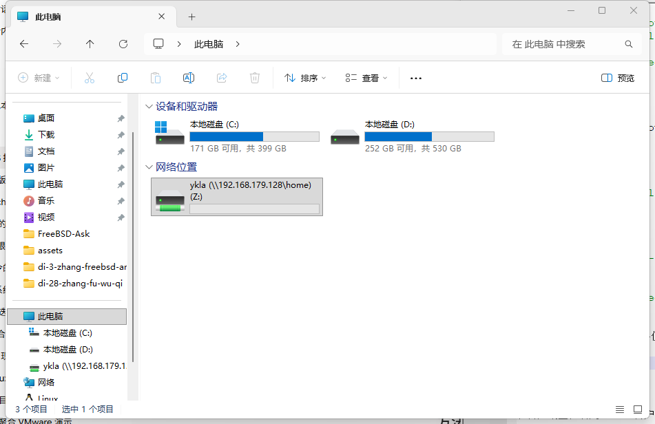

# 28.3 网络文件系统（NFS）

## NFS 概述

NFS（Network File System，网络文件系统）最初由 Sun Microsystems 于 1984 年研发，是一种分布式文件系统协议，允许远程服务器共享文件目录。

FreeBSD 支持网络文件系统（NFSv4），它允许服务器通过网络与客户端共享目录和文件。NFS 以远程过程调用（Remote Procedure Call，RPC）为通信机制，实现透明文件访问，客户端访问远程文件与访问本地文件系统无异。

NFS 有许多实际应用。一些常见的用途包括：

- 原本会在每个客户端上重复的数据可以保存在一个位置，并由网络上的客户端访问。
- 多个客户端可能需要访问 **/usr/ports/distfiles** 目录。共享该目录可以快速访问源文件，而无需将其下载到每个客户端。
- 在大型网络中，通常将所有用户的主目录存储在一个中央 NFS 服务器上会更方便。用户可以在网络中的任何客户端上登录，并访问他们的主目录。
- 管理 NFS 导出变得简化。例如，只需要设置一个文件系统的安全性或备份策略。
- 可移动存储介质可以被网络上的其他机器使用。这减少了网络中的设备数量，并提供了一个集中管理其安全性的地方。通常，从一个集中安装的介质上为多台机器安装软件更加方便。

NFS 由一个服务器和一到多个客户端组成。客户端远程访问存储在服务器机器上的数据。

NFS 服务器在 **/etc/exports** 中指定将共享的文件系统。该文件中的每行指定一个要导出的文件系统，哪些客户端有权限访问该文件系统，以及任何访问选项。添加条目时，每个导出的文件系统、它的属性以及允许的主机必须位于同一行。如果在条目中没有列出客户端，则网络中的任何客户端都可以挂载该文件系统。

## 共享目录

提前准备要共享的路径 **/home/ykla**，将要共享的文件和目录置于其中。

现在将本地目录 **/home/ykla** 及其所有子目录共享至远程主机 **192.168.179.1**（通过 IP 地址或主机名均可指定），配置 NFS 服务器需编辑 **/etc/exports** 文件，添加以下内容：

```ini
/home/ykla -alldirs 192.168.179.1
```

标志 `-alldirs` 允许将子目录作为挂载点。换言之，它不会自动挂载子目录，客户端可以根据需要自行挂载所需的目录。

> **技巧**
>
> 上述示例中的路径 **/home/ykla** 和远程主机地址 **192.168.179.1** 均为占位符，需要替换为实际的值。

可在远程挂载访问对应目录 **/home/ykla**。

对于每个文件系统，同一客户端只能指定一次。

```ini
# 这是错误的格式
/usr/src   192.168.179.1
/usr/ports 192.168.179.1
```

需要在一个条目中指定：

```ini
# 这是正确的格式
/usr/src /usr/ports  192.168.179.1
```

## 共享 ZFS 数据集

该示例将 **zroot/home/ykla** 导出，以便来自不同域的两个客户端可以访问该文件系统：

```sh
zfs set sharenfs="rw=192.168.179.1,maproot=root" zroot/home/ykla
```

说明：

- `-rw` 标志将文件系统设为读写，客户端可以导出的文件系统进行读写操作。
- 选项 `-maproot=root` 允许远程系统上的 root 用户以 root 身份写入导出的文件系统。如未指定 `-maproot=root`，客户端的 root 用户将被映射为服务器上的 nobody 账户，并将受到定义为 nobody 的访问限制。

>**警告**
>
> 请务必谨慎！`-maproot=root` 操作存在安全风险，建议仅在受信网络中共享。

验证状态：

```sh
# zfs get sharenfs zroot/home/ykla
NAME             PROPERTY  VALUE                          SOURCE
zroot/home/ykla  sharenfs  rw=192.168.179.1,maproot=root  local
```

## 服务启动配置

完成共享目录的配置后，为了使这一功能正常工作，必须配置并运行一些进程。必须在服务器上运行以下守护进程：

| 守护进程 | 说明 |
| -------- | ---- |
| nfsd | NFS 守护进程，处理来自 NFS 客户端的请求 |
| mountd | NFS 挂载守护进程，处理来自 nfsd 的请求 |
| rpcbind | 允许 NFS 客户端发现 NFS 服务器使用的端口 |

将以下服务设置为开机自启：

```ini
# service rpcbind enable # 启用 RPC 服务以支持 NFS
# service nfsd enable # 启用 NFS 服务
# service mountd enable # 启用 NFS 挂载守护进程
```

- 启动 RPC 服务：

```sh
# service rpcbind start
```

- 启动 NFS 挂载守护进程：

```sh
# service mountd start
```

- 启动 NFS 服务：

```sh
# service nfsd start
```

- 每当启动 NFS 服务器时，mountd 会自动启动。然而，mountd 只在引导时读取 **/etc/exports**。要使后续的 **/etc/exports** 编辑立即生效，可以强制要求 mountd 重新读取它：

```sh
# service mountd reload
```

查看本机共享文件：

```sh
# showmount -e
Exports list on localhost:
/home/ykla/                        192.168.179.1
```

## Windows 客户端挂载

要在 Windows 中启用 NFS 客户端服务，使用管理员权限打开 PowerShell 键入以下命令并按 **回车键**：

```powershell
PS C:\WINDOWS\system32>dism /online /enable-feature /featurename:ClientForNFS-Infrastructure /all /norestart

Deployment Image Servicing and Management tool
Version: 10.0.26100.5074

Image Version: 10.0.26200.8246

启用一个或多个功能
[==========================100.0%==========================]
The operation completed successfully.
```

执行成功（successfully）后，重启计算机应用变更。

打开 PowerShell 键入以下命令，其中 **192.168.179.128** 是 NFS 服务器地址：

```powershell
PS C:\Users\ykla> showmount -e 192.168.179.128
Exports list on 192.168.179.128:
/home/ykla/                        192.168.179.1
```

检查网络端口：

```powershell
PS C:\Users\ykla> Test-NetConnection 192.168.179.128 -Port 2049


ComputerName     : 192.168.179.128
RemoteAddress    : 192.168.179.128
RemotePort       : 2049
InterfaceAlias   : VMware Network Adapter VMnet8
SourceAddress    : 192.168.179.1
TcpTestSucceeded : True
```

打开 PowerShell（**非** 管理员模式）键入以下命令，使用 `mount` 命令将共享路径映射为一个驱动器号（例如 `Z:`）。

```powershell
PS C:\Users\ykla> mount.exe 192.168.179.128:/home/ykla Z:
Z: is now successfully connected to 192.168.179.128:/home/ykla

The command completed successfully.
```

>**警告**
>
> 如果以管理员模式运行 PowerShell 命令，则资源管理器不会加载对应盘符（`Z`）。

查看挂载情况：

```powershell
New connections will be remembered.


Status       Local     Remote                    Network

-------------------------------------------------------------------------------
             Z:        \\192.168.179.128\home\ykla
                                                NFS Network
The command completed successfully.
```

打开资源管理器可以看到网络位置 `ykla (\\192.168.179.128\home)`，即 Z 盘：



浏览文件：


## FreeBSD 客户端挂载

在客户端上，启用 NFS 客户端服务：

```sh
# sysrc nfs_client_enable="YES"
```

挂载前可用 `showmount -e server` 命令查看服务器已导出的 NFS 共享列表。将远程服务器 `server` 的 **/home/logs/ykla/test** 目录挂载到本地默认挂载点 **/mnt**：

```sh
# showmount -e server
# mount server:/usr/home/logs /mnt
```

## 故障排除与未竟事宜

### showmount 命令无响应

在系统日志 **/var/log/messages** 中查询到如下记录：

```sh
Jun 10 16:38:24 ykla mountd[6415]: bad exports list line '/home/logs/ykla/test': /home/logs: lstat() failed: No such file or directory.
Jun 10 16:38:29 ykla mountd[6416]: bad exports list line '/home/logs/ykla/test': /home/logs: lstat() failed: No such file or directory.
```

说明共享文件配置错误，因为路径 **/home/logs/ykla/test** 不存在。

### 共享目录因使用软链接导致错误

```sh
mount.nfs: access denied by server while mounting
```

此处的 `access denied` 并非用户权限问题，而是 NFS 服务端拒绝了挂载请求，原因在于 NFS 对符号链接的支持有限。

在系统日志 **/var/log/messages** 中查询到如下记录：

```sh
bad exports list line '/abc/logs': symbolic link in export path or statfs failed
```

该记录表明 **/abc/logs** 路径中存在软链接，因此无法共享。编辑 **/etc/exports** 文件，将 **/abc/logs** 路径改为软链接的对象 **/真实路径**。

重新加载 NFS 挂载守护进程的配置：

```sh
# service mountd reload
```

在客户端上执行以下命令，先用 `showmount -e server` 确认服务端已导出共享，再将远程服务器 `server` 的 **/真实路径** 目录挂载到本地默认挂载点 **/mnt**：

```sh
# showmount -e server
# mount server:/真实路径 /mnt
```

此时远程目录已成功挂载到本地挂载点 **/mnt**。

## 参考文献

- FreeBSD Project. mount_nfs -- mount NFS file systems[EB/OL]. [2026-03-25]. <https://man.freebsd.org/cgi/man.cgi?query=mount_nfs&sektion=8>. 该手册页提供了 mount_nfs 命令的完整参数说明。
- 李守中. 李守中的技术笔记[EB/OL]. [2026-03-25]. <https://note.lishouzhong.com>. 该站点包含大量 Unix/Linux 技术文档的中文翻译。
- chhquan. freebsd nfs 挂载遇到的问题[EB/OL]. [2026-03-25]. <https://blog.51cto.com/chhquan/1708250>. 该文章分析了 FreeBSD NFS 挂载常见问题及解决方案。
