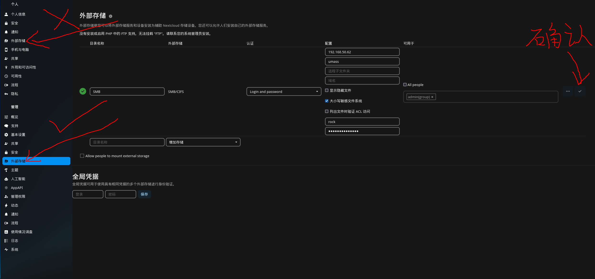

# 29.7 Nextcloud 云服务（基于 PostgreSQL）

Nextcloud 是自托管云存储与协作平台，提供文件管理、日历、联系人以及在线办公功能。

## 安装 Nextcloud

为简化安装流程，建议使用 Ports 而非 pkg 包管理器。

```sh
# cd /usr/ports/www/nextcloud/
# make config # 仅配置 nextcloud 本体
```

本节选择启用 `PGSQL`、`SMB` 和 `PCNTL`；取消勾选 `MYSQL`：


使用 Ports 编译安装 Nextcloud，执行以下命令。

```sh
# make BATCH=yes install clean
```

## 目录结构

Nextcloud 的文件目录结构如下。

```sh
/usr/local/
└── www/
    └── nextcloud/
        ├── config/
        │   ├── config.php              # Nextcloud 主配置文件
        │   ├── config.sample.php       # Nextcloud 配置示例文件
        │   └── config.documented.php   # 带注释的配置选项文档
        └── .htaccess.dist              # Apache .htaccess 模板文件
```

## 安装配置 PostgreSQL

Nextcloud 需借助数据库存储数据，本节使用 PostgreSQL。安装 PostgreSQL（请确保其版本与上述通过 Ports 安装的 `postgresql-client` 一致）。

本节要求自行安装 `postgresql16-server`，并完成初始化和服务自启。

> **注意**
>
> 如果使用 pkg 安装，请另行安装 Port **databases/php83-pdo_pgsql**，PHP 版本号需要全部一致。

在 PostgreSQL 初始化完成后，执行以下命令来创建数据库和用户：

```sql
$ psql -Upostgres # 进入 PostgreSQL 命令行模式
psql (16.7)
Type "help" for help.

postgres=# create user nextcloud; --为 PostgreSQL 创建用户 nextcloud
CREATE ROLE
postgres=# \password nextcloud --为用户 nextcloud 设置/修改密码，注意斜杠 \ 必须输入
Enter new password for user "nextcloud": --此处输入密码，密码不会显示在屏幕上，也不会显示为星号 (*)，输入时屏幕无任何显示，下同
Enter it again: --再次重复输入上面密码
postgres=# create database nextcloud owner=nextcloud; --创建数据库 nextcloud，并将所有权赋予用户 nextcloud
CREATE DATABASE
postgres-# \q --退出 PostgreSQL 命令行，注意斜杠要输入：\
```

> **技巧**
>
> 如需远程访问数据库服务器，请自行修改 **/var/db/postgres/data16/pg_hba.conf** 文件，以允许用户 nextcloud 从指定 IP 使用 SCRAM-SHA-256 验证方式连接 PostgreSQL。
>
> 示例（IP 段 **10.0.50.5/32** 需根据实际进行修改）：
>
> ```sh
> host    nextcloud       nextcloud       10.0.50.5/32               scram-sha-256
> ```

## 安装 `mod_php`

Nextcloud 前端需经 PHP 访问，必须安装 PHP 的 Apache 模块。可通过 `php -v` 命令检查当前 PHP 版本，确保与系统安装的版本一致：

```sh
# php -v
PHP 8.3.17 (cli) (built: Feb 15 2025 01:11:28) (NTS)
Copyright (c) The PHP Group
Zend Engine v4.3.17, Copyright (c) Zend Technologies
    with Zend OPcache v8.3.17, Copyright (c), by Zend Technologies
```

使用 pkg 安装 mod_php，执行以下命令。

```sh
# pkg install mod_php83
```

设置 PHP-FPM 服务开机自启并启动服务：

```sh
# service php_fpm enable   # 设置 PHP-FPM 服务开机自启
# service php_fpm start    # 启动 PHP-FPM 服务
```

## 基于 Apache

如果使用 Apache 作为 Web 服务器，需做相应配置，使 Apache 正确处理 Nextcloud 的 PHP 文件。请参考其他章节完成 Apache 的安装和服务自启。

### 查看 Apache 配置方法

查看 mod_php83 面向 Apache 的配置方法：

```sh
# pkg info -D mod_php83
```

启动 Apache 24 服务：

```sh
# service apache24 start
```

## 启动 Nextcloud

所有配置完成后，可通过浏览器访问 Nextcloud 完成初始配置。访问 `http://ip/nextcloud`，将 `ip` 替换为局域网 IP 地址。


请输入所需的登录账户和密码，其余设置可参照下图。


安装完成后将重定向到插件推荐，可忽略该推荐页面，重新打开 `http://ip/nextcloud` 即可使用。


## 在 Nextcloud 中挂载 Samba 共享

Nextcloud 支持挂载外部存储，如 Samba 共享。需先安装相应的 PHP 模块。

### 安装模块 `php83-pecl-smbclient`

在 Nextcloud 服务器端执行模块安装。

- 使用 pkg 安装：

```sh
# pkg install php83-pecl-smbclient
```

- 或者使用 Ports 安装：

```sh
# cd /usr/ports/net/pecl-smbclient/
# make install clean
```

- 重启 Apache 24 服务以应用配置更改：

```sh
# service apache24 restart
```

### 设置 Samba 共享

安装完模块后，需在 Nextcloud 中启用外部存储支持应用并完成相应配置。进入“应用”页面：


找到“外部存储支持”应用，并启用（默认为禁用状态）。


进入管理设置：


定位到管理中的外部存储（而非“个人”中的外部存储）。



查看所有文件，Samba 已启用：


## 未竟事宜

Nextcloud 另有多个常用插件可安装使用。其他常用插件可通过命令 `pkg search -x nextcloud | grep php83` 查找，再通过 pkg 安装。

> **技巧**
>
> 某些版本中，初始化 Nextcloud 时可能会出现权限问题，请检查 **/usr/local/www/nextcloud** 中 `config` 目录及其下文件的访问权限，确保运行 Apache 的用户具有读写权限。

## 参考文献

- Nextcloud GmbH. System requirements[EB/OL]. [2026-03-25]. <https://docs.nextcloud.com/server/latest/admin_manual/installation/system_requirements.html>. 明确列出 Nextcloud 各组件的版本兼容性要求。
- Nextcloud GmbH. PHP Modules & Configuration[EB/OL]. [2026-03-25]. <https://docs.nextcloud.com/server/latest/admin_manual/installation/php_configuration.html>. 详细说明必需与可选的 PHP 模块及性能优化配置。
