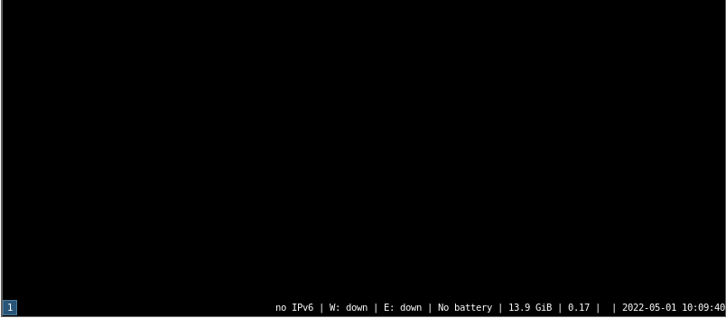

# 第 29.1 节 安装 i3wm

## 安装 i3wm

```
# pkg install -y xorg i3
```

或通过 ports 安装：

```
# cd /usr/ports/x11-wm/i3/
# make install clean
```

## 配置

```
$ echo "/usr/local/bin/i3" >> /usr/home/你的用户名/.xinitrc
$ chown 你的用户名 /usr/home/你的用户名/.xinitrc
```

## 启动

可以用 `startx` 启动 i3 了。



## 参考

- [i3 使用手册](https://www.freebsd.org/cgi/man.cgi?query=i3&apropos=0&sektion=1&manpath=freebsd-ports&format=html)
- [http://bottlenix.wikidot.com/installing-i3wm](http://bottlenix.wikidot.com/installing-i3wm)
- [https://unixsheikh.com/tutorials/how-to-setup-freebsd-with-a-riced-desktop-part-3-i3.html#xterm](https://unixsheikh.com/tutorials/how-to-setup-freebsd-with-a-riced-desktop-part-3-i3.html#xterm)
- [https://forums.freebsd.org/threads/how-to-install-i3.62305/](https://forums.freebsd.org/threads/how-to-install-i3.62305/)
- [https://www.freebsd.org/cgi/man.cgi?query=i3\&apropos=0\&sektion=1\&manpath=freebsd-ports\&format=html](https://www.freebsd.org/cgi/man.cgi?query=i3&apropos=0&sektion=1&manpath=freebsd-ports&format=html)